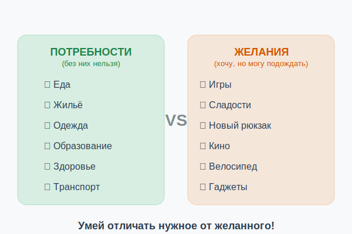

# Потребности и желания: в чём разница



«Хочу» и «нужно» — кажется, что это одно и то же. Но нет! Умение отличить **потребность** от **желания** — один из главных секретов финансовой мудрости. Именно это помогает тратить деньги умнее и быстрее копить на [цели](goal.md).

---

## 1. Что такое потребность

**Потребность** — это то, без чего человек не может нормально жить, учиться и развиваться. Потребности — это **необходимое**.

Основные потребности:
- 🍎 **Еда и вода** — без них не прожить
- 🏠 **Жильё** — место для сна и защиты
- 👕 **Одежда** — особенно по сезону
- 🏫 **Образование** — учиться необходимо
- 💊 **Здоровье** — лекарства при болезни
- 🚌 **Транспорт** — добраться до школы

---

## 2. Что такое желание

**Желание** — это то, что хочется иметь, но без чего можно обойтись. Желания делают жизнь приятнее, но не являются обязательными.

Примеры желаний:
- 🎮 Новая игровая приставка
- 🍦 Мороженое каждый день
- 📱 Телефон последней модели
- 🎒 Модный рюкзак (когда старый ещё в порядке)
- 🎬 Поход в кино каждую неделю

---

## 3. Серая зона: когда желание становится потребностью?

Это хороший вопрос! Граница не всегда чёткая.

| Предмет | Потребность или желание? |
|---------|--------------------------|
| Телефон (чтобы связаться с родителями) | Потребность |
| Телефон последней модели | Желание |
| Школьная одежда | Потребность |
| Модная брендовая одежда | Желание |
| Обед в школе | Потребность |
| Чипсы и газировка | Желание |

---

## 4. Пирамида Маслоу

Американский психолог Абрахам Маслоу создал знаменитую **пирамиду потребностей**. Снизу вверх:

```
        🌟 Самореализация
       🤝 Уважение и признание
      👫 Социальные потребности
     🛡️ Безопасность
    🍎 Физиологические (еда, вода, сон)
```

По Маслоу, нижние потребности нужно закрыть **прежде**, чем переходить к верхним. Это значит: сначала еда и жильё, потом — развлечения и самореализация.

---

## 5. Как использовать это при расходах

Когда хочешь что-то купить, задай себе три вопроса:

1. **Я могу без этого обойтись?** — Если да, это желание
2. **Как долго я этого хочу?** — Если больше 2 недель — скорее всего, не импульс
3. **Что важнее: эта трата или моя [цель](goal.md)?**

> 💡 Трать на потребности — **всегда**.
> Трать на желания — **умеренно и обдуманно**.
> Трать на импульсы — **как можно реже**.

---

## 6. Практика: эксперимент на неделю

Попробуй в течение недели записывать **каждую трату** и отмечать рядом: «П» (потребность) или «Ж» (желание).

В конце недели посчитай:
- Сколько ушло на потребности?
- Сколько — на желания?
- Были ли среди желаний лишние траты?

Это откроет глаза на реальную картину своих [расходов](expenses.md)!

---

## 7. Интересные факты

- Психологи называют желание купить что-то немедленно **«импульсным шопингом»**. В среднем человек совершает 40–60% незапланированных покупок!
- Маркетологи специально создают ощущение **«без этого нельзя»** — через рекламу, акции, «последние штуки в наличии».
- Дети, которых учат различать потребности и желания, тратят [деньги](money.md) **осознаннее** и быстрее достигают финансовых целей.

---

*Похожие темы: [Расходы](expenses.md) | [Бюджет](budget.md) | [Финансовая грамотность](financial_literacy.md) | [Мотивация](motivation.md)*

---
Автор: Команда «Как копить на цель»

*Использованные нейросети: Claude (Anthropic) для генерации текста*
