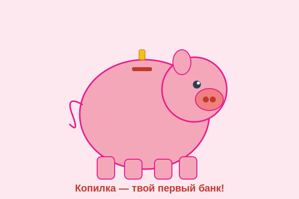

# Копилка: с чего начать копить



Копилка — это, пожалуй, самый первый «банк» в жизни каждого ребёнка. Маленькая свинка (или любой другой сосуд) способна превратить маленькие монетки в большую мечту. Разберёмся, как правильно копить с помощью копилки!

---

## 1. Что такое копилка и зачем она нужна

**Копилка** — это специальный закрытый сосуд, в который складывают деньги. Главная идея проста: положил — не трать. Благодаря этому маленькие суммы накапливаются в большую.

Копилка учит **трём важным навыкам**:
1. Откладывать деньги регулярно
2. Не тратить всё сразу
3. Ждать и терпеть ради [цели](goal.md)

---

## 2. Виды копилок

Копилки бывают самые разные:

| Вид | Особенности | Плюсы |
|-----|-------------|-------|
| **Классическая (глиняная/пластиковая)** | Нужно разбить или открыть ключом | Труднее взять деньги обратно |
| **С кодовым замком** | Открывается только по коду | Защита от соблазна |
| **Прозрачная банка** | Видно, сколько накоплено | Мотивирует (видишь прогресс!) |
| **Электронная** | Считает монеты автоматически | Удобно отслеживать сумму |
| **Конверты или коробочки** | Несколько «отсеков» | Можно копить на разные цели сразу |

---

## 3. Правила успешного накопления

Чтобы копилка работала, соблюдай несколько правил:

- **Клади деньги сразу** — как только получил, сразу отложи часть, не жди «потом»
- **Откладывай фиксированно** — например, всегда 20% от любой полученной суммы
- **Не бери назад** — договорись с собой: деньги из копилки — только на цель
- **Ставь конкретную [цель](goal.md)** — тогда ты знаешь, когда остановиться
- **Считай регулярно** — раз в неделю считай накопленное, это мотивирует!

---

## 4. Лайфхак: копилка-термометр

Нарисуй на листке бумаги большой «термометр» и повесь рядом с копилкой:

```
🌡️ ЦЕЛЬ: Велосипед — 5 000 ₽
████████████░░░░░░░░  60% = 3 000 ₽ накоплено!
```

Каждый раз, когда пополняешь копилку, закрашивай часть термометра. Видеть, как он «заполняется», очень приятно и мотивирует продолжать!

---

## 5. Сколько откладывать?

Нет единого правила, но хорошей стратегией считается **«правило 10%»**:

> Каждый раз, когда получаешь деньги, откладывай как минимум **10%** от суммы.

Например:
- Получил 500 ₽ → отложи 50 ₽
- Получил 1 000 ₽ → отложи 100 ₽
- Получил подарок 3 000 ₽ → отложи 300 ₽

Казалось бы, мало — но за год накапливается **приличная сумма**!

---

## 6. Интересные факты о копилках

- Традиционная копилка в форме свиньи появилась в **Средневековой Европе**. Глиняную посуду тогда делали из дешёвой глины — «pygg». Потом название превратилось в «piggy bank» (свинья-банк).
- В Японии есть традиция копилки **«дотибако»** — специального ящика для монет, который нельзя открыть до определённой даты.
- Самая большая копилка в мире вмещает более **1 миллиона монет** и хранится в музее в Германии.

---

## 7. От копилки — к банку

Когда ты накопишь первую крупную сумму (например, 5 000–10 000 рублей), подумай о том, чтобы открыть [банковский счёт](bank_account.md). Там деньги будут в безопасности **и** ещё немного вырастут за счёт [процентов](interest.md)!

---

*Похожие темы: [Что такое цель](goal.md) | [Банковский счёт](bank_account.md) | [Сбережения](saving.md) | [Мотивация](motivation.md)*

---
Автор: Команда «Как копить на цель»

*Использованные нейросети: Claude (Anthropic) для генерации текста*
