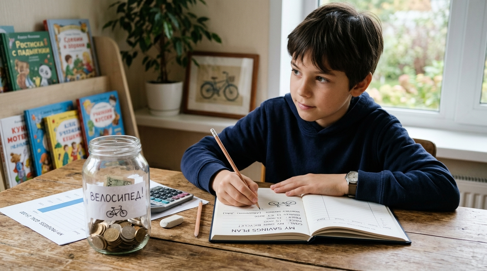

# Финансовый [план](../../../7.2 Media, leisure and hobbies/Computer games/articles/genres_and_worlds/strategy.md): дорога к мечте



Ты знаешь, чего хочешь. Ты знаешь, сколько это стоит. Но как именно дойти от «у меня ноль рублей» до «вот моя [мечта](goal.md)»? Нужен **финансовый план** — конкретный маршрут от старта до [цели](../../../3.1_healthy_lifestyle/pervaya_pomoshch/ushibi_porezy_ozhogi/02_celi_pervoy_pomoshchi.md)!

---

## 1. Что такое финансовый план

**Финансовый план** — это документ (или просто [записи](../../../4.1_rules_of_study/how_to_learn_effectively/articles/note_taking.md) в тетради), в котором расписано:
- Какова твоя [цель](goal.md) и её [стоимость](../../../6.1_Independent_living_and_daily_living_skills/reasonable_spending/articles/price.md)
- Сколько времени есть на накопление
- Сколько нужно откладывать каждый месяц
- Из каких [доходов](income.md) будешь [копить](../../../6.1_Independent_living_and_daily_living_skills/reasonable_spending/articles/savings.md)
- Какие [расходы](expenses.md) можно сократить

Финансовый план превращает мечту в **конкретные [шаги](../../../7.2 Media, leisure and hobbies/Computer games/articles/dream_team/composer.md)**.

---

## 2. Четыре шага финансового плана

### [Шаг](../../../1.2_natural_sciences/physics_in_everyday_life/Q36253.md) 1: Определи [цель](../../../1.2_natural_sciences/why_science_help_understand_world/research_work.md)
Запиши, **что** хочешь купить и **сколько** это стоит.

> Пример: Велосипед — 6 000 ₽

### Шаг 2: Определи [срок](../../../6.1_Independent_living_and_daily_living_skills/reasonable_spending/articles/financial_goal.md)
К **какой дате** ты хочешь достичь цели?

> Пример: к 1 июня — через 6 месяцев

### Шаг 3: Посчитай ежемесячный взнос
Раздели стоимость на количество месяцев.

```
6 000 ₽ ÷ 6 месяцев = 1 000 ₽ в месяц
```

### Шаг 4: Проверь реалистичность
Посмотри на свой [бюджет](budget.md): можешь ли ты откладывать эту сумму ежемесячно? Если нет — увеличь срок или найди дополнительный [доход](income.md).

---

## 3. [Шаблон](../../../5.1_technology_and_digital_literacy/information and media literacy/шаблон_урока_по_медиаграмотности.md) финансового плана

| Параметр | [Значение](../../../7.2 Media, leisure and hobbies /useful_and_interesting_leisure/articles/leisure_and_why_need.md) |
|----------|----------|
| Цель | Велосипед |
| Стоимость | 6 000 ₽ |
| Срок | 6 месяцев |
| Ежемесячное накопление | 1 000 ₽ |
| [Источник](../../../5.1_technology_and_digital_literacy/information and media literacy/дезинформация_и_фейки.md) накоплений | [Карманные деньги](../../../6.1_Independent_living_and_daily_living_skills/reasonable_spending/articles/income.md) + подарки |
| Где храню | [Копилка](../../../6.1_Independent_living_and_daily_living_skills/reasonable_spending/articles/savings.md) / банковский [вклад](bank_account.md) |
| Дата старта | 1 декабря |
| Дата [достижения](../../../4.1_rules_of_study/how_to_learn_effectively/articles/gamification.md) | 1 июня |

---

## 4. Отслеживание прогресса

Просто составить план — мало. Важно **отслеживать выполнение**:

- Раз в месяц проверяй: отложил ли ты нужную сумму?
- Если в какой-то месяц не получилось — не бросай план, просто доберёшь в следующем
- Отмечай галочками или закрашивай клеточки в таблице — это [мотивирует](motivation.md)!

---

## 5. [Корректировка](../../../4.1_rules_of_study/how_to_learn_effectively/articles/self_reflection.md) плана

Планы меняются — и это нормально. Если что-то пошло не так:

| Ситуация | Что делать |
|----------|-----------|
| Неожиданные [расходы](../../../6.1_Independent_living_and_daily_living_skills/reasonable_spending/articles/expense.md) | Увеличь срок на 1–2 месяца |
| Получил больше [денег](../../../8.2_future/choosing_a_career_path/articles/salary.md) | Сократи срок! |
| [Цена](../../../6.1_Independent_living_and_daily_living_skills/reasonable_spending/articles/price.md) выросла | Пересчитай ежемесячный взнос |
| Цель стала неактуальной | Смени цель, не теряя накопленного |

---

## 6. Несколько целей одновременно

Можно копить на **несколько целей** одновременно — как конвертики или разные [копилки](piggy_bank.md):

```
📩 Велосипед (основная цель): 600 ₽/месяц
📩 Подарок другу: 200 ₽/месяц
📩 Резерв (на всякий случай): 200 ₽/месяц
────────────────────────────────────────
Итого откладываю: 1 000 ₽/месяц
```

---

## 7. Интересные [факты](../../../1.2_natural_sciences/physics_in_everyday_life/Q17737.md)

- Исследования показывают, что люди, которые составляют **письменный финансовый план**, достигают своих целей в **2 раза чаще**.
- Самые богатые инвесторы мира — Уоррен Баффетт, Рэй Далио — известны тем, что скрупулёзно следуют своим долгосрочным финансовым планам.
- В Финляндии финансовому планированию учат уже в **начальной школе** — и это одна из причин высокого уровня финансовой грамотности финнов.

---

*Похожие темы: [SMART-цели](smart_goal.md) | [Бюджет](budget.md) | [Мотивация](motivation.md) | [Сбережения](saving.md)*

---

## Читай также из других разделов

- [Проектирование будущего](../../../2.1_society/cause_and_effect_relationships/articles/future_planning.md) — раздел 2.1 «[Общество](../../../2.1_society/cause_and_effect_relationships/articles/why_rules_work.md)»
- [Идеальный распорядок дня и управление энергией](../../../3.1_healthy lifestyle/Sleep, nutrition, and adolescent energy/articles/ideal_schedule_energy_management.md) — раздел 3.1 «[Здоровье](../../../3.1. healthy lifestyle/Sleep, nutrition, and adolescent energy/articles/chronic_sleep_deprivation.md)»

---
[Автор](../../../4.2_thinking_and_working_information/how_to_search_information/articles/copypaste.md): [Команда](../../../4.1_rules_of_study/how_to_learn_effectively/articles/peer_learning.md) «[Как копить](piggy_bank.md) на цель»

*Использованные [нейросети](../../../2.1_society/cause_and_effect_relationships/articles/ai_causality.md): Claude (Anthropic) для генерации текста*
