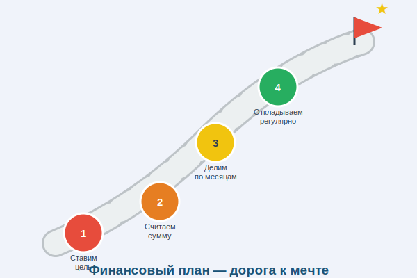

# Финансовый план: дорога к мечте



Ты знаешь, чего хочешь. Ты знаешь, сколько это стоит. Но как именно дойти от «у меня ноль рублей» до «вот моя мечта»? Нужен **финансовый план** — конкретный маршрут от старта до цели!

---

## 1. Что такое финансовый план

**Финансовый план** — это документ (или просто записи в тетради), в котором расписано:
- Какова твоя [цель](goal.md) и её стоимость
- Сколько времени есть на накопление
- Сколько нужно откладывать каждый месяц
- Из каких [доходов](income.md) будешь копить
- Какие [расходы](expenses.md) можно сократить

Финансовый план превращает мечту в **конкретные шаги**.

---

## 2. Четыре шага финансового плана

### Шаг 1: Определи цель
Запиши, **что** хочешь купить и **сколько** это стоит.

> Пример: Велосипед — 6 000 ₽

### Шаг 2: Определи срок
К **какой дате** ты хочешь достичь цели?

> Пример: к 1 июня — через 6 месяцев

### Шаг 3: Посчитай ежемесячный взнос
Раздели стоимость на количество месяцев.

```
6 000 ₽ ÷ 6 месяцев = 1 000 ₽ в месяц
```

### Шаг 4: Проверь реалистичность
Посмотри на свой [бюджет](budget.md): можешь ли ты откладывать эту сумму ежемесячно? Если нет — увеличь срок или найди дополнительный [доход](income.md).

---

## 3. Шаблон финансового плана

| Параметр | Значение |
|----------|----------|
| Цель | Велосипед |
| Стоимость | 6 000 ₽ |
| Срок | 6 месяцев |
| Ежемесячное накопление | 1 000 ₽ |
| Источник накоплений | Карманные деньги + подарки |
| Где храню | Копилка / банковский вклад |
| Дата старта | 1 декабря |
| Дата достижения | 1 июня |

---

## 4. Отслеживание прогресса

Просто составить план — мало. Важно **отслеживать выполнение**:

- Раз в месяц проверяй: отложил ли ты нужную сумму?
- Если в какой-то месяц не получилось — не бросай план, просто доберёт в следующем
- Отмечай галочками или закрашивай клеточки в таблице — это [мотивирует](motivation.md)!

---

## 5. Корректировка плана

Планы меняются — и это нормально. Если что-то пошло не так:

| Ситуация | Что делать |
|----------|-----------|
| Неожиданные расходы | Увеличь срок на 1–2 месяца |
| Получил больше денег | Сократи срок! |
| Цена выросла | Пересчитай ежемесячный взнос |
| Цель стала неактуальной | Смени цель, не теряя накопленного |

---

## 6. Несколько целей одновременно

Можно копить на **несколько целей** одновременно — как конвертики или разные [копилки](piggy_bank.md):

```
📩 Велосипед (основная цель): 600 ₽/месяц
📩 Подарок другу: 200 ₽/месяц
📩 Резерв (на всякий случай): 200 ₽/месяц
────────────────────────────────────────
Итого откладываю: 1 000 ₽/месяц
```

---

## 7. Интересные факты

- Исследования показывают, что люди, которые составляют **письменный финансовый план**, достигают своих целей в **2 раза чаще**.
- Самые богатые инвесторы мира — Уоррен Баффетт, Рэй Далио — известны тем, что скрупулёзно следуют своим долгосрочным финансовым планам.
- В Финляндии финансовому планированию учат уже в **начальной школе** — и это одна из причин высокого уровня финансовой грамотности финнов.

---

*Похожие темы: [SMART-цели](smart_goal.md) | [Бюджет](budget.md) | [Мотивация](motivation.md) | [Сбережения](saving.md)*

---
Автор: Команда «Как копить на цель»

*Использованные нейросети: Claude (Anthropic) для генерации текста*
