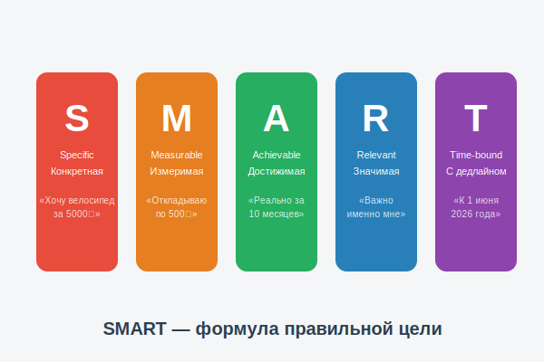

# SMART-цели: как правильно ставить финансовые цели



Ты уже знаешь, что [цель](goal.md) помогает копить. Но не всякая цель одинаково хороша! Размытая цель «хочу денег» не работает так же, как чёткая: «Хочу велосипед за 5 000 рублей к 1 июня». Учёные придумали специальную формулу — **SMART**, которая помогает ставить правильные цели.

---

## 1. Что такое SMART

**SMART** — это аббревиатура из пяти английских слов. Каждая буква — одно свойство правильной цели:

| Буква | Английское слово | Значение |
|-------|-----------------|----------|
| **S** | Specific | **Конкретная** |
| **M** | Measurable | **Измеримая** |
| **A** | Achievable | **Достижимая** |
| **R** | Relevant | **Значимая** |
| **T** | Time-bound | **С дедлайном** |

---

## 2. Разберём каждую букву

### S — Specific (Конкретная)
Цель должна быть чёткой, а не размытой.
- ❌ «Хочу что-нибудь купить»
- ✅ «Хочу купить велосипед марки Forward Apache 26»

### M — Measurable (Измеримая)
Ты должен знать, как измерить прогресс и момент достижения.
- ❌ «Хочу накопить много денег»
- ✅ «Хочу накопить 5 000 рублей»

### A — Achievable (Достижимая)
Цель должна быть реальной — сложной, но выполнимой.
- ❌ «Хочу накопить 1 миллион за месяц» (при карманных 500 ₽)
- ✅ «Хочу накопить 5 000 ₽ за 10 месяцев»

### R — Relevant (Значимая)
Цель должна быть важна **именно тебе**, а не «потому что все так делают».
- ❌ «Хочу купить то же, что есть у Коли»
- ✅ «Хочу велосипед, чтобы ездить в школу и кататься с друзьями»

### T — Time-bound (С дедлайном)
У цели должна быть конкретная дата достижения.
- ❌ «Когда-нибудь куплю»
- ✅ «Куплю к 1 июня 2026 года»

---

## 3. Пример SMART-цели

Давай составим настоящую SMART-цель вместе:

> **«Я хочу накопить 4 500 рублей на роликовые коньки к 15 мая, откладывая по 500 рублей в месяц из карманных денег и подарков»**

Проверяем:
- S ✅ — Роликовые коньки (конкретно)
- M ✅ — 4 500 рублей (измеримо)
- A ✅ — 9 месяцев по 500 ₽ (реально при доходе ~800 ₽/мес)
- R ✅ — Хочу научиться кататься летом (значимо)
- T ✅ — К 15 мая (срок есть)

---

## 4. Как записать SMART-цель

Используй простой шаблон:

```
Моя SMART-цель:
Я хочу [ЧТО] за [СКОЛЬКО ₽] к [ДАТА].
Для этого буду откладывать [СКОЛЬКО] каждую [НЕДЕЛЮ/МЕСЯЦ].
Это важно мне, потому что [ПРИЧИНА].
```

Запиши свою цель, повесь на видное место рядом с [копилкой](piggy_bank.md)!

---

## 5. Что делать, если цель не достигнута?

Иногда планы меняются — и это нормально! Если не получается достичь цели в срок:

1. **Пересмотри срок** — сдвинь дату, а не отказывайся от цели
2. **Найди дополнительный [доход](income.md)** — может, поможешь кому-то?
3. **Сократи [расходы](expenses.md)** — от чего можно временно отказаться?
4. **Раздели цель** — большую цель можно разбить на этапы

---

## 6. Интересные факты

- Метод SMART придумал в **1981 году** Джордж Дораан — американский менеджер.
- Исследования Гарварда показали: студенты, которые **записали конкретные цели**, через 10 лет зарабатывали в **10 раз больше**, чем те, кто не записывал.
- Профессиональные спортсмены, предприниматели и учёные используют SMART для постановки всех своих целей — от спортивных рекордов до научных открытий.

---

*Похожие темы: [Что такое цель](goal.md) | [Финансовый план](planning.md) | [Мотивация](motivation.md) | [Бюджет](budget.md)*

---
Автор: Команда «Как копить на цель»

*Использованные нейросети: Claude (Anthropic) для генерации текста*
