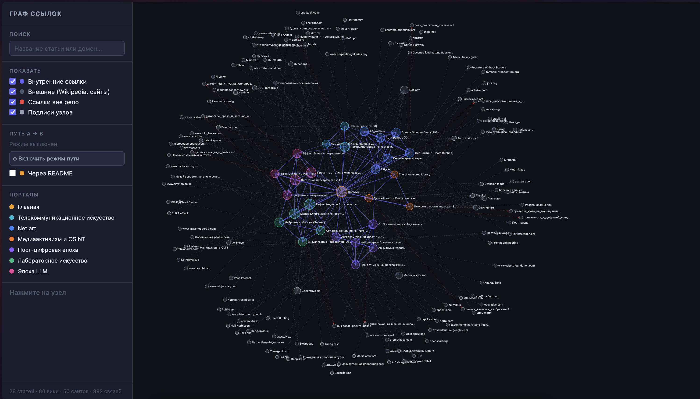
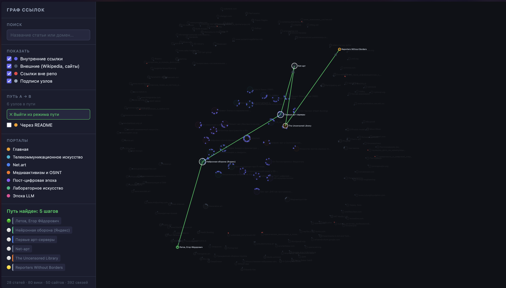

# Технологическое искусство: что мы сделали

Мы написали энциклопедию по медиаарту — от спутниковых телемостов 1980-х до нейросетевых криптидов. Главная цель -- это взглянуть на технологии и искусство с немного другой стороны. Мы считаем, этот репозиторий поможет школьнику развитить кругозор, а статьи, возможно, станут источниками для вдохновения. 

Технологическое искусство — это не «арт про компьютеры». Это практики, где технология становится **материалом, языком и концепцией** одновременно. Художники в этом поле  смогли показать, что современное искуство может быть ещё и интерфейсом. Интерфейсом для критики, объединения, свободы и, главное, живого.

Мы выбрали хронологический принцип — от телевизионных экспериментов 1970-х до современных LLM — чтобы показать, как новые технологии открывали художникам новые пространства для критики и эксперимента.

Всего нами было сделаны 28 статей внутри 6 тематических порталов, интерактивный граф связей и визуализатор, который строится одной командой.



---

## Что внутри

### 6 порталов, 27 статья + README как точка входа

**Портал 1 — Телекоммуникационное искусство (1970–1994)**
Искусство до интернета. Спутники, телевидение, факс.

- [Hole in Space (1980)](articles/1.1_hole_in_space.md) — телемост между витринами Нью-Йорка и Лос-Анджелеса без предупреждения и кураторов
- [Нам Джун Пайк](articles/1.2_nam_june_paik.md) — пионер видеоарта, предвосхитивший интернет на 20 лет
- [Партиципаторное искусство](articles/1.3_participatory_art.md) — как Даглас Дэвис пытался сломать «четвёртую стену» экрана

**Портал 2 — Net.art (1994–2001)**
Появился браузер — художники сразу сделали из него галерею.

- [Арт-группа JODI](articles/2.1_jodi.md) — деконструкция интерфейсов и эстетика глитча
- [Хит Бантинг](articles/2.2_heath_bunting.md) — хактивизм и провокации через поисковики
- [Nettime](articles/2.3_nettime.md) — мейлинг-лист как прото-социальная сеть и арт-медиа
- [Первые арт-серверы](articles/2.4_art_servers.md) — The Thing, Internationale Stadt, Moscow WWW Art Centre
- [Siberian Deal (1995)](articles/2.5_siberian_deal.md) — транссибирский перформанс-блог задолго до блогов
- [Computer Aided Curating](articles/2.6_cac.md) — первая онлайн-выставка (1993), перевернувшая кураторство

**Портал 3 — Медиаактивизм и Цифровое сопротивление**
Игры, OSINT, нейросети против цензуры и слежки.

- [The Uncensored Library](articles/3.1_uncensored_library.md) — Minecraft как убежище для запрещённой журналистики
- [Surveillance Art](articles/3.2_surveillance_art.md) — CV Dazzle: макияж против распознавания лиц; съёмка засекреченных серверов АНБ
- [Дипфейк-арт](articles/3.3_deepfake_art.md) — нейросетевая сатира как исследование постправды

**Портал 4 — Пост-цифровая эпоха и Новая материальность**
Код выходит обратно в физический мир.

- [От Постинтернета к Фиджиталу](articles/4.1_post_internet.md) — почему интернет перестал быть «отдельным местом»
- [AR-монументализм](articles/4.2_ar_monumentalism.md) — пульсирующие цифровые скульптуры над городами (Нэнси Бейкер Кэхилл)
- [Киборг-арт](articles/4.3_cyborg_art.md) — Нил Харбиссон с вживлённой антенной: тело как медиа-интерфейс
- [Био-арт](articles/4.4_bio_art.md) — стихи и GIF, закодированные в ДНК живых бактерий
- [Алгоритмический крафт](articles/4.5_algorithmic_craft.md) — скульптура, просчитанная нейросетью и напечатанная роботом (Neri Oxman)

**Портал 5 — Лабораторное искусство и Эстетика алгоритмов**
IT-корпорации как новые музеи.

- [Визуализация нейросетей](articles/5.1_nn_visualization.md) — инструменты отладки OpenAI Microscope как цифровая абстракция
- [Арт-резиденции при IT-гигантах](articles/5.2_art_residencies.md) — художники в Google Arts & Culture и MIT Media Lab
- [Рефик Анадол](articles/5.3_refik_anadol.md) — монументальные GAN-скульптуры из архивов NASA и корпораций
- [Марио Клингеманн](articles/5.4_mario_klingemann.md) — ИИ бесконечно генерирует портреты несуществующих людей в реальном времени
- [Нейронная оборона (Яндекс)](articles/5.5_yandex_neural.md) — поэзия и альбом в стиле Летова, написанные машиной в 2016

**Портал 6 — Эпоха LLM, Соавторство с машиной**
Граница между художником и инструментом растворяется.

- [Промпт-арт](articles/6.1_prompt_art.md) — промпт-инжиниринг как новая форма поэзии
- [Феномен Loab](articles/6.2_latent_space.md) — жуткий криптид, живущий в «подсознании» нейросетей
- [Иэн Ченг](articles/6.3_ai_simulations.md) — живые существа с нейросетевой «психикой», меняющиеся при контакте со зрителем
- [Холли Херндон / Spawn](articles/6.4_holly_herndon.md) — Holly+: ИИ-инструмент, поющий голосом своей создательницы
- [Эффект Элизы](articles/6.5_eliza_effect.md) — арт-проекты про нашу готовность одушевлять языковые модели

---

## Инструмент визуализации

Вместе со статьями мы написали скрипт, который разбирает все `.md`-файлы, извлекает внутренние и внешние ссылки и строит интерактивный граф прямо в браузере.

```bash
python3 tools/visualize_links.py
open tools/graph.html
```

Что умеет граф:

- **Цветовые кластеры** — каждый портал своим цветом, статьи расположены в секторах
- **Фильтры** — включить/выключить внешние ссылки, Wikipedia, «битые» (ссылки вне репо)
- **Поиск** — подсветить нужную статью и всех её соседей
- **Режим пути A → B** — BFS кратчайшего пути между любыми двумя статьями



## Как делали

1. Составили структуру из 6 порталов и 21 темы — от «что вообще есть» и «что уже классика» до «что появилось вчера».
2. Написали статьи: каждая объясняет конкретный проект или явление, даёт исторический контекст и ссылки на смежные темы внутри энциклопедии. Мы не хотели делать прямую выжимку википедии, старались оформлять статьи скорее как мини эссе в заданной стилистике.
3. Сделали перекрёстные ссылки между статьями — чтобы читатель мог переходить по смыслу, а не только по порядку
4. Написали [visualize_links.py](../WORK/7.1_art/modern_technological_art/tools/visualize_links.py) — скрипт, который парсит всю эту сеть и строит D3.js-граф с BFS, фильтрами и подсветкой
5. Статьи и код писались в паре с **Claude Code** (Anthropic) — для генерации текстов, перекрёстных ссылок и кода визуализатора.


Воркфлоу по каждой статье:

> Ресёрч идеи → скелет структуры → Claude-драфт → редактура и визуал → Claude перекрёстные ссылки → финал

Отдельные статьи не редактировались после Claude как, например, про Эффект Элизы. Нам кажется это несколько ироничным.

---

## Команда

**Команда MAI # 10 · Секция 7.1 — Искусство**

| Участник | Авторство |
|:---------|:-------|
| Вячеслав Самарин | Портал 1: Hole in Space, Нам Джун Пайк, Партиципаторное искусство |
| Артём Закарейшвили | Портал 2: JODI, Хит Бантинг, Nettime |
| Валентин Устинов | Портал 2: Первые арт-серверы, Siberian Deal, C@C |
| Максим Курносов | Портал 3: The Uncensored Library, Surveillance Art |
| Владимир Сергеев | Портал 3: Дипфейк-арт |
| Тимофей Береговин | Порталы 1–6: от кураторства и идей, до полных статей|

---

*Инструменты: Claude Code · Claude Sonnet 4.6 (Anthropic)*
