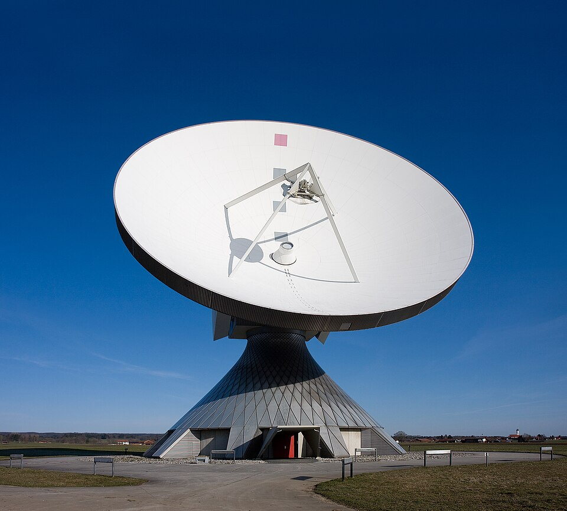
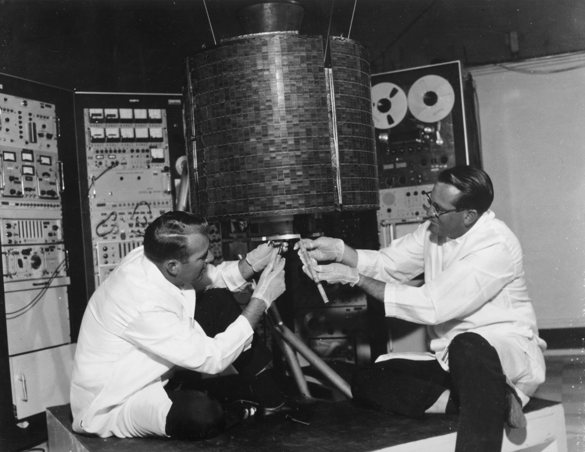

# Hole in Space (1980)

**Hole in Space** («Дыра в пространстве») — пионерский проект [телекоммуникационного искусства](https://en.wikipedia.org/wiki/Telematic_art), созданный американскими художниками [Китом Гэллоуэем и Шерри Рабиновиц](https://en.wikipedia.org/wiki/Kit_Galloway) в ноябре 1980 года. Спутниковый телемост, соединивший витрины магазинов в Нью-Йорке и Лос-Анджелесе без какого-либо предварительного объявления, стал одним из наиболее радикальных и провидческих экспериментов в истории [медиаискусства](https://ru.wikipedia.org/wiki/Медиаискусство) — и по сей день остаётся точкой отсчёта в разговоре о присутствии, расстоянии и спонтанной человеческой связи в эпоху электронных коммуникаций.

---

## История создания

*Земная станция спутниковой связи — технология, положенная в основу проекта Hole in Space. Источник: Wikimedia Commons*

В конце 1970-х — начале 1980-х годов художники, работавшие на стыке технологии и перформанса, всё настойчивее искали способы использовать телевизионный сигнал и спутниковую связь не как инструменты вещания, но как среду живого диалога. Кит Гэллоуэй и Шерри Рабиновиц, работавшие вместе под маркой проекта Satellite Arts Project, уже в 1977 году создали «Satellite Arts Project: A Space with No Geographical Boundaries» — раннюю попытку объединить танцоров из разных городов посредством спутникового изображения. Опыт этой работы убедил их: технология созрела, но аудитория ещё не встретилась с ней лицом к лицу на улице.

В 1980 году, при поддержке организации **Satellite Arts Project**, Гэллоуэй и Рабиновиц получили возможность реализовать значительно более амбициозный замысел. Художники договорились об установке крупноформатных экранов и видеокамер в двух публичных витринах: **Lincoln Center** в Нью-Йорке и **Century City Shopping Center** в Лос-Анджелесе. Принципиально важным решением стал отказ от какой-либо предварительной рекламы или кураторского сопровождения — никаких листовок, никаких объявлений, никаких инструкций для прохожих.

Проект прошёл **три ночи подряд — 11, 14 и 16 ноября 1980 года**. Каждый вечер витрины «оживали»: прохожие внезапно обнаруживали, что смотрят на людей с другого побережья Америки — и что те люди смотрят на них в ответ, в реальном времени.

---

## Концепция и художественный метод

> «Мы хотели создать скульптуру из живых людей и живого пространства — скульптуру, которая существует не в галерее, но в самой ткани города».
> — Кит Гэллоуэй и Шерри Рабиновиц

Гэллоуэй и Рабиновиц намеренно называли Hole in Space **«публичной скульптурой»** — термин, подчёркивающий их дистанцию от традиционных форм [видеоарта](https://ru.wikipedia.org/wiki/Видеоарт) и телевизионного эксперимента. Произведение не имело фиксированной формы: оно целиком конституировалось поведением случайных прохожих. Художники выступали не авторами образа, но архитекторами ситуации.

Ключевые измерения проекта:

| Параметр | Описание |
|---|---|
| Локации | Lincoln Center (Нью-Йорк) и Century City Shopping Center (Лос-Анджелес) |
| Даты | 11, 14 и 16 ноября 1980 года |
| Технология | Двунаправленный спутниковый канал, полноразмерные экраны, живой звук |
| Участие публики | Стихийное, без предварительного уведомления |
| Финансирование | Satellite Arts Project |

Реакция участников превзошла все ожидания. Люди, никогда не видевшие ничего подобного, поначалу застывали в изумлении — а затем начинали размахивать руками, кричать имена знакомых, танцевать, пытаться «передать» предметы через экран, обнимать изображение человека на другом берегу страны. На третью ночь, когда слух о телемосте распространился по городу, к витринам пришли целые семьи, разлучённые расстоянием: матери искали детей, влюблённые назначали свидания через экран.

Дополнительным поэтическим измерением проекта стала **разница часовых поясов в три часа**: когда в Нью-Йорке была глубокая ночь, в Лос-Анджелесе ещё длился вечер. Художники видели в этом несовпадении буквальное воплощение метафоры — не просто «дыра в пространстве», но **«дыра в пространстве-времени»**, напоминание о том, что электронный сигнал разрушает не только географию, но и привычное переживание времени.

В контексте истории [партиципаторного искусства](https://en.wikipedia.org/wiki/Participatory_art) Hole in Space представляет собой радикальный случай: произведение полностью зависело от непредсказуемого поведения случайных прохожих, а художники намеренно устранили все механизмы управления зрительским опытом. Это сближает проект с концепциями [Партиципаторное искусство и телевещание](1.3_participatory_art.md), развивавшимися в тот же период.

---

## Место в истории медиаискусства

*Спутник INTELSAT I (Early Bird, 1965) — первый коммерческий геостационарный спутник связи, открывший эру трансатлантической телетрансляции и ставший технической предпосылкой для проектов телекоммуникационного искусства. Источник: Wikimedia Commons*

Hole in Space создавался в период, когда художники по всему миру открывали спутниковую связь как художественную среду. [Нам Джун Пайк и концепция электронного суперхайвея](1.2_nam_june_paik.md) — пожалуй, наиболее известный параллельный вектор: Пайк грезил о глобальной электронной нервной системе, объединяющей человечество. Однако там, где Пайк работал с образом и метафорой, Гэллоуэй и Рабиновиц создавали **живую инфраструктуру встречи** — без художественного кадрирования, прямо на улице.

Проект вписывается в традицию [телекоммуникационного искусства](https://en.wikipedia.org/wiki/Telematic_art), к которой относятся и другие эксперименты эпохи, охватываемые [Порталом 1: Телекоммуникационное искусство (Предтечи)](../README.md) с факсимильной связью, медленным сканированием телевидения (SSTV) и ранними компьютерными сетями. Hole in Space выделяется среди них именно публичным, уличным характером: это не лабораторный эксперимент и не галерейная инсталляция, но вмешательство в повседневную городскую жизнь.

---

## Влияние и наследие

Значение Hole in Space трудно переоценить. Проект предвосхитил целый ряд технологий и культурных практик, которые стали массовыми лишь десятилетия спустя:

- **Видеозвонки и FaceTime** — идея двусторонней живой видеосвязи между людьми в разных городах, воспринятая в 1980 году как чудо, сегодня является повседневной нормой.
- **Zoom и платформы удалённого присутствия** — особенно актуальные после 2020 года, когда пандемия сделала дистанционное общение через экран универсальным опытом.
- **Публичные телеприсутствия и «порталы»** — современные арт-инсталляции, соединяющие городские площади разных стран прямой видеотрансляцией, прямо наследуют жесту Гэллоуэя и Рабиновиц.

В более широком контексте истории цифрового и сетевого искусства Hole in Space предвосхищает эстетику [Net.art](https://ru.wikipedia.org/wiki/Net-арт) — искусства, существующего в сети и через сеть, — и диалогические стратегии таких художников, как [арт-группа JODI](https://en.wikipedia.org/wiki/JODI_(art_group)), радикально переосмысливших отношения пользователя и технологической среды.

Документация проекта — видеозаписи реакций прохожих, фотографии, описания — хранится в архиве **[Electronic Arts Intermix (EAI)](https://www.eai.org)** в Нью-Йорке, одном из крупнейших мировых хранилищ [медиаискусства](https://ru.wikipedia.org/wiki/Медиаискусство). Эти записи сами по себе стали историческим документом: они фиксируют момент, когда обычные горожане впервые столкнулись с тем, что впоследствии назовут «телеприсутствием».

*Примечательно, что первоначальная реакция публики — изумление, эйфория, попытки физического контакта с изображением — почти буквально воспроизводится в документации первых пользователей FaceTime и видеозвонков тридцать лет спустя. Человеческий отклик на «дыру в пространстве» оказался устойчивее самих технологий.*

---

## Смотри также

- [Портал 1: Телекоммуникационное искусство (Предтечи)](../README.md)
- [Нам Джун Пайк и концепция электронного суперхайвея](1.2_nam_june_paik.md)
- [Партиципаторное искусство и телевещание](1.3_participatory_art.md)
- [Телекоммуникационное искусство](https://en.wikipedia.org/wiki/Telematic_art)
- [Партиципаторное искусство](https://en.wikipedia.org/wiki/Participatory_art)
- [Медиаискусство](https://ru.wikipedia.org/wiki/Медиаискусство)
- [Видеоарт](https://ru.wikipedia.org/wiki/Видеоарт)
- [Net.art](https://ru.wikipedia.org/wiki/Net-арт)

---

Авторы: Вячеслав Самарин;

*Ресурсы: LLM — Claude Sonnet 4.6*
