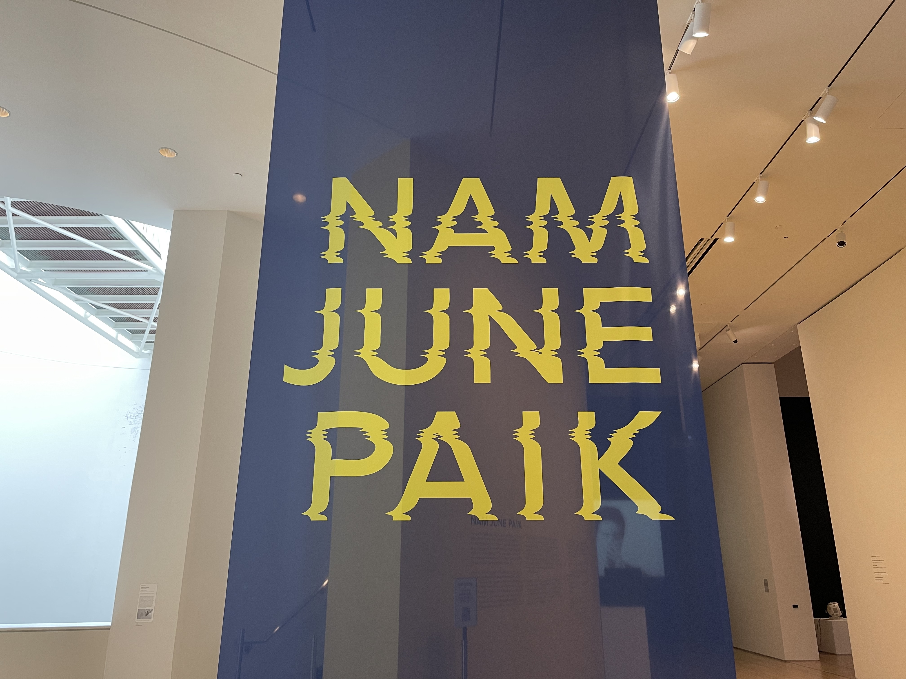
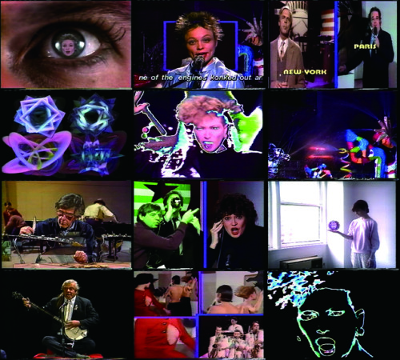
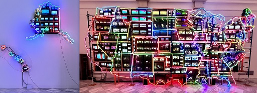

# Нам Джун Пайк и концепция электронного суперхайвея

**Нам Джун Пайк** (кор. 백남준, Nam June Paik; 20 июля 1932, Сеул — 29 января 2006, Майами) — корейско-американский художник, композитор и перформер, основоположник [видеоарта](https://ru.wikipedia.org/wiki/Видеоарт) и один из ключевых теоретиков [медиаискусства](https://ru.wikipedia.org/wiki/Медиаискусство). Пайк первым применил телевизор как художественный материал, предвосхитил появление глобальных коммуникационных сетей и ввёл термин **«электронный суперхайвей»** — за два десятилетия до того, как интернет стал массовым явлением.

> «Телевидение атаковало нас всю жизнь — теперь наш черёд ударить в ответ.»
> — Нам Джун Пайк

---

## Биография и путь к медиаарту

*Видеоинсталляция Нам Джун Пайка в Музее современного искусства Сан-Франциско, 2021. Источник: Wikimedia Commons*

Нам Джун Пайк родился в зажиточной семье в Сеуле. После Корейской войны семья бежала сначала в Гонконг, а затем в Японию. В Токио будущий художник окончил факультет эстетики Токийского университета, защитив диссертацию о немецком композиторе Арнольде Шёнберге. Затем он продолжил музыкальное образование в Западной Германии — в Мюнхенском университете и на знаменитых Дармштадтских летних курсах новой музыки.

Поворотным моментом в биографии Пайка стало знакомство с **Джоном Кейджем** в 1958 году на Дармштадтских курсах. Кейдж, разрушавший границы между искусством и повседневным звуком, оказал на молодого корейца колоссальное влияние. Вскоре Пайк примкнул к движению **[Флюксус](https://ru.wikipedia.org/wiki/Флюксус)** — интернациональному авангардному объединению, отрицавшему элитарность искусства и экспериментировавшему с перформансом, случайностью и новыми медиа.

В 1963 году в галерее Парнас в **Вупертале** Пайк представил инсталляцию **«Exposition of Music — Electronic Television»** — дюжину телевизоров с намеренно искажёнными изображениями, разбросанных по всему пространству галереи. Это была **первая в истории видеоинсталляция**: художник превратил телевизор из пассивного приёмника в скульптурный объект и инструмент художественного высказывания. Наряду с немецким художником **Вольфом Фостелем**, также работавшим с телевизорами в начале 1960-х, Пайк считается отцом-основателем [видеоарта](https://ru.wikipedia.org/wiki/Видеоарт).

В 1964 году Пайк переехал в Нью-Йорк, где началось его долгое и плодотворное сотрудничество с авангардной виолончелисткой **Шарлоттой Мурман**. Вместе они создали серию провокационных перформансов, соединявших классическую музыку, обнажённое тело и электронные технологии. Работа **«TV Bra for Living Sculpture»** (1969) — бюстгальтер из двух маленьких телеэкранов, которые Мурман надевала во время игры на виолончели, — стала одним из самых известных образов технологического [партиципаторного искусства](https://en.wikipedia.org/wiki/Participatory_art) эпохи.

---

## Концепция электронного суперхайвея

В 1974 году Пайк написал программное эссе **«Media Planning for the Postindustrial Society»**, адресованное фонду Рокфеллера. В этом тексте он впервые использовал словосочетание **Electronic Super Highway** («электронный суперхайвей»), описывая будущее, в котором спутниковая связь и кабельные сети объединят человечество в единое информационное пространство.

Пайк представлял электронный суперхайвей как двустороннюю коммуникационную систему, позволяющую людям не только получать, но и **создавать и транслировать** контент. По сути, он предвосхитил архитектуру современного интернета, социальных сетей и стриминговых платформ — явлений, которые стали реальностью лишь в 1990-х и 2000-х годах.

*Нам Джун Пайк, «Good Morning, Mr. Orwell» (1984) — первый глобальный спутниковый арт-телемост, объединивший студии Нью-Йорка, Парижа, Германии и Кореи. Источник: arshake.com*

Идею двусторонней глобальной коммуникации Пайк воплотил в жизнь в **1984 году**, организовав первый в истории глобальный спутниковый арт-телемост **«Good Morning, Mr. Orwell»**. Трансляция в новогоднюю ночь объединила студии телеканалов США (*WNET/Thirteen*, Нью-Йорк), Франции (*Centre Pompidou*, Париж), Германии и Кореи. Более **25 миллионов зрителей** одновременно наблюдали за перформансами Йозефа Бойса, Лори Андерсон, Питера Гэбриела и других художников. Название телемоста было полемическим ответом на антиутопию Оруэлла: Пайк доказывал, что технологии способны освобождать, а не порабощать. Это событие стало вехой в истории [телекоммуникационного искусства](https://en.wikipedia.org/wiki/Telematic_art) и предшественником интерактивных онлайн-трансляций.

В **1995 году** художник создал монументальную инсталляцию **«Electronic Superhighway: Continental U.S., Alaska, Hawaii»** — карту Соединённых Штатов, собранную из **336 телевизионных мониторов** и неоновых трубок. Каждый штат на карте был обозначен своими телевизорами, транслирующими видеоконтент, связанный с культурой и историей данного региона. Это произведение можно интерпретировать как визуальную метафору информационной перегрузки и одновременно — торжества связности. Сегодня оно хранится в постоянной коллекции **Smithsonian American Art Museum** в Вашингтоне.

---

## Ключевые работы

*Инсталляция «Electronic Superhighway: Continental U.S., Alaska, Hawaii» (1995) — карта США из 336 телевизоров и неоновых трубок в постоянной коллекции Smithsonian American Art Museum. Источник: Wikimedia Commons*

| Год | Название | Описание |
|-----|----------|----------|
| 1963 | **Exposition of Music — Electronic Television** | Первая видеоинсталляция: 12 телевизоров с искажёнными изображениями, галерея Парнас, Вупперталь |
| 1965 | **Magnet TV** | Магнит деформирует изображение телевизора; исследование управляемого хаоса |
| 1969 | **TV Bra for Living Sculpture** | Перформанс с Шарлоттой Мурман: бюстгальтер из двух мини-мониторов поверх виолончельного исполнения |
| 1971 | **TV Cello** | Виолончель, собранная из телевизоров; исполнительница Шарлотта Мурман |
| 1974 | **Эссе «Media Planning for the Postindustrial Society»** | Первое употребление термина «Electronic Super Highway» |
| 1984 | **Good Morning, Mr. Orwell** | Первый глобальный спутниковый арт-телемост; аудитория свыше 25 млн зрителей |
| 1986 | **Bye Bye Kipling** | Второй спутниковый телемост: Нью-Йорк, Сеул, Токио |
| 1988 | **Wrap Around the World** | Телемост в честь Олимпийских игр в Сеуле |
| 1995 | **Electronic Superhighway: Continental U.S., Alaska, Hawaii** | 336 мониторов и неон; постоянная коллекция Smithsonian American Art Museum |

---

## Влияние на последующие поколения

Масштаб влияния Нам Джун Пайка на современное искусство и медиакультуру сложно переоценить. Его идеи проросли сразу в нескольких направлениях.

**Видеоарт и медиаискусство.** Пайк легитимизировал электронный экран как художественный носитель, открыв дорогу целому поколению медиахудожников. Без его инсталляций был бы немыслим расцвет [медиаискусства](https://ru.wikipedia.org/wiki/Медиаискусство) в 1980–2000-х годах.

**Телекоммуникационное искусство.** Спутниковые телемосты Пайка заложили фундамент [телекоммуникационного искусства](https://en.wikipedia.org/wiki/Telematic_art) и [Партиципаторное искусство и телевещание](1.3_participatory_art.md). Проект [Hole in Space (1980)](1.1_hole_in_space.md), организованный Китом Гэллоуэем и Шерри Рабиновиц за четыре года до «Good Morning, Mr. Orwell», развивал схожую идею публичного телемоста — и оба проекта вместе сформировали канон [Портал 1: Телекоммуникационное искусство (Предтечи)](../README.md).

**Net.art и сетевые практики.** Концепция электронного суперхайвея оказала прямое влияние на первое поколение интернет-художников. Группа [Арт-группа JODI](https://en.wikipedia.org/wiki/JODI_(art_group)) и другие пионеры [Net.art](https://ru.wikipedia.org/wiki/Net-арт) в 1990-х годах работали именно в той среде, которую Пайк предвидел и описал двадцатью годами ранее.

**Большие данные и алгоритмическое искусство.** Интерес Пайка к потокам информации как художественному материалу предвосхитил практики таких художников, как [Рефик Анадол и Архитектура Big Data](5.3_refik_anadol.md), превращающих массивы данных в иммерсивные визуальные среды.

**YouTube и стриминг.** Пайк мечтал о мире, где каждый человек сможет транслировать своё видение реальности. Эта утопия воплотилась в [YouTube](https://www.youtube.com) (основан в 2005 году, за год до смерти художника), [Twitch](https://www.twitch.tv) и других платформах пользовательского видеоконтента.

---

## Смотри также

- [Видеоарт](https://ru.wikipedia.org/wiki/Видеоарт)
- [Медиаискусство](https://ru.wikipedia.org/wiki/Медиаискусство)
- [Телекоммуникационное искусство](https://en.wikipedia.org/wiki/Telematic_art)
- [Партиципаторное искусство](https://en.wikipedia.org/wiki/Participatory_art)
- [Партиципаторное искусство и телевещание](1.3_participatory_art.md)
- [Hole in Space (1980)](1.1_hole_in_space.md)
- [Портал 1: Телекоммуникационное искусство (Предтечи)](../README.md)
- [Net.art](https://ru.wikipedia.org/wiki/Net-арт)
- [Арт-группа JODI](https://en.wikipedia.org/wiki/JODI_(art_group))
- [Рефик Анадол и Архитектура Big Data](5.3_refik_anadol.md)

---

Авторы: Вячеслав Самарин;

*Ресурсы: LLM — Claude Sonnet 4.6*
