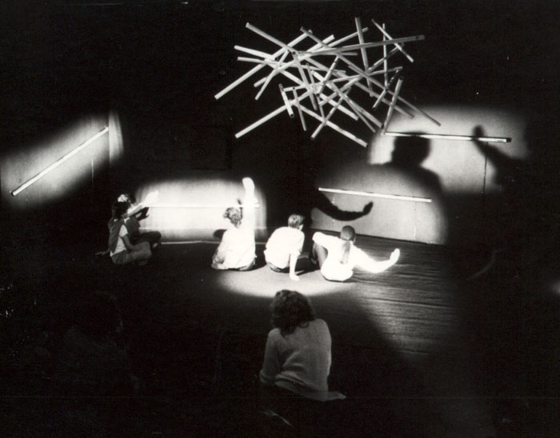
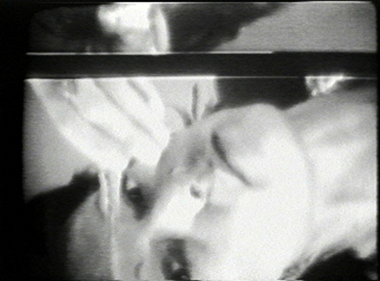

# Партиципаторное искусство и телевещание

**Партиципаторное искусство и телевещание** — направление художественной практики, возникшее в 1970-е годы и ориентированное на разрушение пассивной позиции телезрителя через превращение одностороннего вещания в пространство живого диалога. Ключевой фигурой этого направления является американский художник и теоретик **Даглас Дэвис** (Douglas Davis, 1933–2014), чьи проекты в области [телекоммуникационного искусства](https://en.wikipedia.org/wiki/Telematic_art) предвосхитили интерактивность интернета, культуру лайв-стримов и саму логику социальных сетей.

---

## Контекст эпохи: телевидение как власть

*Chambre à Musique, интерактивный перформанс 1983 года — пример партиципаторного искусства, вовлекающего зрителя в диалог. Источник: Wikimedia Commons*

В 1970-е годы телевидение занимало позицию абсолютного культурного доминанта. В США три крупнейшие сети — NBC, CBS и ABC — контролировали информационную повестку страны, формировали вкусы, насаждали определённую картину мира. Телевизор, стоявший в каждой гостиной, был устроен принципиально асимметрично: он говорил, зритель слушал. Обратного канала не существовало ни технически, ни концептуально.

Художники и теоретики того времени воспринимали этот факт как политическую проблему. [Видеоарт](https://ru.wikipedia.org/wiki/Видеоарт), формировавшийся в тот же период, был в значительной мере реакцией на монополию телевещания: художники брали портативные видеокамеры и записывали то, что телесеть никогда не показала бы в эфире. Однако само телевидение как коммуникативная среда оставалось нетронутым — пока за него не взялся Даглас Дэвис.

Дэвис видел в телевизоре не просто инструмент пропаганды, но **«монологическую машину»** — технологию, структурно исключающую ответ. Его художественная программа состояла в том, чтобы взломать эту структуру изнутри, используя сам телеэфир как материал произведения. В этом его подход принципиально отличался от метода [Нам Джун Пайк и концепция электронного суперхайвея](1.2_nam_june_paik.md): если Пайк физически разбирал телевизоры, перепаивал их схемы и превращал в скульптуры, Дэвис работал с телевидением как **социальной структурой** — как с пространством власти, которое можно оккупировать и перепрограммировать.

---

## Даглас Дэвис: биография и метод

Даглас Дэвис родился в 1933 году в Вашингтоне, округ Колумбия. Он получил образование в области изящных искусств, работал художественным критиком в *Newsweek* и преподавал в нескольких американских университетах. К концу 1960-х Дэвис сформулировал концепцию, которую сам называл **«теорией участия»** (*participation theory*): произведение искусства существует лишь постольку, поскольку оно активирует зрителя, делает его соавтором.

Теоретически эта позиция была близка к концепции **«открытого произведения»** Умберто Эко — идее о том, что художественный текст конституируется не автором, а читателем, который каждый раз заново собирает его смысл. Дэвис переводил эту философию в пространство прямого эфира: он хотел, чтобы зритель телевизора не просто «прочитал» произведение, но физически вмешался в него.

Важным контекстом для его работы является также движение [Флюксус](https://ru.wikipedia.org/wiki/Флюксус) и практики Йозефа Бойса с его концепцией «социальной скульптуры» — идеей, что искусство должно формировать общественные связи, а не создавать объекты для созерцания. Дэвис разделял этот пафос, но реализовывал его в специфически американской медиасреде — в пространстве коммерческого телевидения.

Метод Дэвиса строился на двух принципах:

1. **Обращение напрямую** — художник разговаривал с камерой как с живым собеседником, нарушая конвенцию «четвёртой стены» экрана.
2. **Приглашение к ответу** — он публично призывал телезрителей прикоснуться к экрану, написать, позвонить, вступить в контакт с изображением.

---

## Ключевые проекты

| Год | Проект | Платформа / Событие | Суть |
|-----|--------|----------------------|------|
| 1971 | **Talk-Out!** | WTOP-TV, Вашингтон | Дэвис в прямом эфире разговаривал с телевизионной камерой как с живым существом, обращаясь к невидимым зрителям и предлагая им ответить |
| 1973 | **The Austrian Tapes** | ORF, Австрия | Серия телеперформансов, записанных для австрийского телевидения; зрителей приглашали физически взаимодействовать с экраном — прикасаться к нему руками |
| 1974 | **Talk-Out! / Galveston** | Телеэфир, Техас | Продолжение серии: Дэвис говорил напрямую с телеаудиторией и предлагал ей разрушить условность пассивного просмотра |
| 1977 | **The Last Nine Minutes** | Documenta 6, Кассель (спутник) | Девятиминутный телеперформанс, транслировавшийся через спутник одновременно в **25 странах** в рамках документальной выставки Documenta 6 |
| 1978 | **Two-Way Demo** | Различные площадки | Эксперименты с двусторонней спутниковой связью; первые опыты «телемоста» как художественного жанра |
| 1994 | **The World's First Collaborative Sentence** | Интернет (Whitney Museum) | Незавершённое предложение в сети, которое пользователи могут продолжать бесконечно; хранится в архиве Whitney Museum of American Art |

---

## «The Last Nine Minutes»: перформанс на весь мир

*Джоан Джонас, «Vertical Roll» (1972) — один из первых видеоперформансов, в котором художница исследовала сам телевизионный сигнал как художественный материал. Источник: Wikimedia Commons*

Проект 1977 года стал самым масштабным опытом Дэвиса в области телекоммуникационного искусства. Выставка **Documenta 6** в Касселе была первой в истории, включавшей спутниковую трансляцию как полноправный художественный элемент. Рядом с Дэвисом в этом телемарафоне участвовали [Нам Джун Пайк и концепция электронного суперхайвея](1.2_nam_june_paik.md) и Йозеф Бойс — сам факт их соседства символически обозначил территорию нового вида искусства.

Девять минут в прямом эфире, транслировавшихся одновременно на аудиторию 25 стран, Дэвис говорил с телекамерой — и через неё со зрителями по всему миру — призывая их прикоснуться к экрану, «прорвать» поверхность стекла, которая разделяет отправителя и получателя сигнала.

> «Я прошу вас коснуться экрана. Ваши руки, ваш рот, ваши глаза — они нужны мне прямо сейчас. Стекло — это не барьер. Это место встречи».
> — Даглас Дэвис, «The Last Nine Minutes», 1977

Этот жест — призыв физически прикоснуться к экрану — был радикально наивным и радикально точным одновременно. Он обнажал парадокс телевещания: технология, созданная для связи людей, структурно эту связь запрещала.

---

## «Talk-Out!» (1971): первый разговор с экраном

Перформанс на вашингтонском канале WTOP-TV в 1971 году стал отправной точкой всей художественной программы Дэвиса. Он вышел в прямой эфир и начал разговаривать с камерой — не как ведущий, не как актёр, но как человек, обращающийся к другому человеку через стеклянную стену. Он называл телевизор «живым существом», спрашивал зрителей, слышат ли они его, просил их ответить.

Ни один зритель, разумеется, не мог ответить в прямом техническом смысле — телефонной связи с эфиром не существовало. Но именно эта невозможность ответа и была художественным высказыванием: перформанс делал зримой саму структуру коммуникативного запрета, встроенного в телевизионный медиум.

---

## «The World's First Collaborative Sentence» (1994): переход в интернет

К середине 1990-х Дэвис, одним из первых среди художников своего поколения, понял, что интернет даёт то, чего телевидение не могло дать никогда: настоящий обратный канал. В 1994 году он создал проект **«The World's First Collaborative Sentence»** — текстовый файл, опубликованный в сети, который любой пользователь мог продолжить, добавив своё предложение или слово.

Проект существует по сей день. Его архив хранится в **Whitney Museum of American Art** в Нью-Йорке — знаковое признание институтом современного искусства ценности коллективного, незавершённого, процессуального произведения. В этом смысле «Collaborative Sentence» предвосхитила вики-культуру, форумы и комментарии в социальных сетях — формы коллективного письма, ставшие нормой двадцать лет спустя.

Этот переход от телевизионного эфира к интернет-тексту обнажает непрерывность художественного замысла Дэвиса: на протяжении трёх десятилетий он искал одно и то же — **технологию участия**, медиум, структурно допускающий ответ.

---

## Концепция и теория участия

[Партиципаторное искусство](https://en.wikipedia.org/wiki/Participatory_art) как теоретическая категория опирается на несколько ключевых идей, которые Дэвис разрабатывал параллельно с художественной практикой.

**Против монолога.** Дэвис рассматривал традиционное искусство — живопись, скульптуру, кино, телевидение — как структурно монологичное: автор говорит, зритель слушает. Произведение замкнуто, завершено, отчуждено от того, кто его воспринимает. Его программа состояла в открытии этой замкнутости — в создании произведений, которые без участия зрителя попросту не существуют.

**Тело зрителя как материал.** В «The Austrian Tapes» и ряде других проектов Дэвис буквально приглашал зрителей прикоснуться к экрану. Это физическое действие — прикосновение ладони к стеклу телевизора — превращало телесность зрителя в элемент художественного события. Граница между произведением и публикой стиралась.

**Время как медиум.** Все проекты Дэвиса существовали в режиме реального времени — прямой эфир, перформанс, живая трансляция. Это принципиально отличало его от [видеоарта](https://ru.wikipedia.org/wiki/Видеоарт) как жанра, работающего с записью. Для Дэвиса важен был именно момент *сейчас*, разделённый одновременно художником и аудиторией.

**Телевидение как социальная архитектура.** Дэвис никогда не ограничивался критикой технологии — его интересовала власть как таковая, встроенная в коммуникативные структуры. Телевизор был для него метафорой любого одностороннего высказывания: государственного, институционального, педагогического.

---

## Наследие

Проекты Дагласа Дэвиса 1970-х годов сегодня выглядят провидческими в степени, которую трудно переоценить. Перечислим линии влияния:

- **Телемосты и видеоконференции** — жанр, ставший нормой в корпоративной и политической коммуникации, был художественно опробован Дэвисом на десятилетие раньше его технической нормализации.
- **[Hole in Space (1980)](1.1_hole_in_space.md)** — прямой наследник художественной программы Дэвиса: спутниковый телемост между Нью-Йорком и Лос-Анджелесом, созданный Китом Гэллоуэем и Шерри Рабиновиц, реализовал его утопию двустороннего экрана.
- **Лайв-стримы и Twitch** — культура прямых трансляций, в которых зритель общается с исполнителем через чат в реальном времени, воспроизводит структуру, придуманную Дэвисом в 1971 году на WTOP-TV.
- **[Net.art](https://ru.wikipedia.org/wiki/Net-арт)** и сетевое искусство 1990-х — в частности, коллективные интернет-проекты и [Почтовые рассылки как арт-пространство (Nettime)](https://en.wikipedia.org/wiki/Nettime) наследуют его идее о сети как пространстве горизонтального диалога.
- **Вики-культура** — «The World's First Collaborative Sentence» структурно предвосхищает Wikipedia: незавершённый текст, открытый для бесконечного соавторства.

> «Даглас Дэвис понял, что важен не экран, а промежуток между экраном и человеком. Именно там и рождается искусство».
> — из теоретических обзоров [медиаискусства](https://ru.wikipedia.org/wiki/Медиаискусство) 2000-х годов

Помимо прямых влияний, Дэвис поставил вопрос, который до сих пор остаётся центральным для [медиаискусства](https://ru.wikipedia.org/wiki/Медиаискусство): **что значит участвовать?** Достаточно ли прикоснуться к экрану? Достаточно ли добавить слово в коллективный текст? Где проходит граница между зрителем и соавтором — и нужна ли она вообще?

---

## Смотри также

- [Портал 1: Телекоммуникационное искусство (Предтечи)](../README.md)
- [Hole in Space (1980)](1.1_hole_in_space.md)
- [Нам Джун Пайк и концепция электронного суперхайвея](1.2_nam_june_paik.md)
- [Видеоарт](https://ru.wikipedia.org/wiki/Видеоарт)
- [Медиаискусство](https://ru.wikipedia.org/wiki/Медиаискусство)
- [Телекоммуникационное искусство](https://en.wikipedia.org/wiki/Telematic_art)
- [Партиципаторное искусство](https://en.wikipedia.org/wiki/Participatory_art)
- [Net.art](https://ru.wikipedia.org/wiki/Net-арт)
- [Арт-группа JODI](https://en.wikipedia.org/wiki/JODI_(art_group))
- [Почтовые рассылки как арт-пространство (Nettime)](https://en.wikipedia.org/wiki/Nettime)

---

Авторы: Вячеслав Самарин;

*Ресурсы: LLM — Claude Sonnet 4.6*
