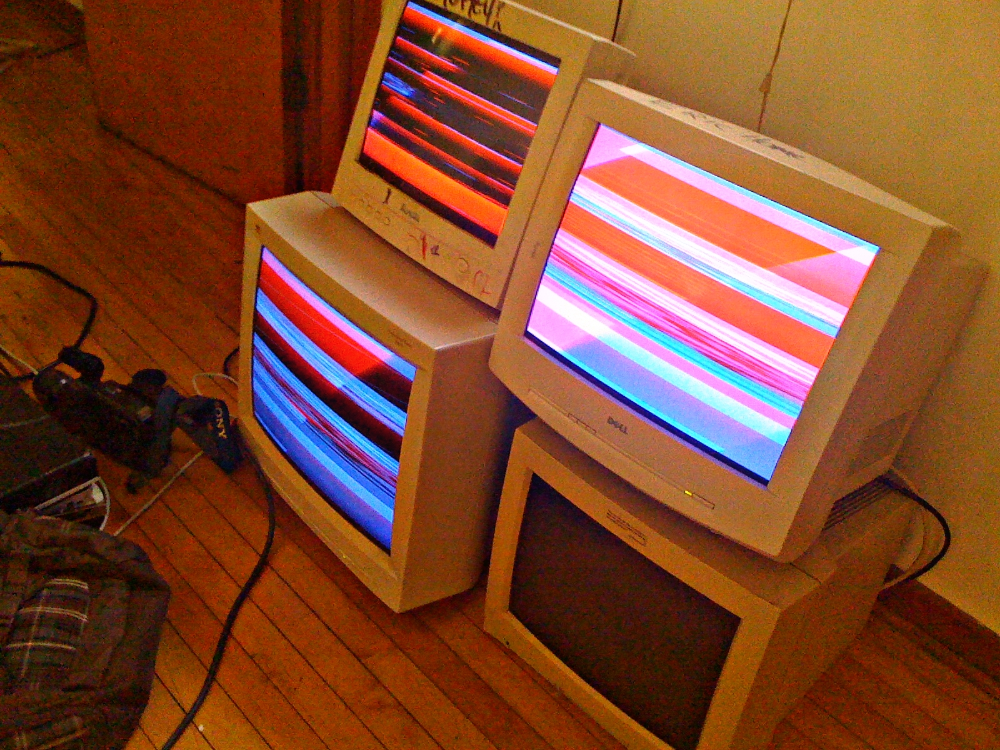
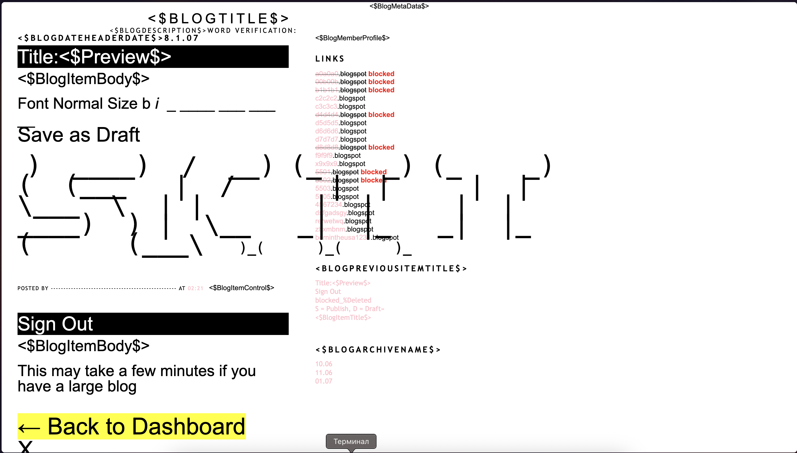

# Арт-группа JODI

**JODI** — пионерский дуэт сетевого искусства, образованный нидерландской художницей **Джоан Хемскерк** (Joan Heemskerk, род. 1968) и бельгийским художником **Дирком Паэсмансом** (Dirk Paesmans, род. 1965). Начиная с 1994 года группа работает на пересечении веб-искусства, game art и перформанса, превращая интерфейс компьютера в арену деконструкции и художественного хаоса. JODI считаются одними из основоположников [net.art](https://ru.wikipedia.org/wiki/Net-арт) и [глитч-арта](https://ru.wikipedia.org/wiki/Глитч-арт) — двух течений, без которых невозможно понять эстетику [цифровой](../../musical_instruments/articles/synthesizer.md) культуры рубежа XX–XXI веков. Подробная биография и дискография группы представлены в статье [JODI (art group)](https://en.wikipedia.org/wiki/JODI_(art_group)) в англоязычной Википедии.

---

## [Контекст](../../../5.1_technology_and_digital_literacy/information and media literacy/геолокация_и_проверка_контекста.md): первые браузеры и анархия сети

*Глитч-арт как [перформанс](1.3_participatory_art.md): группа DIE COMPUTER (Джеймс Коннолли и Эрик Пеллегрино) демонстрирует эстетику сбоя и цифровой [ошибки](../../../3.1_healthy_lifestyle/pervaya_pomoshch/ushibi_porezy_ozhogi/07_ushib_chego_nelzya.md) — художественное [направление](../../../1.2_natural_sciences/physics_in_everyday_life/Q11402.md), у истоков которого стоит JODI. [Источник](../../../5.1_technology_and_digital_literacy/information and media literacy/дезинформация_и_фейки.md): Wikimedia Commons*

В [1993](2.6_cac.md)–1994 годах мировая аудитория впервые получила доступ к браузеру **[Mosaic](../../../5.1_technology_and_digital_literacy/how_internet_works/articles/history/internet_at_home.md)**, а затем и к **[Netscape](../../../5.1_technology_and_digital_literacy/how_internet_works/articles/history/internet_at_home.md) Navigator** — инструментам, которые превратили абстрактную [сеть](../../../5.1_technology_and_digital_literacy/how_internet_works/articles/history/internet_history.md) передачи данных в визуальное [пространство](../../../1.2_natural_sciences/physics_in_everyday_life/Q36253.md) с гиперссылками, изображениями и цветными страницами. [Интернет](../../../1.2_natural_sciences/physics_in_everyday_life/Q26540.md) переставал быть привилегией военных и учёных: в него входили художники, активисты, журналисты и просто любопытные.

Первые годы Всемирной паутины были временем радикального безвластия. Не существовало ни поисковых корпораций, ни алгоритмов вовлечённости, ни стандартов юзабилити. Каждый сайт был отдельным экспериментом, а HTML-код — одновременно чертежом и полотном. Именно в эту щель анархии и хлынули художники.

Для авангардного арт-сообщества сеть предлагала нечто невозможное прежде: **полную независимость от институции**. Никаких галеристов, никаких кураторов, никаких географических ограничений. Произведение публиковалось мгновенно и достигало аудитории напрямую — будь то [Нью-Йорк](1.1_hole_in_space.md), Роттердам или Токио. Группы художников в Амстердаме, Загребе и Любляне начали осваивать HTML так же, как их предшественники осваивали холст.

Именно в этот момент встретились Хемскерк и Паэсманс. Они увидели в браузере не окно в информацию, а **[материал](../../../1.2_natural_sciences/physics_in_everyday_life/Q25358.md) для [работы](../../../8.2_future/choosing_a_career_path/articles/interview.md)** — и немедленно начали его ломать.

---

## [Метод](../../../5.1_technology_and_digital_literacy/how_internet_works/articles/http_https/http_https.md): деконструкция интерфейса

Если традиционный веб-дизайн стремится к прозрачности — интерфейс должен исчезать, уступая место содержанию, — то JODI делают ровно противоположное. Они **выворачивают интерфейс наизнанку**, превращая ожидаемый [порядок](../../../1.2_natural_sciences/physics_in_everyday_life/Q45003.md) в зрелищный [хаос](../../../1.2_natural_sciences/physics_in_everyday_life/Q45003.md).

Первым и наиболее радикальным примером стал сайт **[jodi.org](https://jodi.org)**, запущенный в 1994 году. Посетитель, открывавший его в браузере, видел не [текст](../../../4.1_rules_of_study/how_to_learn_effectively/articles/reading_skills.md) и не картинки — а хаотичный [поток](../../../5.1_technology_and_digital_literacy/operating system/articles/thread.md) символов, псевдографики, команд и знаков, похожих на распечатку сбойной программы или на [экран](../../../3.1. healthy lifestyle/Sleep, nutrition, and adolescent energy/articles/gadgets_blue_light_sleep.md) умирающего терминала. Казалось, что сайт «заражён вирусом» или просто сломан.

Однако если открыть исходный [код](../../../5.2_cybersecurity/cpp_fundamentals/1_introduction.md) [страницы](../../../5.1_technology_and_digital_literacy/operating system/articles/memory_management.md) — [поведение](../../../1.2_natural_sciences/neurobiology_for_teens/articles/06_phineas_gage.md), которое в 1994 году было доступно любому пользователю через меню браузера, — обнаруживалась совершенно иная картина: аккуратно структурированный, даже изысканный HTML с зашифрованной схемой атомной бомбы. То, что выглядело как катастрофа на уровне рендеринга, оказывалось **точно спроектированным произведением на уровне кода**.

> «Мы думали о браузере как о рамке. Мы хотели разрушить эту рамку — показать, что за ней есть что-то ещё».
> — Джоан Хемскерк и Дирк Паэсманс

*Скриншот jodi.org: хаотичный поток ASCII-символов и псевдографики, который видит посетитель. В исходном HTML-коде скрыта детальная схема атомной бомбы. Источник: jodi.org*

Этот приём — демонстрация «изнанки» цифрового объекта — стал фирменным методом JODI. HTML-теги, вместо того чтобы оставаться невидимой разметкой, выступали на экране как **самостоятельный текст и визуальный [элемент](../../../1.2_natural_sciences/why_science_help_understand_world/chemistry.md)**. Код становился картиной.

[Эстетика](../../../7.2 Media, leisure and hobbies /what_you_can_read_and_watch_to_develop_your_taste/articles/aesthetics_and_taste.md) **глитча** — сбоя, ошибки, непреднамеренного визуального артефакта — оказалась для JODI не дефектом, а художественным высказыванием. Сломанный экран говорит о хрупкости цифровой среды, о [том](../../musical_instruments/articles/drums.md), что за любым «гладким» интерфейсом скрывается сложная и уязвимая машинерия.

---

## Ключевые проекты

| [Проект](../../../1.2_natural_sciences/why_science_help_understand_world/research_work.md) | Год | Описание |
|---|---|---|
| **[jodi.org](https://jodi.org)** | 1994 | Первый веб-сайт JODI. На экране — хаотичный поток символов и псевдографики; в исходном коде — спрятанная схема атомной бомбы. Радикальная демонстрация разрыва между видимым интерфейсом и его «изнанкой». |
| **%Wrong** | [1995](2.5_siberian_deal.md) | Серия браузерных работ, эксплуатирующих ошибки и баги ранних версий Netscape. JODI намеренно провоцировали сбои, превращая аварийное поведение программы в перформативный жест. |
| **OSS (Open Source Software)** | 1999–2002 | Цикл модификаций (модов) коммерческих видеоигр. JODI вмешивались в исходный код **Quake** и **Jet Set Willy**, превращая привычные игровые миры в абстрактные пространства из геометрических примитивов — без текстур, без нарратива, без [цели](../../../3.1_healthy_lifestyle/pervaya_pomoshch/ushibi_porezy_ozhogi/02_celi_pervoy_pomoshchi.md). |
| **SOD** | 1999 | Мод-пародия на **Wolfenstein 3D** от id Software. Уровни, враги и звуки оригинальной игры заменены абстракцией: чёрно-белые лабиринты, бессмысленные знаки, полная дезориентация. Один из первых примеров game art как автономного художественного жанра. |

---

## JODI и глитч-арт

JODI принято называть **основоположниками глитч-арта** — или, по меньшей мере, его первыми сознательными адептами. Глитч как художественный метод предполагает не исправление ошибок, а их культивирование: сбой становится высказыванием.

В [работах](../../../8.2_future/choosing_a_career_path/articles/interview.md) JODI глитч несёт двойную нагрузку. С одной стороны, это **эстетический жест**: разорванное [изображение](../../../5.1_technology_and_digital_literacy/information and media literacy/оценка_качества_изображений_и_видео.md), мерцающий [пиксель](../../../7.2 Media, leisure and hobbies/Computer games/articles/technologies_inside/screen_magic.md), [артефакт](../../../5.1_technology_and_digital_literacy/information and media literacy/оценка_качества_изображений_и_видео.md) сжатия обладают своей красотой — тревожной, непривычной, но неоспоримой. С другой — это **критическое высказывание**: показывая, как легко «нормальный» интерфейс разрушается, JODI напоминают, что цифровая [среда](../../../1.2_natural_sciences/physics_in_everyday_life/Q124003.md) не является ни нейтральной, ни надёжной.

> «Компьютер — не инструмент. Это пространство, полное скрытых правил. Мы хотим сделать эти [правила](../../../2.1_society/cause_and_effect_relationships/articles/why_rules_work.md) видимыми — или сломать их».

Этот подход оказал прямое [влияние](../../../5.1_technology_and_digital_literacy/information and media literacy/манипуляции_и_пропаганда.md) на поколение художников 2000-х и 2010-х годов, работавших с глитчем как самостоятельным медиумом: **Rosa Menkman** ([автор](../../../4.2_thinking_and_working_information/how_to_search_information/articles/copypaste.md) «Манифеста глитча»), **Curt Cloninger**, **Daniel Temkin**. Глитч-арт сегодня — признанное направление с собственными теоретическими текстами, фестивалями и музейными коллекциями. У его истоков стоят именно JODI.

---

## Влияние и наследие

Влияние JODI на цифровую культуру сложно переоценить — отчасти потому, что оно распространилось сразу в нескольких направлениях.

**Веб-дизайн** обязан JODI парадоксальным долгом: именно их работы заставили [профессиональное сообщество](../../../../8.1_self_understanding/articles/mentorship.md) задуматься о том, что «нормальный» сайт — это конструкт, а не природная данность. Деконструктивная эстетика JODI предвосхитила целые поколения экспериментального веб-дизайна — от эпохи Flash до современной «некрасивой» эстетики indie-веба.

**Game art** как самостоятельный [жанр](../../../../8.1_entertainment/articles/movie.md) во многом вырос из работ серии OSS и SOD. Модификации видеоигр, превращающие коммерческий продукт в художественное высказывание, сегодня представлены в крупнейших мировых музеях — в том числе в постоянной онлайн-коллекции **Whitney Museum of American Art** в Нью-Йорке, где хранится ряд работ JODI.

**Пост-интернет-арт** 2010-х годов — художественная [практика](../../../1.2_natural_sciences/physics_in_everyday_life/Q124003.md), осмысляющая [жизнь](../../../1.2_natural_sciences/physics_in_everyday_life/Q1751973.md) «после» интернета, когда сеть стала тотальной средой обитания, — прямо наследует критическому импульсу JODI. Художники вроде **Harm van den Dorpel** и **Artie Vierkant** продолжают задавать [вопросы](../../../4.1_rules_of_study/how_to_learn_effectively/articles/curiosity.md) о видимости кода, природе интерфейса и политике платформ — те самые вопросы, которые JODI поставили ещё в 1994-м.

Наконец, JODI стали важнейшими предшественниками современной **культуры ошибки**: интернет-эстетики, в которой 404-страница, скриншот с артефактом или случайный баг воспринимаются не как неисправность, а как полноправный художественный материал. В эпоху, когда алгоритмические системы формируют [восприятие](../../../1.2_natural_sciences/neurobiology_for_teens/articles/26_optical_illusions.md) миллиардов людей, умение видеть и называть сбои этих систем приобретает отчётливо политическое [измерение](../../../1.2_natural_sciences/physics_in_everyday_life/Q107715.md).

---

## Смотри также

- [Хит Бантинг](2.2_heath_bunting.md)
- [Почтовые рассылки как арт-пространство (Nettime)](2.3_nettime.md)
- [Первые арт-серверы](2.4_art_servers.md)
- [Проект Siberian Deal (1995)](2.5_siberian_deal.md)
- [Computer Aided Curating (C@C)](2.6_cac.md)
- [Портал 2: Net.art (Золотой век сетевого искусства 1990-х)](../README.md)
- [Hole in Space (1980)](1.1_hole_in_space.md)
- [Глитч-арт](https://ru.wikipedia.org/wiki/Глитч-арт) (внешняя [ссылка](../../../4.2_thinking_and_working_information/how_to_search_information/articles/copypaste.md))
- [Net.art](https://ru.wikipedia.org/wiki/Net-арт) (внешняя ссылка)
- [JODI (art group)](https://en.wikipedia.org/wiki/JODI_(art_group)) (внешняя ссылка)

---

Авторы: Артём Закарейшвили;

*[Ресурсы](../../../2.1_society/cause_and_effect_relationships/articles/ecological_footprint.md): [LLM](../README.md) — Claude Sonnet 4.6*
