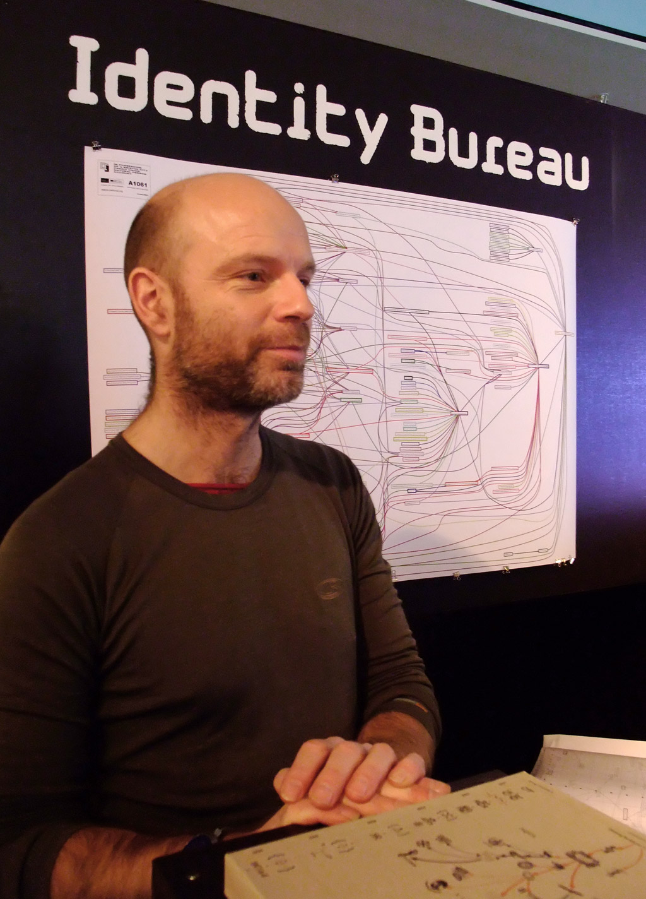

# Хит Бантинг (Heath Bunting)

**Хит Бантинг** ([Heath Bunting](https://en.wikipedia.org/wiki/Heath_Bunting), род. 1966, Великобритания) — британский [художник](../../../7.2 Media, leisure and hobbies/Computer games/articles/dream_team/artist.md), [пионер](1.2_nam_june_paik.md) [net.art](https://ru.wikipedia.org/wiki/Net-арт) и [хактивизма](https://ru.wikipedia.org/wiki/Хактивизм), чьи [работы](../../../8.2_future/choosing_a_career_path/articles/interview.md) превратили публичные базы данных, поисковые системы и государственные реестры в [материал](../../../1.2_natural_sciences/physics_in_everyday_life/Q25358.md) для художественного высказывания. Используя инфраструктуру самой системы против неё самой, Бантинг заложил [основы](../../../3.1_healthy_lifestyle/pervaya_pomoshch/ushibi_porezy_ozhogi/01_chto_takoe_pervaya_pomoshch.md) практики, которую впоследствии назовут «критическим программированием» и которая предвосхитила целое поколение активистов, журналистов-расследователей и художников цифрового сопротивления.

---

## От граффити к сети

*Хит Бантинг — британский художник и хактивист, один из основоположников [net.art](../README.md). Фотография 2011 года. [Источник](../../../5.1_technology_and_digital_literacy/information and media literacy/дезинформация_и_фейки.md): Wikimedia Commons*

[Путь](../../../1.2_natural_sciences/physics_in_everyday_life/Q11476.md) Бантинга к сетевому искусству начался не за компьютером, а на улицах Бристоля. В конце 1980-х годов он работал как граффити-художник, воспринимая городскую стену как [пространство](../../../1.2_natural_sciences/physics_in_everyday_life/Q36253.md) несанкционированного высказывания — место, где частное слово вторгается в публичное пространство без разрешения институтов. Граффити для Бантинга было не вандализмом, а методом: взять чужую [поверхность](../../../1.2_natural_sciences/physics_in_everyday_life/Q35197.md) и оставить на ней [след](../../../5.1_technology_and_digital_literacy/information and media literacy/приватность_и_цифровой_след.md), игнорируя [правила](../../../2.1_society/cause_and_effect_relationships/articles/why_rules_work.md) собственности.

Примерно тогда же Бантинг открыл для себя BBS-сети (Bulletin Board Systems) — предшественников интернета, где пользователи обменивались текстами через телефонные линии. Эти закрытые, самоорганизованные сообщества напоминали ему граффити-культуру: те же горизонтальные связи, тот же дух обхода официальных каналов. С приходом Всемирной паутины в начале 1990-х Бантинг немедленно распознал в ней то, чем всегда была для него стена, — новую поверхность для несанкционированного письма, только глобального масштаба.

В 1994 году Бантинг вместе с художницей Рэйчел Бейкер и рядом других единомышленников основал **[irational.org](https://irational.org)** — один из первых независимых арт-серверов, ставших домом для экспериментального сетевого искусства. Irational.org намеренно позиционировал себя как «иррациональный» ресурс: вне логики коммерческого веба, вне галерейной системы, вне государственных субсидий. Это был жест институциональной автономии, воплощённый в регистрации домена.

---

## Художественный [метод](../../../5.1_technology_and_digital_literacy/how_internet_works/articles/http_https/http_https.md): [взлом](../../../5.1_technology_and_digital_literacy/how_internet_works/articles/wifi/security.md) баз данных

Центральным инструментом Бантинга стал не [код](../../../5.2_cybersecurity/cpp_fundamentals/1_introduction.md) в техническом смысле, а [информация](../../../5.1_technology_and_digital_literacy/information and media literacy/как_устроена_современная_информационная_среда.md) — публично доступная, но обычно невидимая в своей системности. Телефонные справочники, реестры налогоплательщиков, базы данных государственной регистрации, поисковые индексы — всё это Бантинг рассматривал как художественный материал, аналогичный краске или камню.

Его метод можно описать как «взлом через легальность»: он никогда не проникал в закрытые системы и не нарушал [законы](../../../1.2_natural_sciences/physics_in_everyday_life/Q7860.md) о доступе к данным. Вместо этого он брал публично доступную информацию и соединял её неожиданными способами, обнажая механизмы, которые система предпочитает скрывать. Если традиционный [хакер](../../../5.1_technology_and_digital_literacy/how_internet_works/articles/wifi/security.md) ищет уязвимость в коде, чтобы получить несанкционированный доступ, Бантинг искал уязвимость в логике системы, чтобы задать ей неудобный вопрос.

Принципиальное отличие от хакинга в обычном смысле — в целеполагании. Бантинга не интересовало разрушение, [кража данных](../../../5.2_cybersecurity/passwords_cyber_safety/articles/phishing.md) или демонстрация технического превосходства. Его [цель](../../../1.2_natural_sciences/why_science_help_understand_world/research_work.md) была художественной и политической одновременно: показать, как системы классификации формируют идентичность, как государство превращает человека в набор записей, как публичное пространство данных одновременно открыто и манипулятивно.

---

## Ключевые проекты

| [Проект](../../../1.2_natural_sciences/why_science_help_understand_world/research_work.md) | Год | Суть |
|---|---|---|
| **_readme.[html](2.1_jodi.md)** | 1996 | Гипертекстовая [сеть](../../../5.1_technology_and_digital_literacy/how_internet_works/articles/history/internet_history.md), построенная из единственного слова «readme». Каждое слово в тексте становилось ссылкой на связанные с ним [ресурсы](../../../2.1_society/cause_and_effect_relationships/articles/ecological_footprint.md) в сети, превращая обычный словарный запас в интерактивную карту языка и интернета одновременно. Проект исследовал природу гипертекста как нового вида мышления — нелинейного, ризоматического, бесконечно расширяющегося. |
| **Identity Bureau** | 2000-е | Проект-сервис, в рамках которого Бантинг помогал людям создавать «альтернативные» легальные личности, используя пробелы и противоречия в системах государственной регистрации. Опираясь исключительно на публично доступные документы и юридические лазейки, он демонстрировал, насколько условна и уязвима официально зафиксированная идентичность. |
| **Status Project** | с 2004 | Масштабное картографирование того, как британское государство фиксирует, классифицирует и контролирует своих граждан. Бантинг систематически собирал [данные](../../../2.1_society/cause_and_effect_relationships/articles/ai_causality.md) о всех официальных категориях, в которых может существовать [человек](../../../1.2_natural_sciences/physics_in_everyday_life/Q45003.md) в глазах государства: налогоплательщик, пассажир, пациент, подозреваемый. Результатом стали визуальные схемы, напоминающие одновременно бюрократические формы и концептуальные карты. |

---

## [Хактивизм](../README.md) как художественная [практика](../../../1.2_natural_sciences/physics_in_everyday_life/Q124003.md)

Термин «хактивизм» — [соединение](../../../5.1_technology_and_digital_literacy/how_internet_works/articles/tcp_udp/tcp_udp.md) слов «хакинг» и «активизм» — применительно к художественной сфере Бантинг воплощал раньше, чем этот термин получил широкое [распространение](../../../1.2_natural_sciences/physics_in_everyday_life/Q41364.md). Его практика принципиально отличалась как от традиционного политического активизма, так и от классического хакерства.

Политический активизм, как [правило](../../../1.2_natural_sciences/why_science_help_understand_world/patterns.md), апеллирует к власти с требованиями: подпишите петицию, измените [закон](../../../1.2_natural_sciences/physics_in_everyday_life/Q41719.md), остановите политику. Бантинг предпочитал иное: он не требовал изменений, а демонстрировал их возможность, действуя непосредственно в пространстве системы. Это роднило его с философией **Temporary Autonomous Zones** (TAZ), описанной теоретиком-анархистом Хакимом Беем: вместо того чтобы брать власть, создавай временные зоны свободы внутри существующей системы, не запрашивая на это разрешения.

Bантинг превращал художественный проект в функционирующий инструмент. Identity Bureau не просто говорил об идентичности — он реально помогал людям создавать новые идентичности. Status Project не просто критиковал государственный [надзор](3.2_surveillance_art.md) — он картографировал его с той же методичностью, с которой сам надзор картографирует граждан. Это [зеркало](../../../1.2_natural_sciences/physics_in_everyday_life/Q35197.md), поставленное не ради красоты отражения, а ради дискомфорта узнавания.

---

## [Влияние](../../../5.1_technology_and_digital_literacy/information and media literacy/манипуляции_и_пропаганда.md) и наследие

Практика Бантинга обозначила [вектор](../../../1.2_natural_sciences/physics_in_everyday_life/Q161635.md), по которому развивалось несколько поколений художников, активистов и исследователей.

Его метод «взлома через легальность» — использование публично доступных данных для обнажения системных противоречий — стал фундаментальным принципом журналистики данных и расследовательских медиапроектов, расцветших в 2010-е годы. [Культура](../../../2.1_society/cause_and_effect_relationships/articles/why_rules_work.md) WikiLeaks, [движение](../../../1.2_natural_sciences/physics_in_everyday_life/Q11023.md) Anonymous, [журналистика](3.1_uncensored_library.md) OSINT (Open Source Intelligence) — все они работают в логике, которую Бантинг артикулировал художественными средствами ещё в середине 1990-х.

Концепция «альтернативной идентичности» из Identity Bureau перекликается с практиками **[Forensic Architecture](https://forensic-architecture.org)** — арт-исследовательской группы Эяля Вайзмана, которая использует открытые данные для документирования государственных преступлений. Оба проекта исходят из одного тезиса: публичная информация, собранная и структурированная нужным образом, становится инструментом власти — но также и инструментом сопротивления.

В более широком контексте net.art Бантинг олицетворял этическую позицию, противостоявшую коммерциализации интернета. В то [время](../../../1.2_natural_sciences/physics_in_everyday_life/Q20702.md) как Силиконовая долина строила веб как [рынок](../../../2.1_society/cause_and_effect_relationships/articles/economic_chains.md), Бантинг настаивал на нём как на публичном пространстве, где художник обязан занимать критическую позицию. Эта позиция остаётся актуальной в эпоху, когда алгоритмические системы классификации стали значительно мощнее и непрозрачнее, чем телефонные справочники 1990-х.

---

## Смотри также

- [Арт-группа JODI](2.1_jodi.md)
- [Почтовые рассылки как арт-пространство (Nettime)](2.3_nettime.md)
- [Первые арт-серверы](2.4_art_servers.md)
- [Проект Siberian Deal (1995)](2.5_siberian_deal.md)
- [Computer Aided Curating (C@C)](2.6_cac.md)
- [Портал 2: Net.art (Золотой век сетевого искусства 1990-х)](../README.md)

- [Хактивизм](https://ru.wikipedia.org/wiki/Хактивизм) (external)
- [Net.art](https://ru.wikipedia.org/wiki/Net-арт) (external)

### [Медиаграмотность](../../../4.2_thinking_and_working_information/critical_thinking/articles/manipulation_recognition.md) и [критическое мышление](../../../1.2_natural_sciences/neurobiology_for_teens/articles/25_cognitive_biases.md)

- [Роль поисковых систем](../../../5.1_technology_and_digital_literacy/information%20and%20media%20literacy/articles/роль_поисковых_систем.md) — как поисковые системы работают и как ими пользоваться критически (Бантинг превратил сами поисковые индексы в художественный материал)

---

Авторы: Артём Закарейшвили;

*Ресурсы: [LLM](../README.md) — Claude Sonnet 4.6*
