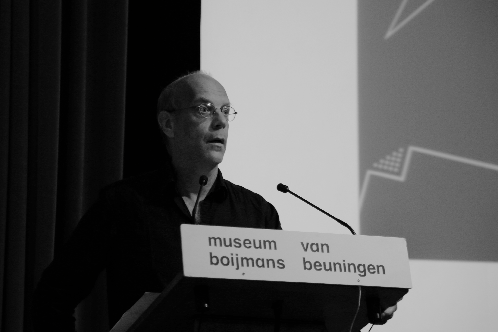
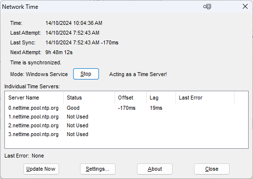

**Nettime** — список рассылки, основанный в 1995 году Питом Шульцем (Pit Schultz) и Гертом Ловинком (Geert Lovink) на фестивале Next 5 Minutes в Амстердаме. За несколько лет он превратился в одно из главных интеллектуальных пространств раннего интернета, где критики, художники и активисты со всего мира совместно вырабатывали теорию медиаискусства и сетевой культуры. Подробнее: [Nettime](https://en.wikipedia.org/wiki/Nettime).

## Почтовые рассылки как медиум

*Герт Ловинк — медиатеоретик и сооснователь почтовой рассылки Nettime, одного из ключевых интеллектуальных пространств раннего интернета. Источник: Wikimedia Commons*

Список рассылки (mailing list, listserv) — это сервис коллективной электронной почты: сообщение, отправленное на один адрес, автоматически доходит до всех подписчиков. Технология появилась ещё в 1970-х годах в академических сетях ARPANET, однако именно в 1990-е она стала главным инструментом интеллектуального общения в интернете.

Электронная почта обладала несколькими свойствами, которых не было у других тогдашних медиумов. Во-первых, она была асинхронной: участники могли отвечать в удобное время, не присутствуя в сети одновременно, — в отличие от IRC-чатов, требовавших немедленной реакции. Во-вторых, она была децентрализованной: никакого центрального сервера-модератора не существовало, и письмо могло путешествовать между разными почтовыми системами без единой точки контроля. В-третьих, e-mail допускал длинные, хорошо аргументированные тексты — эссе, манифесты, критические разборы, — что принципиально отличало его от веб-форумов, где культура общения тяготела к коротким репликам.

Именно поэтому в 1990-е почтовые рассылки стали «первыми социальными сетями» для интеллектуалов: они соединяли людей поверх географических и институциональных границ, сохраняя при этом письменную культуру академической дискуссии.

## История Nettime: от Венеции до глобального сообщества

Предыстория Nettime связана с Венецией: в 1995 году, во время Венецианской биеннале, Ловинк и Шульц организовали небольшую встречу художников и теоретиков, озабоченных политическим измерением нового медиума. Формальное основание рассылки произошло чуть позже — на фестивале Next 5 Minutes в Амстердаме, посвящённом тактическим медиа и медиаактивизму.

Среди первых участников были ключевые фигуры нарождавшегося net.art: московский художник Алексей Шульгин, загребский пионер сетевого искусства Вук Чосич, российский художник и теоретик Olia Lialina, австралийский медиатеоретик Маккензи Уорк (McKenzie Wark). Рядом с ними работали критики, журналисты, активисты, программисты — список никогда не был закрытым художественным клубом.

К концу 1990-х Nettime насчитывал несколько тысяч подписчиков и породил языковые ветки: Nettime-nl (нидерландоязычная), Nettime-bold (для более свободных, менее модерируемых дискуссий), Nettime-ro (румыноязычная). Эта разветвлённость отражала реальную географическую широту сообщества — от Восточной Европы, переживавшей постсоциалистическую трансформацию, до Северной Америки и Австралии.

*Онлайн-архив рассылки Nettime — цифровой памятник раннего интернет-активизма, где в реальном времени формировалась теория медиаискусства 1990-х. Источник: nettime.org*

## Интеллектуальная программа

Центральными темами Nettime были критика технодетерминизма, концепция тактических медиа, права на данные и медиаактивизм. Участники рассылки противостояли господствующему в 1990-е нарративу о том, что интернет сам по себе несёт освобождение: они настаивали на том, что новые технологии встроены в политические и экономические структуры власти и требуют критического осмысления.

Понятие «тактических медиа» стало главным теоретическим вкладом круга Nettime в историю медиаискусства. Термин, разработанный Ловинком и Дэвидом Гарсиа, описывал художественные и активистские практики, использующие дешёвые, доступные медиатехнологии — видео, радио, интернет — для создания временных зон сопротивления и критики. Тактические медиа не стремились к институциональному признанию; их сила была в мобильности и ситуативности.

В 1999 году вышла антология **«Readme!»** — сборник лучших текстов, опубликованных в Nettime за несколько лет. Книга стала документом эпохи: она зафиксировала момент, когда интернет ещё не был коммерциализирован, а его будущее казалось открытым и спорным. «Readme!» до сих пор остаётся важным источником для исследователей истории медиаискусства и сетевой культуры 1990-х.

## Nettime как художественная практика

Сам Nettime можно рассматривать как произведение искусства — коллективный текст, не принадлежащий никому в отдельности. Каждое письмо в рассылке существовало одновременно как частное высказывание и как вклад в общий, постоянно разворачивающийся нарратив. Никакой единый автор не контролировал этот текст; он жил в пространстве между голосами.

На Nettime разворачивались и намеренно художественные акции — «почтовые перформансы». Художники использовали рассылку для проведения e-mail кампаний, которые балансировали на грани документа, манифеста и провокации. Спам-арт как жанр — намеренное использование логики нежелательной почты в эстетических целях — также нашёл в подобных пространствах свою питательную среду.

Эти практики перекликаются с более ранним проектом Дугласа Дэвиса «World's First Collaborative Sentence» (1994): художник создал в интернете незавершаемое предложение, к которому каждый желающий мог дописать продолжение. Как и Nettime, этот проект исследовал, что происходит с авторством и смыслом в условиях открытого, коллективного, сетевого производства текста. Оба случая ставят один и тот же вопрос: может ли бесконечный разговор быть формой искусства?

## Наследие и современность

Влияние Nettime на последующую цифровую культуру трудно переоценить. Многие практики, которые сегодня кажутся само собой разумеющимися — публичный интеллектуальный блог, тематический Twitter-аккаунт, авторский Telegram-канал, — структурно наследуют логике почтовых рассылок: один голос или небольшая редакция обращается к подписавшейся аудитории, создавая сообщество вокруг темы, а не вокруг платформы.

Архив Nettime, частично доступный онлайн, представляет собой уникальный исторический документ: это живая запись того, как формировалась теория медиаискусства в реальном времени, в режиме коллективного мышления. Исследователи цифровой культуры регулярно обращаются к нему как к первоисточнику.

К середине 2000-х активность большинства листов рассылки резко упала: блоги, а затем социальные сети перетянули на себя аудиторию и энергию. «Смерть» рассылок оказалась, однако, временной. В 2010-е и особенно в 2020-е годы формат переживает возрождение — в виде платформ [Substack](https://substack.com) и аналогичных сервисов, а также тематических Discord-серверов, которые воспроизводят ту же логику подписки и сообщества. История движется по спирали: то, что казалось архаикой, вновь оказывается актуальным.

## Смотри также

- [Арт-группа JODI](2.1_jodi.md)
- [Хит Бантинг](2.2_heath_bunting.md)
- [Первые арт-серверы](2.4_art_servers.md)
- [Проект Siberian Deal (1995)](2.5_siberian_deal.md)
- [Computer Aided Curating (C@C)](2.6_cac.md)
- [Портал 2: Net.art (Золотой век сетевого искусства 1990-х)](../README.md)
- [Партиципаторное искусство и телевещание](1.3_participatory_art.md)
- [Эффект Элизы в современном искусстве](6.5_eliza_effect.md)
- [Net.art](https://ru.wikipedia.org/wiki/Net-арт) (external)
- [Nettime](https://en.wikipedia.org/wiki/Nettime) (external)

---

Авторы: Артём Закарейшвили;

*Ресурсы: LLM — Claude Sonnet 4.6*
