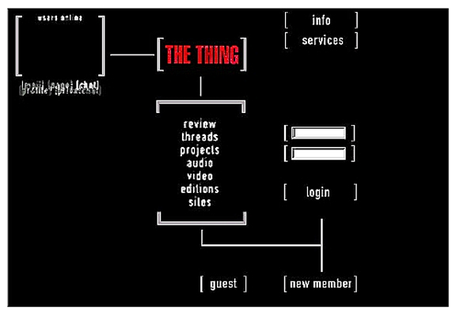

# Первые арт-серверы

В начале 1990-х годов, когда интернет ещё не стал коммерческим пространством, небольшая группа художников и активистов создала независимые онлайн-платформы, которые предоставляли творческим людям хостинг, инструменты и сообщество вне какой-либо коммерческой инфраструктуры. Эти платформы получили название **арт-серверы** — они стали не просто техническими ресурсами, но полноценными культурными институтами новой эпохи, альтернативой галереям, журналам и университетам. Арт-серверы формировали особый тип художественного пространства: децентрализованного, самоуправляемого, политически осознанного.

## The Thing (Нью-Йорк, 1991)

*Экран платформы The Thing — нью-йоркского арт-сервера, основанного Вольфгангом Штале в 1991 году. Один из первых независимых цифровых пространств для художников и критиков. Источник: Wikimedia Commons*

Одним из первых и наиболее влиятельных арт-серверов стал нью-йоркский проект **[The Thing](https://thing.net)**, основанный в 1991 году немецким художником **Вольфгангом Штале** (Wolfgang Staehle). Изначально The Thing существовал как BBS-система (Bulletin Board System) — текстовая сеть для обмена сообщениями, доступная по телефонной линии. Это была своего рода коммуна художников в цифровом пространстве: место, где можно было обсуждать искусство, критику, политику и технологии в режиме реального времени.

Название проекта — «the thing» («вещь», «штука», «нечто») — намеренно неопределённо. Штале выбрал его как указание на открытость к интерпретации: платформа не должна была фиксировать смысл, а оставаться пространством для его порождения. В 1995 году The Thing перешёл в веб, сохранив свою идею: сервер как место диалога, а не витрина.

The Thing был тесно связан с галерейной культурой Нью-Йорка — прежде всего с художниками из круга Soho и Tribeca, которые видели в цифровых сетях продолжение своих перформативных и концептуальных практик. На платформе размещались проекты таких художников, как Кен Голдберг, Дара Бирнбаум и многие другие представители тогдашней сцены net.art. Примечательно, что The Thing существует по сей день — это редкий случай выживания независимой цифровой инфраструктуры эпохи первого веба.

## Internationale Stadt (Берлин, 1994–2000)

В 1994 году в объединённом Берлине появился проект **Internationale Stadt** — «Международный город». Его создали художники **Йоахим Бланк** (Joachim Blank) и **Карл-Х. Йерон** (Karl-H. Jeron). В контексте послеобъединительного Берлина, где сходились восточная и западная художественные сцены, этот проект был одновременно утопическим экспериментом и практическим инструментом.

Internationale Stadt предлагал бесплатный хостинг для художников, музыкантов, активистов и всех, кого можно было назвать «cultural workers» — работниками культуры. Ключевой метафорой стал **город**: сервер организовывался как городское пространство с районами, улицами и площадями. Каждый пользователь или проект занимал определённый «адрес» в этом цифровом городе, что отражало идею цифрового сообщества как реальной городской общины.

Эта метафора была не просто эстетическим приёмом — она отражала реальную социальную программу. В Берлине 1990-х, где пустующие здания бывшей ГДР превращались в сквоты и культурные центры, идея цифрового города-утопии воспринималась органично. Internationale Stadt закрылся в 2000 году — вместе с первым интернет-пузырём. Архивы проекта частично сохранились и доступны исследователям как документ эпохи.

## Moscow WWW Art Centre и Алексей Шульгин

На восточноевропейском фланге сцены net.art ключевой фигурой стал российский художник **Алексей Шульгин**. В 1994–1996 годах он основал и вёл **Moscow WWW Art Centre** — первый российский арт-сервер, объединивший отечественных художников, работавших с сетью. Это был по-настоящему пионерский жест: в середине 1990-х российский интернет был крошечным, а художественная сцена, связанная с новыми медиа, только нащупывала свои контуры.

Шульгин занимался не только инфраструктурой, но и собственным художественным производством. Его проект **«Refresh»** (1996) — одна из первых работ, использовавших тег автоматической перезагрузки страницы как художественный приём: браузер бесконечно переходил от одного сайта к другому, создавая что-то вроде непрерывного монтажа. Проект **«Form Art»** (1997) исследовал эстетику стандартных элементов HTML-форм — кнопок, чекбоксов, полей ввода — как самостоятельного визуального языка.

Шульгин был активным участником легендарного почтового листа **Nettime**, где художники, теоретики и активисты со всего мира обсуждали политику сети, критику технологий и будущее цифровой культуры. Именно через Nettime российские художники встраивались в международную сцену — и именно туда Шульгин переехал в конце 1990-х, работая уже в западноевропейском контексте. Его путь стал типичным для поколения восточноевропейских net.art-художников: локальный пионер, ставший частью глобальной сцены.

## Значение независимой инфраструктуры

Арт-серверы — это не просто технические решения. Их создание было **политическим актом**. В середине 1990-х коммерческие платформы — AOL, GeoCities, Compuserve — предлагали хостинг и сообщество, но на своих условиях: с ограничениями, рекламой и отчуждением контента. Художники, создававшие независимые серверы, отказывались от этой модели сознательно.

Параллель с **самиздатом** и underground-прессой здесь не случайна. Как самиздат обходил государственную цензуру, создавая параллельную инфраструктуру распространения текстов, так и арт-серверы обходили коммерческую цензуру — не запреты, но экономическую логику, превращавшую художника в потребителя. Собственный сервер означал собственные правила: можно было экспериментировать с форматами, нарушать конвенции, создавать нежизнеспособные с коммерческой точки зрения проекты.

Сегодня эта логика воспроизводится в платформах вроде **[itch.io](https://itch.io)** (независимый хостинг для игр) или **[Mastodon](https://joinmastodon.org)** (децентрализованная социальная сеть). Принцип тот же: независимая инфраструктура как условие независимого творчества. Арт-серверы 1990-х предвосхитили эту идею — и своим существованием доказали, что она работает.

Важно и то, что арт-серверы создавали **сообщество** — не аудиторию, а участников. Художники на The Thing или Internationale Stadt не просто хранили файлы: они обменивались идеями, критиковали работы друг друга, вместе формировали язык нового искусства. В эпоху до социальных сетей это было редким и ценным опытом горизонтального художественного диалога через границы.

## Смотри также

- [Арт-группа JODI](2.1_jodi.md)
- [Хит Бантинг](2.2_heath_bunting.md)
- [Почтовые рассылки как арт-пространство (Nettime)](2.3_nettime.md)
- [Проект Siberian Deal (1995)](2.5_siberian_deal.md)
- [Computer Aided Curating (C@C)](2.6_cac.md)
- [Портал 2: Net.art (Золотой век сетевого искусства 1990-х)](../README.md)
- [Нейронная оборона (Яндекс)](5.5_yandex_neural.md)
- [Net.art](https://ru.wikipedia.org/wiki/Net-арт) (external)
- [Хактивизм](https://ru.wikipedia.org/wiki/Хактивизм) (external)

---

Авторы: Валентин Устинов;

*Ресурсы: LLM — Claude Sonnet 4.6*
