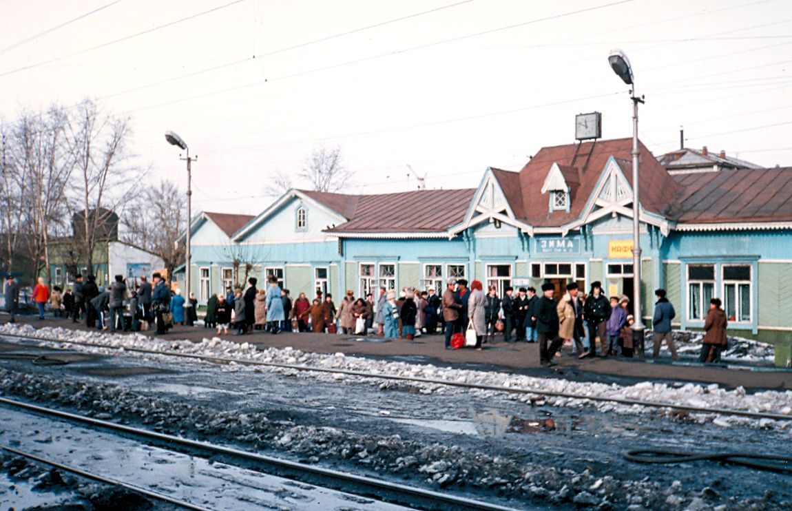

# [Проект](../../../1.2_natural_sciences/why_science_help_understand_world/research_work.md) Siberian Deal (1995)

**Siberian Deal** («Сибирская сделка») — [net.art](../README.md) проект 1995 года австрийской художницы Евы Вольгемут (Eva Wohlgemuth) и американской художницы Кэти Рэй Хоффман (Kathy Rae Huffman), реализованный в форме документированного путешествия по Транссибирской железной дороге от Москвы до Владивостока. Проект считается первым «перформанс-блогом» в истории искусства: ещё за десятилетие до появления самого слова «блог» художницы вели онлайн-дневник путешествия в реальном времени, превращая маршрут поезда в художественное высказывание о границах между физическим и цифровым, локальным и глобальным, телом и сетью.

---

## Концепция: [тело](../../../1.2_natural_sciences/why_science_help_understand_world/organism.md) в движении как [медиа](../../../5.1_technology_and_digital_literacy/information and media literacy/как_устроена_современная_информационная_среда.md)

*Станция [Зима](../../../3.2 healthy lifestyle/how to act in a dangerous situation/articles/thin-ice.md) на Транссибирской железной дороге, 1990 год — за пять лет до путешествия Евы Вольгемут и Кэти Рэй Хоффман. Именно такие остановки стали точками обмена предметами в проекте Siberian Deal. [Источник](../../../5.1_technology_and_digital_literacy/information and media literacy/дезинформация_и_фейки.md): Wikimedia Commons*

В основе Siberian Deal лежит простая, но радикальная идея: само передвижение тела в пространстве может быть художественным медиа. В июне 1995 года Вольгемут и Хоффман сели на поезд в Москве и в течение нескольких недель пересекли всю Россию с запада на восток — маршрут длиной почти в десять тысяч километров через Урал, Западную и Восточную Сибирь, Забайкалье и Дальний Восток до Тихоокеанского побережья.

На каждой значимой остановке художницы вступали в [контакт](../../../1.2_natural_sciences/neurobiology_for_teens/articles/17_hugs_oxytocin.md) с местными жителями — пассажирами поезда, торговцами на перронах, случайными встречными — и совершали с ними обмен предметами. Каждый обмен документировался: фотография предмета, имя или описание человека, с которым совершилась «сделка», краткая [история](../../../1.2_natural_sciences/physics_in_everyday_life/Q11469.md) вещи. Эта документация затем передавалась в [интернет](../../../1.2_natural_sciences/physics_in_everyday_life/Q26540.md) — насколько позволяла тогдашняя инфраструктура — и публиковалась на сайте проекта.

Ключевое [напряжение](../../../1.2_natural_sciences/physics_in_everyday_life/Q11023.md) проекта — между скоростью движущегося поезда и медленным, прерывистым ритмом сетевой публикации. Тело перемещалось непрерывно; [нарратив](../../../7.2 Media, leisure and hobbies/Computer games/articles/dream_team/screenwriter.md) в сети формировался с задержкой, по кускам, сохраняя следы этого разрыва. Физический мир создавал события; виртуальный архив превращал их в произведение искусства. Ни одна из этих двух составляющих не существовала бы полноценно без другой.

---

## Технический [контекст](../../../5.1_technology_and_digital_literacy/information and media literacy/геолокация_и_проверка_контекста.md) 1995 года

Чтобы понять, насколько амбициозным был проект, необходимо представить себе техническую [реальность](../../../1.2_natural_sciences/physics_in_everyday_life/Q140028.md) 1995 года. World Wide Web существовал лишь несколько лет — [браузер](../../../5.1_technology_and_digital_literacy/how_internet_works/articles/http_https/http_https.md) [Mosaic](../../../5.1_technology_and_digital_literacy/how_internet_works/articles/history/internet_at_home.md) появился в 1993-м, [Netscape](../../../5.1_technology_and_digital_literacy/how_internet_works/articles/history/internet_at_home.md) — в 1994-м. [Подключение](../../../1.2_natural_sciences/physics_in_everyday_life/Q25250.md) к сети осуществлялось через dial-up модемы со скоростью 14,4–28,8 кбит/с; [загрузка](../../../7.2 Media, leisure and hobbies/Computer games/articles/how_it_all_started/cartridge_versus_disc.md) одной фотографии среднего качества могла занимать несколько минут. [HTML](2.1_jodi.md) был примитивен, понятие «онлайн-публикации в реальном времени» практически не существовало.

Сама Россия 1995 года представляла собой особое технологическое [пространство](../../../1.2_natural_sciences/physics_in_everyday_life/Q36253.md). Советская телекоммуникационная инфраструктура разрушалась быстрее, чем строилась новая; телефонные линии были ненадёжны; интернет оставался уделом нескольких крупных городов, главным образом Москвы и Санкт-Петербурга. За пределами этих центров — в Новосибирске, Иркутске, Хабаровске — сетевое подключение было либо редкостью, либо полностью отсутствовало.

Художницы работали в этих ограничениях, используя e-mail как основной канал передачи данных и опираясь на немногочисленных местных помощников и технических партнёров. Именно поэтому [публикация](../../../5.1_technology_and_digital_literacy/information and media literacy/цифровая_репутация.md) отставала от путешествия: [материалы](../../../1.2_natural_sciences/physics_in_everyday_life/Q487005.md) накапливались, а затем передавались в [сеть](../../../5.1_technology_and_digital_literacy/how_internet_works/articles/history/internet_history.md) при первой возможности — из гостиницы, из университета, из случайно найденного офиса с выходом в интернет. Эта вынужденная асинхронность стала не дефектом проекта, а его смысловым элементом: архив всегда немного запаздывал за реальностью, как [воспоминание](../../../4.1_rules_of_study/how_to_memorize/articles/pamyat.md) запаздывает за событием.

Сам [выбор](../../../2.1_society/cause_and_effect_relationships/articles/personal_choice.md) России в качестве маршрута был политически и концептуально нагружен. Постсоветский [хаос](../../../1.2_natural_sciences/physics_in_everyday_life/Q45003.md) середины 1990-х создавал уникальную среду: страна находилась в состоянии культурного и экономического переходного периода, старые структуры рухнули, новые ещё не сложились. Это делало каждый обмен предметами особенно острым — вещи здесь имели иной [вес](../../../1.2_natural_sciences/physics_in_everyday_life/Q11023.md), иную биографию, иной смысл, чем на западных рынках.

---

## Обмен как художественный жест

Центральный механизм проекта — бартер — выбран не случайно. «Сделка» в названии проекта указывает на экономическую транзакцию, но транзакцию принципиально неденежную: обмен предметами, обмен историями, обмен присутствием.

В эпоху, когда цифровая [культура](../../../2.1_society/cause_and_effect_relationships/articles/why_rules_work.md) всё активнее двигалась в сторону нематериального — [бит](../../../7.2 Media, leisure and hobbies/Computer games/articles/technologies_inside/smart_processor.md), данных, файлов, которые можно копировать бесконечно без потерь, — Вольгемут и Хоффман настаивали на физическом, единственном, невоспроизводимом объекте. [Еда](../../../3.1. healthy lifestyle/Sleep, nutrition, and adolescent energy/articles/stress_and_food.md) с перрона — пирожки, домашние соленья, орехи. Сувениры — значки, открытки, маленькие фигурки. Личные вещи — шарфы, [книги](../../../7.2 Media, leisure and hobbies /useful_and_interesting_leisure/articles/reading_and_self_education.md), записки. Каждый предмет мог существовать только в одном экземпляре и только в одном месте одновременно; после обмена он перемещался, менял владельца, продолжал жить в другом контексте.

Онлайн-архив проекта превращал эти предметы в виртуальный музей путешествия. Фотография вещи в сети и сама вещь в руках нового владельца существовали параллельно — как два разных вида присутствия. Сеть не заменяла [объект](../../../1.2_natural_sciences/physics_in_everyday_life/Q634.md), а создавала его цифровую [тень](../../../1.2_natural_sciences/physics_in_everyday_life/Q14506045.md), его [след](../../../5.1_technology_and_digital_literacy/information and media literacy/приватность_и_цифровой_след.md) в общем пространстве, доступном любому, кто имел доступ к браузеру.

Этот механизм перекликается с концепцией gift economy — экономики дара, описанной антропологом Марселем Моссом и переосмысленной в цифровую эпоху Льюисом Хайдом. В отличие от товарного обмена, дар создаёт [связь](../../../1.2_natural_sciences/physics_in_everyday_life/Q12969754.md) между людьми: он обязывает, он несёт в себе часть дарящего, он существует в длящихся отношениях, а не в мгновенной транзакции. Каждая «сделка» на транссибирском маршруте была именно таким даром — жестом установления связи между двумя мирами, которые иначе никогда бы не пересеклись.

---

## Место в истории net.art

Siberian Deal появился в тот момент, когда сетевое [искусство](../../../7.2 Media, leisure and hobbies /what_you_can_read_and_watch_to_develop_your_taste/articles/aesthetics_and_taste.md) только начинало осознавать себя как отдельное [явление](../../../1.2_natural_sciences/physics_in_everyday_life/Q163214.md). Параллельно работали [JODI](2.1_jodi.md), [Хит Бантинг](2.2_heath_bunting.md) и другие пионеры, исследовавшие сеть как художественный [материал](../../../1.2_natural_sciences/physics_in_everyday_life/Q25358.md). Но большинство тогдашних net.art проектов работали исключительно в цифровом пространстве — с кодом, с интерфейсом, с браузером как холстом. Siberian Deal радикально отличался тем, что выводил художественное [действие](../../../2.1_society/cause_and_effect_relationships/articles/personal_choice.md) в физический мир, используя сеть лишь как одно из измерений произведения.

В этом смысле проект предвосхитил несколько форматов, которые станут массовыми много позже. Travel-блогинг как [жанр](../../../../8.1_entertainment/articles/movie.md) сложился в 2000-х; Instagram-stories с документацией путешествий в реальном времени — в 2010-х; концепция «живой документации» события через [социальные сети](../../../3.1_healthy lifestyle/vrednye_privychki/articles/Social_media.md) — и того позже. Вольгемут и Хоффман проделали всё это в 1995-м, с dial-up модемом и ранним HTML, без алгоритмов дистрибуции и без аудитории, готовой потреблять подобный [контент](../../../5.1_technology_and_digital_literacy/information and media literacy/информационная_диета.md).

Принципиальное отличие Siberian Deal от простой документации путешествия — наличие художественной рамки и концептуальной программы. Путешественники фотографируют всегда; журналисты пишут репортажи с дороги. Но здесь каждый обмен предметами был заранее продуманным художественным действием, каждый объект становился частью концептуальной системы, каждая публикация в сети была элементом единого произведения. Туристический [опыт](../../../1.2_natural_sciences/why_science_help_understand_world/experimental_science.md) был превращён в [перформанс](1.3_participatory_art.md), а перформанс — в архив, существующий одновременно в физическом и цифровом пространстве.

Проект также поставил важные [вопросы](../../../4.1_rules_of_study/how_to_learn_effectively/articles/curiosity.md) о документации и присутствии, которые будут занимать [медиаискусство](1.2_nam_june_paik.md) ещё долго: что значит «присутствовать» в сети? Чем [цифровой след](../../../4.2_thinking_and_working_information/how_to_search_information/articles/digital_footprint.md) события отличается от самого события? Можно ли считать онлайн-архив произведением, или произведением было только путешествие? Siberian Deal не давал окончательных ответов, но сама его [структура](../../../4.1_rules_of_study/how_to_learn_effectively/articles/note_taking.md) делала эти вопросы видимыми.

---

## Смотри также

- [Арт-группа JODI](2.1_jodi.md)
- [Хит Бантинг](2.2_heath_bunting.md)
- [Почтовые рассылки как арт-пространство (Nettime)](2.3_nettime.md)
- [Первые арт-серверы](2.4_art_servers.md)
- [Computer Aided Curating (C@C)](2.6_cac.md)
- [Портал 2: Net.art (Золотой век сетевого искусства 1990-х)](../README.md)
- [Партиципаторное искусство и телевещание](1.3_participatory_art.md)
- [Net.art](https://ru.wikipedia.org/wiki/Net-арт) (внешняя [ссылка](../../../4.2_thinking_and_working_information/how_to_search_information/articles/copypaste.md))

---

Авторы: Валентин Устинов;

*[Ресурсы](../../../2.1_society/cause_and_effect_relationships/articles/ecological_footprint.md): [LLM](../README.md) — Claude Sonnet 4.6*
