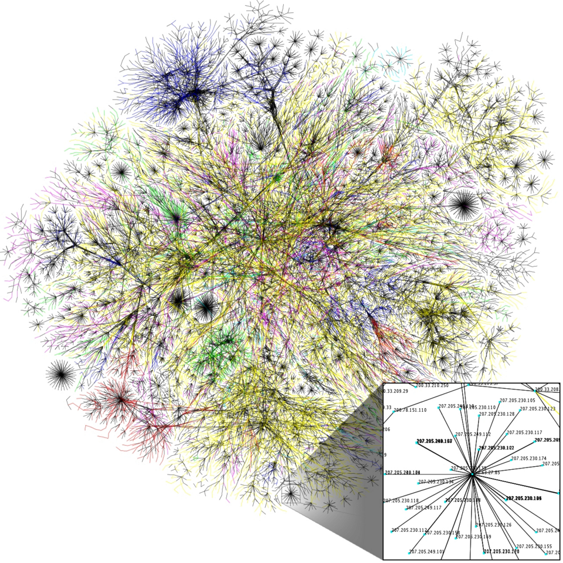
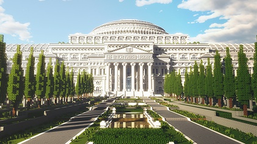

# The Uncensored Library

**The Uncensored Library** («Нецензурируемая библиотека») — проект в области [хактивизма](https://ru.wikipedia.org/wiki/Хактивизм) и цифрового искусства, реализованный организацией [Reporters Without Borders](https://en.wikipedia.org/wiki/Reporters_Without_Borders) совместно с дизайн-студией BlockWorks и агентством DDB Berlin в марте 2020 года. Проект представляет собой виртуальную библиотеку, построенную в игровом мире [Minecraft](https://ru.wikipedia.org/wiki/Minecraft), в которой хранятся журналистские материалы, запрещённые государственной [цензурой](https://ru.wikipedia.org/wiki/Цензура) в ряде стран мира. Дата запуска — 12 марта 2020 года — была выбрана намеренно: это Всемирный день борьбы с интернет-цензурой.

---

## Контекст и замысел

*Визуализация глобальной структуры интернета — пространства, свободу которого защищает проект The Uncensored Library. Источник: Wikimedia Commons*

К 2020 году ограничения доступа к интернет-ресурсам существовали в ряде государств. По данным организации Reporters Without Borders, в России, Египте, Вьетнаме, Мексике и Саудовской Аравии были заблокированы сайты отдельных изданий, а журналисты в этих странах подвергались правовому давлению. Стандартные инструменты обхода блокировок — VPN, браузер Tor, зеркальные сайты — в ряде юрисдикций также ограничивались или запрещались.

Авторы проекта задались нетривиальным вопросом: что если использовать игровую платформу в качестве канала распространения информации? [Minecraft](https://ru.wikipedia.org/wiki/Minecraft) — одна из самых популярных видеоигр в мире с аудиторией свыше 120 миллионов активных пользователей — во многих странах с жёстким цензурным режимом не заблокирована. Её игровые серверы функционируют как децентрализованные пространства обмена данными, формально находящиеся вне юрисдикции традиционного медиарегулирования.

Замысел сочетал в себе несколько стратегий одновременно. Во-первых, это был акт **медиаактивизма**: заблокированные тексты получали новый канал распространения. Во-вторых, это было **художественное высказывание**: виртуальная архитектура превращалась в метафору доступа к информации. В-третьих, это была демонстрация технологической возможности: игровая платформа использовалась как канал, формально находящийся вне сферы традиционного медиарегулирования.

Подобный подход вписывается в традицию [Net.art](https://ru.wikipedia.org/wiki/Net-арт) — течения, исследующего сеть как пространство художественного и политического действия, — однако выходит за его рамки, перенося активизм с веб-страниц в трёхмерную игровую среду.

---

## Реализация проекта

### Техническое устройство

Библиотека была возведена на публичном сервере Minecraft командой из более чем 24 строителей в течение нескольких месяцев. Общий масштаб сооружения — свыше **12,5 миллиона блоков**. Здание спроектировано в неоклассическом стиле, намеренно отсылающем к образу публичной библиотеки как института просвещения: колонны, купол, анфилады залов, читальные комнаты. Каждый зал посвящён отдельной стране.

Текстовые материалы были встроены непосредственно в игровые объекты — книги (объект «Книга и перо» в механике Minecraft), размещённые на внутриигровых подставках. Читатель, зайдя на сервер, мог подойти к стеллажу, открыть книгу и прочитать репортаж, написанный журналистом, которого преследуют у него на родине.

Скачать мир можно было также в виде файла `.zip`, что дополнительно обеспечивало распространение архива вне зависимости от доступности серверов.

### Представленные страны и авторы

На момент запуска в марте 2020 года библиотека включала материалы из **пяти стран**:

| Страна | Контекст цензуры |
|---|---|
| Россия | Ограничения доступа к ряду публикаций и изданий |
| Египет | Репрессии против независимой прессы после 2013 года |
| Вьетнам | Систематическая блокировка критических СМИ |
| Мексика | Систематическое давление на журналистов-расследователей, освещающих деятельность организованной преступности |
| Саудовская Аравия | Цензура в связи с делом Джамаля Хашогги |

Среди представленных материалов — статьи Джамаля Хашогди (Saudi Arabia), репортажи о коррупции в Мексике, тексты российских и египетских журналистов, официально запрещённые в их странах.

### Расширение библиотеки (2021–2026)

После успешного запуска Reporters Without Borders продолжила развивать проект, планомерно добавляя новые национальные секции. К 2026 году библиотека существенно выросла — как по числу стран, так и по объёму представленных материалов. По данным RSF, только в 2024 году сайт проекта посетили около **200 000 человек**, карту Minecraft скачали порядка **80 000 раз**, а в офлайн-режиме было прочитано более **336 500 текстов**.

Были добавлены секции для стран Латинской Америки, Азии, Африки и Ближнего Востока. В частности, расширение охватило:

| Страна | Контекст цензуры |
|---|---|
| Бразилия | Давление на журналистов, освещающих вырубку лесов Амазонии и деятельность организованной преступности |
| Беларусь | Массовое закрытие независимых изданий и уголовное преследование журналистов после протестов 2020 года |
| Мьянма | Введение военной цензуры и уголовное преследование прессы после переворота 2021 года |
| Иран | Блокировки и преследование журналисток, освещавших протесты 2022 года («Женщина, жизнь, свобода») |
| Бангладеш | Ограничения свободы слова в рамках закона о цифровой безопасности |
| Эфиопия | Информационная блокада в условиях вооружённого конфликта в регионе Тыграй |
| Индия | Административное и правовое давление на региональные СМИ |

Архитектура библиотеки была расширена: к оригинальному зданию добавились новые крылья и этажи, соответствующие региональным тематическим секциям — Латинской Америке, Ближнему Востоку, Азиатско-Тихоокеанскому региону и Африке. Физический масштаб виртуального здания в Minecraft вырос вместе с расширением его документального содержания.

### Зал США (2026)

12 марта 2026 года RSF открыла зал, посвящённый ограничениям свободы прессы в **Соединённых Штатах**. В нём собраны удалённые правительственные веб-страницы, анализ давления на медиакомпании через FCC и иски администрации против редакций. Среди экспонатов — политическая карикатура лауреата Пулитцеровской премии **Энн Телнес**, снятая редакцией *The Washington Post* перед публикацией.

---

## Архитектура как язык сопротивления

*Парадный вход в The Uncensored Library — виртуальное здание в неоклассическом стиле, возведённое в Minecraft командой из 24 строителей для хранения запрещённых журналистских материалов. Источник: Wikimedia Commons*

The Uncensored Library ставит принципиальный вопрос о природе архитектурного пространства в цифровую эпоху. Физическое здание библиотеки исторически было не просто хранилищем книг, но символом открытого доступа к знанию — пространством, принципиально противостоящим закрытости и секретности. Виртуальная библиотека в Minecraft воспроизводит эту символику в среде, где физические законы и государственные границы теряют прежнюю силу.

Архитекторы проекта сознательно выбрали неоклассический стиль — язык институциональной легитимности, монументальности, доверия. Это решение полемично: здание выглядит как государственное учреждение, однако действует вопреки государству. Величие форм подчёркивает абсурд положения, при котором власть способна снести здание в реальном мире, но бессильна перед его виртуальным двойником.

В этом смысле проект наследует традиции **архитектурного активизма** и **ситуационистской практики** создания «психогеографических» пространств, изменяющих восприятие политической реальности. Виртуальное здание становится «гетеротопией» в терминологии Мишеля Фуко — пространством, существующим по иным правилам, нежели окружающий мир.

Примечательно, что в рамках проекта архитектура перестаёт быть просто оберткой для содержания. Само по себе существование библиотеки — факт её посещения, блуждания по залам, физического (пусть и виртуального) прикосновения к запрещённому тексту — превращается в политический акт. Это сближает проект с практиками [Партиципаторное искусство и телевещание](1.3_participatory_art.md): смысл рождается не в объекте, а в действии субъекта внутри пространства.

---

## Влияние и ограничения

### Успех и резонанс

Запуск библиотеки получил широкое международное освещение. За первые недели сервер посетили сотни тысяч игроков; публикации о проекте появились в The Guardian, BBC, New York Times и других ведущих изданиях. Reporters Without Borders сообщали о значительном росте интереса к проблемам свободы прессы среди молодёжной аудитории — той самой, которая обычно является основными пользователями Minecraft.

Проект получил ряд профессиональных наград в области рекламы и коммуникаций, в том числе Гран-при Каннских львов в категории Innovation (2020), что зафиксировало его восприятие не только как журналистскую, но и как художественную акцию.

В нескольких странах, включая Россию и Вьетнам, после запуска проекта действительно фиксировались попытки ограничить доступ к серверам Minecraft, что само по себе стало медийным событием, дополнительно привлёкшим внимание к библиотеке.

### Критика и ограничения

Проект не избежал критики. Ряд медиааналитиков указывал на **символичность** в ущерб практической эффективности: доля граждан в цензурируемых странах, имеющих технические возможности и навыки для доступа к Minecraft-серверу, крайне мала по сравнению с той аудиторией, которую охватывают заблокированные сайты.

Другое возражение касалось **языкового барьера**: большинство материалов были опубликованы на языках оригинала, а интерфейс навигации — преимущественно на английском, что снижало доступность для целевой аудитории внутри пострадавших стран.

Наконец, критики обращали внимание на **медийный парадокс**: широкое освещение проекта в западной прессе означало, что его основной аудиторией стали не жители Египта или Вьетнама, а западные читатели, и без того имеющие доступ к независимым источникам информации.

### Последующие проекты

The Uncensored Library положила начало направлению, которое можно обозначить как **игровой хактивизм** — использование игровых платформ для политической и правозащитной деятельности. Среди проектов, развивавших эту идею:

- Проведение митингов и политических акций в онлайн-играх (в том числе в Animal Crossing и VRChat в период пандемии COVID-19);
- Размещение цензурируемых произведений искусства и литературы в игровых пространствах;
- Использование игровых движков для воссоздания уничтоженных архивов и разрушенных зданий как инструмент исторической памяти и медиаактивизма.

Тема соотношения наблюдения, контроля и цифрового пространства, поднятая в проекте, получила развитие и в художественных практиках, исследующих [Искусство против надзора (Surveillance Art)](3.2_surveillance_art.md).

---

## Смотри также

- [Портал 3: Медиаактивизм, OSINT и Цифровое сопротивление](../README.md)
- [Искусство против надзора (Surveillance Art)](3.2_surveillance_art.md)
- [Дипфейк-арт и Синтетическая сатира](3.3_deepfake_art.md)
- [Hole in Space (1980)](1.1_hole_in_space.md)
- [Нам Джун Пайк и концепция электронного суперхайвея](1.2_nam_june_paik.md)
- [Партиципаторное искусство и телевещание](1.3_participatory_art.md)
- [Хактивизм](https://ru.wikipedia.org/wiki/Хактивизм) — Википедия
- [Minecraft](https://ru.wikipedia.org/wiki/Minecraft) — Википедия
- [Net.art](https://ru.wikipedia.org/wiki/Net-арт) — Википедия

### Медиаграмотность и критическое мышление

- [Что такое информационная и медиаграмотность](../../../5.1_technology_and_digital_literacy/information%20and%20media%20literacy/articles/что_такое_информационная_и_медиаграмотность.md) — базовые навыки работы с информацией, которые The Uncensored Library стремится защитить от цензуры

---

Авторы: Максим Курносов;

*Ресурсы: LLM — Claude Sonnet 4.6*
