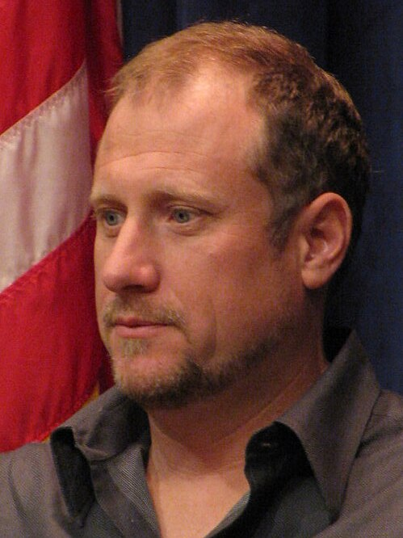
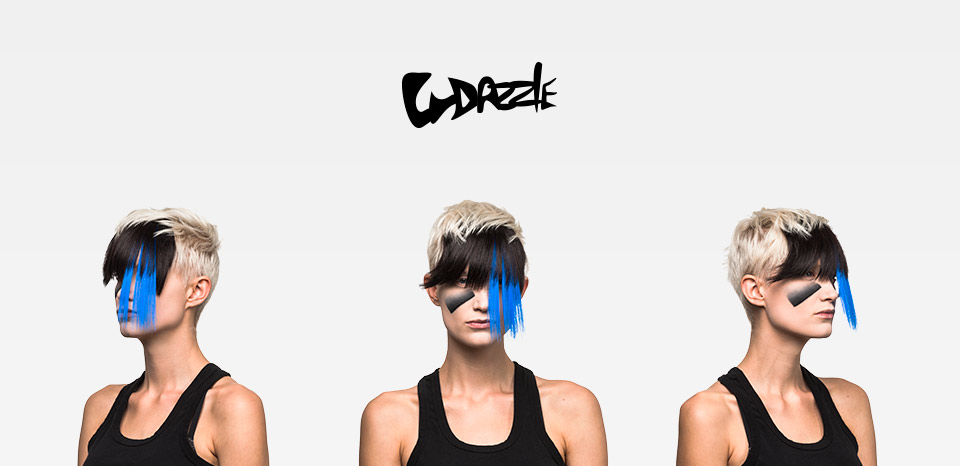
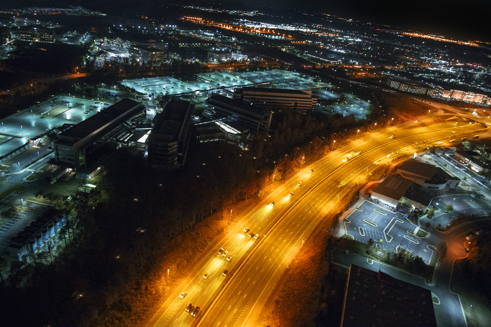

# [Искусство](../../../7.2 Media, leisure and hobbies /what_you_can_read_and_watch_to_develop_your_taste/articles/aesthetics_and_taste.md) против надзора (Surveillance Art)

**Surveillance art** (от англ. *surveillance* — [слежка](../../../5.1_technology_and_digital_literacy/how_internet_works/articles/http_https/cookies.md), [наблюдение](../../../1.2_natural_sciences/neurobiology_for_teens/articles/15_empathy.md)) — [направление](../../../1.2_natural_sciences/physics_in_everyday_life/Q11402.md) современного медиаискусства и [медиаактивизма](https://en.wikipedia.org/wiki/Media_activism), в котором художники исследуют, визуализируют и критически переосмысляют системы тотального контроля: камеры видеонаблюдения, [алгоритмы](../../../4.2_thinking_and_working_information/how_to_search_information/articles/buble_filter.md) [распознавания лиц](https://ru.wikipedia.org/wiki/Распознавание_лиц), [биометрические](https://ru.wikipedia.org/wiki/Биометрия) [базы данных](2.2_heath_bunting.md), разведывательные спутники и цифровую инфраструктуру слежки. [Surveillance art](https://en.wikipedia.org/wiki/Surveillance_art) возникло на пересечении концептуального искусства, политического активизма и технологической критики и с начала 2000-х годов оформилось в самостоятельное художественное течение.

---

## [Контекст](../../../5.1_technology_and_digital_literacy/information and media literacy/геолокация_и_проверка_контекста.md): эпоха тотального надзора

*Тревор Паглен, [художник](../../../7.2 Media, leisure and hobbies/Computer games/articles/dream_team/artist.md), снимающий секретные объекты разведки и исследующий эстетику тотального надзора. [Источник](../../../5.1_technology_and_digital_literacy/information and media literacy/дезинформация_и_фейки.md): Wikimedia Commons*

Массовая цифровая слежка приобрела беспрецедентный масштаб после событий 11 сентября 2001 года, когда правительства западных стран существенно расширили полномочия спецслужб. Разоблачения Эдварда Сноудена в 2013 году показали, что [АНБ](https://ru.wikipedia.org/wiki/Агентство_национальной_безопасности) и союзные ведомства ведут систематическое наблюдение за миллионами граждан по всему миру — перехватывая [переговоры](../../../2.1_society/cause_and_effect_relationships/articles/conflict_roots.md), отслеживая [метаданные](../../../5.1_technology_and_digital_literacy/information and media literacy/проверка_фото_на_манипуляции.md) и получая доступ к серверам крупнейших технологических корпораций.

Параллельно развивались коммерческие системы слежки: к середине 2020-х годов в мире насчитывались сотни миллионов камер видеонаблюдения, алгоритмы [распознавания лиц](https://ru.wikipedia.org/wiki/Распознавание_лиц) интегрировались в аэропорты, торговые центры и системы городского управления, а [данные](../../../2.1_society/cause_and_effect_relationships/articles/ai_causality.md) о перемещениях пользователей собирались смартфонами и приложениями.

В этом контексте художники, работающие в жанре surveillance art, выполняют функцию социального зеркала: они делают невидимую инфраструктуру контроля зримой, переводят абстрактные угрозы приватности в чувственно воспринимаемые образы и предлагают [стратегии](../../../../8.1_self_understanding/articles/overcoming.md) сопротивления — как практические, так и символические.

---

## CV Dazzle (Адам Харви)

[Адам Харви](https://en.wikipedia.org/wiki/Adam_Harvey_(artist)) (р. 1981) — американский художник и [исследователь](../../../1.2_natural_sciences/why_science_help_understand_world/experiment.md), работающий на пересечении [технологии](../../../2.2_history/world_economy_on_fingers/articles/globalizatsiya.md), дизайна и политики приватности. Его [проект](../../../1.2_natural_sciences/why_science_help_understand_world/research_work.md) **CV Dazzle** (2010–2012) стал одним из наиболее цитируемых примеров surveillance art и получил широкое признание как в художественных, так и в научно-технических кругах.

### [Метод](../../../5.1_technology_and_digital_literacy/how_internet_works/articles/http_https/http_https.md) и [визуальный язык](../../../7.2 Media, leisure and hobbies /what_you_can_read_and_watch_to_develop_your_taste/articles/z2.md)

Название проекта отсылает к технике камуфляжа Первой мировой войны — «ослепляющей окраске» (*dazzle camouflage*), при которой корабли покрывались контрастными геометрическими узорами, дезориентирующими противника. Харви применил аналогичную логику к человеческому лицу: разработанный им макияж и стилистика причёсок целенаправленно нарушают [работу](../../../8.2_future/choosing_a_career_path/articles/interview.md) алгоритмов компьютерного зрения (*CV* — *computer vision*).

Алгоритмы [распознавания лиц](https://ru.wikipedia.org/wiki/Распознавание_лиц), в частности классификатор Виолы — Джонса, обучены выделять характерные области: [контраст](../../../1.2_natural_sciences/neurobiology_for_teens/articles/26_optical_illusions.md) между глазами и переносицей, симметрию бровей, пропорции носа и рта. CV Dazzle атакует именно эти опорные точки: асимметричные полосы краски через переносицу, экстравагантные чёлки, закрывающие лоб, и геометрические узоры вокруг [глаз](../../../1.2_natural_sciences/physics_in_everyday_life/Q467980.md) разрушают [шаблон](../../../5.1_technology_and_digital_literacy/information and media literacy/шаблон_урока_по_медиаграмотности.md), который ищет машина.

*CV Dazzle (Адам Харви, 2010–2012): макияж и стилистика причёски, целенаправленно нарушающие работу алгоритмов компьютерного зрения. Асимметрия и контрастные узоры скрывают «опорные точки», по которым система идентифицирует лицо. Источник: Adam Harvey / cvdazzle.com*

### Концепция «антифейса»

Харви ввёл понятие **«антифейса»** (anti-face) — внешности, которая одновременно является лицом для человека и не-лицом для алгоритма. Этот концептуальный [сдвиг](../../../1.2_natural_sciences/physics_in_everyday_life/Q193514.md) принципиален: художник не скрывает человека, а создаёт [пространство](../../../1.2_natural_sciences/physics_in_everyday_life/Q36253.md) асимметрии между человеческим и машинным восприятием.

В более широкой перспективе CV Dazzle ставит вопрос о праве на [анонимность](../../../4.2_thinking_and_working_information/how_to_search_information/articles/vpn_dns_proxy_anonymity_and_security.md) в публичном пространстве. Если прежде анонимность в толпе была естественным состоянием, то системы видеоаналитики превращают каждое [появление](../../../1.2_natural_sciences/physics_in_everyday_life/Q5339.md) на улице в потенциально идентифицируемое [событие](../../../2.1_society/cause_and_effect_relationships/articles/causality_base.md). Макияж CV Dazzle — это не столько практическая маскировка, сколько художественное высказывание о необходимости «права на непрозрачность».

Харви продолжил [исследование](../../../1.2_natural_sciences/neurobiology_for_teens/articles/19_curiosity.md) в проектах **HyperFace** (2017), в котором [одежда](../../../1.2_natural_sciences/physics_in_everyday_life/Q487005.md) с принтами, имитирующими лица, призвана перегрузить [алгоритм](../../../2.1_society/cause_and_effect_relationships/articles/ai_causality.md) ложными целями, и **MegaPixels** — базе данных, документирующей, как миллионы фотографий из открытого доступа используются без согласия людей для обучения нейросетей.

---

## Тревор Паглен и невидимая инфраструктура

[Тревор Паглен](https://en.wikipedia.org/wiki/Trevor_Paglen) (р. 1974) — американский художник, географ и [автор](../../../4.2_thinking_and_working_information/how_to_search_information/articles/copypaste.md), чья [работа](../../../1.2_natural_sciences/physics_in_everyday_life/Q11382.md) сосредоточена на [том](../../musical_instruments/articles/drums.md), что он называет «невидимой инфраструктурой» государственной власти. Его метод сочетает длительные натурные наблюдения, спутниковые данные, журналистские расследования и высокохудожественную фотографию.

### Фотографии секретных объектов

Паглен годами фотографировал засекреченные военные и разведывательные базы на территории США — объекты, существование которых официально не признаётся или тщательно скрывается. Используя телеобъективы с экстремальным фокусным расстоянием и располагаясь на общедоступных территориях, он создавал снимки, в которых постройки теряются в дрожащем от жары воздухе пустыни, превращаясь в почти абстрактные образы.

Серия *Limit Telephotography* («Телефотография на пределе») исследует эту эстетику пограничного видения: изображения размыты и зернисты не из-за технической несостоятельности, а намеренно — как свидетельство дистанции и недоступности объектов. Сама нечёткость становится художественным и политическим высказыванием: существует то, что видно, но не может быть увидено ясно.

### Атлас шпионских спутников

Совместно с исследователем Джоном Ламбертом Паглен составил [каталог](../../../5.1_technology_and_digital_literacy/operating system/articles/file_system.md) разведывательных спутников [АНБ](https://ru.wikipedia.org/wiki/Агентство_национальной_безопасности) и других секретных космических аппаратов. Используя открытые данные астрономов-любителей, отслеживающих орбитальные объекты, и архивные документы, он вычислял траектории засекреченных спутников и фотографировал их как световые точки на ночном небе.

Книга *I Could Tell You But Then You Would Have to Be Destroyed by Me* (2008) стала результатом многолетнего сбора нашивок секретных военных программ — сувенирной атрибутики засекреченных проектов, которая неожиданно оказалась доступна широкой публике. Нашивки с загадочными символами и девизами образовали коллекцию, которая одновременно является архивом, художественным объектом и критикой культуры секретности.

### Подводные кабели данных

Серия *The Other Night Sky* и последующие [работы](../../../8.2_future/choosing_a_career_path/articles/interview.md) обратились к физической инфраструктуре интернета — подводным оптоволоконным кабелям, через которые проходит подавляющая часть мирового трафика данных. Паглен нырял с аквалангом, чтобы сфотографировать кабели в местах их выхода на берег — точках, представляющих особый [интерес](../../../1.2_natural_sciences/neurobiology_for_teens/articles/19_curiosity.md) для разведывательных служб.

Эти снимки разоблачают иллюзию о «бесплотности» цифрового мира: [интернет](../../../1.2_natural_sciences/physics_in_everyday_life/Q26540.md) — это не [облако](../../../1.2_natural_sciences/physics_in_everyday_life/Q182453.md), а физическая инфраструктура, пролегающая по конкретным географическим маршрутам и уязвимая к физическому перехвату. Документы Сноудена впоследствии подтвердили, что британский GCHQ и АНБ действительно осуществляли перехват данных именно на кабельных узлах.

---

## Другие художники и проекты

*Тревор Паглен, «National Reconnaissance Office» (2013) — фотография засекреченной базы спецслужб, снятая с публичной территории с помощью телеобъектива. Размытие и зернистость — намеренная художественная [стратегия](../../../2.1_society/cause_and_effect_relationships/articles/future_planning.md), свидетельствующая о дистанции и недоступности объекта. Источник: Wikimedia Commons*

Surveillance art не ограничивается работами Харви и Паглена — это разветвлённое [поле](../../../5.2_cybersecurity/cpp_fundamentals/13_struct.md), включающее многочисленных авторов и коллективные практики.

**Хито Штайерль** (Hito Steyerl) в видеоработах и эссе исследует режимы видимости и невидимости в эпоху цифрового капитализма, анализируя, как военные технологии зрения мигрируют в пространство культуры и социального контроля.

**Стив Манн** (Steve Mann) — [пионер](1.2_nam_june_paik.md) «носимых вычислений», с 1980-х годов ведущий перманентную видеозапись своей жизни. Его концепция **sousveillance** («слежка снизу») противопоставляет гражданский контрнадзор государственному и корпоративному наблюдению.

**!Mediengruppe Bitnik** — швейцарский художественный дуэт, известный акциями прямого вмешательства в системы слежки: отправкой посылки по даркнету с прямой трансляцией маршрута или взломом охранных камер с публикацией получённых изображений.

**Forensic Architecture** — исследовательское агентство под руководством Эяля Вайцмана, которое использует открытые данные и архитектурный [анализ](../../../1.2_natural_sciences/why_science_help_understand_world/research.md) для расследования нарушений прав человека, в том числе связанных с государственной слежкой.

**Метку-Dazzle** и смежные практики художественной маскировки продолжают развиваться в [ответ](../../../5.1_technology_and_digital_literacy/how_internet_works/articles/http_https/http_https.md) на [распространение](../../../1.2_natural_sciences/physics_in_everyday_life/Q41364.md) систем видеоаналитики — от специальных очков, отражающих инфракрасный [свет](../../../1.2_natural_sciences/physics_in_everyday_life/Q1.md) камер, до тканей с термическими рисунками, скрывающими носителя от тепловизоров.

---

## [Теория](../../../1.2_natural_sciences/why_science_help_understand_world/science.md): надзор как эстетическая проблема

Surveillance art опирается на богатую теоретическую традицию. Концепция **паноптикума** Иеремии Бентама (1791) — тюрьмы, в которой заключённые находятся под постоянным потенциальным наблюдением надзирателя, — была переосмыслена Мишелем Фуко в «Надзирать и наказывать» (1975) как модель дисциплинарного общества: достаточно знания о возможной слежке, чтобы люди начали регулировать собственное [поведение](../../../1.2_natural_sciences/neurobiology_for_teens/articles/06_phineas_gage.md).

Дэвид Лайон развил это понятие в концепцию **«общества наблюдения»**, в котором слежка рассеяна по всей социальной ткани и осуществляется не только государством, но и корпорациями, алгоритмами и самими гражданами через социальные [медиа](../../../5.1_technology_and_digital_literacy/information and media literacy/как_устроена_современная_информационная_среда.md). Художники surveillance art визуализируют именно эту рассеянную, невидимую власть — делая её предметом эстетического переживания и тем самым открывая возможность для критической рефлексии.

Важно и понятие **«права на непрозрачность»**, предложенное мартиникским поэтом и философом Эдуаром Глиссаном: [право](../../../5.1_technology_and_digital_literacy/information and media literacy/авторское_право_и_честное_использование.md) не быть полностью понятым, классифицированным и прозрачным для власти. В этом смысле CV Dazzle, «ослепляющие» принты HyperFace и фотографии Паглена, делающие видимым невидимое, выступают как художественные практики защиты непрозрачности — сопротивления тотальной читаемости.

Теоретики медиаискусства, в частности Лев Манович и Джорджо Агамбен, указывали на биополитическое [измерение](../../../1.2_natural_sciences/physics_in_everyday_life/Q107715.md) надзорных технологий: идентификация лица, снятие биометрических данных, профилирование поведения — это не нейтральные технические операции, а формы власти над телом и жизнью. Surveillance art в этом контексте — не просто [критика](../../../8.1_self-understanding/HowToFindYourStrengths/articles/impostor_syndrome.md) технологии, но эстетическое и политическое [сопротивление](../../../1.2_natural_sciences/physics_in_everyday_life/Q12725.md) биополитическому контролю.

---

## Смотри также

- [Портал 3: Медиаактивизм, OSINT и Цифровое сопротивление](../README.md)
- [Игровой хактивизм (The Uncensored Library)](3.1_uncensored_library.md) — обход цензуры средствами игровых платформ
- [Дипфейк-арт и Синтетическая сатира](3.3_deepfake_art.md) — художественное исследование синтетических медиа и манипуляции образом
- [Surveillance Art](https://en.wikipedia.org/wiki/Surveillance_art) — [Wikipedia](../../../4.2_thinking_and_working_information/how_to_search_information/articles/wikipedia.md)
- [Хактивизм](https://ru.wikipedia.org/wiki/Хактивизм) — [Википедия](../../../4.2_thinking_and_working_information/how_to_search_information/articles/wikipedia.md)

### [Медиаграмотность](../../../4.2_thinking_and_working_information/critical_thinking/articles/manipulation_recognition.md) и [критическое мышление](../../../1.2_natural_sciences/neurobiology_for_teens/articles/25_cognitive_biases.md)

- [Приватность и цифровой след](../../../5.1_technology_and_digital_literacy/information%20and%20media%20literacy/articles/приватность_и_цифровой_след.md) — как работает слежка в повседневном интернете и что каждый оставляет за собой
- [Что такое информационная и медиаграмотность](../../../5.1_technology_and_digital_literacy/information%20and%20media%20literacy/articles/что_такое_информационная_и_медиаграмотность.md) — осознанность как ответ на тотальный мониторинг информационной среды

---

Авторы: Максим Курносов;

*[Ресурсы](../../../2.1_society/cause_and_effect_relationships/articles/ecological_footprint.md): [LLM](../README.md) — Claude Sonnet 4.6*
