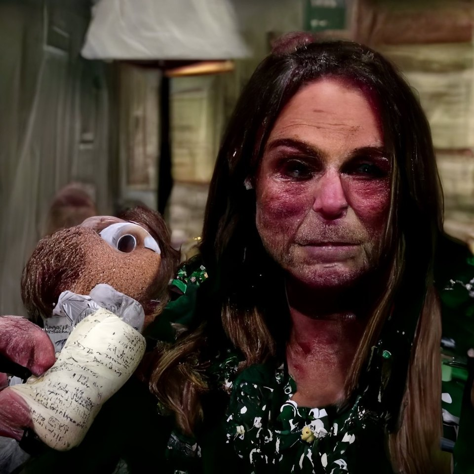

# Дипфейк-арт и Синтетическая сатира

**Дипфейк-арт** — направление современного медиаискусства, в котором художники используют технологии синтетического замещения лиц и голосов ([дипфейк](https://ru.wikipedia.org/wiki/Дипфейк)) как инструмент художественного высказывания, политической сатиры или правозащитной деятельности. В отличие от дипфейков, создаваемых с целью [медиаманипуляции](https://ru.wikipedia.org/wiki/Манипуляция_в_СМИ) и обмана, дипфейк-арт эксплицитно маркирует свою искусственность — либо через художественный контекст, либо через намеренную гиперболизацию — и исследует саму природу доверия к образу в эпоху [постправды](https://ru.wikipedia.org/wiki/Постправда). Ключевой вопрос, которым задаётся это направление: не «как обмануть зрителя», а «что происходит с достоверностью, когда обман становится технически тривиальным».

---

## Технология: как работает deepfake

*Результаты работы алгоритма SimSwap: дипфейк на основе архитектуры энкодер-декодер и генеративно-состязательных сетей (GAN). Источник: medium.com*

Технология дипфейка основана на методах глубокого обучения, прежде всего на [генеративно-состязательных сетях](https://ru.wikipedia.org/wiki/Генеративно-состязательная_сеть) (GAN, от англ. *Generative Adversarial Networks*), предложенных Яном Гудфеллоу с соавторами в 2014 году. Архитектура GAN включает два конкурирующих нейросетевых агента: **генератор**, синтезирующий изображения, и **дискриминатор**, пытающийся отличить синтетическое изображение от подлинного. В процессе совместного обучения они итерационно совершенствуют друг друга: генератор учится создавать всё более убедительные подделки, дискриминатор — всё точнее их распознавать.

В контексте замещения лиц (*face swap*) система обучается на видеоматериале двух людей: донора (чьё лицо подставляется) и реципиента (в чьём видео происходит замена). Нейросеть извлекает обобщённую «карту лица» донора — его геометрию, мимику, освещение — и проецирует её на мимику реципиента в реальном времени, согласуя ракурс, цветовой баланс и микродвижения.

Параллельно развивались смежные технологии:

- **Автоэнкодеры** — более ранний метод, сжимающий изображение лица в компактное латентное представление и восстанавливающий его с заменённой идентичностью;
- **Синтез речи** (voice cloning) — воспроизведение тембра и интонаций конкретного голоса на основе нескольких минут записи;
- **Синтез видео «голова-говорит»** (*talking head synthesis*) — полная анимация лица по аудиодорожке без исходного видео реципиента.

К середине 2020-х годов порог вхождения снизился до уровня потребительского программного обеспечения, доступного любому пользователю ноутбука. Именно этот демократизирующий сдвиг сделал дипфейк одновременно инструментом массового творчества и вектором системного информационного риска.

---

## Дипфейк как сатира и художественный комментарий

*Вирусное изображение Папы Франциска в белой стёганой куртке (2023), созданное с помощью ИИ Midjourney — один из первых примеров широко распространившегося AI-дипфейка, поставивший вопрос о разграничении сатиры и дезинформации. Источник: Wikimedia Commons*

### Bill Posters и проект «Spectre»

Британский художник-активист **Bill Posters** (псевдоним) совместно с арт-коллективом **Public Data Arts** в 2019 году создал серию дипфейк-видео под общим названием **«Spectre»**, показанную на фестивале [Sheffield Doc/Fest](https://sheffdocfest.com). В серии фигурировали Марк Цукерберг, Ким Кардашьян и другие публичные персоны, чьи синтетические образы произносили тексты, написанные художниками.

Наиболее резонансным стал **дипфейк Марка Цукерберга**: в видео основатель Facebook спокойно рассказывает, что обладает «украденными данными миллиардов людей» и что истинная власть состоит в контроле над будущим. Текст был намеренно составлен из реальных публичных высказываний Цукерберга, переставленных таким образом, чтобы обнажить их скрытую логику. Видео было опубликовано в самом Instagram (принадлежащем Facebook), создавая дополнительное концептуальное напряжение: платформа распространяла критику своего создателя его же синтетическими устами.

Facebook потребовал удаления видео, сославшись на политику против манипулятивных медиа. Художники отказались, указав на двойной стандарт: платформа удаляла сатирические дипфейки, но не дипфейки, созданные в политических целях. Этот инцидент поставил вопрос о том, кто и по каким критериям определяет границу между сатирой и дезинформацией в условиях, когда техника их неотличима.

### Ctrl+Shift+Face

Анонимный видеохудожник, работающий под псевдонимом **Ctrl+Shift+Face**, с 2019 года создаёт серию дипфейк-пародий, переосмысляющих культовые эпизоды кинематографа. В его работах Джим Керри заменяет Джека Николсона в «Сиянии», Билл Хэйдер трансформируется в Арнольда Шварценеггера и Сильвестра Сталлоне во время интервью, а Энтони Хопкинс появляется в сцене из «Один дома».

Художественный метод Ctrl+Shift+Face принципиально отличается от дезинформационных дипфейков: работы не претендуют на документальность, их юмор строится на узнаваемости оригинала и абсурде замены. Однако именно это делает их ценным исследовательским материалом — они наглядно демонстрируют, как мозг зрителя испытывает когнитивное расщепление между «знаю, что это подделка» и «воспринимаю как реальное».

### Дипфейк и традиция политической карикатуры

Традиция политической карикатуры насчитывает несколько столетий, и художники-дипфейкеры осмысляют свои работы именно в этом контексте. Ряд видеохудожников создавали синтетические видео с участием публичных политиков, в которых те произносили противоречащие их реальным позициям тексты, подчёркнуто маркированные как художественный вымысел.

Теоретики медиаискусства, в частности Хито Штайерль, указывают на парадокс: традиционная карикатура всегда обозначала свою условность через стилизацию — шарж, гротеск, метафору. Дипфейк уничтожает эту условность и вместе с ней — защитный механизм жанра. Когда подделка фотореалистична, её сатирический статус перестаёт быть очевидным без контекстуальных подпорок.

---

## Постправда и эпистемологический кризис

### Видео как доказательство — умершая конвенция

На протяжении XX века видеозапись обладала особым эпистемическим статусом: «видео не врёт». Эта конвенция была основой системы доказательств в суде, в журналистике и в коллективном сознании. Дипфейк-технологии производят структурный разрыв с этой конвенцией: видео теперь может быть полностью синтетическим при невозможности визуально отличить его от подлинного.

Теоретики [постправды](https://ru.wikipedia.org/wiki/Постправда) — в частности, Ли Макинтайр в книге «Post-Truth» (2018) — описывают ситуацию, в которой не сами факты становятся ненадёжными, а доверие к институтам, удостоверяющим факты. Дипфейк-технология является крайним выражением этой логики: она уничтожает не отдельные факты, а саму возможность фактической верификации через визуальное свидетельство.

### «Liar's Dividend» — дивиденд лжеца

Правовед Бобби Чесни и специалист по кибербезопасности Даниэль Ситрон ввели понятие **«liar's dividend»** («дивиденд лжеца»): даже без создания реальных дипфейков само знание об их существовании позволяет любому политику или публичной персоне отрицать подлинность компрометирующих видео, объявляя их дипфейками. Технология подрывает доверие не только к подделкам, но и к подлинным материалам.

Это эпистемологическое следствие занимает художников не меньше, чем сами дипфейки. Ряд работ, например перформативные проекты **Слухи о смерти** (коллектив **!Mediengruppe Bitnik**), исследуют именно этот эффект: создаётся нарратив о существовании несуществующего дипфейка — и публика реагирует на него как на реальный материал.

### Алгоритмическое зрение против человеческого

Параллельно развивается исследование порогов восприятия: с какого момента дипфейк становится неотличимым для человека, но не для алгоритма? И наоборот: могут ли некоторые дипфейки обманывать детекторы, оставаясь очевидными для людей? Художники, работающие в этой области, — в частности, **Sougen Chung** (Соуэн Чанг), исследующая взаимодействие человека и алгоритма в перформативных практиках, — ставят под сомнение само разграничение между «человеческим» и «машинным» способом видеть.

Дипфейк-арт в этой перспективе не просто использует технологию — он ставит под сомнение, что значит «видеть» и «знать» в мире, где синтетические образы неотличимы от документальных.

---

## Правовые и этические дискуссии

### Право на образ и согласие

Центральная правовая проблема дипфейков — право человека на собственный образ (*right of publicity* в американской традиции, право на изображение в европейском праве). Синтетическое замещение лица фактически позволяет поместить любого человека в любой контекст без его согласия. Законодательные ответы на этот вызов существенно разнятся по юрисдикциям:

- В **США** к 2024 году большинство штатов приняли законы, криминализирующие дипфейк-порнографию без согласия изображаемого; федеральные законы об этом находились в стадии разработки.
- В **Европейском союзе** Акт об искусственном интеллекте (AI Act, 2024) обязывает маркировать синтетические медиа, в том числе дипфейки, специальными метаданными.
- В **Великобритании** закон Online Safety Act (2023) ввёл уголовную ответственность за создание и распространение дипфейков сексуального характера без согласия.

### Сатира, пародия и защита свободы слова

Дипфейки в художественном и сатирическом контекстах пользуются защитой как форма высказывания во многих демократических правопорядках. Американская доктрина «добросовестного использования» (*fair use*) и европейские исключения для пародии и сатиры в принципе применимы к художественным дипфейкам — при условии, что они явно маркированы как вымысел и не наносят коммерческого ущерба правообладателю.

Однако маркировка остаётся слабым местом: видео, созданное с художественными намерениями, может распространяться без контекста и восприниматься как подлинное. Это порождает дискуссию о технических стандартах верификации — в частности, о **контент-провенансе** ([Content Authenticity Initiative, CAI](https://contentauthenticity.org)), разрабатывающем системы криптографического подтверждения происхождения медиафайлов.

### Этика использования образов без согласия

Отдельную полемику вызывают проекты, использующие лица реальных людей без их согласия даже в художественных целях. Критики указывают, что сатирические дипфейки воспроизводят структуру насилия над образом, характерную для дипфейков дезинформационных, — разница лишь в намерении автора, которое жертва не контролирует. Сторонники возражают: политические карикатуры всегда деформировали образ публичных персон без их согласия — и это признаётся необходимым условием свободы политической критики.

Консенсуса нет. Художественное сообщество склоняется к разграничению по критерию **публичности и власти**: дипфейки публичных политиков и корпоративных фигур в контексте политической сатиры — допустимы; дипфейки частных лиц или псевдодокументальные материалы без маркировки — нет.

---

## Смотри также

- [Портал 3: Медиаактивизм, OSINT и Цифровое сопротивление](../README.md)
- [Игровой хактивизм (The Uncensored Library)](3.1_uncensored_library.md) — обход цензуры средствами игровых платформ
- [Искусство против надзора (Surveillance Art)](3.2_surveillance_art.md) — CV Dazzle, распознавание лиц и право на анонимность
- [Промпт-арт (Лингвистическое искусство)](6.1_prompt_art.md) — текст как художественный код для генеративных систем
- [Латентное пространство и Феномен Loab](6.2_latent_space.md) — исследование «подсознания» нейросетей
- [Диффузионные модели](https://en.wikipedia.org/wiki/Diffusion_model) — Wikipedia

### Медиаграмотность и критическое мышление

- [Дезинформация и фейки](../../../5.1_technology_and_digital_literacy/information%20and%20media%20literacy/articles/дезинформация_и_фейки.md) — как дипфейки вписываются в экосистему фейков и манипуляций: практические советы по распознаванию
- [Манипуляции и пропаганда](../../../5.1_technology_and_digital_literacy/information%20and%20media%20literacy/articles/манипуляции_и_пропаганда.md) — дипфейк как инструмент пропаганды и скрытого влияния
- [Как проверить фото на манипуляции](../../../5.1_technology_and_digital_literacy/information%20and%20media%20literacy/articles/проверка_фото_на_манипуляции.md) — практическое руководство по обнаружению синтетических и отредактированных изображений
- [Оценка качества изображений и видео](../../../5.1_technology_and_digital_literacy/information%20and%20media%20literacy/articles/оценка_качества_изображений_и_видео.md) — технические критерии, помогающие отличить подлинное видео от синтетического
- [Критическое мышление в онлайн-среде](../../../5.1_technology_and_digital_literacy/information%20and%20media%20literacy/articles/критическое_мышление_в_онлайн_среде.md) — навыки, необходимые в эпоху, когда видео перестало быть доказательством

---

Авторы: Владимир Сергеев;

*Ресурсы: LLM — Claude Sonnet 4.6*
