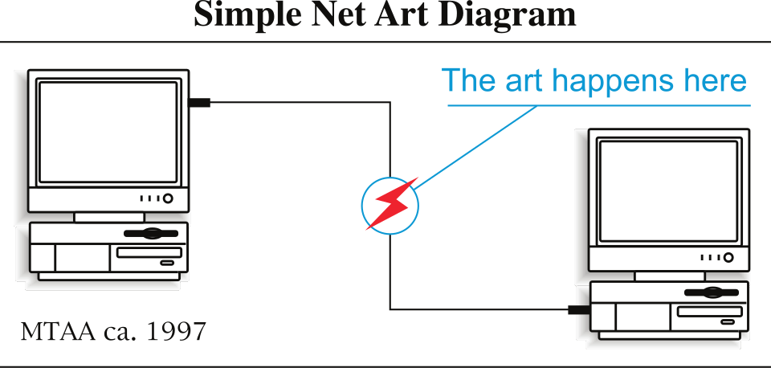
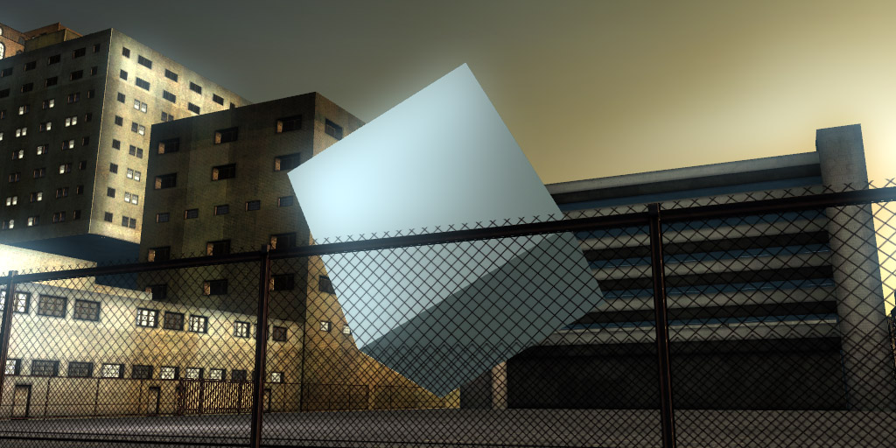

# От Постинтернета к Фиджиталу

**[Постинтернет](../README.md)** (англ. *Post-Internet*) — теоретическая и художественная концепция, описывающая культурное и эстетическое состояние, возникшее после того, как [интернет](../../../1.2_natural_sciences/physics_in_everyday_life/Q26540.md) перестал восприниматься как особое, отдельное [пространство](../../../1.2_natural_sciences/physics_in_everyday_life/Q36253.md) и стал неотличимой частью повседневной жизни. **[Фиджитал](../README.md)** (англ. *phygital*, от *physical* + *digital*) — производное [явление](../../../1.2_natural_sciences/physics_in_everyday_life/Q163214.md), обозначающее художественные практики и пространства, в которых физическое и цифровое существуют как единая, нераздельная [среда](../../../1.2_natural_sciences/physics_in_everyday_life/Q124003.md). Вместе эти концепции образуют теоретический фундамент постцифровой эпохи в [медиаискусстве](https://ru.wikipedia.org/wiki/Медиаискусство).

---

## Постинтернет: [жизнь](../../../1.2_natural_sciences/physics_in_everyday_life/Q1751973.md) после «невинности» сети

*Simple Net Art Diagram — схема, иллюстрирующая концепцию сетевого искусства, которое существует одновременно в физическом и цифровом пространстве. [Источник](../../../5.1_technology_and_digital_literacy/information and media literacy/дезинформация_и_фейки.md): Wikimedia Commons*

### [История](../../../1.2_natural_sciences/physics_in_everyday_life/Q11469.md) термина

Термин «постинтернет» впервые был употреблён американской художницей **Марисой Олсон** (Marisa Olson) в [интервью](../../../8.2_future/choosing_a_career_path/articles/interview.md) 2008 года изданию *Rhizome*. Описывая собственную практику, Олсон говорила о творчестве, которое возникает не «в интернете» и не «об интернете», а *из* интернета — как осадок, остающийся после бесконечного серфинга, скачивания, просмотра и потребления сетевого контента. [Искусство](../../../7.2 Media, leisure and hobbies /what_you_can_read_and_watch_to_develop_your_taste/articles/aesthetics_and_taste.md), которое она описывала, было пропитано сетью насквозь, хотя и существовало в галерейном, физическом пространстве.

Параллельно теоретик и [художник](../../../7.2 Media, leisure and hobbies/Computer games/articles/dream_team/artist.md) **Джин МакХью** (Gene McHugh) в [период](../../../1.2_natural_sciences/physics_in_everyday_life/Q11652.md) с 2009 по 2010 год вёл анонимный [блог](2.5_siberian_deal.md) *[Post](../../../5.1_technology_and_digital_literacy/how_internet_works/articles/http_https/http_https.md) Internet*, систематизируя наблюдения о новом художественном климате. По его формулировке, постинтернет — это момент, когда «интернет стал само собой разумеющимся», когда он перестал быть революционной новинкой и превратился в инфраструктуру — невидимую, как [электричество](../../../1.2_natural_sciences/physics_in_everyday_life/Q11408.md) или водопровод. [Статус](../../../5.1_technology_and_digital_literacy/how_internet_works/articles/http_https/http_https.md) «пользователя интернета» как особой идентичности исчез: в сети теперь находятся все и всегда.

Важную роль в формировании концепции сыграл также художник и куратор **Артие Вирант** (Artie Vierkant), опубликовавший в 2010 году манифест *«The Image Object Post-Internet»*. Вирант утверждал, что в постинтернет-эпохе принципиально изменился сам статус изображения: любой [объект](../../../1.2_natural_sciences/physics_in_everyday_life/Q634.md) существует одновременно в двух состояниях — как физический предмет и как его сетевая репрезентация (фотография, документация, GIF, превью). Причём оба состояния равноправны; ни одно не является «оригинальным» по отношению к другому. Это разрушало традиционную иерархию «подлинника» и «копии», на которой держался весь институт современного искусства.

Подробнее об истории термина — в статье [постинтернет](https://en.wikipedia.org/wiki/Post-Internet) в англоязычной Википедии.

### Ключевые теоретики и [контекст](../../../5.1_technology_and_digital_literacy/information and media literacy/геолокация_и_проверка_контекста.md)

Постинтернет-дискурс сложился на пересечении нескольких интеллектуальных традиций. Он унаследовал критику репрезентации от постструктурализма, [интерес](../../../1.2_natural_sciences/neurobiology_for_teens/articles/19_curiosity.md) к инфраструктуре и сетям — от исследований науки и технологий (STS), а полемику о подлиннике и копии — напрямую от Вальтера Беньямина и его «Произведения искусства в эпоху его технической воспроизводимости».

Если [Net.art](https://ru.wikipedia.org/wiki/Net-арт) 1990-х — золотого века сетевого искусства — был наивно восхищён интернетом как новой территорией свободы и экспериментов, то постинтернет возникает из разочарования в этой «невинности». К концу 2000-х стало очевидно: [сеть](../../../5.1_technology_and_digital_literacy/how_internet_works/articles/history/internet_history.md) коммерциализирована, алгоритмически управляема, встроена в глобальный капитализм. Художники постинтернет-поколения воспринимали это не как трагедию, а как данность — стартовые условия, которые нужно осмыслить, а не оплакивать.

Теоретик Лев Манович, хотя и не использовал сам термин «постинтернет», заложил концептуальную базу для понимания постцифрового состояния в своей книге «[Язык](../../../5.2_cybersecurity/cpp_fundamentals/1_introduction.md) новых [медиа](../../../5.1_technology_and_digital_literacy/information and media literacy/как_устроена_современная_информационная_среда.md)» (2001), описав логику «транскодирования» — взаимного проникновения культурного слоя и компьютерного слоя реальности.

---

## [Эстетика](../../../7.2 Media, leisure and hobbies /what_you_can_read_and_watch_to_develop_your_taste/articles/aesthetics_and_taste.md) постинтернета

### Ирония, мем-культура и экранная эстетика в галерее

Постинтернет-искусство обладает легко узнаваемым визуальным словарём, выросшим непосредственно из эстетики экрана и сетевого потребления. Его ключевые черты:

**Присвоение и рекомбинация.** Постинтернет-художники работают с готовыми изображениями из сети — скриншотами, стоковыми фотографиями, мемами, рекламными баннерами — комбинируя их в новые объекты. Граница между «найденным» и «созданным» намеренно размыта. Этот подход наследует [традиции](../../../2.1_society/cause_and_effect_relationships/articles/why_rules_work.md) художников-присвоителей 1980-х (Шерри Левин, Ричард Принс), однако переносит их в контекст тотальной сетевой избыточности.

**[Плоскость](../../../1.2_natural_sciences/physics_in_everyday_life/Q847073.md) и глянец.** [Поверхность](../../../1.2_natural_sciences/physics_in_everyday_life/Q35197.md) постинтернет-объектов нередко имитирует экранную эстетику: яркие насыщенные [цвета](../../../1.2_natural_sciences/physics_in_everyday_life/Q11652.md), характерные для RGB-палитры мониторов, гладкие отражающие поверхности, напоминающие о глянце дисплея, принты высокого разрешения на физических носителях. Физический объект в галерее выглядит так, словно он «распечатан» прямо с экрана.

**Ирония и дистанция.** Постинтернет-искусство демонстративно уклоняется от романтического пафоса. Оно иронично по отношению к самой идее «серьёзного» художественного высказывания, отражая культурную логику мема — формата, в котором любой смысл немедленно подрывается, переигрывается, ремикшируется.

**[Мем](../../../7.2 Media, leisure and hobbies/Computer games/articles/game_culture/game_memes.md) как художественная единица.** Мем в постинтернет-оптике — не просто интернет-шутка, а полноценная культурная [форма](4.5_algorithmic_craft.md), обладающая собственной эстетикой распространения и мутации. Художники изучают механику вирусности как самостоятельный художественный [процесс](../../../5.1_technology_and_digital_literacy/operating system/articles/process.md), работая с [генеративным искусством](https://en.wikipedia.org/wiki/Generative_art) как инструментом осмысления этих механик.

**Документация как произведение.** Следуя логике Виранта, постинтернет-художники часто уделяют особое [внимание](../../../1.2_natural_sciences/neurobiology_for_teens/articles/16_love_chemistry.md) тому, как их [работа](../../../1.2_natural_sciences/physics_in_everyday_life/Q11382.md) будет выглядеть в сети — в Instagram, на сайте галереи, в пресс-релизе. Фотодокументация выставки проектируется как самостоятельный объект, а не как вторичная запись.

### Глитч как язык

Эстетика технического сбоя — [глитч-арт](https://ru.wikipedia.org/wiki/Глитч-арт) — органично вписывается в постинтернет-контекст. Если первопроходцы глитч-арта, такие как арт-группа [JODI](2.1_jodi.md), работали с ошибкой как с критической деконструкцией медиума, то в постинтернет-контексте глитч становится скорее стилистическим приёмом — знаком принадлежности к цифровому опыту, символом уязвимости и непостоянства сетевых образов.

---

## Фиджитал: когда [код](../../../5.2_cybersecurity/cpp_fundamentals/1_introduction.md) выходит в физический мир

*Цифровое произведение «Debris» — пример постинтернет-эстетики, исследующей [взаимодействие](../../../1.2_natural_sciences/physics_in_everyday_life/Q128030.md) между сетевыми образами и физическим пространством галереи. Источник: Wikimedia Commons*

### [Определение](../../../1.2_natural_sciences/physics_in_everyday_life/Q29996.md) и происхождение

Термин «[фиджитал](https://en.wikipedia.org/wiki/Phygital)» возник в маркетинговых исследованиях начала 2010-х годов для описания опыта потребителя, одновременно существующего в физическом магазине и цифровом интерфейсе. Однако в контексте искусства он приобрёл значительно более широкий смысл: фиджитал описывает художественные практики, пространства и объекты, в которых физическое и цифровое не просто сосуществуют, но образуют неразложимое целое — среду, где одно без другого перестаёт иметь смысл.

Фиджитал — прямое [следствие](../../../2.1_society/cause_and_effect_relationships/articles/causality_base.md) постинтернет-логики. Если интернет стал тотальной средой, а не отдельным «местом», то и искусство, работающее с этой средой, неизбежно выходит за пределы экрана в физическое пространство — и одновременно втягивает физическое пространство в цифровое [измерение](../../../1.2_natural_sciences/physics_in_everyday_life/Q107715.md).

### Фиджитал в выставочной практике

Фиджитальная выставка — это пространство, в котором [зритель](1.3_participatory_art.md) не «смотрит на [экран](../../../3.1. healthy lifestyle/Sleep, nutrition, and adolescent energy/articles/gadgets_blue_light_sleep.md)» и не «смотрит на физический объект», а находится внутри интегрированной среды. Типичные элементы такой среды:

- **Физические объекты с цифровыми слоями.** Скульптуры, активируемые смартфоном; принты, за которыми скрыта [анимация](../../../7.2 Media, leisure and hobbies/Computer games/articles/dream_team/artist.md) в дополненной реальности; инсталляции, реагирующие на сетевые [данные](../../../2.1_society/cause_and_effect_relationships/articles/ai_causality.md) в реальном времени. Это [направление](../../../1.2_natural_sciences/physics_in_everyday_life/Q11402.md) пересекается с практиками [AR-монументализма](4.2_ar_monumentalism.md).
- **Сетевые образы на физических носителях.** Мемы, скриншоты, GIF-анимации, напечатанные на холсте или отлитые в пластике. [Цифровой](../../musical_instruments/articles/synthesizer.md) объект, обретающий [вес](../../../1.2_natural_sciences/physics_in_everyday_life/Q11023.md) и фактуру.
- **IRL-эстетика** (In Real Life). Перенос в галерею визуальных и поведенческих паттернов, характерных для онлайн-коммуникации: языка смайлов, логики хэштегов, интерфейсных элементов, пикселизации.
- **Гибридные перформансы.** [Действия](../../../3.1_healthy_lifestyle/pervaya_pomoshch/ushibi_porezy_ozhogi/03_obschie_pravila_algorithm.md), одновременно разворачивающиеся в физическом пространстве и транслируемые [онлайн](../../../3.2 healthy lifestyle/how to act in a dangerous situation/articles/internet-safety.md), причём оба [измерения](../../../1.2_natural_sciences/physics_in_everyday_life/Q11423.md) считаются равноправными «сценами».

---

## Ключевые художники и проекты

### Артие Вирант

**Артие Вирант** (Artie Vierkant, р. 1986) — американский художник, один из наиболее последовательных теоретиков и практиков постинтернет-эстетики. Его серия *Image Objects* (с 2011 года) — физические объекты, напечатанные на алюминиевых панелях, которые впоследствии намеренно переработаны (дорисованы, отфотошоплены) в своей сетевой документации. Таким образом, физический и цифровой объект расходятся: зритель в галерее видит одно, зритель в сети — другое. Ни одна из версий не является «правильной». Этот жест материализует постинтернет-тезис о равноправии физического и цифрового состояний произведения.

### Сад Кониши

**Сад Кониши** (Sad Konishi) — художественный псевдоним, под которым работает ряд анонимных авторов, создающих произведения на пересечении мем-культуры, аффективной эстетики и постинтернет-иронии. Их проекты существуют преимущественно в сети — в виде аккаунтов, постов, вирусных образов — однако периодически материализуются в выставочных пространствах в виде принтов, инсталляций и перформансов. Сама амбивалентность авторства — «кто стоит за этим именем?» — является частью художественного высказывания об эпохе сетевой анонимности.

### Райан Тречартин

**Райан Тречартин** (Ryan Trecartin, р. 1981) — американский художник, работающий преимущественно с [видео](../../../5.1_technology_and_digital_literacy/information and media literacy/оценка_качества_изображений_и_видео.md). Его многочасовые [фильмы](../../../7.2 Media, leisure and hobbies /what_you_can_read_and_watch_to_develop_your_taste/articles/z1.md) — радикальный [монтаж](../../../5.1_technology_and_digital_literacy/information and media literacy/оценка_качества_изображений_и_видео.md), гиперактивные [персонажи](../../../7.2 Media, leisure and hobbies/Computer games/articles/dream_team/screenwriter.md), клиповая [скорость](../../../1.2_natural_sciences/physics_in_everyday_life/Q11402.md), карнавальные костюмы — воспроизводят интенсивность и фрагментарность сетевого опыта средствами [кино](../../../7.2 Media, leisure and hobbies /what_you_can_read_and_watch_to_develop_your_taste/articles/z1.md). Тречартин описывает своих персонажей как «посткорпоративных субъектов», существующих исключительно в режиме онлайн-самопрезентации. Его [работы](../../../8.2_future/choosing_a_career_path/articles/interview.md) демонстрировались на Венецианской биеннале (2009) и в крупнейших мировых музеях, однако первично создавались для сетевого потребления.

---

## Смотри также

- [Портал 4: Пост-цифровая эпоха и Новая материальность](../README.md)
- [AR-монументализм](4.2_ar_monumentalism.md)
- [Киборг-арт и Пост-цифровая телесность](4.3_cyborg_art.md)
- [Био-арт: ДНК как программный код](4.4_bio_art.md)
- [Алгоритмический крафт и 3D-печать](4.5_algorithmic_craft.md)
- [Net.art](https://ru.wikipedia.org/wiki/Net-арт) — [Википедия](../../../4.2_thinking_and_working_information/how_to_search_information/articles/wikipedia.md)
- [постинтернет](https://en.wikipedia.org/wiki/Post-Internet) — [Wikipedia](../../../4.2_thinking_and_working_information/how_to_search_information/articles/wikipedia.md)
- [фиджитал](https://en.wikipedia.org/wiki/Phygital) — Wikipedia
- [глитч-арт](https://ru.wikipedia.org/wiki/Глитч-арт) — Википедия
- [медиаискусство](https://ru.wikipedia.org/wiki/Медиаискусство) — Википедия
- [генеративное искусство](https://en.wikipedia.org/wiki/Generative_art) — Wikipedia

---

Авторы: Тимофей Береговин;

*[Ресурсы](../../../2.1_society/cause_and_effect_relationships/articles/ecological_footprint.md): [LLM](../README.md) — Claude Sonnet 4.6*
