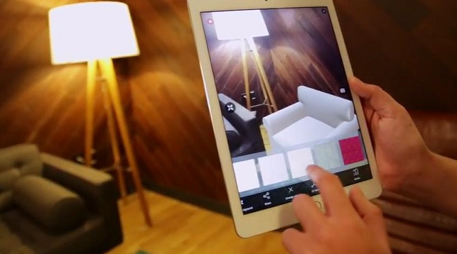
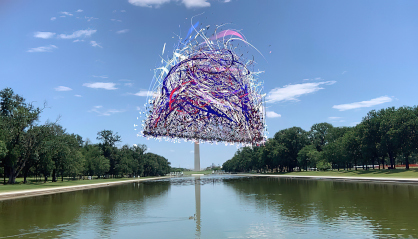

# AR-монументализм

**AR-монументализм** — направление современного [медиаискусства](https://ru.wikipedia.org/wiki/Медиаискусство), в котором художники создают масштабные скульптурные и архитектурные произведения средствами [дополненной реальности](https://ru.wikipedia.org/wiki/Дополненная_реальность), существующие исключительно в цифровом слое над физическим публичным пространством. В отличие от традиционного [публичного искусства](https://en.wikipedia.org/wiki/Public_art), AR-монументы не требуют постаментов, согласований с городскими властями и физических материалов: они существуют как геолоцированные трёхмерные объекты, видимые через экраны смартфонов и AR-гарнитуры. Направление сложилось в середине 2010-х годов и к концу десятилетия оформилось в самостоятельную художественную практику, поставив принципиальные вопросы о природе памятника, праве на городское пространство и о том, кому принадлежит воздух над городом.

---

## Дополненная реальность как художественная среда

*Пример дополненной реальности: цифровые объекты накладываются поверх физической среды — та же технология лежит в основе AR-монументализма. Источник: Wikimedia Commons*

Технология дополненной реальности — совмещение компьютерной графики с изображением реального мира в реальном времени — была разработана в оборонных и инженерных целях ещё в 1960–70-х годах. Иван Сазерленд создал первую AR-систему в 1968 году, а сам термин «дополненная реальность» был введён исследователями Boeing Томом Коделлом и Дэвидом Мизеллем в 1992 году. Однако путь технологии в искусство был долгим: до появления массового смартфона и достаточных вычислительных мощностей AR оставалась уделом дорогостоящих лабораторных установок.

Первые художественные эксперименты с AR относятся к 1990-м годам. Арт-группа **[Blast Theory](https://www.blasttheory.co.uk)** и исследовательская группа **Mixed Reality Lab** Университета Ноттингема с 1997 года создавали перформативные проекты, в которых участники взаимодействовали с цифровыми персонажами в реальном городском пространстве. В 2010-х годах появление смартфонов с достаточной производительностью и GPS-модулями открыло AR для широкой художественной практики. Приложение **Layar** (2009) стало первой массовой платформой для геолоцированного AR-контента, а появление **ARKit** (Apple, 2017) и **ARCore** (Google, 2018) сделало создание AR-объектов технически доступным для художников без специализированного программирования.

Принципиальный сдвиг произошёл, когда художники осознали, что AR позволяет работать с масштабом, недоступным в физическом мире: цифровая скульптура может быть выше небоскрёба, растягиваться на кварталы или помещаться там, куда физический объект не пустили бы никакие городские инстанции. Именно это свойство — безграничный масштаб в сочетании с точной геолокацией — стало основой AR-монументализма.

---

## Нэнси Бейкер Кэхилл: скульптуры без постаментов

[Нэнси Бейкер Кэхилл](https://en.wikipedia.org/wiki/Nancy_Baker_Cahill) (Nancy Baker Cahill, р. 1971) — американская художница, работающая на пересечении рисунка, перформанса и иммерсивных технологий, — является центральной фигурой AR-монументализма. Уроженка Коннектикута, выпускница Университета Денвера, она прошла путь от традиционного рисунка и живописи к цифровым медиа в 2010-х годах, когда осознала, что её интерес к «рисунку как процессу, а не объекту» наиболее полно воплощается в трёхмерных динамических структурах дополненной реальности.

В 2017 году Кэхилл основала **[4th Wall](https://4thwall.app)** — собственную AR-платформу, позволяющую размещать масштабные цифровые произведения в конкретных географических точках и предоставлять к ним свободный публичный доступ. Принципиальная позиция художницы состоит в том, что AR-искусство в публичном пространстве должно быть бесплатным и общедоступным: любой человек со смартфоном может увидеть её работы, загрузив приложение.

### Художественный метод

Кэхилл описывает свои AR-произведения как **«рисунок в пространстве»**: она начинает работу с ручных набросков, затем переводит их в трёхмерные параметрические формы, которые анимируются и «дышат» — пульсируют, вращаются, меняют прозрачность. Визуально её скульптуры напоминают органические структуры — нейронные сети, клеточные мембраны, грибницы — и одновременно архитектурные каркасы. Художница намеренно уклоняется от мимесиса: её объекты не изображают существующие явления, а создают новые визуальные сущности, которые невозможно спутать с реальными предметами, но которые при этом существуют в конкретном месте и в конкретный момент времени.

Принципиально важна для её метода **встроенная нестабильность**: скульптуры анимированы, они никогда не бывают одинаковыми в двух разных просмотрах. Время суток, угол зрения, освещение — всё это меняет характер произведения. Кэхилл называет это «инструментом против монументальной фиксированности» традиционной скульптуры.

### Ключевые проекты

| Проект | Год | Локация | Краткое описание |
|---|---|---|---|
| **Margin of Error** | 2019 | Вашингтон (над Капитолием США) | Две пульсирующие цифровые скульптуры высотой около 90 метров, парящие над куполом Капитолия. Созданы как художественный комментарий к политической поляризации и искажению фактов в американской политике. |
| **Reverie** | 2018 | Лос-Анджелес | Первая крупная работа в рамках платформы 4th Wall; парящие органические формы над городскими кварталами Лос-Анджелеса. |
| **Liberty** | 2021 | Нью-Йорк (остров Эллис) | Масштабная AR-скульптура над историческим иммиграционным центром; исследование тем свободы, принадлежности и коллективной памяти. |
| **Rêverie** | 2022 | Глобальная (геолоцированные точки в 15 городах мира) | Первый глобально-распределённый AR-монумент; одновременно доступен в Нью-Йорке, Лондоне, Сеуле и других городах. |
| **Slow Burn** | 2020 | Виртуальная / удалённая | Работа, созданная в период пандемии COVID-19; сочетала AR с телеприсутствием, позволяя зрителям взаимодействовать с произведением дистанционно. |

### «Margin of Error» над Капитолием

Проект **«Margin of Error»** (2019) стал наиболее цитируемой работой Кэхилл и своеобразным манифестом AR-монументализма. Две огромные цифровые скульптуры — пульсирующие, похожие на живые клеточные структуры — были «установлены» на высоте нескольких десятков метров над куполом Капитолия. Любой посетитель Национальной аллеи с приложением 4th Wall мог видеть их через экран смартфона, парящими над символом американской государственности.

Название отсылает к статистическому понятию допустимой погрешности и к политическому контексту: эпоха «постправды», в которой статистика и факты становятся предметом манипуляции. Кэхилл описывала работу как вопрос, а не утверждение: «Что происходит, когда погрешность становится нормой? Что остаётся от институтов, когда исчезает доверие?»

Принципиально, что проект не требовал разрешения властей: AR-скульптура существует исключительно в цифровом слое и не нарушает никаких регуляций публичного пространства. Это обстоятельство само по себе стало частью художественного высказывания: художница оккупировала символический центр государственной власти без какого-либо согласования.

---

## AR и политика памяти

*Нэнси Бейкер Кэхилл, «Liberty Bell DC» (2021) — AR-скульптура, видимая через смартфон над историческими памятниками Вашингтона. Художница намеренно помещает цифровые объекты в символически нагруженные публичные пространства. Источник: Wikimedia Commons*

### Памятники и дискуссии о коллективной памяти

AR-монументализм возник и развивался параллельно с широкой дискуссией о роли памятников в публичном пространстве: кому и как их устанавливать, как переосмыслять существующие монументы, не прибегая к их физическому сносу или перемещению.

Художники и активисты обратились к AR как к инструменту «альтернативной монументальности»: вместо физического демонтажа и строительства новых памятников можно создать цифровой слой над существующим объектом. Активистская AR-платформа **ARTWALK** (2018) позволяла пользователям «размещать» над существующими памятниками новые интерпретирующие слои — тексты, изображения, дополнительные исторические контексты.

### AR как альтернативная история

Концепция **«контрмонумента»** (counter-monument), разработанная в контексте мемориальной культуры Германии применительно к работам **Йохена Герца**, получила новое измерение в эпоху AR. Если физический контрмонумент Герца намеренно исчезает, зарываясь в землю, то AR-контрмонумент существует в том же пространстве, что и оспариваемый физический объект, — накладываясь на него, дополняя его, переписывая.

В 2020 году, после демонтажа ряда памятников в США, несколько AR-художников создали цифровые проекты для освободившихся постаментов: одни исследовали сам постамент как архитектурный объект, другие предлагали альтернативные фигуры и нарративы. Опустевший постамент превратился в «чистый холст» для AR-высказываний о коллективной памяти.

Подобная практика ставит принципиальный вопрос: если физический памятник — это решение городского сообщества, то кто имеет право устанавливать AR-памятник? Технология демократизирует монументальность, но одновременно лишает её коллективного измерения: каждый устанавливает собственный AR-монумент для собственной аудитории.

---

## Другие художники AR-пространства

### Acute Art

**[Acute Art](https://acuteart.com)** — лондонская платформа и студия, основанная в 2017 году куратором Якобом де Грааффом, — занимает особое место в AR-монументализме: она работает как продюсер и технологический партнёр для художников мирового уровня, реализующих свои первые AR-проекты. Среди её коллабораций — Марина Абрамович, Кавс (KAWS), Олафур Элиассон, Джефф Кунс.

Проект Acute Art с **Олафуром Элиассоном** — **«Wunderkammer»** (2020) — позволял зрителям «помещать» в своё физическое окружение световые инсталляции в стиле художника: радужные сферы, переливающиеся плоскости, фрагменты северного сияния. Особенностью проекта было намеренное снятие границы между «искусством в галерее» и «искусством в быту»: работы Элиассона появлялись на кухонных столах, в парках, на тротуарах.

Платформа Acute Art применяет технологию **World Anchors** — систему, позволяющую привязывать AR-объекты к конкретным физическим точкам с точностью до нескольких сантиметров, — что даёт возможность создавать AR-произведения, существующие в определённом месте независимо от времени суток и числа зрителей.

### Хито Штайерль: «Power Plants»

Немецкий художник и теоретик **Хито Штайерль** (Hito Steyerl) реализовала AR-проект **«Power Plants»** в рамках выставки в [Serpentine Galleries](https://www.serpentinegalleries.org) (Лондон, 2019). Проект разворачивался как в физическом пространстве галереи, так и в AR-слое над ней: зрители, направляя смартфоны на пустые стены, видели цифровые «растения» — неорганические, алгоритмически сгенерированные структуры, напоминающие одновременно электрические схемы и ботанические иллюстрации.

Концептуально «Power Plants» исследовала связь между энергетической инфраструктурой, цифровыми технологиями и биологическими системами. В теоретических текстах, сопровождавших выставку, Штайерль поставила вопрос об «экологии данных»: цифровые объекты, подобно живым организмам, потребляют ресурсы (серверные мощности, электроэнергию, данные пользователей) — но эти ресурсы невидимы для зрителя, наблюдающего лишь изящную AR-картинку.

Работа Штайерль в AR вписана в её более широкую теоретическую программу критики «бедного образа» (*poor image*): цифровые изображения, сжатые, тиражированные, лишённые ауры оригинала, — и одновременно носители политических и экономических отношений. AR-объект существует только как «бедный образ» — он неотделим от устройства, которое его отображает, от платформы, которая его хранит, от корпорации, которая контролирует инфраструктуру.

### Дэмиен Хёрст в AR

В 2021 году **Дэмиен Хёрст** реализовал масштабный AR-проект совместно с Acute Art — **«Butterflies»**: серию гигантских цифровых бабочек, которые пользователи могли «выпускать» в своё окружение через смартфон. Проект имел коммерческое измерение (бабочки продавались как NFT), однако художественно он поднял вопрос, актуальный для всего направления: чем AR-скульптура отличается от цифрового товара? Если физическая скульптура Хёрста стоит миллионы за счёт материальной уникальности, то AR-объект бесконечно тиражируем — и его «ценность» определяется исключительно сертификатом NFT.

Этот проект стал одним из первых, где пересечение AR-монументализма с экономикой NFT было сделано полностью прозрачным, что вызвало критику: критики указывали, что «демократизация» AR-искусства в случае Хёрста оказалась мнимой — доступ к лучшим цифровым объектам вновь определялся финансовыми возможностями.

---

## Технология и доступность

### Платформы и приложения

AR-монументализм технически опирается на несколько конкурирующих платформ и фреймворков. Художественные платформы — **[4th Wall](https://4thwall.app)** (Нэнси Бейкер Кэхилл), **[Acute Art](https://acuteart.com)** (Якоб де Грааф), **[Artivive](https://artivive.com)** (Вена, 2017) — ориентированы на художников и предоставляют инструменты для создания и геолокации AR-произведений. Технологические фреймворки — **ARKit** (Apple), **ARCore** (Google), **Niantic Lightship** — обеспечивают базовую инфраструктуру отслеживания пространства и привязки объектов.

Ключевой технологической проблемой остаётся **персистентность**: большинство AR-объектов существуют лишь в момент сессии конкретного пользователя и не сохраняются в пространстве между сеансами. Решения для создания «постоянных» AR-объектов — **Persistent Cloud Anchors** (Google), **World Tracking** (Apple) — технически сложны и требуют значительных серверных ресурсов. Именно поэтому масштабные AR-монументы, подобные работам Кэхилл, требуют собственной платформенной инфраструктуры.

### Геолокация и точность

Точность геолокации имеет принципиальное значение для AR-монументализма: скульптура, «установленная» над конкретным зданием, не должна смещаться при изменении позиции зрителя. GPS-точность потребительских смартфонов составляет 3–5 метров, что приемлемо для крупных объектов, но недостаточно для детальных скульптур. Современные решения — **VPS** (Visual Positioning System, Google), использующая распознавание визуальных ориентиров вместо GPS, — позволяют достигать точности в несколько сантиметров, однако требуют предварительного картографирования пространства.

### Проблема «кто видит искусство?»

AR-монументализм поднимает острый вопрос демократии доступа. С одной стороны, произведения геолоцированы и открыты для всех: теоретически любой человек с смартфоном и приложением может увидеть скульптуру над Капитолием. С другой стороны, реальные барьеры оказываются значительными:

- **Технологический барьер:** необходимость смартфона с ARKit/ARCore поддержкой (модели до 2016–2017 года часто не поддерживают), достаточного объёма памяти и скорости передачи данных.
- **Платформенный барьер:** каждый AR-монумент существует в рамках конкретного приложения — для просмотра работ Кэхилл нужно приложение 4th Wall, для работ Acute Art — Acute Art. Фрагментация платформ воспроизводит логику галерейной фрагментации.
- **Географический барьер:** геолоцированные произведения доступны только на месте — для просмотра «Margin of Error» над Капитолием нужно физически находиться в Вашингтоне. В этом смысле AR-монументализм воспроизводит, а не преодолевает географическое неравенство доступа к искусству.
- **Цифровое неравенство:** в регионах с низким проникновением смартфонов AR-искусство остаётся принципиально недоступным.

Критики, в том числе теоретик [фиджитала](https://en.wikipedia.org/wiki/Phygital) Доминик Чен, указывают на парадокс: AR-монументализм претендует на демократизацию публичного пространства — но в действительности создаёт параллельное публичное пространство, доступное лишь обладателям определённых технологий. Физический памятник виден всем; AR-памятник виден только «вооружённому» зрителю.

Художники реагируют на эту критику по-разному. Кэхилл делает свою платформу бесплатной и открытой. Ряд проектов включает дополнительные медиации — уличные экраны, смотровые станции с выданными смартфонами. Однако системного решения проблемы доступности AR-монументализм пока не предложил, и это остаётся центральной этической дискуссией внутри направления.

---

## Смотри также

- [Портал 4: Пост-цифровая эпоха и Новая материальность](../README.md)
- [От Постинтернета к Фиджиталу](4.1_post_internet.md) — теоретическая база гибридных сред и растворения границы между физическим и цифровым
- [Киборг-арт и Пост-цифровая телесность](4.3_cyborg_art.md) — тело как интерфейс и продолжение направления «новой телесности»
- [Био-арт: ДНК как программный код](4.4_bio_art.md) — живые организмы и биологические процессы как художественный материал
- [Алгоритмический крафт и 3D-печать](4.5_algorithmic_craft.md) — параметрические формы и алгоритмически сгенерированные скульптуры
- [Медиаискусство](https://ru.wikipedia.org/wiki/Медиаискусство) — Википедия
- [Фиджитал](https://en.wikipedia.org/wiki/Phygital) — Wikipedia

---

Авторы: Тимофей Береговин;

*Ресурсы: LLM — Claude Sonnet 4.6*
