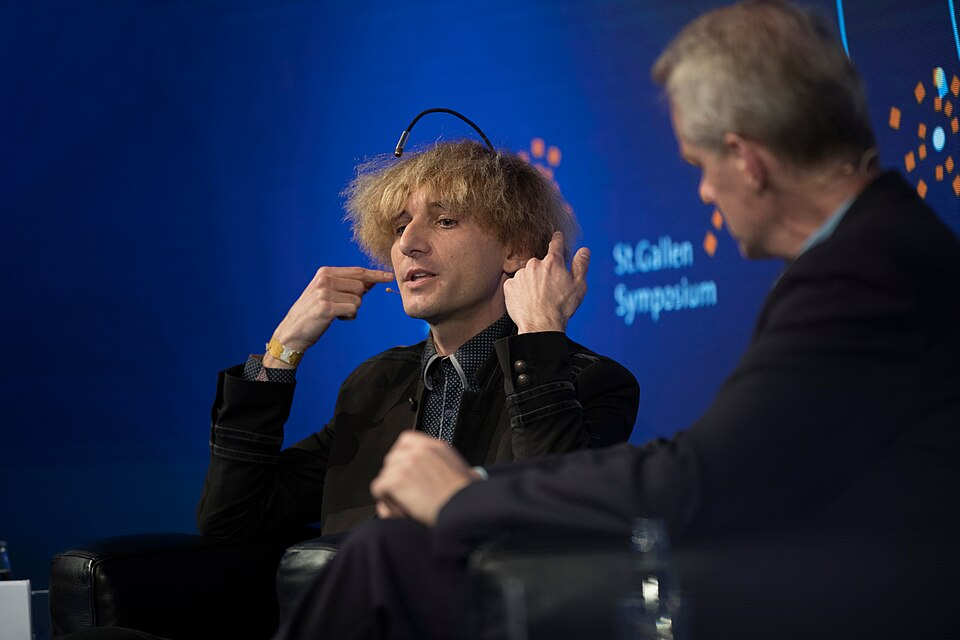
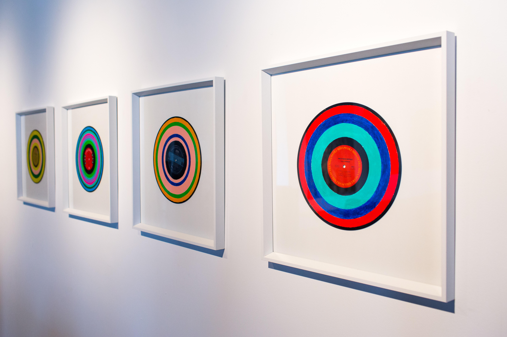

# Киборг-арт и Пост-цифровая телесность

**Киборг-арт** (от англ. *cyborg art*) — [направление](../../../1.2_natural_sciences/physics_in_everyday_life/Q11402.md) современного технологического искусства, в котором художники исследуют слияние человеческого тела с технологическими устройствами, превращая биологическое существо в расширенный медиа-интерфейс. В рамках этой практики [тело](../../../1.2_natural_sciences/why_science_help_understand_world/organism.md) перестаёт быть замкнутой автономной системой и становится открытой платформой: протезы, вживлённые датчики, нейроинтерфейсы и механические расширения наделяют его новыми чувственными возможностями, недоступными природной биологии. Киборг-арт принадлежит широкому пространству [постгуманизма](https://ru.wikipedia.org/wiki/Постгуманизм) и постцифровой эпохи, в которой граница между физическим и вычислительным, между плотью и кодом, становится всё более условной.

---

## Тело как медиа-интерфейс

*Нил Харбиссон (слева) — [художник](../../../7.2 Media, leisure and hobbies/Computer games/articles/dream_team/artist.md) с вживлённой антенной для восприятия [цвета](../../../1.2_natural_sciences/physics_in_everyday_life/Q11652.md) через [звук](../../../1.2_natural_sciences/physics_in_everyday_life/Q124003.md), первый [человек](../../../1.2_natural_sciences/physics_in_everyday_life/Q45003.md) с официально признанным кибернетическим органом чувств. [Источник](../../../5.1_technology_and_digital_literacy/information and media literacy/дезинформация_и_фейки.md): Wikimedia Commons*

### Теоретический [контекст](../../../5.1_technology_and_digital_literacy/information and media literacy/геолокация_и_проверка_контекста.md)

Интеллектуальным основанием киборг-арта служит прежде всего «[Манифест киборга](https://en.wikipedia.org/wiki/A_Cyborg_Manifesto)» (1985) [Донны Харауэй](https://en.wikipedia.org/wiki/Donna_Haraway) — американского философа, историка науки и феминистского теоретика. В этом эссе Харауэй предложила [образ](../../../7.2 Media, leisure and hobbies/Computer games/articles/game_culture/cosplay.md) [киборга](https://ru.wikipedia.org/wiki/Киборг) не как угрозу и не как утопию технократического будущего, а как провокативную метафору, разрушающую устойчивые бинарные оппозиции: [природа](../../../1.2_natural_sciences/physics_in_everyday_life/Q11408.md)/[культура](../../../2.1_society/cause_and_effect_relationships/articles/why_rules_work.md), [организм](../../../1.2_natural_sciences/neurobiology_for_teens/articles/03_nervous_system_map.md)/машина, мужское/женское, человек/[животное](../../../1.2_natural_sciences/why_science_help_understand_world/biology.md). Для Харауэй киборг — это «иронический политический миф», позволяющий мыслить идентичность как нестабильную, гибридную и незавершённую конструкцию.

Вслед за «Манифестом» в 1990-х годах сформировалась широкая постгуманистическая [теория](../../../1.2_natural_sciences/why_science_help_understand_world/science.md), связавшая биотехнологические практики с переосмыслением самого понятия человека. Философы Кэтрин Хейлз (*How We Became Posthuman*, 1999), Роберт Пепперелл (*The Posthuman Condition*, [1995](2.5_siberian_deal.md)) и другие обосновывали [тезис](../../../4.2_thinking_and_working_information/critical_thinking/articles/logical_errors_and_sophisms.md) о [том](../../musical_instruments/articles/drums.md), что человек всегда был «техническим» существом — с момента изобретения первого орудия труда. Современные нейроинтерфейсы, бионические протезы и сенсорные импланты лишь делают это [измерение](../../../1.2_natural_sciences/physics_in_everyday_life/Q107715.md) более наглядным.

В этом контексте художники-киборги занимают особое место: они превращают собственное тело в лабораторию и одновременно в произведение искусства, переводя теоретические конструкты в живой перформативный [опыт](../../../1.2_natural_sciences/why_science_help_understand_world/experimental_science.md). Тело в киборг-арте — это не пассивный [объект](../../../1.2_natural_sciences/physics_in_everyday_life/Q634.md) хирургического вмешательства, а активный медиум, манифест и инструмент художественного высказывания.

### От теории к практике

Концептуально тело-как-интерфейс противостоит двум доминирующим трактовкам: технофобической, воспринимающей модификацию тела как угрозу человеческому достоинству, и технофильской, редуцирующей тело до «аппаратной платформы», подлежащей бесконечному апгрейду. Киборг-арт удерживает продуктивное [напряжение](../../../1.2_natural_sciences/physics_in_everyday_life/Q11023.md) между этими полюсами, настаивая на художественном и этическом измерении телесной трансформации: здесь важны не только технические возможности импланта, но и то, какие смыслы, ощущения и [отношения](../../../2.1_society/how_and_where_find_friends/articles/guide_dlya_introvertov.md) он порождает.

---

## Нил Харбиссон: человек-антенна

### [История](../../../1.2_natural_sciences/physics_in_everyday_life/Q11469.md) и контекст

[Нил Харбиссон](https://en.wikipedia.org/wiki/Neil_Harbisson) (р. 1984, Белфаст) — первый человек в мире, официально признанный государством как [киборг](https://ru.wikipedia.org/wiki/Киборг). Харбиссон страдает ахроматопсией — врождённой полной цветовой слепотой: весь видимый мир он воспринимает исключительно в оттенках серого. В 2004 году в сотрудничестве с кибернетиком и художником Адамом Монтандоном Харбиссон разработал первую версию **eyeborg** — [устройства](../../../5.1_technology_and_digital_literacy/operating system/articles/HAL.md), преобразующего цвета в звуковые частоты.

Когда в 2004 году Харбиссон подал заявление на получение нового паспорта, он настоял на том, чтобы фотография включала антенну как часть его головы. После длительной бюрократической борьбы британское правительство впервые в истории согласилось внести в официальный документ [изображение](../../../5.1_technology_and_digital_literacy/information and media literacy/оценка_качества_изображений_и_видео.md) человека с вживлённым технологическим устройством — прецедент, закрепивший юридический [статус](../../../5.1_technology_and_digital_literacy/how_internet_works/articles/http_https/http_https.md) Харбиссона как киборга.

### Технология

[Антенна](../../../5.1_technology_and_digital_literacy/how_internet_works/articles/wifi/router.md) Харбиссона — это жёсткий стержень, закреплённый в затылочной кости черепа. На конце стержня расположена видеокамера, постоянно направленная вперёд. Программное обеспечение в реальном времени анализирует [цвет](../../../1.2_natural_sciences/physics_in_everyday_life/Q1075.md) каждого объекта в [поле](../../../5.2_cybersecurity/cpp_fundamentals/13_struct.md) зрения и преобразует его в звуковую частоту, которая передаётся через кость черепа непосредственно во внутреннее ухо — минуя наружный слуховой проход.

Система использует принцип **костной проводимости**: вибрации распространяются через костную ткань черепа, создавая внутренний звук, слышимый только носителю. Каждый цвет видимого спектра соответствует определённой ноте: красный — низкая [частота](../../../1.2_natural_sciences/physics_in_everyday_life/Q11388.md), фиолетовый — высокая. Ключевая особенность устройства состоит в том, что оно воспринимает также **инфракрасный и ультрафиолетовый** диапазоны — спектры, принципиально недоступные человеческому зрению. Харбиссон стал первым человеком, обладающим внечеловеческим чувством в буквальном, а не метафорическом смысле.

По словам художника, спустя несколько лет после вживления антенна перестала восприниматься как внешнее [устройство](../../../1.2_natural_sciences/physics_in_everyday_life/Q178032.md): он ощущает её частью тела, а звуки цветов — непосредственным чувственным переживанием, а не интеллектуальной интерпретацией.

### Художественная [практика](../../../1.2_natural_sciences/physics_in_everyday_life/Q124003.md)

Харбиссон активно использует расширенное [восприятие](../../../1.2_natural_sciences/neurobiology_for_teens/articles/26_optical_illusions.md) в художественной [работе](../../../8.2_future/choosing_a_career_path/articles/interview.md). Его [метод](../../../5.1_technology_and_digital_literacy/how_internet_works/articles/http_https/http_https.md) **«соноxроматика»** (sonochromatics) строится на прямом переводе визуальной цветовой информации в музыкальные партитуры: посещая музеи, художник «слушает» картины и транскрибирует услышанное в ноты. Серия *Colours of Kandinsky* представляет собой музыкальные пьесы, рождённые из живописи, а *Face Concerts* — перформансы, в ходе которых Харбиссон «исполняет» лица знаменитостей, транслируя цвета их кожи, губ и волос в звуковую мелодию.

Другое направление — **«звуковые портреты»**: вместо того чтобы рисовать или фотографировать людей, Харбиссон создаёт их звуковые образы — уникальные мелодии, определяемые цветовой палитрой внешности конкретного человека. Портреты политиков, монархов и деятелей культуры существуют в этой системе как музыкальные пьесы.

Принципиально важно, что Харбиссон позиционирует свою практику не как «[искусство](../../../7.2 Media, leisure and hobbies /what_you_can_read_and_watch_to_develop_your_taste/articles/aesthetics_and_taste.md) инвалида, преодолевающего ограничения», а как расширение художественных возможностей: антенна даёт ему доступ к чувственным данным, которых лишён любой другой художник в мире.

---

## Стелак: [перформанс](1.3_participatory_art.md) на пределе тела

*Нил Харбиссон на выставке, демонстрирующий антенну eyeborg — устройство, преобразующее цвета в звуки через костную [проводимость](../../../1.2_natural_sciences/physics_in_everyday_life/Q124291.md). Художник превратил своё кибернетическое расширение в основу уникальной художественной практики. Источник: Wikimedia Commons*

[Стелак](https://en.wikipedia.org/wiki/Stelarc) (настоящее имя Стелиос Аркадиу, р. 1946, Кипр) — один из наиболее радикальных и влиятельных художников, работающих с телесными пределами. На протяжении полувека он исследует тело как несостоятельную, устаревшую и нуждающуюся в расширении биологическую систему. В отличие от Харбиссона, апеллирующего к расширению чувственности, Стелак настаивает на принципиальной «obsolescence» — устарелости тела как такового: оно слишком хрупко, слишком медленно и слишком ограничено, чтобы отвечать требованиям постиндустриальной среды.

### Suspension: тело в пространстве

С 1976 по 1988 год Стелак провёл серию из двадцати пяти [перформансов](https://ru.wikipedia.org/wiki/Перформанс) **Suspension**, в ходе которых подвешивал себя за кожу на крюках — в галереях, на деревьях, над улицами городов, внутри и снаружи зданий. Крюки вонзались в кожу спины, груди, рук и ног; тело повисало в воздухе без какой-либо иной поддержки.

*Suspension* — одновременно [исследование](../../../1.2_natural_sciences/neurobiology_for_teens/articles/19_curiosity.md) болевого порога, испытание материальной прочности кожи как архитектурного материала и [медитация](../../../8.2_future_and_path_choice/articles/relaxation_and_recovery.md) о теле как объекте, утратившем привычную гравитационную укоренённость. Стелак описывал подвешивание как [переживание](../../../4.1_rules_of_study/how_to_memorize/articles/stress.md) тела в «нейтральном» состоянии — без функциональности, без социального контекста, как чистая биологическая [масса](../../../1.1_structure_of_the_world/matter/articles/01_matter.md) в пространстве. Фотографии и [видео](../../../5.1_technology_and_digital_literacy/information and media literacy/оценка_качества_изображений_и_видео.md) перформансов вошли в канон телесного искусства и радикально расширили дискурс о физической выносливости и самоовладении.

### Third Hand: механическое расширение

В 1980 году Стелак разработал **Third Hand** («Третья рука») — механический манипулятор, закреплённый на правом предплечье художника и управляемый электрическими сигналами мышц живота и ног. Устройство включало независимо управляемые пальцы, хватательный механизм и функцию вращения запястья на 360 градусов — возможность, недоступная анатомической руке.

В серии перформансов Стелак управлял тремя руками одновременно: две биологические и одна механическая действовали параллельно, создавая ситуацию распределённого телесного контроля. Третья рука ставила под вопрос понятие о теле как единой, целостно управляемой системе: субъект оказывался одновременно оператором и машиной, организмом и протезом. В более поздних перформансах сигналы для управления третьей рукой поступали от удалённых пользователей через [интернет](../../../1.2_natural_sciences/physics_in_everyday_life/Q26540.md) — тело художника становилось терминалом для внешних команд.

### Ear on Arm: [орган](../../musical_instruments/articles/organ.md) без функции

Наиболее известный и обсуждаемый [проект](../../../1.2_natural_sciences/why_science_help_understand_world/research_work.md) Стелака — **Ear on Arm** («Ухо на руке», с 2007 года по настоящее [время](../../../1.2_natural_sciences/physics_in_everyday_life/Q20702.md)). В ходе серии хирургических операций на левом предплечье художника было сформировано и вживлено дополнительное ухо — реплика человеческой ушной раковины, выращенная из биосовместимых материалов с последующей интеграцией в ткань предплечья.

Ухо лишено слуховой функции: оно не подключено к нервной системе Стелака и не передаёт звуки в [мозг](../../../3.1. healthy lifestyle/Sleep, nutrition, and adolescent energy/articles/breakfast_for_the_brain.md). Его концептуальная роль принципиально иная: художник намеревался имплантировать в него микрофон и bluetooth-передатчик, чтобы любой интернет-пользователь мог в реальном времени слышать через это ухо всё, [что происходит](../../../5.1_technology_and_digital_literacy/how_internet_works/articles/web_basics/what_happens.md) рядом с художником, — создав таким образом орган, предназначенный не для самого носителя, а для удалённых слушателей по всему миру.

*Ear on Arm* радикально переформулирует понятие тела как частной собственности: орган существует на теле одного человека, однако функционирует как публичная инфраструктура. Критики и биоэтики активно обсуждали проект как провокацию к границам медицинской этики; защитники видели в нём предельное воплощение [идеи](../../../7.2 Media, leisure and hobbies /useful_and_interesting_leisure/articles/free_leisure_activities.md) сетевого тела.

---

## Moon Ribas и Cyborg Foundation

### Moon Ribas: сейсмический танец

[Moon Ribas](https://en.wikipedia.org/wiki/Moon_Ribas) (р. 1985, Барселона) — художница-перформер и сооснователь Cyborg Foundation, разработавшая собственное киборг-расширение: **сейсмические импланты** в ступнях. Устройства подключены к онлайн-сейсмографам по всему миру и в реальном времени передают вибрационные сигналы всякий раз, когда в любой точке [планеты](../../../1.2_natural_sciences/physics_in_everyday_life/Q1.md) происходит [землетрясение](../../../1.2_natural_sciences/why_science_help_understand_world/earth_sciences.md) — от едва ощутимых микротолчков до катастрофических событий.

Рибас использует это постоянно поступающее сейсмическое «чувство» как основу перформансов: она танцует в прямой зависимости от активности Земли. Интенсивность, [ритм](../../../1.2_natural_sciences/neurobiology_for_teens/articles/18_music_chills.md) и [амплитуда](../../../1.2_natural_sciences/physics_in_everyday_life/Q159190.md) движений определяются силой и частотой сейсмических событий по всему миру. В периоды затишья перформанс тяготеет к неподвижности; в моменты высокой сейсмической активности тело художницы отвечает на них движением.

Серия перформансов **Waiting [for](../../../5.2_cybersecurity/cpp_fundamentals/7_loops.md) Earthquakes** исследует опыт [ожидания](../../../1.2_natural_sciences/neurobiology_for_teens/articles/27_brain_predicts.md) — тело как инструмент экологического слушания, настроенный на пульс планеты. В отличие от большинства технологических расширений, ориентированных на получение информации о человеческой среде, импланты Рибас подключают её непосредственно к геологическим процессам, выводя художественную практику за пределы антропоцентрической системы восприятия.

### Cyborg Foundation

В 2010 году Нил Харбиссон и Moon Ribas совместно основали **[Cyborg Foundation](https://www.cyborgfoundation.com)** — международную некоммерческую организацию с тройственной миссией: [помощь](../../../3.1_healthy_lifestyle/pervaya_pomoshch/ushibi_porezy_ozhogi/10_krovotechenie_chto_delat.md) людям в создании и вживлении сенсорных расширений; [защита](../../../5.1_technology_and_digital_literacy/how_internet_works/articles/dns/cdn.md) прав киборгов как особой категории существ; продвижение кибернетики как художественной и философской практики.

Фонд последовательно разграничивает свою деятельность с трансгуманистической идеологией технологического совершенствования тела ради повышения «производительности». Для Харбиссона и Рибас имплант интересен прежде всего как инструмент художественного восприятия и нового опыта — а не как способ стать «быстрее» или «умнее». В этом отношении Cyborg Foundation занимает особое место в дискуссии о будущем тела: он настаивает на эстетическом и этическом измерении киборгизации, а не только на её утилитарном потенциале.

Фонд также ведёт юридическую [работу](../../../8.2_future/choosing_a_career_path/articles/interview.md): добивается признания права на телесную модификацию и официального статуса киборгов в различных национальных законодательствах, ставя вопрос о том, применимы ли существующие правовые категории к существам, сочетающим биологическую и технологическую природу.

---

## Этические и философские [вопросы](../../../4.1_rules_of_study/how_to_learn_effectively/articles/curiosity.md)

### [Право](../../../5.1_technology_and_digital_literacy/information and media literacy/авторское_право_и_честное_использование.md) на модификацию тела

Один из центральных вопросов, поднимаемых киборг-артом, — это **право на телесную автономию**: имеет ли человек право по собственному усмотрению модифицировать собственное тело с помощью технологий, выходящих за рамки медицинских показаний? Большинство национальных законодательств не предусматривает подобной категории и либо игнорирует такие практики, либо подводит их под статьи о нанесении вреда здоровью.

Bioethical комитеты и медицинские [ассоциации](../../../1.2_natural_sciences/neurobiology_for_teens/articles/18_music_chills.md) в целом относятся к немедицинским имплантам с осторожностью или прямым отказом: хирурги, выполняющие операции для художников вроде Стелака, рискуют профессиональными санкциями. Стелак неоднократно описывал [трудности](../../../4.1_rules_of_study/how_to_learn_effectively/articles/growth_mindset.md) с поиском медицинских специалистов, согласившихся провести операцию по имплантации уха — именно в силу отсутствия медицинских показаний.

### Постгуманизм vs трансгуманизм

В дискуссии о киборгизации важно разграничить **постгуманизм** и **трансгуманизм** — два философских направления, часто смешиваемых, но принципиально различных по посылкам.

**Трансгуманизм** исходит из того, что человек в его нынешнем биологическом облике — лишь промежуточный этап эволюции, подлежащий преодолению с помощью технологий. Его горизонт — радикальное продление жизни, когнитивный апгрейд, постепенный переход к «постбиологическому» существованию. Тело здесь воспринимается как ограничение, от которого следует освободиться.

**Постгуманизм** (в версии Харауэй, Хейлз и их последователей) не стремится «преодолеть» тело, а переосмысляет саму категорию «человеческого»: оспаривает его исключительность, демонтирует жёсткую границу между человеком, животным и машиной, указывает на то, что человек всегда уже был гибридным, технически опосредованным существом. Это критическая, а не утопическая позиция.

Киборг-арт в целом тяготеет к постгуманистической чувствительности: художников интересует не «[улучшение](../../../4.1_rules_of_study/how_to_learn_effectively/articles/learning_from_mistakes.md)» человека, а расширение его опыта восприятия и художественных возможностей, а также критическое исследование границ телесности как культурного и политического конструкта.

### Новые [чувства](../../../2.1_society/cause_and_effect_relationships/articles/empathy_causality.md) и эпистемология

Вживлённые сенсоры Харбиссона и Рибас поднимают глубокий философский вопрос: что происходит с **познанием и субъективностью**, когда человек обретает принципиально новый канал восприятия? Классическая эпистемология предполагала, что [органы чувств](../../../1.2_natural_sciences/physics_in_everyday_life/Q11466.md) человека — устойчивый базис, на котором выстраивается [знание](../../../1.2_natural_sciences/why_science_help_understand_world/science.md) о мире. Киборг-арт ставит это под сомнение: восприятие оказывается не данностью, а технически изменяемой переменной.

По свидетельству Харбиссона, спустя годы пользования антенной он начал видеть цветные сны — несмотря на то что никогда не видел цветов «нативно». Нейробиологи расценивают это как свидетельство нейропластичности: мозг способен интегрировать новые сенсорные входы и перестраивать под них свою архитектуру. Это открывает принципиальный вопрос о том, насколько «человеческое» восприятие является биологически фиксированным, а насколько — пластичным и расширяемым.

---

## Смотри также

- [Портал 4: Пост-цифровая эпоха и Новая материальность](../README.md)
- [От Постинтернета к Фиджиталу](4.1_post_internet.md) — теоретический контекст пост-цифровой эпохи
- [AR-монументализм](4.2_ar_monumentalism.md) — [дополненная реальность](4.2_ar_monumentalism.md) как искусство в публичном пространстве
- [Био-арт: ДНК как программный код](4.4_bio_art.md) — [ДНК](4.4_bio_art.md) как программный [код](../../../5.2_cybersecurity/cpp_fundamentals/1_introduction.md) и алгоритмические биологические формы
- [Алгоритмический крафт и 3D-печать](4.5_algorithmic_craft.md) — скульптура и [дизайн](../../../7.2 Media, leisure and hobbies/Computer games/articles/dream_team/artist.md), где [форма](4.5_algorithmic_craft.md) вычисляется алгоритмами
- [Медиаискусство](https://ru.wikipedia.org/wiki/Медиаискусство) — [Википедия](../../../4.2_thinking_and_working_information/how_to_search_information/articles/wikipedia.md)

---

Авторы: Тимофей Береговин;

*[Ресурсы](../../../2.1_society/cause_and_effect_relationships/articles/ecological_footprint.md): [LLM](../README.md) — Claude Sonnet 4.6*
