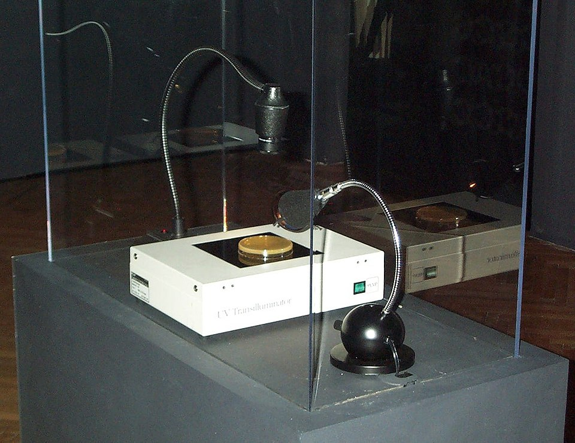
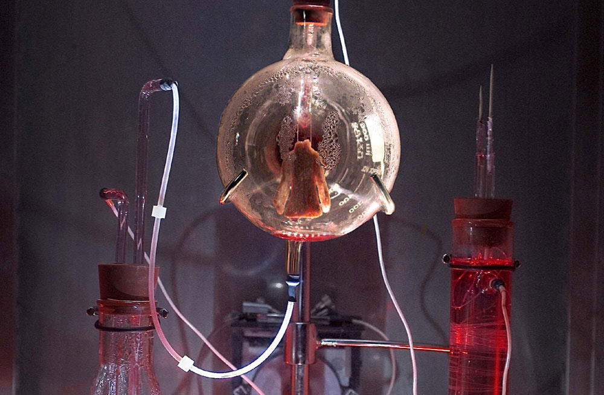

# Био-арт: ДНК как программный [код](../../../5.2_cybersecurity/cpp_fundamentals/1_introduction.md)

**Био-арт** (от англ. *bio art*) — [направление](../../../1.2_natural_sciences/physics_in_everyday_life/Q11402.md) современного искусства, в котором художники используют [живые организмы](../../../1.2_natural_sciences/physics_in_everyday_life/Q11388.md), биологические процессы и [генную инженерию](https://ru.wikipedia.org/wiki/Генная_инженерия) в качестве художественного материала и медиума. В отличие от традиционного искусства, работающего с инертными материалами — камнем, холстом или пикселями, — [биоарт](https://en.wikipedia.org/wiki/Bio_art) имеет дело с системами, которые живут, дышат, размножаются и умирают. Центральный вопрос направления — может ли [жизнь](../../../1.2_natural_sciences/physics_in_everyday_life/Q1751973.md) быть записана как код, а код — прорасти живым существом? Это пересечение молекулярной биологии, биоэтики и [постгуманизма](https://ru.wikipedia.org/wiki/Постгуманизм) производит [работы](../../../8.2_future/choosing_a_career_path/articles/interview.md), принципиально неотличимые от научного эксперимента: разница не в методе, а в намерении и контексте.

---

## ДНК как носитель информации: [наука](../../../1.2_natural_sciences/physics_in_everyday_life/Q238323.md) и [искусство](../../../7.2 Media, leisure and hobbies /what_you_can_read_and_watch_to_develop_your_taste/articles/aesthetics_and_taste.md)

[ДНК](https://ru.wikipedia.org/wiki/ДНК) — дезоксирибонуклеиновая [кислота](../../../1.1_structure_of_the_world/matter/articles/12_chemical_properties.md) — представляет собой полимер, в котором биологическая [информация](../../../5.1_technology_and_digital_literacy/information and media literacy/как_устроена_современная_информационная_среда.md) кодируется последовательностью четырёх нуклеотидных оснований: аденина (A), тимина (T), гуанина (G) и цитозина ([C](../../../2.1_society/how_and_where_find_friends/articles/sora_drug.md)). Каждая из этих букв соответствует двум битам информации, что делает ДНК исключительно ёмким носителем: в одном грамме теоретически можно записать около 215 петабайт данных. Для сравнения, всё мировое [производство](../../../2.1_society/cause_and_effect_relationships/articles/economic_chains.md) [цифровой](../../musical_instruments/articles/synthesizer.md) информации в год укладывается примерно в 100 зеттабайт — и ДНК могла бы хранить его в объёме нескольких чайных ложек.

Возможность [записи](../../../4.1_rules_of_study/how_to_learn_effectively/articles/note_taking.md) произвольной цифровой информации в ДНК была доказана экспериментально в 2012 году командой Джорджа Чёрча из Гарварда, закодировавшей 5,27 мегабит в синтетическую ДНК, а в [2016](5.5_yandex_neural.md) году Microsoft Research синтезировала запись [200](../../../5.1_technology_and_digital_literacy/how_internet_works/articles/http_https/http_https.md) мегабайт данных — в [том](../../musical_instruments/articles/drums.md) числе видеоролики, документы и изображения — и успешно считала их обратно. Принцип прост: цифровой [файл](../../../5.1_technology_and_digital_literacy/operating system/articles/file_system.md) переводится в бинарную запись, затем в последовательность нуклеотидных пар по условному алфавиту (например, 00 = A, 01 = C, 10 = G, 11 = T), после чего синтезируется соответствующая [молекула](../../../1.1_structure_of_the_world/matter/articles/01_matter.md). Считывание происходит методом секвенирования следующего поколения (NGS).

Художники, работающие с ДНК как носителем, присваивают этой [технологии](../../../2.2_history/world_economy_on_fingers/articles/globalizatsiya.md) смысловое [измерение](../../../1.2_natural_sciences/physics_in_everyday_life/Q107715.md), недоступное лаборатории. Когда в синтетическую молекулу вписывается стихотворение, манифест или молитва, а эта молекула встраивается в живую клетку — вопрос о границе между «природой» и «культурой» перестаёт быть риторическим. [Организм](../../../1.2_natural_sciences/neurobiology_for_teens/articles/03_nervous_system_map.md) буквально несёт в себе [текст](../../../4.1_rules_of_study/how_to_learn_effectively/articles/reading_skills.md) как часть генома. Информация становится жизнью.

---

## Эдуардо Кац: [пионер](1.2_nam_june_paik.md) трансгенного искусства

*Эдуардо Кац представляет [проект](../../../1.2_natural_sciences/why_science_help_understand_world/research_work.md) Genesis на выставке Ars Electronica 1999 — первое произведение, в котором художественный текст был транскодирован в ДНК живых бактерий. [Источник](../../../5.1_technology_and_digital_literacy/information and media literacy/дезинформация_и_фейки.md): Wikimedia Commons*

[Эдуардо Кац](https://en.wikipedia.org/wiki/Eduardo_Kac) (р. 1962, Бразилия) — наиболее последовательный теоретик и практик [трансгенного искусства](https://en.wikipedia.org/wiki/Transgenic_art): направления, в котором произведение создаётся путём переноса генетического материала между организмами или синтезом новых генетических последовательностей. Кац сформулировал теорию трансгенного искусства в манифесте 1998 года, определив его как «новую форму художественной практики, основанную на использовании методов генной инженерии для создания уникальных существ».

### «Genesis» (1999)

Инсталляция **«Genesis»** (1999, [Ars Electronica](https://ars.electronica.art)) является одной из ключевых работ в истории биоарта и одновременно точным воплощением его концептуальной программы. В её основе — [фраза](../../../7.2 Media, leisure and hobbies/Computer games/articles/game_culture/game_memes.md) из [Книги](../../../7.2 Media, leisure and hobbies /useful_and_interesting_leisure/articles/reading_and_self_education.md) Бытия (Бытие 1:28): *«Наполняйте землю, и обладайте ею, и владычествуйте над рыбами морскими и над птицами небесными, и над всяким животным, пресмыкающимся по земле»*. Кац перевёл этот текст в код Морзе, а затем преобразовал его в последовательность ДНК по простому алфавиту: точка = T, тире = A, пробел между буквами = C, пробел между словами = G. Полученная синтетическая ДНК-последовательность была встроена в геном [бактерии](../../../6.1_Independent_living_and_daily_living_skills/Simple_and_safe_cooking/articles/hand_hygiene.md) *Escherichia coli*.

Инсталляция транслировалась через [интернет](../../../1.2_natural_sciences/physics_in_everyday_life/Q26540.md) в реальном времени: [зрители](../../../7.2 Media, leisure and hobbies/Computer games/articles/game_culture/esports.md) в галерее и онлайн-посетители могли активировать [ультрафиолетовое излучение](../../../1.2_natural_sciences/physics_in_everyday_life/Q12969754.md), воздействующее на бактериальную культуру и вызывающее мутации в геноме — а значит, в самом «тексте» внутри ДНК. По завершении выставки Кац секвенировал изменённую ДНК и перевёл мутировавшую последовательность обратно в слова. [Результат](../../../1.2_natural_sciences/why_science_help_understand_world/experimental_science.md): библейский текст о господстве человека над природой оказался искажён коллективным действием анонимных участников через интернет.

«Genesis» работает на нескольких уровнях одновременно: как комментарий к теологическому обоснованию эксплуатации природы человеком; как модель децентрализованного коллективного авторства; как [исследование](../../../1.2_natural_sciences/neurobiology_for_teens/articles/19_curiosity.md) природы мутации — случайного, неконтролируемого изменения — применительно к человеческому тексту. Мутация, в биологии нейтральная или вредоносная, здесь приобретает смысл редактуры, которую никто не контролирует.

### «GFP Bunny» — Альба (2000)

Ещё более широкую — и неоднозначную — известность получил проект **«GFP Bunny»** (2000), в котором Кац совместно с биотехнологической лабораторией INRA (Франция) создал трансгенного кролика по имени **Альба**, несущего ген зелёного флуоресцентного белка (GFP — *Green Fluorescent Protein*), заимствованный у медузы *Aequorea victoria*. Под воздействием синего или ультрафиолетового света кролик светился зелёным.

Технически GFP-трансгенез был известен в биологии с 1990-х как инструмент маркировки белков в живых клетках. Кац перенёс его из контекста научного инструмента в [контекст](../../../5.1_technology_and_digital_literacy/information and media literacy/геолокация_и_проверка_контекста.md) живого произведения искусства — и тем самым поднял [вопросы](../../../4.1_rules_of_study/how_to_learn_effectively/articles/curiosity.md), которые биологи предпочитали игнорировать: каков этический [статус](../../../5.1_technology_and_digital_literacy/how_internet_works/articles/http_https/http_https.md) существа, созданного специально как арт-объект? Является ли Альба субъектом или инструментом? Кому она принадлежит?

[Лаборатория](../../../1.2_natural_sciences/why_science_help_understand_world/experimental_science.md) INRA, первоначально участвовавшая в проекте, впоследствии отказалась передать кролика художнику, опасаясь скандала. Кац публично потребовал возврата Альбы и права взять её домой как члена семьи. [Переписка](../../../2.1_society/how_and_where_find_friends/articles/drug_poznaetsya_v_perepiske.md) художника с лабораторией и последовавшая медийная [дискуссия](../../../4.2_thinking_and_working_information/critical_thinking/articles/logical_errors_and_sophisms.md) сами по себе стали частью произведения: «GFP Bunny» — это не только кролик, но и социальный [перформанс](1.3_participatory_art.md) вокруг него, обнажающий, как научные институции присваивают живые существа.

Альба умерла в лаборатории в 2002 году, так и не покинув её. Кац посвятил ей серию последующих работ — в частности, инсталляцию «The Eighth Day» (2001), где трансгенные организмы помещались в замкнутую экосистему под стеклянным куполом, и серию фотографий «Alba's Portrait» — подчёркнуто семейных, интимных снимков кролика.

---

## Живые скульптуры: мицелий и тканевые культуры

*Tissue Culture & Art Project (Оран Кац и Ионат Зурр), «Victimless Leather» (2004) — миниатюрная куртка, выращенная из мышиных клеток на биоразлагаемом полимерном каркасе в биореакторе; экспонировалась в MoMA в 2008 году. Источник: SymbioticA, University of Western Australia*

### Скульптуры из мицелия

[Мицелий](https://ru.wikipedia.org/wiki/Мицелий) — вегетативное [тело](../../../1.2_natural_sciences/why_science_help_understand_world/organism.md) гриба, состоящее из разветвлённых нитей-гиф, — обладает уникальными свойствами строительного материала: он растёт, заполняя форму, связывает органические субстраты (опилки, солому, сельскохозяйственные отходы) и затвердевает при высыхании в лёгкий, прочный и полностью биоразлагаемый композит. Именно это свойство использует компания **[Ecovative Design](https://ecovative.com)** (основатели — Гэвин Макинтайр и Эбен Байер), разработавшая технологию выращивания упаковочных и строительных материалов из мицелия.

Архитектор и [дизайнер](../../../8.2_future/choosing_a_career_path/articles/designer.md) **Нери Окман** (1976–2023), возглавлявшая лабораторию [MIT Media Lab](5.2_art_residencies.md) Mediated Matter Group, превратила этот технологический [процесс](../../../5.1_technology_and_digital_literacy/operating system/articles/process.md) в художественную и архитектурную программу. В проекте **«Aguahoja»** (2018–2019) её лаборатория создавала структуры из биополимеров — хитина, целлюлозы и пектина — с использованием алгоритмического проектирования и роботизированного нанесения: [форма](4.5_algorithmic_craft.md) объекта определялась не скульптором, а вычислительной оптимизацией, имитирующей биологические [принципы](../../../3.1_healthy_lifestyle/pervaya_pomoshch/ushibi_porezy_ozhogi/02_celi_pervoy_pomoshchi.md) роста. Скульптуры были буквально «выращены» по алгоритму.

Ключевой принцип Окман, сформулированный ею как концепция **«material ecology»** («[материальная экология](4.5_algorithmic_craft.md)»): [дизайн](../../../7.2 Media, leisure and hobbies/Computer games/articles/dream_team/artist.md) должен имитировать логику живого роста, а не противостоять ей. Форма возникает не из замысла художника, спроецированного на пассивный [материал](../../../1.2_natural_sciences/physics_in_everyday_life/Q25358.md), — она рождается из диалога алгоритма и биологических свойств материала. В этом смысле автором скульптуры является не только [человек](../../../1.2_natural_sciences/physics_in_everyday_life/Q45003.md), но и сам мицелий.

### Tissue Culture & Art Project

**Tissue Culture & Art Project** (TC&A) — арт-дуэт австралийских художников **Орана Каца** и **Иони Зунзеля**, работающих с тканевыми культурами: живыми клетками и фрагментами тканей животных, выращиваемыми в лабораторных условиях вне организма. Основанный в 1996 году при Лаборатории [SymbioticA](https://www.symbiotica.uwa.edu.au) Университета Западной Австралии, проект исследует эстетические, этические и онтологические последствия работы с «полуживыми» материалами.

Наиболее известный проект TC&A — **«Victimless Leather»** («Кожа без жертвы», 2004): крошечная куртка, выращенная из мышиных клеток на биоразлагаемом полимерном каркасе и помещённая в биореактор как [элемент](../../../1.2_natural_sciences/why_science_help_understand_world/chemistry.md) галерейной инсталляции. Проект задавался вопросом: если одежду можно вырастить из клеточной культуры без убийства животного — является ли это этическим прогрессом или новой формой эксплуатации биологического материала?

Инсталляция «Victimless Leather» была показана в MoMA в 2008 году в рамках выставки Design and the Elastic Mind. Когда ткань разрослась настолько, что начала заполнять биореактор и перекрывать [поток](../../../5.1_technology_and_digital_literacy/operating system/articles/thread.md) питательной среды, куратор выставки Паола Антонелли была вынуждена «убить» инсталляцию, отключив систему жизнеобеспечения. Сам этот момент — [принятие](../../../2.1_society/how_and_where_find_friends/articles/otkaz_ne_konets.md) решения об умерщвлении художественного объекта — стал, по словам художников, частью произведения.

---

## [Этика](../../../2.1_society/cause_and_effect_relationships/articles/responsibility.md): жизнь как материал

Биоарт порождает этические вопросы, которые не имеют аналогов в традиционных художественных практиках. Эти вопросы можно структурировать по нескольким осям.

### Субъектность живого материала

Когда [художник](../../../7.2 Media, leisure and hobbies/Computer games/articles/dream_team/artist.md) работает с камнем или красками, этический статус материала не вызывает сомнений. Когда материалом служит живая [клетка](../../../1.2_natural_sciences/physics_in_everyday_life/Q40260.md), ткань или организм — возникает вопрос о его субъектности. Кролик Альба был создан как произведение искусства, но обладал нервной системой, испытывал [боль](../../../1.2_natural_sciences/neurobiology_for_teens/articles/16_love_chemistry.md) и [страх](../../../1.2_natural_sciences/neurobiology_for_teens/articles/14_amygdala_fear.md). Тканевые культуры TC&A находятся в промежуточном состоянии: они живые, но не являются организмом в полном смысле. Где проходит граница между материалом и субъектом — и кто правомочен её устанавливать?

Биоэтики, критикующие подобные практики, апеллируют к принципу защиты живых существ вне зависимости от их «художественной» функции. Сторонники биоарта возражают: биомедицинская индустрия ежегодно использует в экспериментах несравнимо большее число живых организмов — без каких-либо эстетических или концептуальных рефлексий. Биоарт, как [минимум](../../../1.2_natural_sciences/physics_in_everyday_life/Q136980.md), делает это видимым.

### Синтетическая жизнь и проблема создателя

Создание трансгенного организма, которого до художника не существовало в природе, ставит вопрос об ответственности создателя за своё творение. В отличие от скульптуры, которую можно убрать в хранилище, [живое существо](../../../1.2_natural_sciences/why_science_help_understand_world/organism.md) требует ухода, стареет и умирает. Художник выступает в роли, традиционно принадлежавшей эволюции или богу, — и принимает ли он вместе с этой ролью соответствующую [ответственность](../../../2.1_society/cause_and_effect_relationships/articles/responsibility.md)?

Эдуардо Кац последовательно настаивал: да, он принимает. Именно поэтому он добивался права взять Альбу домой — как декларацию о том, что художник несёт за своё творение такую же ответственность, как родитель за ребёнка. Лаборатория, отказавшая ему, — по его интерпретации — именно эту ответственность от себя отстранила.

### Биобезопасность и пределы открытости

Часть биоарт-проектов реализуется в профессиональных биолабораториях с соответствующими протоколами безопасности. Другие — особенно в движении **DIY-bio** («сделай сам»), где художники и активисты работают с генетическим материалом в домашних условиях, — вызывают опасения у специалистов в области биобезопасности. Демократизация биотехнологий, которую приветствуют одни участники биоарт-сцены, для других означает снижение пороговых барьеров для создания потенциально опасных организмов.

Это [противоречие](../../../2.1_society/cause_and_effect_relationships/articles/conflict_roots.md) не имеет простого разрешения и в различных странах регулируется по-разному: в США деятельность DIY-bio лабораторий лицензируется на уровне штатов, в Европейском союзе — подпадает под [действие](../../../2.1_society/cause_and_effect_relationships/articles/personal_choice.md) Директивы по генетически модифицированным организмам.

### Корпоративное присвоение жизни

Отдельный пласт критики связан с вопросом патентования биологических объектов. Начиная с решения Верховного суда США по делу *Diamond v. Chakrabarty* (1980), признавшего патентоспособность живых организмов, созданных человеком, корпорации активно патентуют генетические последовательности и трансгенные организмы. Художники-биоарты оказываются в парадоксальном положении: созданный ими организм может стать собственностью не их, а научной или корпоративной организации, предоставившей лабораторию и технологии.

---

## Смотри также

- [Портал 4: Пост-цифровая эпоха и Новая материальность](../README.md)
- [От Постинтернета к Фиджиталу](4.1_post_internet.md) — теоретическая [база](../../../1.2_natural_sciences/physics_in_everyday_life/Q5339.md) постцифровой эпохи
- [AR-монументализм](4.2_ar_monumentalism.md) — [дополненная реальность](4.2_ar_monumentalism.md) как искусство в публичном пространстве
- [Киборг-арт и Пост-цифровая телесность](4.3_cyborg_art.md) — слияние тела и технологий как художественная [программа](../../../5.1_technology_and_digital_literacy/operating system/articles/process.md)
- [Алгоритмический крафт и 3D-печать](4.5_algorithmic_craft.md) — скульптура и дизайн, где форма просчитывается нейросетями
- [Биоарт](https://en.wikipedia.org/wiki/Bio_art) — [Wikipedia](../../../4.2_thinking_and_working_information/how_to_search_information/articles/wikipedia.md)
- [ДНК](https://ru.wikipedia.org/wiki/ДНК) — [Википедия](../../../4.2_thinking_and_working_information/how_to_search_information/articles/wikipedia.md)
- [Генеративное искусство](https://en.wikipedia.org/wiki/Generative_art) — Wikipedia
- [Медиаискусство](https://ru.wikipedia.org/wiki/Медиаискусство) — Википедия

---

Авторы: Тимофей Береговин;

*[Ресурсы](../../../2.1_society/cause_and_effect_relationships/articles/ecological_footprint.md): [LLM](../README.md) — Claude Sonnet 4.6*
