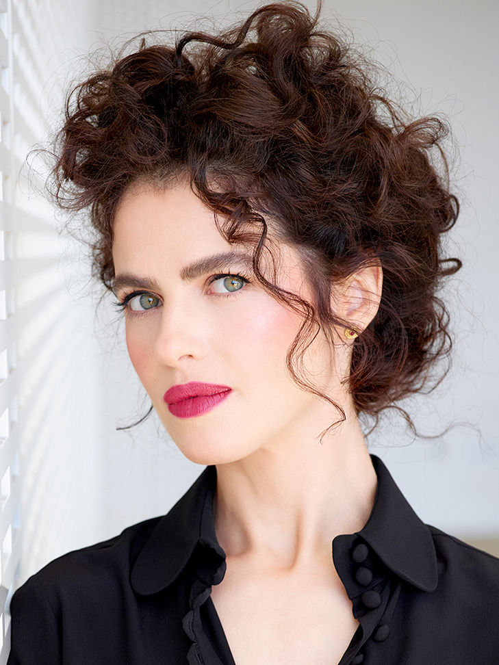
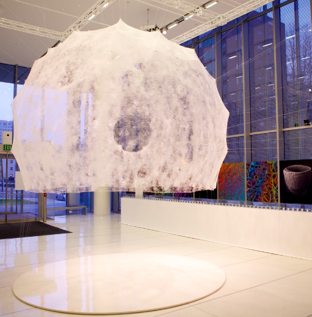
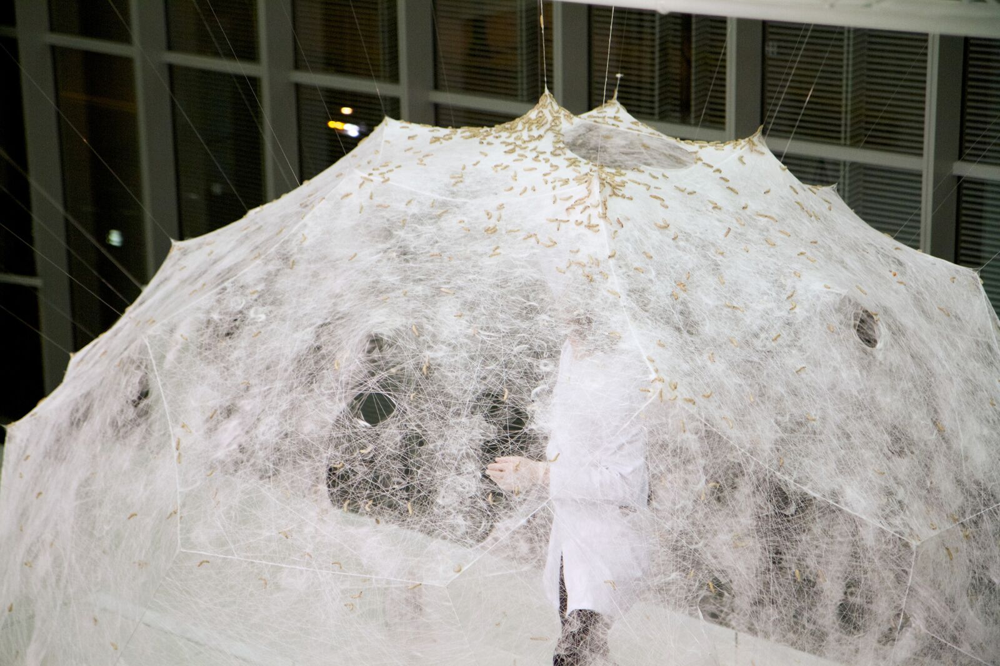
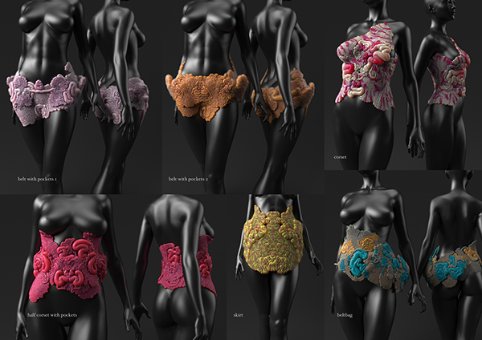
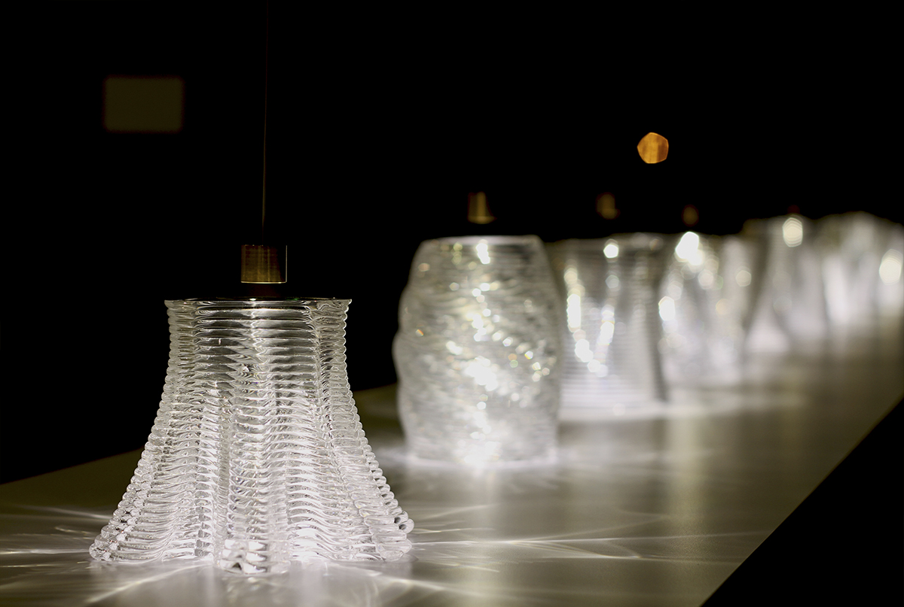

# Алгоритмический крафт и 3D-печать

**Алгоритмический крафт** — направление в современном искусстве и дизайне, в котором форма объекта не проектируется вручную, но **вычисляется**: генерируется алгоритмами на основе заданных параметров, биологических принципов или данных из окружающей среды, а затем материализуется посредством [3D-печати](https://ru.wikipedia.org/wiki/3D-печать), роботизированных манипуляторов или числового программного управления (ЧПУ). Это направление находится на пересечении [генеративного искусства](https://en.wikipedia.org/wiki/Generative_art), вычислительной скульптуры, [параметрического проектирования](https://en.wikipedia.org/wiki/Parametric_design) и промышленных технологий аддитивного производства. Ключевой философский сдвиг состоит в переосмыслении авторства: художник задаёт **систему правил**, а не конечный образ, делегируя роль «скульптора» вычислительному процессу.

---

## Алгоритм как автор формы

### От параметрического дизайна к генеративным скульптурам

Идея вычисляемой формы восходит к [параметрическому проектированию](https://en.wikipedia.org/wiki/Parametric_design) — подходу, при котором геометрия объекта описывается не фиксированными координатами, но системой переменных и зависимостей между ними. Изменение одного параметра автоматически перестраивает всю структуру: архитектор задаёт не чертёж, но логику, порождающую чертёж. Этот принцип уходит корнями в аналитическую работу Пьера Безье в 1960-х годах и программное проектирование Кристофера Александра, однако своего расцвета достиг лишь с появлением программ-оболочек наподобие **[Grasshopper](https://www.grasshopper3d.com)** (плагин к Rhino3D) и **[Processing](https://processing.org)** в 2000-е годы.

Принципиальный шаг от параметрического **дизайна** к генеративной **скульптуре** состоит в отказе от функциональных ограничений: форма перестаёт быть средством для достижения утилитарной цели и становится самоценным высказыванием о природе роста, ветвления, кристаллизации или турбулентности. Алгоритм в таком случае имитирует природные системы — дендритный рост, морфогенез, фракталы — и производит структуры, обладающие органической сложностью, воспроизвести которую вручную было бы невозможно. Среди используемых методов — **L-системы** (формальная грамматика, описывающая рост растений), **реакционно-диффузионные уравнения** (воспроизводящие образование пятен на шкурах животных), **агентное моделирование** и нейросетевые генераторы форм.

С появлением доступных 3D-принтеров и промышленных роботов-манипуляторов генеративная скульптура вышла за пределы экрана: алгоритм стал **инструментом производства**, а не только проектирования. Именно это слияние вычислительного метода и физической материализации образует то, что называют алгоритмическим крафтом — ремеслом нового рода, где мастерство художника состоит не в ловкости рук, но в точности постановки вычислительной задачи.

---

## Нери Оксман и «материальная экология»

*Нери Оксман, исследователь и дизайнер, основавшая направление «материальной экологии» — алгоритмического синтеза форм, вдохновлённых природными структурами. Источник: Wikimedia Commons*

### Биография и метод

[Нери Оксман](https://en.wikipedia.org/wiki/Neri_Oxman) (род. 1976) — израильско-американский архитектор, дизайнер и исследователь, основавшая в Массачусетском технологическом институте (MIT) группу **Mediated Matter**, которую возглавляла с 2010 по 2019 год. Образование Оксман охватывает медицину, архитектуру и вычислительные науки — и эта мультидисциплинарность определяет сам характер её практики.

Концептуальную основу работы Оксман образует понятие **«материальная экология»** (*material ecology*): подход, в котором дизайн рассматривается как продолжение природных процессов, а не как их альтернатива. Оксман отвергает разрыв между природным и технологическим, биологическим и вычислительным: в её проектах живые организмы, алгоритмические структуры и роботизированные производственные системы существуют как **единая экосистема**. Вдохновение черпается из [биомиметики](https://ru.wikipedia.org/wiki/Биомиметика) — науки, изучающей перенос принципов живой природы в инженерию и дизайн.

Ключевой технологический инструмент группы Mediated Matter — **многоматериальная 3D-печать с градиентом свойств**: принтеры, способные одновременно работать с десятками различных материалов, плавно переходя от жёсткого к гибкому, от прозрачного к непрозрачному в пределах одного объекта. Это воспроизводит принцип строения живых тканей, где жёсткость и упругость распределены по объёму непрерывно, а не заданы однородным материалом.

### Silk Pavilion

*«Silk Pavilion» (2013) — купол, сотканный 6 500 тутовыми шелкопрядами на роботизированном каркасе, Нери Оксман / MIT Media Lab. Источник: Wikimedia Commons, CC BY-SA 4.0*

Наиболее известная работа Нери Оксман — **«Silk Pavilion»** («Шёлковый павильон», 2013). Структура представляет собой купол площадью около 2,3 кв. м, в создании которого участвовали **6 500 живых тутовых шелкопрядов** вместе с роботизированной системой. На первом этапе промышленный робот CNC (числовое программное управление) намотал грубый каркас из единственной непрерывной нити длиной около 1,5 км поверх металлического каркаса. Затем в нескольких ключевых узлах были размещены коконы шелкопрядов. Гусеницы, выходя из коконов, начали прокладывать нити по направлению к свету и тёплым зонам — заполняя пустые участки каркаса органическими узорами, которые ни один алгоритм заранее не предписывал.

*Тутовые шелкопряды выпущены на каркас «Silk Pavilion» и прокладывают нити, заполняя органическими узорами пространство между роботизированными намотками. Нери Оксман. Источник: Wikimedia Commons, CC BY-SA 4.0*

«Silk Pavilion» воплощает центральную идею «материальной экологии»: живой организм выступает **соавтором структуры**, его поведение интегрировано в производственный процесс наравне с роботом. Архитектурная форма возникает из взаимодействия вычислительного управления и биологической непредсказуемости. Проект хранится в постоянной коллекции Музея современного искусства (MoMA) в Нью-Йорке.

### «Нагери» и Mushtari

*Серия «Wanderers» (2014), Нери Оксман — рендер носимых объектов-экосистем, напечатанных многоматериальной 3D-печатью, с каналами для фотосинтетических микроорганизмов. Источник: Wikimedia Commons, CC BY-SA 4.0*

В серии работ **«Wanderers»** («Странники», 2014) Оксман исследует идею «носимой экосистемы» — изделий, надеваемых на тело и взаимодействующих с его физиологией. Объект **«Нагери»** (Neri + «река» на иврите) представляет собой сложную оболочку для торса, структура которой имитирует разветвлённые сосудистые и дыхательные системы. Его поверхность содержит градиентные переходы от жёсткого экзоскелета к мягким мембранам — напечатанные за один цикл многоматериальной печатью.

**«Mushtari»** (арабское название Юпитера) — спираллевидная трубчатая система, охватывающая тело от плеча до бедра. По замыслу Оксман, внутри трубок должны обитать **фотосинтетические микроорганизмы** (водоросли, биолюминесцентные бактерии), производящие питательные вещества или свет для своего носителя. Это переводит дискуссию о носимых технологиях из области электроники в плоскость **симбиотической биологии**: тело, его одежда и микроорганизмы образуют единую экосистему. Серия «Wanderers» создавалась совместно с компанией Stratasys, производителем профессиональных 3D-принтеров.

---

*Каустические световые узоры, создаваемые 3D-печатной стеклянной структурой — результат вычислительного проектирования оптических свойств материала. Источник: Wikimedia Commons*

## Michael Hansmeyer: колонны с 16 миллионами граней

Швейцарский архитектор и вычислительный дизайнер **Michael Hansmeyer** (Михаэль Хансмайер, род. 1973) разрабатывает методы генерации архитектурных форм на основе рекурсивного многократного подразделения полигональных поверхностей — алгоритма, буквально **умножающего сложность** исходной формы на каждой итерации.

Его наиболее радикальная серия — **«Subdivided Columns»** («Разделённые колонны», 2010–2012). Отправной точкой служат классические ордерные колонны (дорийская, ионийская, коринфская), которые Хансмайер подвергает шести–семи итерациям подразделения поверхности с вариациями параметров. Результат — объекты, несущие в своей геометрии формальную «память» античной колонны, однако разросшиеся до **16 миллионов полигональных граней**: поверхность покрыта пещеровидными нишами, тончайшими ребрами и складками, воспроизводящими логику кораллов, нервных узлов и сталактитовых образований. Ни один человек физически не в состоянии спроектировать такую форму вручную — она существует только как вычислительный результат.

Проблема материализации этих объектов потребовала нестандартного технологического решения: стандартные 3D-принтеры тех лет не справлялись с такой детализацией в архитектурном масштабе. Хансмайер нарезал каждую колонну на **2 700 горизонтальных слоёв** толщиной около 1 мм из лёгкого картона, которые затем собирались вручную. В 2012 году он совместно с Бенджамином Дилленбургером представил **«Digital Grotesque»** — полноразмерную комнату с поверхностями, полностью покрытыми рекурсивным орнаментом, напечатанным на крупноформатном 3D-принтере из песчаника. Площадь поверхностей одной комнаты составила около 30 кв. м; суммарное число граней в геометрической модели — **260 миллионов**. Работа экспонировалась на Venice Architecture Biennale.

Подход Хансмайера ставит вопрос о **пределе человеческого восприятия сложности**: глаз охватывает только несколько уровней детализации одновременно, тогда как алгоритм генерирует их десятки. Это создаёт эстетический эффект, близкий к ощущению бесконечности в пределах конечного объекта.

---

## 3D-печать как демократизация скульптуры

До появления доступного аддитивного производства создание сложной скульптуры требовало либо значительных материальных ресурсов (мрамор, бронзовое литьё), либо многолетнего ремесленного мастерства. Промышленные 3D-принтеры 1990-х годов стоили сотни тысяч долларов и оставались инструментом аэрокосмической и автомобильной промышленности. Ситуация кардинально изменилась с появлением проекта **[RepRap](https://reprap.org)** (2005) — инициативы британского инженера Адриана Боуера, цель которой состояла в создании **самовоспроизводящегося 3D-принтера**, способного печатать большинство собственных деталей.

RepRap стал первым **опен-сорс 3D-принтером**: все чертежи, программное обеспечение и спецификации публиковались под свободными лицензиями. К 2010 году сообщество вокруг проекта породило десятки производных конструкций, включая платформу **Prusa** (сегодня один из наиболее распространённых форматов любительской 3D-печати). Потребительские принтеры, появившиеся на основе репрапного движения, снизили стоимость вхождения с сотен тысяч до нескольких сотен долларов.

Параллельно развивались онлайн-платформы для обмена 3D-моделями — прежде всего **[Thingiverse](https://www.thingiverse.com)** (основана 2008), где художники и дизайнеры публикуют файлы под открытыми лицензиями. Это создало инфраструктуру **опен-сорс дизайна**: скульптурные объекты, ювелирные изделия и архитектурные элементы распространяются как цифровые файлы и могут быть материализованы любым обладателем принтера в любой точке мира. Разрыв между автором формы и производителем объекта стал таким же концептуальным вызовом, каким в своё время была репродукция в фотографии: что такое «оригинал», если форма существует прежде всего как набор данных?

Для алгоритмического крафта доступность 3D-принтеров означает, что **генеративные скульптуры перестали быть привилегией хорошо финансируемых лабораторий**. Художники, работающие с Grasshopper, Processing или специализированными библиотеками вроде [OpenSCAD](https://openscad.org), могут генерировать формы и немедленно печатать их дома. Это привело к появлению обширного сообщества практиков, занимающихся вычислительным крафтом — «народным» алгоритмическим дизайном, — и к размыванию границы между профессиональным художником и технически грамотным энтузиастом.

---

## Параметрическая архитектура

### Заха Хадид Architects

[Заха Хадид](https://ru.wikipedia.org/wiki/Хадид,_Заха) (1950–2016) стала первой женщиной, получившей Притцкеровскую премию (2004), и наиболее узнаваемым голосом параметрической архитектуры в массовой культуре. Её бюро **[Zaha Hadid Architects (ZHA)](https://www.zaha-hadid.com)** систематически применяет параметрическое проектирование для создания текучих, несимметричных форм, в которых ни одна поверхность не повторяет другую. Такие здания, как **Оперный театр в Гуанчжоу** (2010), **Центр Гейдара Алиева в Баку** (2012) или **MAXXI — Национальный музей искусств XXI века** в Риме (2010), невозможно было бы спроектировать и построить без цифрового параметрического инструментария: их геометрия слишком сложна для ручного чертежа.

ZHA активно использует собственные вычислительные системы и алгоритмические инструменты для генерации структурных решений, а не только формальных образов. Это включает **топологическую оптимизацию** — алгоритмическое нахождение конструктивно эффективной формы при заданных нагрузках — и генеративное проектирование фасадных систем. Архитектурная философия Хадид перекликается с концепцией «деконструктивизма», однако превосходит его: там, где деконструктивизм апеллировал к метафоре разрушения, параметрическая архитектура Хадид апеллирует к математическому описанию непрерывного потока.

### Bjarke Ingels Group

Датское бюро **[Bjarke Ingels Group (BIG)](https://big.dk)**, основанное в 2005 году архитектором Бьярке Ингельсом, применяет параметрические методы в контексте ярко выраженного социального и экологического мышления. Знаковые проекты BIG — жилой комплекс **VM Houses** в Копенгагене (2005) с зигзагообразным планом или **VIA 57 West** в Нью-Йорке (2016), сочетающий типологию небоскрёба и европейского двора, — демонстрируют, как параметрические инструменты позволяют найти нетривиальные конфигурации, оптимизирующие одновременно инсоляцию, вид из окон и использование площади.

BIG активно исследует **экстремальную вычислительную оптимизацию**: для некоторых проектов бюро генерирует тысячи вариантов планировки, оцениваемых по многомерной системе критериев. Алгоритм в данном случае выступает не автором, но **дизайн-партнёром**, расширяющим пространство возможных решений за пределы того, что способен перебрать проектировщик за разумное время.

---

## Смотри также

- [Портал 4: Пост-цифровая эпоха и Новая материальность](../README.md)
- [От Постинтернета к Фиджиталу](4.1_post_internet.md) — теоретический контекст выхода цифрового в физическое
- [AR-монументализм](4.2_ar_monumentalism.md) — дополненная реальность как скульптура в публичном пространстве
- [Киборг-арт и Пост-цифровая телесность](4.3_cyborg_art.md) — тело как технологически расширенный медиа-интерфейс
- [Био-арт: ДНК как программный код](4.4_bio_art.md) — живые организмы и биологические системы как художественный материал
- [Рефик Анадол и Архитектура Big Data](5.3_refik_anadol.md) — монументальные вычислительные инсталляции и Big Data как скульптурный материал
- [3D-печать](https://ru.wikipedia.org/wiki/3D-печать) — Википедия
- [Генеративное искусство](https://en.wikipedia.org/wiki/Generative_art) — Wikipedia
- [Нери Оксман](https://en.wikipedia.org/wiki/Neri_Oxman) — Wikipedia
- [Параметрическое проектирование](https://en.wikipedia.org/wiki/Parametric_design) — Wikipedia
- [Биомиметика](https://ru.wikipedia.org/wiki/Биомиметика) — Википедия
- [Заха Хадид](https://ru.wikipedia.org/wiki/Хадид,_Заха) — Википедия

---

Авторы: Тимофей Береговин;

*Ресурсы: LLM — Claude Sonnet 4.6*
