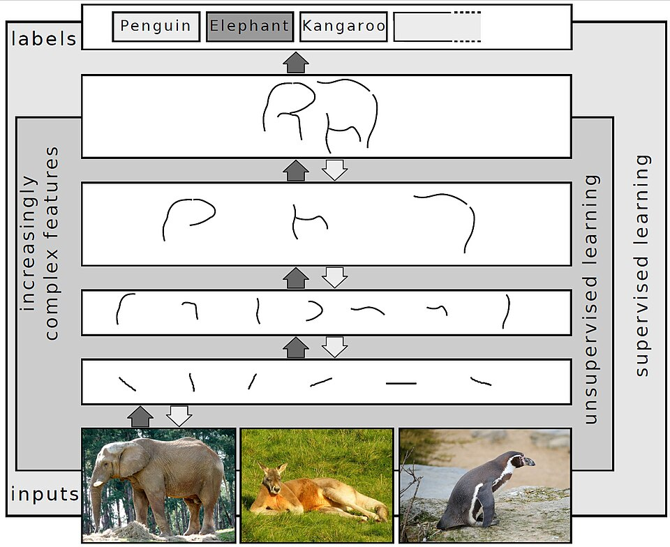
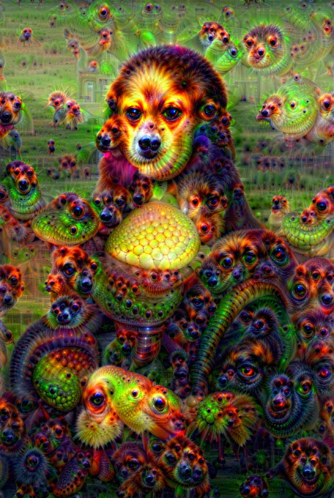

# Визуализация нейросетей (OpenAI Microscope)

**Визуализация нейросетей** — область на пересечении технологии и [медиаискусства](https://ru.wikipedia.org/wiki/Медиаискусство), в которой инструменты отладки и интерпретации систем искусственного интеллекта производят визуальные образы, обладающие самостоятельной эстетической ценностью. В более узком смысле термин обозначает методы **feature visualization** — целенаправленного синтеза изображений, максимально возбуждающих отдельные нейроны или каналы [нейронной сети](https://ru.wikipedia.org/wiki/Искусственная_нейронная_сеть), — а также работу интерпретируемых интерфейсов вроде **[OpenAI Microscope](https://microscope.openai.com)**, превращающих внутреннюю архитектуру нейронных моделей в открытый визуальный архив. Результирующие образы — психоделические мозаики глаз, текстур, деформированных животных и абстрактных паттернов — возникали изначально как побочный продукт инженерного исследования, однако были восприняты художественным сообществом как самостоятельный жанр [генеративного искусства](https://en.wikipedia.org/wiki/Generative_art).

---

## Что скрыто внутри нейросети

*Схематическая визуализация архитектуры системы глубокого обучения — многоуровневые слои нейронов, каждый из которых кодирует всё более сложные признаки входного изображения. Источник: Wikimedia Commons*

Современные нейронные сети — прежде всего глубокие сверточные архитектуры, применяемые в задачах компьютерного зрения, — состоят из множества последовательных **слоёв**. Каждый слой преобразует поступающий сигнал: первые слои реагируют на базовые визуальные примитивы (края, цветовые переходы, пятна текстуры), тогда как более глубокие слои накапливают сложность и начинают распознавать составные образы — глаза, носы, контуры предметов, наконец, целостные объекты и сцены.

Минимальная единица вычисления в такой сети — **нейрон**: математическая функция, принимающая взвешенную сумму входных сигналов и возвращающая скалярное значение активации. Миллионы таких нейронов, организованных в параллельные **каналы** (feature maps) на каждом слое, совместно кодируют любое изображение, поданное на вход. В процессе обучения на миллионах примеров нейроны специализируются: конкретный нейрон на пятом слое ResNet-50 может устойчиво активироваться в ответ на любое изображение, содержащее текстуру меха; другой — реагировать на паттерн спиральной симметрии.

Ключевая проблема состоит в том, что эта специализация **не задаётся инженером явно** — она возникает самостоятельно как результат оптимизации. Нейронная сеть в целом остаётся «чёрным ящиком»: известно, что она работает, но неизвестно, почему именно так и какие концепты в ней закодированы. Попытка ответить на этот вопрос породила целое исследовательское направление — **интерпретируемость ИИ** (AI interpretability), — а инструменты, разработанные в его рамках, оказались источником неожиданных визуальных образов.

---

*«Мона Лиза» Леонардо да Винчи, обработанная алгоритмом DeepDream с использованием нейросети VGG16, обученной на ImageNet — наглядная демонстрация «внутреннего взгляда» алгоритма, достраивающего знакомые паттерны поверх классического произведения. Источник: Wikimedia Commons*

## DeepDream (Google, 2015)

### История и метод

В июне 2015 года инженер Google **Александр Мордвинцев** опубликовал в официальном блоге компании запись, сопровождавшуюся серией галлюциногенных изображений: фотографии природы, на которых проступали сотни глаз, птицы со спиралевидными телами, животные, вырастающие из облаков. Инструмент получил название **[DeepDream](https://en.wikipedia.org/wiki/DeepDream)**.

Метод DeepDream основан на обращении стандартной процедуры работы нейронной сети. В норме изображение подаётся на вход, а на выходе получается классификационная метка. DeepDream делает обратное: **начиная с шума или с реальной фотографии**, алгоритм итеративно модифицирует само входное изображение в том направлении, которое усиливает активации выбранного слоя сети. Иными словами, изображение постепенно «оптимизируется» так, чтобы сеть всё сильнее «видела» в нём те паттерны, на которые данный слой настроен.

Этот процесс аналогичен **парейдолии** — когнитивному феномену, при котором человеческий мозг усматривает лица и узнаваемые образы в случайных текстурах. Однако если в случае человека парейдолия порождается устройством биологической зрительной коры, то DeepDream обнажает «предпочтения» конкретной модели, обученной на конкретных данных. Наиболее известный эффект возникал при использовании сети InceptionV3, обученной на ImageNet: поскольку датасет ImageNet содержит огромное количество изображений собак, сеть была предрасположена «достраивать» собачьи морды, рыбьи глаза и перья птиц из любого доступного визуального материала.

### Эстетика «сновидений ИИ»

Мордвинцев намеренно назвал свой метод «инсептионизмом» (*Inceptionism*) по аналогии с архитектурой Inception, использованной при экспериментах. Однако именно метафора сновидения — **«то, что видит нейросеть, когда видит сны»** — стала доминирующей в массовом восприятии. Изображения DeepDream немедленно разошлись по сети: их специфическая эстетика — многократно вложенные текстуры, органические образы, нарастающая детализация — оказалась безошибочно узнаваемой.

С художественной точки зрения DeepDream поставил вопрос о природе «внутреннего взгляда» алгоритма. Если нейронная сеть в процессе обработки любого изображения неизбежно обнаруживает в нём заученные паттерны, то визуализация этого процесса — нечто вроде **проекционного теста Роршаха**, только наоборот: не человек проецирует смысл на чернильное пятно, а машина проецирует выученные концепты на поданное ей изображение. Это сделало DeepDream первым широко известным примером того, как инженерный инструмент приобрёл статус художественного медиума.

---

## OpenAI Microscope

### Что это и как работает

**[OpenAI Microscope](https://microscope.openai.com)** — открытый онлайн-инструмент, выпущенный лабораторией OpenAI в 2020 году как часть исследований по интерпретируемости нейросетей. В отличие от DeepDream, Microscope не генерирует новые изображения в режиме реального времени, а представляет собой **статический каталог**: заранее вычисленные визуализации для каждого из миллионов нейронов в нескольких крупных моделях компьютерного зрения — InceptionV1, AlexNet, ResNet-50, VGG-19 и ряде других.

Для каждого нейрона Microscope отображает:

- **Feature visualization** — синтетическое изображение, полученное оптимизацией с нуля: то, «что нейрон хочет видеть» в абсолютно максимальном выражении;
- **Dataset examples** — реальные фотографии из обучающей выборки, которые наиболее сильно активировали данный нейрон;
- **Activation atlas** — карту взаимодействий между нейронами в пространстве признаков.

Интерфейс позволяет перемещаться по слоям сети как по этажам здания: от самых ранних слоёв, чьи нейроны реагируют на края и цветовые волны, к глубоким слоям, где возникают образы, узнаваемые как «морда собаки», «текстура черепицы» или «пучок травы». Это делает внутреннее устройство нейронной сети **навигируемым пространством** — своего рода музеем концептов, каждый из которых представлен визуальным экспонатом.

### Какие образы производит Microscope

Визуализации, доступные через Microscope, образуют несколько характерных визуальных классов. Ранние слои демонстрируют **абстрактные геометрические паттерны**: направленные градиенты, клеточные решётки, цветовые квадранты. Средние слои производят **биоморфные текстуры**: переплетения, имитирующие кожу рептилий, пчелиные соты, системы прожилок. Глубокие слои дают самые странные образы: многоглазые химеры, составленные из частей реальных объектов, — например, нейрон, настроенный на «глаз насекомого», визуализируется как бесконечно тиражированный фасеточный орган зрения, покрывающий всё поле изображения.

Наиболее интригующее открытие, сделанное с помощью Microscope, — существование **«нейронов-мультиконтекстников»** (*multimodal neurons*), реагирующих на несколько семантически различных концептов одновременно: например, один и тот же нейрон в модели CLIP оказался активирован как изображением паука, так и написанным словом «spider» на разных языках, а также карикатурными изображениями и символами, ассоциируемыми с опасностью. Это говорит о том, что нейронная сеть строит **концептуальные обобщения**, не ограниченные единственной модальностью, — и именно эти обобщения становятся визуальным материалом для художников.

---

## Feature visualization как художественный жанр

**Feature visualization** — метод синтеза изображений путём оптимизации входного сигнала для максимизации целевой активации — был разработан как инструмент анализа нейронных сетей в работах Эрли, Олаха и коллег (Google Brain, впоследствии Anthropic) в 2017–2020 годах. Ключевой принцип: если нейронная сеть — это функция, то можно поставить обратную задачу и найти **аргумент** этой функции, дающий максимальное значение. Так получается «идеальный стимул» для любого нейрона.

Художественный потенциал метода состоит в нескольких свойствах:

- **Непредсказуемость результата.** Художник задаёт лишь «адрес» нейрона и параметры оптимизации; конкретный образ возникает в ходе итеративного вычисления и не может быть полностью предугадан.
- **Машинный «подпис».** Каждая модель производит визуализации, отмеченные её специфической архитектурой и обучающими данными — как своего рода фирменным стилем.
- **Масштабируемость абстракции.** Варьируя глубину слоя, художник перемещается от чистой абстракции (нижние слои) к почти фигуративным образам (верхние слои), охватывая весь спектр между геометрической абстракцией и сюрреалистическим фигурализмом.

В контексте истории искусства feature visualization может быть прочитана как продолжение традиции **абстрактного автоматизма**: как сюрреалисты делегировали контроль над изображением бессознательному психики, так художники, работающие с feature visualization, делегируют его «бессознательному» нейронной сети — распределённой системе весов, хранящей следы миллиардов обучающих примеров.

---

## Художники, работающие с нейросетевой абстракцией

### Gene Kogan

**Джин Коган** — американский художник и педагог, один из наиболее последовательных популяризаторов нейросетевой эстетики в художественном сообществе. С начала 2010-х годов Коган ведёт открытые образовательные курсы по машинному обучению для художников, публикует лекции и материалы на принципах открытого доступа. Его художественная практика включает генеративные видеоработы, интерактивные инсталляции и принты, созданные методами feature visualization и трансферного стиля.

Концептуальная позиция Когана строится на убеждении, что нейронная сеть — **не инструмент автоматизации**, а система, порождающая новый вид взгляда: взгляд, сформированный статистическими паттернами человеческой визуальной культуры, но не совпадающий с ней. В своих видеоработах Коган исследует то, что он называет «эстетическим подсознанием» модели, — образы, возникающие на границе узнаваемого и абсурдного. Работы Когана экспонировались на фестивалях медиаискусства в Европе и США; он регулярно участвует в арт-резиденциях, объединяющих художников и исследователей ИИ.

### Memo Akten

**Мемо Актен** — турецко-британский художник и исследователь, работающий на пересечении вычислительного искусства, философии восприятия и изучения искусственного интеллекта. В своих работах Актен систематически исследует вопрос: **что значит «видеть»** для системы, обученной на человеческих данных? Его инсталляция **«Learning to See»** (2017–2019) представляет собой нейронную сеть, наблюдающую в режиме реального времени за объектами перед камерой и интерпретирующую их через призму заученного: мятая алюминиевая фольга превращается в видение океанских волн, пламя свечи — в закат, горсть камней — в облака. Модель «видит» то, что статистически похоже на поданный ей сигнал, — и именно это несовпадение между тем, что находится перед камерой, и тем, что «видит» машина, становится содержанием работы.

Серия **«Gloomy Sunday»** (2016) использует нейронные сети для аффективного анализа видеозаписей публичных пространств, превращая невидимые эмоциональные паттерны толпы в абстрактные визуальные волны. Актен настаивает на том, что нейросетевая абстракция — не украшение, а **эпистемологический инструмент**: способ сделать видимым то, что остаётся за пределами человеческого восприятия, — распределённые статистические структуры в данных.

Актен является постоянным участником программ таких институций, как [Ars Electronica](https://ars.electronica.art) (Линц) и [Sonar+D](https://sonarplusd.com) (Барселона), а его работы входят в постоянные коллекции ряда европейских музеев медиаискусства.

---

## Смотри также

- [Портал 5: Лабораторное искусство и Эстетика алгоритмов](../README.md)
- [Арт-резиденции при IT-гигантах](5.2_art_residencies.md) — сотрудничество художников с Google, Microsoft и OpenAI
- [Рефик Анадол и Архитектура Big Data](5.3_refik_anadol.md) — монументальные вычислительные инсталляции на основе данных
- [Марио Клингеманн и генеративные портреты](5.4_mario_klingemann.md) — генеративные портреты и ИИ как автономный творец
- [Нейронная оборона (Яндекс)](5.5_yandex_neural.md) — ранние эксперименты с генеративными архитектурами в России
- [Латентное пространство и Феномен Loab](6.2_latent_space.md) — «подсознание» нейросетей и феномен Loab
- [Нейронная сеть](https://ru.wikipedia.org/wiki/Искусственная_нейронная_сеть) — Википедия
- [DeepDream](https://en.wikipedia.org/wiki/DeepDream) — Wikipedia
- [Генеративное искусство](https://en.wikipedia.org/wiki/Generative_art) — Wikipedia
- [Медиаискусство](https://ru.wikipedia.org/wiki/Медиаискусство) — Википедия

---

Авторы: Тимофей Береговин;

*Ресурсы: LLM — Claude Sonnet 4.6*
