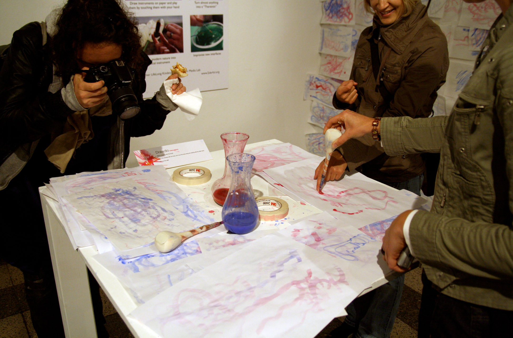

# Арт-резиденции при IT-гигантах

**Арт-резиденции при IT-гигантах** — институциональная практика, при которой технологические корпорации, исследовательские лаборатории и инженерные консорциумы приглашают художников, дизайнеров и теоретиков культуры для работы внутри своих научно-технических структур на срок от нескольких недель до нескольких лет. Резидент получает доступ к технологиям, данным, вычислительной инфраструктуре и специалистам корпорации в обмен на художественную рефлексию, нетривиальные постановки задач и культурную легитимацию технологических проектов. Подобное сотрудничество принято рассматривать как одно из структурообразующих явлений [медиаискусства](https://ru.wikipedia.org/wiki/Медиаискусство) конца XX — начала XXI века: именно оно обеспечило художников вычислительными ресурсами, прежде недоступными вне государственных институтов, а инженеров — методологией работы с неопределённостью, характерной для художественной практики.

---

## История: Bell Labs и E.A.T. как первый прецедент (1960-е)

*MIT Media Lab — одна из ведущих исследовательских площадок, где художники и учёные работают совместно над проектами на стыке технологий и культуры. Источник: Wikimedia Commons*

Первым масштабным прецедентом симбиоза между художниками и высокотехнологичной корпорацией стала программа **[Experiments in Art and Technology](https://en.wikipedia.org/wiki/Experiments_in_Art_and_Technology)** (E.A.T.), основанная в 1966 году инженерами [Bell Labs](https://en.wikipedia.org/wiki/Bell_Labs) Билли Клювером и Фредом Уолдхауэром совместно с художниками Робертом Раушенбергом и Робертом Уайтменом. Формальным поводом послужил успех девятивечернего перформанс-фестиваля *9 Evenings: Theatre and Engineering* (Нью-Йорк, октябрь 1966), для которого инженеры Bell Labs специально разработали ряд экспериментальных технических систем: беспроводные микрофоны, доплеровские детекторы движения, управляемые светом акустические системы и инфракрасные проекторы. Ни одно из этих устройств не существовало в коммерческом виде — они были сконструированы под конкретные художественные задачи.

E.A.T. превратилась в организацию-посредника, связывавшую художников с инженерами крупнейших американских корпораций на принципах паритетного партнёрства. К 1971 году в её базе данных значилось около **6 000 инженеров-добровольцев** и более **2 000 художников**. Ключевой декларируемый принцип был сформулирован Клювером как «равное, а не иерархическое взаимодействие»: инженер не обслуживает художника, а художник не иллюстрирует технологию — оба являются соавторами нового опыта. На практике это означало, что технические задачи переформулировались из инженерных в эстетические, и наоборот: художественные замыслы обнаруживали неожиданные инженерные импликации.

Bell Labs как институция занимала особое место в этой истории: лаборатория, принадлежавшая AT&T, была одним из наиболее производительных исследовательских центров XX века (транзистор, лазер, операционная система Unix, язык C — всё это разработки Bell Labs) и при этом обладала культурой фундаментальной науки, терпимой к долгосрочным, практически не ориентированным исследованиям. Именно эта культура — редкая для корпоративной среды — делала Bell Labs совместимой с художественной практикой: и там, и там ценилась готовность работать без гарантированного результата.

Историческое значение E.A.T. состоит в том, что она сформулировала **структурный шаблон**, которому будут следовать все последующие корпоративные арт-резиденции: художник получает доступ к закрытым технологиям, создаёт произведение, обогащающее публичный образ корпорации, и возвращает в технологическую среду нестандартные постановки задач. Этот шаблон воспроизводился с теми или иными вариациями во всех последующих программах — от Xerox PARC Artist-in-Residence в 1990-е до Google Arts & Culture в 2010-е.

---

*Инсталляция IMPETUS на фестивале Ars Electronica 2009, созданная совместно с MIT Media Lab — один из примеров сотрудничества технологических институтов и арт-сообщества. Источник: Wikimedia Commons*

## Google Arts & Culture — программа и примеры проектов

[Google Arts & Culture](https://en.wikipedia.org/wiki/Google_Arts_%26_Culture) — платформа, запущенная в 2011 году как Google Art Project и переименованная в 2016-м, — изначально создавалась как инструмент оцифровки музейных коллекций: технология Street View применялась к интерьерам музеев, а высококачественное сканирование позволяло рассматривать произведения с разрешением, недоступным при физическом посещении. Однако со временем Google Arts & Culture превратилась в площадку для художественных экспериментов непосредственно с технологиями Google.

Программа **Artist in Residence** в Google существует в нескольких форматах. Наиболее известен формат резиденций внутри подразделений **Google Brain** и **Google Creative Lab**, где художники получают доступ к исследовательским моделям машинного обучения до их публичного выхода. Показательный пример — сотрудничество с [Рефиком Анадолом](5.3_refik_anadol.md), который в рамках работы с архивными данными Google создал серию инсталляций, использующих латентные пространства генеративных моделей как скульптурный материал. Другой системный проект — **[«Magenta»](https://magenta.tensorflow.org)**: исследовательская программа, изучающая применение машинного обучения в музыкальном и визуальном творчестве; её сотрудники работают на пересечении инженерной и художественной практики, публикуя как научные статьи, так и инструменты для художников.

Особую роль в экосистеме Google сыграл проект **«DeepDream»** (2015): изначально это был инструмент визуализации активаций нейронной сети, разработанный инженером Александром Мордвинцевым для отладки модели распознавания образов. Когда изображения, прошедшие через DeepDream, были опубликованы в открытом доступе, они немедленно вошли в художественный оборот: их психоделическая эстетика — узнаваемые галлюциногенные паттерны из собачьих морд, рыбьих глаз и архитектурных фрагментов — стала первым массовым образцом того, что впоследствии назовут «эстетикой машинного зрения». [Марио Клингеманн и генеративные портреты](5.4_mario_klingemann.md) и ряд других художников использовали DeepDream как базовый инструментарий в своих ранних работах с нейросетями.

В рамках коллаборации Google Arts & Culture с музеями была разработана функция **Art Selfie** — инструмент, сопоставляющий лицо пользователя с портретами из мировых музейных собраний с помощью алгоритмов распознавания лиц. Несмотря на очевидно развлекательный характер, этот проект поставил вопросы о биометрических данных, этике распознавания лиц в культурном пространстве и границе между игровым интерфейсом и сбором персональных данных — вопросы, которые художники из программы резиденций исследуют в режиме критической рефлексии.

---

## MIT Media Lab — «антидисциплинарное» пространство между искусством и наукой

[MIT Media Lab](https://en.wikipedia.org/wiki/MIT_Media_Lab) — исследовательская лаборатория Массачусетского технологического института, основанная в 1985 году Николасом Негропонте и Джеромом Визнером, — с момента своего создания позиционировалась как намеренно **«антидисциплинарное»** пространство: место, где исследователи работают в точках пересечения дисциплин, не признаваемых ни одной из них в отдельности. Неологизм «антидисциплинарный» (antidisciplinary), введённый директором лаборатории Джои Ито в 2016 году, подчёркивал принципиальное отличие от «мультидисциплинарного» или «интердисциплинарного» подхода: речь шла не о комбинировании существующих дисциплин, а о работе в пространствах, которые эти дисциплины ещё не освоили.

Структура лаборатории отражает эту философию: каждая из её исследовательских групп финансируется консорциумом корпораций-«членов» (в разные годы это были Sony, Google, Samsung, Motorola, Lego и десятки других), которые получают в обмен доступ к результатам исследований. Для художников и дизайнеров MIT Media Lab предлагает среду, в которой **создание прототипа является формой знания**: лаборатория принципиально ориентирована на демонстрации и работающие системы, а не только на публикации.

Ключевые художественно-технологические проекты, вышедшие из Media Lab, охватывают широкий спектр направлений. Группа **«Affective Computing»** под руководством Розалинд Пикард с 1990-х годов разрабатывала технологии распознавания эмоционального состояния человека по физиологическим и поведенческим сигналам; художники, работавшие с этими технологиями, создавали инсталляции, исследующие границы между измеряемым и переживаемым в эмоциональном опыте. Группа **«Tangible Media»** Хироши Иши разработала концепцию «осязаемых битов» (tangible bits) — физических интерфейсов, переводящих цифровую информацию в осязаемые материальные формы; её проекты регулярно экспонировались в музейных контекстах как самостоятельные произведения.

Наиболее устойчивая связь с миром современного искусства прослеживается в работе группы **«Fluid Interfaces»** и в деятельности выпускников Media Lab, таких как Нери Оксман (руководитель группы **«Mediated Matter»** с 2010 по 2019 год), чьи работы на пересечении биологии, вычислительного проектирования и 3D-печати хранятся в постоянных коллекциях MoMA. Media Lab стала институциональной моделью, предложившей альтернативу как традиционному университетскому факультету, так и корпоративной R&D-лаборатории: её структура сознательно поддерживает состояние неопределённости между фундаментальным исследованием, прикладной разработкой и художественной практикой.

---

## Модели взаимодействия: резиденция, консультация, совместная публикация

Анализ корпоративных арт-программ позволяет выделить несколько устойчивых **моделей взаимодействия**, различающихся по степени интеграции художника в корпоративную структуру, длительности сотрудничества и характеру результата.

**Резиденция с полным погружением** (full residency) предполагает, что художник на определённый срок — как правило, от трёх месяцев до года — физически работает внутри корпорации, пользуется её инфраструктурой и участвует в регулярных встречах с инженерами. Такой формат практикуют **Autodesk Artist in Residence** (Pier 9, Сан-Франциско), где художники получают доступ к промышленным станкам с ЧПУ, 3D-принтерам и лазерным резакам, и программа **Adobe Research Artists in Residence**, сосредоточенная на новых инструментах для создания визуального контента. Результатом, как правило, является конкретное произведение или серия работ, а также взаимное влияние на технологическую повестку: художники ставят перед инженерами задачи, для которых инструменты ещё не созданы, и тем самым формируют дорожную карту разработок.

**Консультативная модель** (advisory / fellowship) предполагает менее жёсткую привязку к месту и более свободный график: художник или теоретик выступает в роли внешнего эксперта, периодически участвующего в обсуждениях продуктовых или исследовательских стратегий. Эту модель активно использовали **Microsoft Research** (программа «New Experiences and Technologies», NET), где приглашённые художники и гуманитарные учёные участвовали в осмыслении этических и культурных аспектов технологических проектов, и подразделение **Facebook Reality Labs** (Meta), сотрудничавшее с художниками в сфере дополненной и виртуальной реальности.

**Совместная публикация** как форма взаимодействия характерна прежде всего для академически ориентированных структур — MIT Media Lab и Bell Labs эпохи E.A.T.: художники участвуют в подготовке научных статей как соавторы, а инженеры фигурируют в каталогах выставок. Этот формат в наибольшей степени реализует декларируемую идею «равного партнёрства», однако остаётся наименее распространённым: корпоративные юридические отделы, как правило, предпочитают чётко разграниченные права интеллектуальной собственности.

Отдельного рассмотрения заслуживает модель **«открытого доступа к инструментам»** (tooling residency), при которой корпорация не приглашает конкретного художника, но создаёт программный или аппаратный инструментарий и публикует его в открытом доступе, рассчитывая на то, что художественное сообщество само найдёт ему применение. Именно так функционировала программа **Google Magenta**: опубликованные открытые модели для генерации музыки и изображений фактически превратились в инструменты для тысяч художников по всему миру, не проходивших официальной процедуры отбора в резиденцию.

---

## Критика: корпоративная культура и художественная независимость

Институт корпоративной арт-резиденции неоднократно становился предметом критики со стороны теоретиков медиаискусства и самих художников. Критические аргументы распадаются на несколько взаимосвязанных кластеров.

**Структурный дисбаланс** в отношениях художника и корпорации определяется принципиальной асимметрией ресурсов и зависимостей. Корпорация контролирует доступ к технологиям, данным и инфраструктуре; она же задаёт условия NDA (соглашения о неразглашении), определяет права на интеллектуальную собственность, созданную в период резиденции, и решает, какие результаты будут опубликованы, а какие останутся внутренними. Художник в этой системе занимает структурно уязвимую позицию: его независимость декларируется, но не обеспечивается институционально. Критик и куратор Рита Раули указывала, что в большинстве корпоративных резиденций художники де-факто выполняют функцию «культурного камуфляжа» (cultural washing) — легитимируют технологические проекты, придавая им ауру гуманитарной озабоченности.

**Проблема критической дистанции** возникает тогда, когда художник, чья практика состоит в рефлексии над технологиями власти и надзора, оказывается внутри одной из самых влиятельных технологических корпораций мира. Ряд художников, в разные годы проходивших резиденции в структурах Google, впоследствии признавали, что близость к технологическому производству затрудняла критический взгляд на него: эффект институциональной лояльности, хорошо известный по университетской и музейной среде, работал и здесь.

**Избирательность и воспроизводство неравенства**: программы отбора в корпоративные резиденции, как правило, предполагают уже состоявшиеся международные карьеры, владение английским языком и определённый профессиональный статус, что воспроизводит характерные для арт-мира паттерны неравного доступа. Художники из стран Глобального Юга, работающие вне западных арт-институций, системно недопредставлены в большинстве программ.

**Претензии к E.A.T. и историческому прецеденту**: ряд исследователей указывает, что даже «эталонный» случай Bell Labs / E.A.T. не был лишён структурных противоречий. AT&T извлекла из сотрудничества значительную репутационную выгоду, тогда как художественные результаты программы оказались в значительной мере вытеснены на периферию арт-исторического нарратива: о технических инновациях Bell Labs помнят, об арт-программе — значительно меньше. Это ставит вопрос о том, чьи интересы в конечном счёте обслуживает модель корпоративного арт-партнёрства.

При всей обоснованности этих критических аргументов они не отменяют фактического влияния корпоративных резиденций на развитие медиаискусства: именно доступ к технологиям, обеспеченный этими программами, позволил художникам работать с нейросетями, геномными данными и производственной робототехникой задолго до их коммерциализации. Напряжение между институциональной зависимостью и художественной независимостью остаётся конститутивным для этой практики — и само по себе является предметом художественного исследования для ряда резидентов.

---

## Смотри также

- [Портал 5: Лабораторное искусство и Эстетика алгоритмов](../README.md)
- [Визуализация нейросетей (OpenAI Microscope)](5.1_nn_visualization.md) — инструменты отладки ИИ как самостоятельная эстетическая форма
- [Рефик Анадол и Архитектура Big Data](5.3_refik_anadol.md) — монументальные вычислительные инсталляции на пересечении корпоративных данных и публичного искусства
- [Марио Клингеманн и генеративные портреты](5.4_mario_klingemann.md) — генеративные портреты и работа художника с нейросетевой инфраструктурой
- [Нейронная оборона (Яндекс)](5.5_yandex_neural.md) — ранние эксперименты с генеративными архитектурами в России
- [Google Arts & Culture](https://en.wikipedia.org/wiki/Google_Arts_%26_Culture) — Wikipedia
- [MIT Media Lab](https://en.wikipedia.org/wiki/MIT_Media_Lab) — Wikipedia
- [Experiments in Art and Technology](https://en.wikipedia.org/wiki/Experiments_in_Art_and_Technology) — Wikipedia
- [Bell Labs](https://en.wikipedia.org/wiki/Bell_Labs) — Wikipedia
- [медиаискусство](https://ru.wikipedia.org/wiki/Медиаискусство) — Википедия

---

Авторы: Тимофей Береговин;

*Ресурсы: LLM — Claude Sonnet 4.6*
