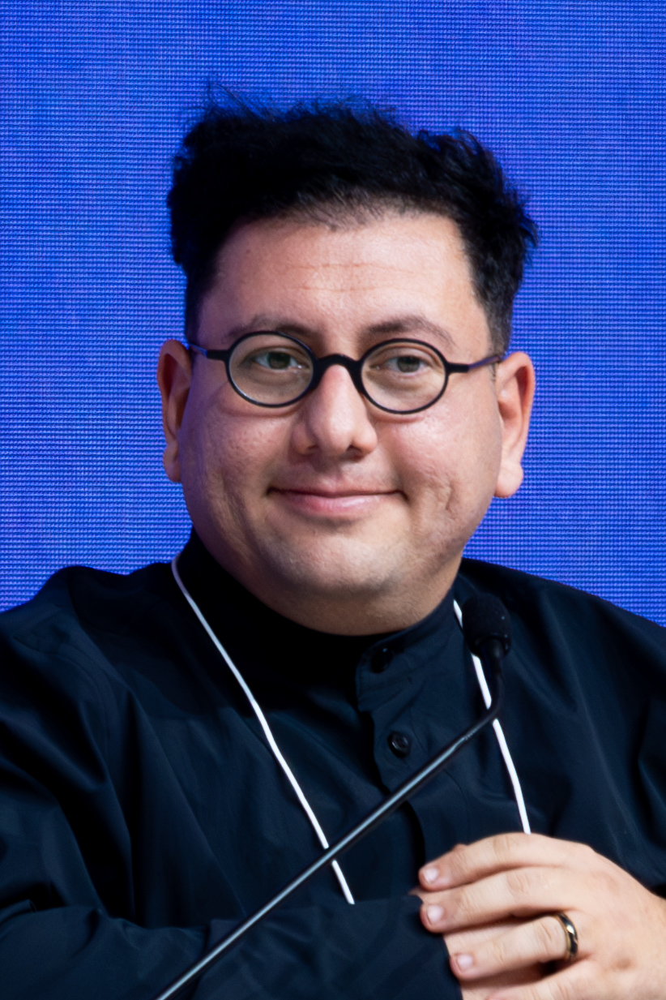
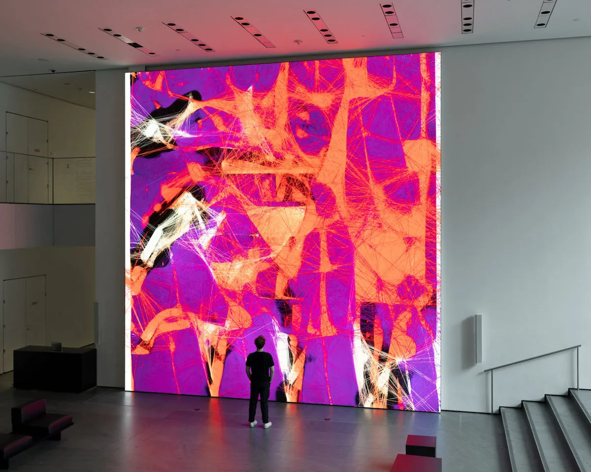

# Рефик Анадол и Архитектура Big Data

**Рефик Анадол** (тур. *Refik Anadol*, род. 1985, Стамбул) — турецко-американский [медиахудожник](https://ru.wikipedia.org/wiki/Медиаискусство), режиссёр и пионер в области использования [больших данных](https://ru.wikipedia.org/wiki/Большие_данные) в качестве художественного материала. Анадол создаёт монументальные вычислительные инсталляции, в которых миллионы файлов данных — архивы музеев, нейронные записи, климатические датасеты, снимки NASA — трансформируются с помощью алгоритмов машинного обучения в текучие, непрерывно меняющиеся визуальные ландшафты. Центральная концепция его практики — **«эстетика данных»** (*data aesthetics*) и **«машинная память»** (*machine memory*): идея о том, что вычислительные системы способны не просто обрабатывать информацию, но обретать нечто аналогичное коллективному воспоминанию и на его основе «галлюцинировать» новые образы. В 2022 году Анадол стал первым художником, чья работа на основе [генеративно-состязательной сети](https://ru.wikipedia.org/wiki/Генеративно-состязательная_сеть) вошла в постоянную коллекцию [Музея современного искусства (MoMA)](https://ru.wikipedia.org/wiki/Музей_современного_искусства_(Нью-Йорк)).

---

## Биография и путь к медиаарту

*Рефик Анадол — медиахудожник, превращающий большие данные в монументальные вычислительные инсталляции, первый художник с генеративным произведением в постоянной коллекции MoMA. Источник: Wikimedia Commons*

Рефик Анадол родился в 1985 году в Стамбуле. По его собственному признанию, решающим импульсом стал просмотр в детстве фильма Стивена Спилберга «Парк Юрского периода» (1993): сцены компьютерной визуализации открыли ему, что данные могут порождать образы, обладающие чувственной силой. Это интуитивное ощущение впоследствии оформилось в полноценную художественную программу.

Академическое образование Анадола разворачивалось одновременно в двух плоскостях — художественной и технологической. Он окончил факультет визуальных коммуникаций Университета Билги (Стамбул), а затем получил степень магистра в Медиаартс-программе Калифорнийского университета в Лос-Анджелесе (UCLA). Именно в Лос-Анджелесе произошла встреча с научным и технологическим сообществом Силиконовой долины, определившая масштаб его амбиций: он начал устанавливать сотрудничества с исследовательскими лабораториями, включая проекты при поддержке Google, Microsoft и NASA.

С 2016 года Анадол работает преподавателем на кафедре дизайна медиаарта в UCLA. В 2019 году он основал **[Refik Anadol Studio](https://refikanadol.com)** в Лос-Анджелесе — мультидисциплинарную команду, объединяющую художников, инженеров машинного обучения, архитекторов данных и дизайнеров. Студия реализует как камерные галерейные работы, так и фасадные проекции на крупнейших зданиях мира — от штаб-квартиры Google в Маунтин-Вью до Гранд-театра в Ла-Корунье.

---

## Метод: данные как художественный материал

### От пикселя к датасету

Традиционный художник работает с материалом, обладающим физическими свойствами: камень сопротивляется резцу, холст принимает краску. Анадол устанавливает принципиально иной тип художественных отношений: его материал — **структурированные массивы данных**, измеряемые миллионами и миллиардами единиц. Эти данные не нейтральны: каждый архивный файл несёт в себе след человеческой деятельности — взгляда, прикосновения, решения.

Рабочий процесс Анадола можно схематично описать в несколько этапов:

1. **Сбор и структурирование данных.** Студия агрегирует датасеты из внешних источников: музейные цифровые архивы (изображения произведений, метаданные выставок), научные базы данных (телескопические снимки NASA, геофизические записи), нейрофизиологические данные (паттерны активности мозга из медицинских исследований), корпоративные и городские данные (трафик, звуки мегаполиса). Одна инсталляция может задействовать от нескольких сотен тысяч до 300 миллионов файлов.

2. **Обучение моделей.** Собранный датасет становится обучающей выборкой для нейросети. Как правило, используются архитектуры [генеративно-состязательных сетей](https://ru.wikipedia.org/wiki/Генеративно-состязательная_сеть) (GAN) или диффузионные модели. Нейросеть обучается воспроизводить и интерполировать паттерны внутри данных — то есть «запоминать» структуру исходного массива.

3. **Генерация и рендеринг.** Обученная модель производит непрерывный поток изображений — латентное пространство, через которое алгоритм перемещается в реальном времени. Анадол называет эти изображения «галлюцинациями машины»: они являются не копиями исходных данных, но тем, что нейросеть «воображает», опираясь на усвоенные паттерны.

4. **Инсталляция.** Видеопоток проецируется на архитектурные поверхности — фасады зданий, стены галерей, гигантские светодиодные экраны. Масштаб намерен: Анадол считает, что данные, затрагивающие цивилизационный уровень, заслуживают монументального воплощения.

### Концепция «data aesthetics»

Анадол формулирует свою теоретическую позицию через понятие **«data aesthetics»** («эстетика данных»). Согласно ей, данные — не просто техническая субстанция, но форма коллективной памяти человечества. Каждый файл в архиве MoMA содержит в себе решение куратора, взгляд посетителя, исторический момент. Когда нейросеть обрабатывает этот архив, она становится своего рода мнемоническим устройством: она «помнит» всё, что было в неё загружено, и это «воспоминание» приобретает видимую форму.

Концепция **«машинной памяти»** (*machine memory*) — производная от этой позиции. Анадол настаивает на том, что нейросетевые системы, прошедшие обучение на достаточно богатых и семантически насыщенных датасетах, формируют нечто аналогичное ассоциативной памяти: не точное хранилище, а пространство связей, аналогий, смещений. Именно этот «неточный», «мечтательный» характер машинного воспроизведения составляет, по Анадолу, эстетическую ценность работы.

---

## Ключевые проекты

| Проект | Год | Место | Датасет |
|---|---|---|---|
| *Melting Memories* | 2017–2018 | EPFL Pavilions (Лозанна); NGV (Мельбурн) | ЭЭГ-записи нейронной активности при воспоминаниях |
| *Archive Dreaming* | 2017 | SALT Galata (Стамбул) | 1,7 млн документов из архива SALT |
| *Machine Hallucinations* | 2019–2022 | Artechouse (Нью-Йорк); MoMA | 300+ млн изображений городских пространств |
| *Unsupervised* | 2022–2023 | MoMA, Нью-Йорк | Полная коллекция MoMA (200 лет искусства) |
| *Dataland* | 2023 | Grand Palais (Париж) | Мультисенсорный архив культурного наследия |
| *Living Archive* | 2021 | Google Los Angeles | Внутренние данные компании и культурные датасеты |

*Рефик Анадол, «Machine Hallucinations» в Artechouse (Нью-Йорк) — монументальная инсталляция, в которой GAN-модель, обученная на 300 миллионах городских фотографий, генерирует непрерывный поток архитектурных «галлюцинаций». Источник: Wikimedia Commons*

### «Melting Memories» (2017–2018)

**«Melting Memories»** («Тающие воспоминания») — серия работ, в которой Анадол обратился к нейрофизиологии как источнику данных. Совместно с исследователями он получил ЭЭГ-записи активности мозга испытуемых, выполнявших задания на вспоминание эпизодических событий. Эти записи — временны́е ряды электрических потенциалов — были использованы как входные данные для алгоритма, генерирующего трёхмерные визуальные структуры.

Результат: непрерывно деформирующиеся объёмные поверхности, напоминающие топографии расплавленного металла или дрейфующих облаков. Работа задаёт вопрос, который её автор считает центральным для всей своей практики: **как выглядело бы воспоминание, если бы его можно было увидеть?** Художник намеренно использует физиологические данные, неинтерпретируемые невооружённым глазом, и передаёт задачу их «перевода» машине — получая образы, претендующие на передачу внутреннего опыта через внешние числовые паттерны.

«Melting Memories» экспонировалась в Национальной галерее Виктории (Мельбурн), Музее Барселоны и на Павильонах EPFL в Лозанне. Работа получила широкое признание как одна из первых удачных попыток создания нейроарта, в котором исходным материалом служит не изображение, а физиологические данные.

### «Machine Hallucinations» (2019–2022)

**«Machine Hallucinations»** («Галлюцинации машины») — наиболее масштабный и тиражируемый проект Анадола. В его основе — датасет из более чем 300 миллионов фотографий городских пространств, собранных из открытых источников и архивов. GAN-модель, обученная на этом корпусе, генерировала непрерывный поток визуальных образов — архитектурных фрагментов, уличных сцен, световых паттернов, — которые проецировались на фасад MoMA в рамках однодневной акции в 2019 году, а затем в расширенной версии — в пространстве арт-центра Artechouse в Нью-Йорке.

В 2022 году работа обрела новое измерение: MoMA приобрёл произведение из этой серии в постоянную коллекцию, сделав его **первым произведением ИИ-арта**, официально вошедшим в собрание крупнейшего музея современного искусства в мире. Это решение стало институциональным прецедентом и спровоцировало широкую дискуссию: что именно приобретает музей, когда покупает программу, порождающую динамическое изображение? Каков статус «оригинала» в контексте вычислительного произведения?

---

## «Unsupervised» в MoMA (2022–2023): живой ИИ как постоянный экспонат

**«Unsupervised»** («Без надзора») — наиболее концептуально амбициозная работа Анадола. С октября 2022 по март 2023 года она существовала в Атриуме MoMA (Нью-Йорк) как **живой, автономно работающий экспонат**: гигантский светодиодный экран размером около 7 × 7 метров, на котором в режиме реального времени работала нейросеть, обученная на полной оцифрованной коллекции музея — произведениях, охватывающих более двух столетий истории искусства.

*Рефик Анадол, «Unsupervised» в атриуме MoMA (октябрь 2022 — март 2023): нейросеть, обученная на всей оцифрованной коллекции музея, в режиме реального времени генерирует образы, реагируя на присутствие посетителей, уровень шума и время суток. Источник: Refik Anadol Studio / MoMA*

Принципиальная особенность работы состоит в слове «без надзора» в названии: алгоритм не воспроизводит конкретные произведения из коллекции и не следует заданному сценарию. Он использует текущие данные из окружающей среды — уровень шума в атриуме, температуру, количество посетителей, время суток — как дополнительные входные параметры, непрерывно корректирующие направление «мечтания». Каждый момент изображения уникален и никогда не повторится.

Анадол описывает «Unsupervised» как попытку ответить на вопрос: **что «видит» нейросеть, когда смотрит на всю историю человеческого визуального искусства?** Машина, обученная на Пикассо, Моне, Уорхоле и тысячах других художников, производит образы, не похожие ни на один из оригиналов, но несущие в себе их суммарный «отпечаток» — текучие цветовые поля, деформированные формы, переходы между стилями, которые человеческий художник никогда не совместил бы в одной работе.

Для MoMA принятие «Unsupervised» имело институциональный смысл, выходящий за рамки эстетики: музей впервые в своей истории разместил в постоянной экспозиции произведение, которое **продолжает создавать себя** в реальном времени, реагируя на присутствие публики. Граница между коллекцией и живым перформансом оказалась принципиально размыта.

---

## Концепция «памяти машины» и дискуссии об ИИ-авторстве

### «Машинная память» как художественная категория

Центральный философский тезис Анадола состоит в следующем: когда нейросеть проходит обучение на достаточно богатом и культурно насыщенном датасете, она формирует нечто, функционально аналогичное памяти. Это не архив в традиционном смысле — точное хранилище файлов, — но **латентное пространство**: многомерная структура, в которой понятия, образы и события существуют не изолированно, но в системе взаимных близостей и расстояний. Воспроизводя содержимое этого пространства, алгоритм «вспоминает» — не точно, но ассоциативно, производя образы, стоящие между оригинальными данными.

Это понимание ставит Анадола в ряд художников, работающих с философией памяти и архива — от Кристиана Болтански с его инсталляциями из одежды и фотографий погибших до Вилема Флюссера с его теорией технических образов. Однако там, где Болтански апеллирует к личной и исторической утрате, Анадол апеллирует к **коллективной памяти цивилизации**, закодированной в данных: музейных архивах, научных базах, городских инфраструктурах.

### Дискуссия об ИИ-авторстве

Приобретение MoMA произведений Анадола и размещение «Unsupervised» в постоянной экспозиции спровоцировали острую дискуссию в художественном сообществе. Критики выдвигают несколько взаимосвязанных аргументов.

**Вопрос авторства.** Если нейросеть генерирует образы автономно, кто является автором произведения — Анадол, написавший код и собравший датасет? Или инженеры, разработавшие архитектуру GAN? Или создатели исходных произведений, чьи образы вошли в обучающую выборку? Анадол позиционирует себя как «архитектора системы», а не её исполнителя — проводя аналогию с дирижёром оркестра или режиссёром фильма, чья роль состоит в организации чужого труда в единое высказывание.

**Вопрос присвоения.** Обучающие датасеты Анадола содержат произведения, часть которых защищена авторским правом. Когда студия работает с архивом MoMA или NASA, юридическая сторона вопроса урегулирована соглашениями с институциями. Однако принцип остаётся спорным: нейросеть «переваривает» чужое творчество, производя нечто новое, — является ли это формой производной работы или самостоятельным актом творчества?

**Вопрос сложности.** Ряд критиков — в частности, искусствовед и художник Лев Манович — указывают, что спектакулярный масштаб работ Анадола может скрывать за собой относительную методологическую простоту: использование стандартных GAN-архитектур на больших датасетах, без принципиальных технических инноваций. С этой точки зрения, художественная ценность работы определяется прежде всего институциональным контекстом и нарративом, а не технологическим содержанием.

Сам Анадол, отвечая на подобную критику, настаивает на том, что художник не обязан быть инженером: Леонардо да Винчи не изобретал пигменты, Ричард Серра не выплавлял сталь. Вопрос состоит не в том, кто создал инструмент, а в том, что художник произносит с его помощью.

### Место в истории медиаарта

Независимо от исхода этих дискуссий, институциональное признание Анадола зафиксировало важный исторический момент: **музеи начали воспринимать ИИ как полноправный художественный медиум**, а не как технологический трюк или иллюстративное средство. «Unsupervised» в MoMA — в одном ряду с такими прецедентами, как первое приобретение видеоарта Нам Джун Пайка или первая музейная экспозиция net.art в конце 1990-х. В каждом из этих случаев институция брала на себя ответственность за легитимацию нового медиума — и тем самым меняла то, что считается искусством.

---

## Смотри также

- [Портал 5: Лабораторное искусство и Эстетика алгоритмов](../README.md)
- [Визуализация нейросетей (OpenAI Microscope)](5.1_nn_visualization.md) — изображения из скрытых слоёв нейросетей как цифровая абстракция
- [Арт-резиденции при IT-гигантах](5.2_art_residencies.md) — сотрудничество художников с Google, Microsoft и другими технологическими корпорациями
- [Марио Клингеманн и генеративные портреты](5.4_mario_klingemann.md) — другой ключевой практик генеративного ИИ-арта; бесконечно генерируемые портреты несуществующих людей
- [Нейронная оборона (Яндекс)](5.5_yandex_neural.md) — ранние эксперименты с генеративными архитектурами в России
- [Алгоритмический крафт](4.5_algorithmic_craft.md) — вычислительные методы в скульптуре и дизайне; Нери Оксман и генеративные формы
- [Промпт-арт (Лингвистическое искусство)](6.1_prompt_art.md) — следующее поколение практик: текст как инструмент управления генеративными системами
- [Рефик Анадол](https://en.wikipedia.org/wiki/Refik_Anadol) — статья в Wikipedia (англ.)
- [Генеративно-состязательная сеть](https://ru.wikipedia.org/wiki/Генеративно-состязательная_сеть) — Википедия
- [Музей современного искусства (Нью-Йорк)](https://ru.wikipedia.org/wiki/Музей_современного_искусства_(Нью-Йорк)) — Википедия
- [Медиаискусство](https://ru.wikipedia.org/wiki/Медиаискусство) — Википедия
- [Большие данные](https://ru.wikipedia.org/wiki/Большие_данные) — Википедия

---

Авторы: Тимофей Береговин;

*Ресурсы: LLM — Claude Sonnet 4.6*
