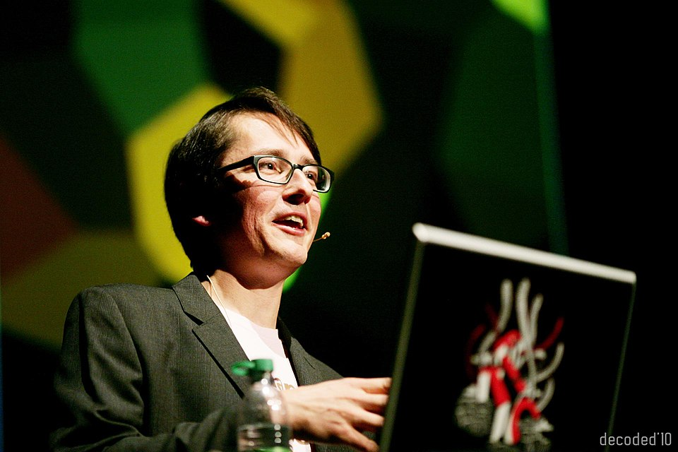
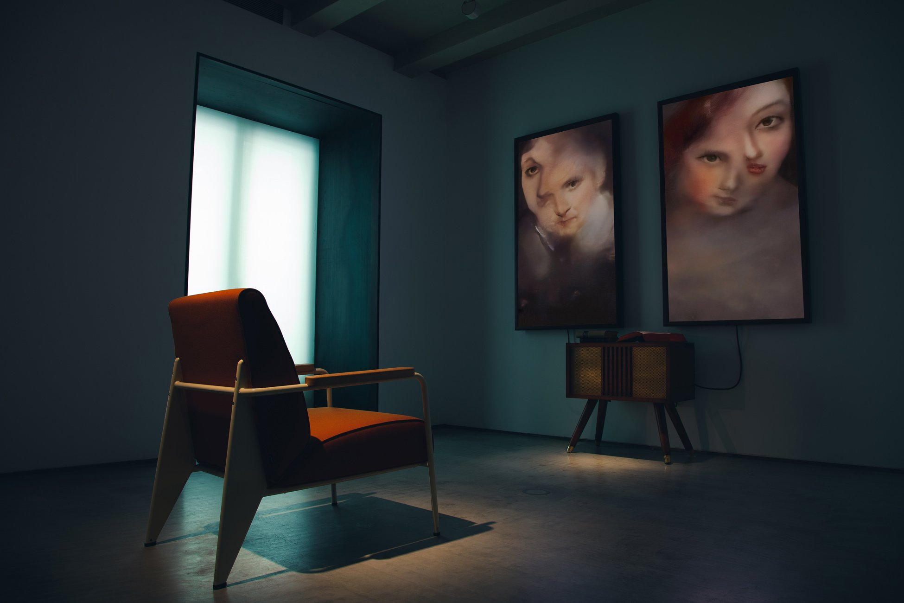

# [Марио](../../../7.2 Media, leisure and hobbies/Computer games/articles/how_it_all_started/crisis_and_resurrection.md) Клингеманн и генеративные портреты

**Марио Клингеманн** (нем. Mario Klingemann; псевдоним — **Quasimondo**; род. 1970, Германия) — немецкий [художник](../../../7.2 Media, leisure and hobbies/Computer games/articles/dream_team/artist.md), [пионер](1.2_nam_june_paik.md) [генеративного искусства](https://en.wikipedia.org/wiki/Generative_art) с использованием нейросетей. Получил широкую известность благодаря исследованию [генеративно-состязательных сетей](https://ru.wikipedia.org/wiki/Генеративно-состязательная_сеть) ([GAN](3.3_deepfake_art.md)) как инструмента создания изображений. В своей практике рассматривает [искусственный интеллект](../../../1.2_natural_sciences/physics_in_everyday_life/Q11023.md) не как инструмент художника, но как **автономного творца** — систему, способную к самостоятельному визуальному высказыванию вне зависимости от прямого авторского вмешательства. Один из первых художников, чья [работа](../../../1.2_natural_sciences/physics_in_everyday_life/Q11382.md) с ИИ-генерацией в реальном времени была выставлена на аукцион [Sotheby's](https://ru.wikipedia.org/wiki/Sotheby%27s).

---

## Биография: от рекламы к нейросетевому искусству

*Марио Клингеманн (Quasimondo) — художник, исследующий [нейросети](../../../2.1_society/cause_and_effect_relationships/articles/ai_causality.md) как автономных творцов и создавший первое ИИ-произведение, проданное на аукционе Sotheby's. [Источник](../../../5.1_technology_and_digital_literacy/information and media literacy/дезинформация_и_фейки.md): Wikimedia Commons*

Марио Клингеманн начинал карьеру в рекламной и медиаиндустрии, работая с флэш-анимацией и компьютерной графикой. Профессиональный [опыт](../../../1.2_natural_sciences/why_science_help_understand_world/experimental_science.md) в цифровых [медиа](../../../5.1_technology_and_digital_literacy/information and media literacy/как_устроена_современная_информационная_среда.md) сформировал у него устойчивый [интерес](../../../1.2_natural_sciences/neurobiology_for_teens/articles/19_curiosity.md) к алгоритмическим процессам и к тому, как машины «видят» и интерпретируют визуальный мир. В нулевые годы он активно экспериментировал с процедурной генерацией изображений, публикуя [результаты](../../../1.2_natural_sciences/why_science_help_understand_world/research_work.md) под псевдонимом Quasimondo — именем, отсылающим к горбуну Квазимодо из романа Виктора Гюго, что несёт в себе определённую авторскую иронию: «урод» как первооткрыватель красоты нестандартных форм.

С появлением глубокого обучения и архитектуры [генеративно-состязательных сетей](https://ru.wikipedia.org/wiki/Генеративно-состязательная_сеть) (GAN), предложенной Иэном Гудфеллоу в 2014 году, Клингеманн одним из первых в художественном сообществе осознал художественный потенциал этой [технологии](../../../2.2_history/world_economy_on_fingers/articles/globalizatsiya.md). Если большинство исследователей воспринимали GAN как инженерный инструмент для генерации синтетических данных, Клингеманн увидел в них нечто принципиально иное: систему, способную создавать образы, которые никогда не существовали, — и делать это непрерывно, без устали, без повторений.

Начиная с середины 2010-х годов он систематически участвует в крупнейших выставках и фестивалях медиаискусства: [Ars Electronica](https://ars.electronica.art) (Линц), [ZKM Center for Art and Media](https://zkm.de) (Карлсруэ), [Barbican Centre](https://www.barbican.org.uk) ([Лондон](../../../2.2_history/world_economy_on_fingers/articles/funt_sterlingov.md)). С 2017 года работает в качестве приглашённого исследователя в [Google Arts & Culture](5.2_art_residencies.md) — одной из наиболее значимых [арт-резиденций при IT-гигантах](5.2_art_residencies.md), где инженеры и художники исследуют возможности машинного обучения в совместных экспериментах. Этот опыт непосредственной [работы](../../../8.2_future/choosing_a_career_path/articles/interview.md) с исследовательской инфраструктурой крупной технологической корпорации оказал значительное [влияние](../../../5.1_technology_and_digital_literacy/information and media literacy/манипуляции_и_пропаганда.md) на его [метод](../../../5.1_technology_and_digital_literacy/how_internet_works/articles/http_https/http_https.md): доступ к производительным вычислительным ресурсам позволил реализовывать масштабные проекты с обучением нейросетей на больших наборах изображений.

---

*Марио Клингеманн, «Memories of Passersby I» (2018–2019): два монитора в деревянных рамах бесконечно генерируют портреты несуществующих людей — каждое лицо существует лишь мгновение и никогда не повторится. В 2019 году продано на аукционе Sotheby's за £40 000. Источник: Mario Klingemann*

## «Memories of Passersby I» — бесконечный портрет незнакомца

### Описание инсталляции

**«Memories of Passersby I»** («[Воспоминания](../../../1.2_natural_sciences/neurobiology_for_teens/articles/21_how_memory_works.md) прохожих I», 2018–2019) — медиаинсталляция, ставшая наиболее известной [работой](../../../8.2_future/choosing_a_career_path/articles/interview.md) Клингеманна и переломным событием в истории ИИ-искусства. Инсталляция состоит из двух вертикальных мониторов в деревянных рамах, напоминающих классические галерейные портреты, и скрытого под ними блока компьютерного оборудования. На каждом экране — лицо человека: меняющееся, текущее, никогда не останавливающееся ни на одном образе более чем на долю секунды.

Работа не воспроизводит заранее созданный видеофайл. Она **генерирует изображения в реальном времени**, без остановки, без повторений — до тех пор, пока включено [питание](../../../3.1. healthy lifestyle/Sleep, nutrition, and adolescent energy/articles/breakfast_for_the_brain.md). Каждое лицо на экране существует лишь мгновение: оно никогда не существовало раньше и никогда не появится снова. [Зритель](1.3_participatory_art.md) наблюдает непрерывный [поток](../../../5.1_technology_and_digital_literacy/operating system/articles/thread.md) несуществующих людей — «прохожих», которых невозможно [запомнить](../../../4.1_rules_of_study/how_to_memorize/articles/zapominanie.md), потому что они исчезают раньше, чем успеваешь их рассмотреть.

### Технология: два GAN в диалоге

Технологическую основу инсталляции составляют **две независимые [генеративно-состязательные сети](https://ru.wikipedia.org/wiki/Генеративно-состязательная_сеть)**, каждая из которых отвечает за один монитор. Архитектура GAN предполагает одновременное [обучение](../../../3.1. healthy lifestyle/Sleep, nutrition, and adolescent energy/articles/sleep_and_memory_grades.md) двух нейросетей: **генератора**, создающего синтетические изображения, и **дискриминатора**, пытающегося отличить их от реальных. В процессе соревновательного обучения генератор постепенно учится создавать изображения, неотличимые от тренировочных данных.

Клингеманн обучил свои сети на обширном корпусе классической портретной живописи — произведениях европейских мастеров XVI–XIX веков. Это [решение](../../../2.1_society/cause_and_effect_relationships/articles/personal_choice.md) принципиально: результирующие образы несут в себе не фотографический реализм, но **живописную трактовку лица** — мерцающую, плавно перетекающую, как будто художник бесконечно переписывает один и тот же портрет. Два монитора с двумя независимыми GAN создают эффект удвоения: зритель одновременно наблюдает за двумя потоками несуществующих лиц, которые никогда не синхронизируются и никогда не встретятся.

Важным техническим аспектом является **отсутствие промежуточного хранения**: система не создаёт изображения заранее и не воспроизводит их из [базы данных](2.2_heath_bunting.md). Каждый [кадр](../../../../8.1_entertainment/articles/director.md) генерируется непосредственно в момент отображения — за счёт непрерывного прохода через генераторную [сеть](../../../5.1_technology_and_digital_literacy/how_internet_works/articles/history/internet_history.md). Это означает, что инсталляция принципиально невоспроизводима: два показа никогда не будут идентичны.

### Смысл и художественный [контекст](../../../5.1_technology_and_digital_literacy/information and media literacy/геолокация_и_проверка_контекста.md)

«Memories of Passersby I» существует в точке пересечения нескольких художественных традиций. Формально — это **портрет**, один из старейших жанров западной живописи; но это портрет, лишённый субъекта. Классический портрет документирует конкретного человека, закрепляет его [образ](../../../7.2 Media, leisure and hobbies/Computer games/articles/game_culture/cosplay.md) во времени. Портрет Клингеманна делает противоположное: он непрерывно порождает лица, которых нет, и немедленно их стирает.

Название работы апеллирует к **[памяти](../../../4.1_rules_of_study/how_to_memorize/articles/pamyat.md)** — но к памяти машины, а не человека. Нейросеть, обученная на тысячах портретов, «помнит» их все одновременно: не как конкретные образы, но как статистическую структуру, из которой она генерирует бесконечные вариации. Это своеобразная «коллективная [память](../../../3.1. healthy lifestyle/Sleep, nutrition, and adolescent energy/articles/sleep_and_memory_grades.md)» живописной [традиции](../../../2.1_society/cause_and_effect_relationships/articles/why_rules_work.md) — дистиллированная, обезличенная, превращённая в непрерывный поток.

В контексте [визуализации нейросетей](5.1_nn_visualization.md) работа Клингеманна примечательна тем, что делает видимым не внутреннее [устройство](../../../1.2_natural_sciences/physics_in_everyday_life/Q178032.md) сети, но **[результат](../../../1.2_natural_sciences/why_science_help_understand_world/experimental_science.md) её автономной активности** — бесконечное порождение образов без внешнего запроса, без конкретной [цели](../../../3.1_healthy_lifestyle/pervaya_pomoshch/ushibi_porezy_ozhogi/02_celi_pervoy_pomoshchi.md), как будто нейросеть «думает вслух».

### Аукцион Sotheby's (2019)

В феврале 2019 года «Memories of Passersby I» была выставлена на торги [Sotheby's](https://ru.wikipedia.org/wiki/Sotheby%27s) в Лондоне в рамках торгов «Curiosity: Art & Science Collectibles». Лот стал **первым в истории аукциона Sotheby's произведением ИИ-искусства, генерируемого в реальном времени**. Работа была продана за 40 000 фунтов стерлингов (около 51 000 долларов США) — результат, значительно превысивший предварительный эстимейт. Продажа зафиксировала институциональное признание ИИ-арта как самостоятельного художественного жанра и обозначила принципиальное отличие от более ранних прецедентов: в отличие от фиксированных цифровых отпечатков, покупатель приобрёл **живую систему** — физический [объект](../../../1.2_natural_sciences/physics_in_everyday_life/Q634.md) с работающим оборудованием, генерирующим уникальные изображения бесконечно.

---

## ИИ как автономный творец: философский вопрос об авторстве

Центральным теоретическим вопросом, который ставит творческая [практика](../../../1.2_natural_sciences/physics_in_everyday_life/Q124003.md) Клингеманна, является вопрос **авторства**: кто является автором произведения, если его визуальное содержание создаётся нейросетью без прямого участия человека в момент создания?

Клингеманн последовательно придерживается [позиции](../../musical_instruments/articles/trombone.md), согласно которой ИИ в его [работах](../../../8.2_future/choosing_a_career_path/articles/interview.md) выступает **не инструментом, но соавтором или самостоятельным агентом**. Художник сравнивает свою роль с ролью дрессировщика или куратора: он формирует условия, в которых система обучается и работает, выбирает тренировочные [данные](../../../2.1_society/cause_and_effect_relationships/articles/ai_causality.md), задаёт архитектурные параметры — но не управляет конкретными образами, которые система порождает. «Я не рисую эти лица. Я создаю систему, которая их рисует», — формулирует художник свою позицию.

Эта позиция противоречит традиционному пониманию авторства в западном искусстве, восходящему к романтической концепции художника как уникального творческого субъекта. Если принять [аргумент](../../../5.1_technology_and_digital_literacy/information and media literacy/критическое_мышление_в_онлайн_среде.md) Клингеманна, то произведение создаётся **агентом, лишённым субъективности** — статистической моделью, не обладающей намерением, опытом или сознанием. Ряд критиков возражает: подлинным автором остаётся художник, поскольку именно он принял все ключевые решения до начала генерации. Клингеманн парирует: то же самое можно сказать о природе, создающей [кристаллы](../../../1.2_natural_sciences/physics_in_everyday_life/Q11469.md) или снежинки, — но мы не называем природу художником.

Эта [дискуссия](../../../4.2_thinking_and_working_information/critical_thinking/articles/logical_errors_and_sophisms.md) напрямую перекликается с вопросами, которые поднимает [Рефик Анадол](5.3_refik_anadol.md) в своих монументальных инсталляциях с [Big Data](5.3_refik_anadol.md): где проходит граница между художественным замыслом и алгоритмическим исполнением? Если у Анадола нейросеть является «воспоминательной машиной», интерпретирующей архивы данных по заданию художника, то у Клингеманна она ближе к **автономному агенту**, запущенному и предоставленному самому себе.

Правовой аспект этой проблематики остаётся нерешённым: законодательство большинства стран не предусматривает авторства за юридически нелицеспособными объектами, включая программные системы. Произведения, созданные ИИ без «творческого вклада» человека, формально не охраняются авторским правом — что создаёт принципиальный парадокс для рынка ИИ-искусства.

---

## Другие проекты

| Название | Год | Описание |
|---|---|---|
| **Neurography** | [2016](5.5_yandex_neural.md)–2017 | Серия экспериментов с ранними GAN: трансформации человеческих лиц и тел в сюрреалистические гибриды. Публиковались в Twitter (X), собрав широкую аудиторию подписчиков в академическом и художественном сообществе. |
| **Neural Zoo** | 2017 | Коллекция изображений существ, синтезированных нейросетью на основе животных и текстур. [Исследование](../../../1.2_natural_sciences/neurobiology_for_teens/articles/19_curiosity.md) латентного пространства как «зверинца» несуществующих форм. |
| **Appropriate Response** | 2017 | Система, генерирующая автоматические ответы на [комментарии](../../../4.2_thinking_and_working_information/how_to_search_information/articles/cooperative_work.md) в социальных сетях, обученная на паттернах риторических стратегий. [Критика](../../../8.1_self-understanding/HowToFindYourStrengths/articles/impostor_syndrome.md) алгоритмических систем модерации и автоматизированного общения. |
| **The Butcher's Son** | 2017 | Победитель конкурса LUX Moving Image Award (Лондон). ИИ-видео с бесконечной трансформацией человеческого тела — одна из первых работ художника, получивших премию крупного институционального конкурса. |
| **Мозаичные вирусы** | 2015–2016 | Ранние работы с клеточными автоматами и процедурной генерацией текстур, напоминающих биологические структуры под микроскопом. Предшествовали переходу к глубокому обучению. |

---

## Botto — DAO-художник как коллективный ИИ-творец

В 2021 году Марио Клингеманн выступил одним из ключевых разработчиков проекта **[Botto](https://botto.com)** — принципиально новой формы ИИ-художника, функционирующего как [децентрализованная автономная организация](https://en.wikipedia.org/wiki/Decentralized_autonomous_organization) (DAO).

Концепция Botto радикально переосмысляет вопрос авторства, с которым работают все проекты Клингеманна. Если в «Memories of Passersby I» художник создаёт автономную систему и предоставляет ей действовать самостоятельно, то Botto передаёт часть управления этой системой **сообществу держателей токенов**. Архитектура проекта такова: нейросеть еженедельно генерирует сотни изображений; [сообщество](../../../2.1_society/how_and_where_find_friends/articles/druzhba_s_sosedyami.md) участников голосует за наиболее ценные из них, используя токены $BOTTO; победившие работы чеканятся как [NFT](https://ru.wikipedia.org/wiki/Невзаимозаменяемый_токен) и выставляются на аукцион; вырученные средства частично реинвестируются в [развитие](../../../3.1. healthy lifestyle/Sleep, nutrition, and adolescent energy/articles/micronutrients_and_teenagers.md) системы, частично распределяются между участниками.

Принципиальный механизм: результаты голосования **возвращаются в систему как [обратная связь](../../../8.1_self-understanding/HowToFindYourStrengths/articles/objective_view.md)**. Нейросеть обучается на предпочтениях сообщества, постепенно смещая свой «художественный [вкус](../../../1.2_natural_sciences/neurobiology_for_teens/articles/10_sweet_tooth.md)» в сторону образов, которые участники находят наиболее ценными. Таким образом, Botto не просто генерирует [искусство](../../../7.2 Media, leisure and hobbies /what_you_can_read_and_watch_to_develop_your_taste/articles/aesthetics_and_taste.md) — он **развивается** под влиянием коллективного эстетического суждения тысяч людей. Это создаёт принципиально новую сущность: ИИ-художника, чья идентичность формируется децентрализованным сообществом, а не единственным автором.

Критики указывают на внутреннее [противоречие](../../../2.1_society/cause_and_effect_relationships/articles/conflict_roots.md): механизм обратной связи неизбежно толкает систему к производству образов, наиболее приятных большинству, — то есть к усреднению и китчу. Сторонники возражают, что Botto демонстрирует принципиально новую модель авторства — **коллективного, распределённого, динамического**, — в которой традиционное понятие художника как индивидуального субъекта уступает место алгоритмическому посреднику между машинным творчеством и человеческим вкусом.

К 2024 году Botto продал работы на сумму свыше 4 миллионов долларов, а его сообщество насчитывает несколько тысяч активных участников. [Проект](../../../1.2_natural_sciences/why_science_help_understand_world/research_work.md) остаётся одним из наиболее масштабных экспериментов на пересечении ИИ-искусства, криптоэкономики и [децентрализованных автономных организаций](https://en.wikipedia.org/wiki/Decentralized_autonomous_organization).

---

## Смотри также

- [Портал 5: Лабораторное искусство и Эстетика алгоритмов](../README.md)
- [Визуализация нейросетей (OpenAI Microscope)](5.1_nn_visualization.md) — внутренние представления нейросетей как абстрактная живопись
- [Арт-резиденции при IT-гигантах](5.2_art_residencies.md) — институциональный контекст взаимодействия технологических компаний и художников
- [Рефик Анадол и Архитектура Big Data](5.3_refik_anadol.md) — монументальные GAN-инсталляции и Big Data как скульптурный [материал](../../../1.2_natural_sciences/physics_in_everyday_life/Q25358.md)
- [Нейронная оборона (Яндекс)](5.5_yandex_neural.md) — ранние эксперименты с нейросетями в российском медиаискусстве
- [Промпт-арт (Лингвистическое искусство)](6.1_prompt_art.md) — [текст](../../../4.1_rules_of_study/how_to_learn_effectively/articles/reading_skills.md) как инструкция для ИИ-генерации
- [Латентное пространство и Феномен Loab](6.2_latent_space.md) — «подсознание» нейросетей и его художественное исследование
- [Генеративное искусство](https://en.wikipedia.org/wiki/Generative_art) — [Wikipedia](../../../4.2_thinking_and_working_information/how_to_search_information/articles/wikipedia.md)
- [Генеративно-состязательная сеть](https://ru.wikipedia.org/wiki/Генеративно-состязательная_сеть) — [Википедия](../../../4.2_thinking_and_working_information/how_to_search_information/articles/wikipedia.md)
- [NFT](https://ru.wikipedia.org/wiki/Невзаимозаменяемый_токен) — Википедия
- [Децентрализованная автономная организация](https://en.wikipedia.org/wiki/Decentralized_autonomous_organization) — Wikipedia
- [Sotheby's](https://ru.wikipedia.org/wiki/Sotheby%27s) — Википедия

---

Авторы: Тимофей Береговин;

*[Ресурсы](../../../2.1_society/cause_and_effect_relationships/articles/ecological_footprint.md): [LLM](../README.md) — Claude Sonnet 4.6*
