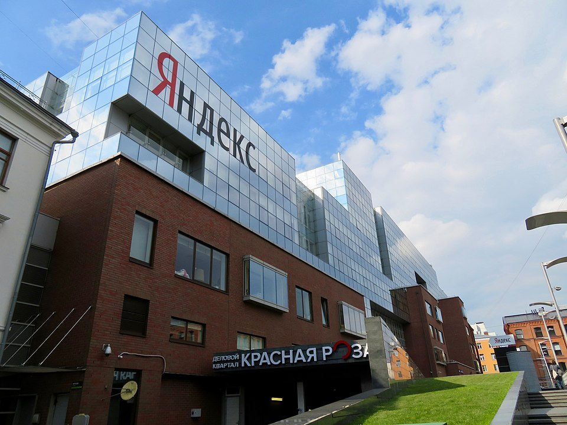
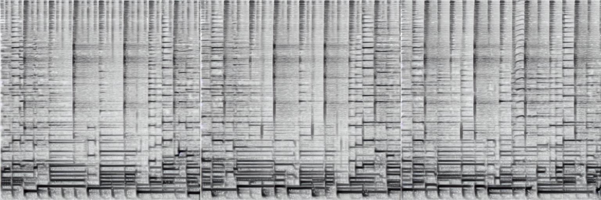

# Нейронная оборона (Яндекс)

**«Нейронная оборона»** — музыкальный проект, реализованный командой [Яндекса](https://ru.wikipedia.org/wiki/Яндекс) в 2016 году: рекуррентная нейронная сеть архитектуры [LSTM](https://ru.wikipedia.org/wiki/Долгая_краткосрочная_память) была обучена на текстах песен [Егора Летова](https://ru.wikipedia.org/wiki/Летов,_Егор_Фёдорович) — лидера сибирской панк-рок-группы [«Гражданская оборона»](https://ru.wikipedia.org/wiki/Гражданская_оборона_(группа)) — и сгенерировала корпус оригинальной поэзии, на основе которого был создан полноценный музыкальный альбом. Проект стал одним из первых резонансных примеров алгоритмической генерации музыки и лирики в русскоязычном культурном пространстве и породил широкую общественную дискуссию об этике использования творческого наследия умершего художника.

---

## Контекст: Егор Летов и «Гражданская оборона»

*Главный офис Яндекса в Москве — технологической компании, чья команда в 2016 году обучила рекуррентную нейросеть на текстах Егора Летова и выпустила полноценный ИИ-альбом. Источник: Wikimedia Commons*

[Егор Летов](https://ru.wikipedia.org/wiki/Летов,_Егор_Фёдорович) (1964–2008) — поэт, музыкант и продюсер, основавший в 1984 году в Омске группу [«Гражданская оборона»](https://ru.wikipedia.org/wiki/Гражданская_оборона_(группа)), которая на протяжении почти четверти века оставалась главным явлением русского андеграундного панка. Тексты Летова отличаются исключительной самобытностью: в них переплетаются образы советского абсурда, нигилистической лирики, отсылки к Хармсу, Крученых и народным частушкам, экзистенциальный надрыв и намеренно деструктивная фонетика. Группа выпустила более двадцати студийных альбомов и сформировала вокруг себя устойчивую субкультуру — поклонники «Гражданской обороны» отличаются особой преданностью и ревностным отношением к наследию лидера.

Летов скончался в феврале 2008 года от сердечной недостаточности. После его смерти права на тексты и музыку перешли к его вдове Натальи Чумаковой — бас-гитаристке группы и соратнице на протяжении последних полутора десятилетий жизни Летова. Корпус его текстов — несколько сотен песен, публичные интервью, стихи — к середине 2010-х годов был широко представлен в открытом доступе в сети, что делало его технически пригодным учебным материалом для языковых моделей.

---

*Визуализация аудиоволны ИИ-сгенерированной музыкальной композиции в стиле босса-нова с электрогитарой — наглядное представление того, как алгоритмы преобразуют статистические паттерны в звук. Источник: Wikimedia Commons*

## Техническая реализация

### Архитектура: LSTM

Нейронная сеть, использованная в проекте, относится к классу **рекуррентных нейронных сетей** (RNN) с архитектурой **LSTM** (*Long Short-Term Memory* — долгая краткосрочная память). LSTM была предложена Зеппом Хохрайтером и Юргеном Шмидхубером в 1997 году и к середине 2010-х годов являлась основным инструментом для задач генерации последовательностей — текстов, мелодий, речи. В отличие от простых RNN, LSTM оснащена «ячейками памяти» с управляемыми вентилями (забывания, ввода, вывода), что позволяет сети удерживать долгосрочные зависимости: помнить рифмическую схему, повторяющийся образ или характерную синтаксическую конструкцию на протяжении многих строк.

В 2016 году [генеративное искусство](https://en.wikipedia.org/wiki/Generative_art) на основе LSTM переживало период активного освоения: широкую известность получил эксперимент Андрея Карпатого (2015), обучившего LSTM на произведениях Шекспира и коде Linux. Именно этот подход лёг в основу яндексовского проекта, адаптированного для русскоязычного поэтического материала.

### Обучающая выборка

Обучающий корпус формировался из текстов песен «Гражданской обороны» и сольных альбомов Летова, доступных в открытом доступе. Тексты обрабатывались на уровне символов (*character-level* модель): сеть обучалась предсказывать следующий символ, опираясь на предшествующую последовательность. Такой подход позволял модели «усвоить» не только лексику Летова, но и его характерные графические приёмы — намеренные орфографические деформации, строчные буквы в начале строф, специфическую пунктуацию.

Ключевая сложность состояла в относительно небольшом объёме корпуса: тексты одного поэта, пусть и плодовитого, существенно уступают по размеру корпусам, на которых обучались крупные языковые модели того времени. Это делало результат одновременно более «узнаваемым» стилистически и более склонным к дословному воспроизведению фрагментов оригинала — явление, впоследствии получившее название «мемориализации» (memorization) в исследованиях по безопасности больших языковых моделей.

### Генерация текстов и музыки

Тексты генерировались путём последовательной выборки символов с заданной «температурой» — параметром, регулирующим случайность предсказаний. При низкой температуре модель воспроизводила наиболее статистически вероятные продолжения, приближаясь к оригиналу; при высокой — порождала более неожиданные, но менее связные последовательности. Финальный отбор строк для альбома производился людьми: редакторы и музыканты отбирали наиболее художественно состоятельные фрагменты из сгенерированного массива.

Музыкальная составляющая альбома создавалась уже средствами живой аранжировки: реальные музыканты, работавшие в жанре панк-рок, положили на музыку отобранные нейросетевые тексты, намеренно воспроизводя звуковую эстетику «Гражданской обороны» — перегруженную гитару, характерную хрипловатую манеру исполнения, плотное студийное звучание. Таким образом, итоговый продукт представлял собой гибрид: лирика — алгоритмическая, аранжировка и исполнение — человеческие.

---

## Результат: альбом «Нейронная оборона» (2016)

Альбом был представлен публично в 2016 году и получил немедленный, но неоднозначный отклик. Часть слушателей отметила, что тексты обладают узнаваемой «летовской» интонацией: абсурдистские образы, характерные инверсии, игра с советской лексикой. Поклонники указывали на отдельные строфы, которые могли бы органично войти в оригинальный альбом группы.

Критики же подчёркивали принципиальные ограничения: сеть воспроизводила поверхностные статистические паттерны, но не могла передать смысловое напряжение, которое у Летова возникало из осознанного столкновения несовместимых культурных пластов. Генерированные тексты нередко производили впечатление «сна о Летове» — визуально похожего, но лишённого внутренней логики. Ряд музыкальных журналистов сформулировал это как разницу между **стилем** и **голосом**: нейросеть научилась стилю, но голос остался недостижим.

Медийный резонанс проекта оказался несоразмерно большим по сравнению с его художественными достижениями: «Нейронная оборона» превратилась в точку публичного разговора о пределах машинного творчества, правах на наследие и природе авторской идентичности. Проект широко освещался в технологических и культурных изданиях и стал обязательной ссылкой в русскоязычных текстах об ИИ и искусстве второй половины 2010-х годов.

---

## Этические и правовые вопросы

### Права на образ умершего художника

Проект «Нейронная оборона» обострил вопрос, не имевший на тот момент ни юридического, ни этического консенсуса: вправе ли третьи лица использовать творческое наследие умершего художника для обучения генеративных моделей без согласия правообладателей?

С точки зрения действующего на тот момент российского законодательства об [интеллектуальной собственности](https://ru.wikipedia.org/wiki/Интеллектуальная_собственность), тексты песен Летова охранялись авторским правом, которое наследуется. Формально обучение нейросети на охраняемых текстах с последующей коммерческой публикацией результата могло квалифицироваться как нарушение исключительных прав. Однако в 2016 году эта правовая зона оставалась фактически неурегулированной: ни прецедентной судебной практики, ни специальных нормативных актов применительно к обучению машинных моделей на охраняемых произведениях не существовало ни в России, ни в большинстве других юрисдикций.

Юридическое измерение дополнялось этическим: использование образа конкретного художника — не абстрактного «поэта», а фигуры с отчётливой политической биографией и системой убеждений — ставило вопрос о посмертном согласии. Художник не мог высказаться о том, одобрил бы он подобный эксперимент; интерпретировать его прижизненные взгляды в этом отношении было крайне затруднительно.

### Реакция наследников и сообщества

Наталья Чумакова, вдова и правообладательница, публично выразила несогласие с проектом: по её словам, использование текстов без разрешения наследников противоречит её позиции об охране наследия. Это сделало «Нейронную оборону» одним из первых публичных споров вокруг посмертного цифрового образа художника в русскоязычном пространстве.

Реакция слушателей разделилась. Часть аудитории восприняла проект с интересом — как технологический эксперимент. Другая часть отнеслась к нему критически, считая недопустимым воспроизведение авторского стиля без согласия правообладателей.

Этот конфликт предвосхитил волну аналогичных споров, разгоревшихся в мире позднее — вокруг [цифрового клонирования голоса](6.4_holly_herndon.md) и посмертных ИИ-реконструкций музыкантов.

---

## В контексте русскоязычного AI-арта

«Нейронная оборона» была не единственным и не первым экспериментом с генерацией текстов на русскоязычном классическом материале, однако именно она получила наибольший общественный резонанс в силу культурного статуса Летова.

Параллельно и вскоре после проекта Яндекса в русскоязычном интернете появился ряд аналогичных экспериментов. Нейросети обучались на текстах Александра Пушкина: сгенерированные «онегинские строфы» распространялись в социальных сетях и вызывали сдержанный академический интерес — отчасти потому, что Пушкин перешёл в общественное достояние, а его канонический статус делал имитацию культурно безопасной. Схожие эксперименты ставились на текстах Владимира Маяковского, Велимира Хлебникова и Осипа Мандельштама. Во всех этих случаях LSTM-модели успешно воспроизводили ритмику и характерную образность оригиналов, однако исследователи неизменно отмечали ту же проблему: алгоритм улавливал форму, но не семантическое напряжение.

Общим контекстом для всех этих проектов служило глобальное оживление интереса к рекуррентным сетям после того, как в 2014–2015 годах стали широко доступны библиотеки Theano и TensorFlow, снизившие порог входа в эксперименты с LSTM до уровня энтузиастов. «Нейронная оборона» была прямым продуктом этой демократизации инструментов — и одновременно наглядной демонстрацией её культурных рисков.

В более широком международном контексте проект стоит в одном ряду с экспериментами над [Марио Клингеманном](5.4_mario_klingemann.md) и другими художниками, исследовавшими генеративные нейросети как самостоятельную художественную практику, а также с деятельностью [арт-резиденций при IT-гигантах](5.2_art_residencies.md), институционализировавших подобные эксперименты.

---

## Смотри также

- [Портал 5: Лабораторное искусство и Эстетика алгоритмов](../README.md)
- [Визуализация нейросетей (OpenAI Microscope)](5.1_nn_visualization.md) — инструменты отладки ИИ как самостоятельная эстетическая форма
- [Арт-резиденции при IT-гигантах](5.2_art_residencies.md) — институциональный контекст взаимодействия технологических компаний и художников
- [Рефик Анадол и Архитектура Big Data](5.3_refik_anadol.md) — монументальные вычислительные инсталляции на основе данных
- [Марио Клингеманн и генеративные портреты](5.4_mario_klingemann.md) — другой ключевой пример автономного художественного ИИ середины 2010-х
- [Цифровое клонирование голоса (Холли Херндон / Spawn)](6.4_holly_herndon.md) — развитие темы посмертного и прижизненного цифрового образа художника

**Внешние ссылки:**
- [Егор Летов — Википедия](https://ru.wikipedia.org/wiki/Летов,_Егор_Фёдорович)
- [Гражданская оборона — Википедия](https://ru.wikipedia.org/wiki/Гражданская_оборона_(группа))
- [LSTM (Долгая краткосрочная память) — Википедия](https://ru.wikipedia.org/wiki/Долгая_краткосрочная_память)
- [Яндекс — Википедия](https://ru.wikipedia.org/wiki/Яндекс)
- [Генеративное искусство — Wikipedia](https://en.wikipedia.org/wiki/Generative_art)
- [Интеллектуальная собственность — Википедия](https://ru.wikipedia.org/wiki/Интеллектуальная_собственность)

---

Авторы: Тимофей Береговин;

*Ресурсы: LLM — Claude Sonnet 4.6*
