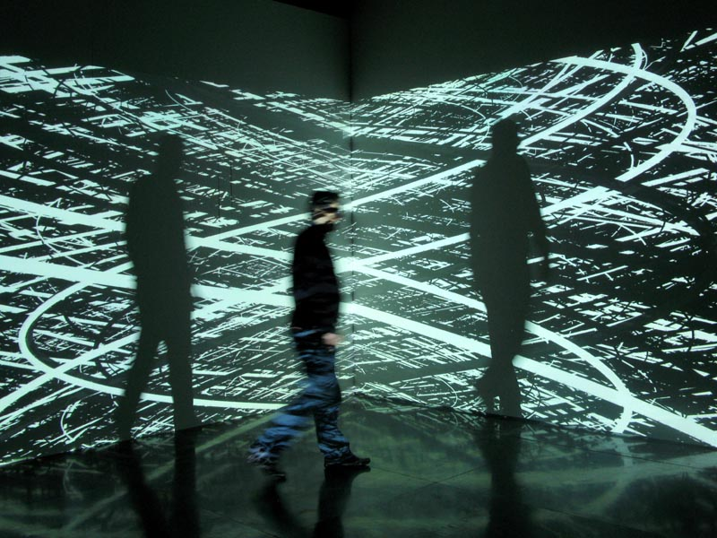

# Промпт-арт (Лингвистическое [искусство](../../../7.2 Media, leisure and hobbies /what_you_can_read_and_watch_to_develop_your_taste/articles/aesthetics_and_taste.md))

**Промпт-арт** (*prompt art*, также **лингвистическое искусство**) — художественная [практика](../../../1.2_natural_sciences/physics_in_everyday_life/Q124003.md), в которой главным инструментом создания визуального, звукового или текстового произведения является текстовая инструкция (промпт), адресованная генеративной [нейросети](../../../2.1_society/cause_and_effect_relationships/articles/ai_causality.md). В отличие от традиционных цифровых [медиа](../../../5.1_technology_and_digital_literacy/information and media literacy/как_устроена_современная_информационная_среда.md), где [художник](../../../7.2 Media, leisure and hobbies/Computer games/articles/dream_team/artist.md) напрямую манипулирует пикселями или звуковыми волнами, в промпт-арте [образ](../../../7.2 Media, leisure and hobbies/Computer games/articles/game_culture/cosplay.md) рождается на пересечении человеческого языка и статистических паттернов, усвоенных моделью из многомиллиардных датасетов. Промпт при этом выступает одновременно как [код](https://ru.wikipedia.org/wiki/Исходный_код), как поэтический [текст](../../../4.1_rules_of_study/how_to_learn_effectively/articles/reading_skills.md) и как своеобразное заклинание — [формула](../../../1.2_natural_sciences/physics_in_everyday_life/Q11652.md), запускающая [процесс](../../../5.1_technology_and_digital_literacy/operating system/articles/process.md) машинного воображения.

---

## [Язык](../../../5.2_cybersecurity/cpp_fundamentals/1_introduction.md) как инструмент создания образа

*Генеративное произведение Паскаля Домби — визуальный паттерн, созданный алгоритмом: прообраз того, что сегодня достигается через текстовые промпты. [Источник](../../../5.1_technology_and_digital_literacy/information and media literacy/дезинформация_и_фейки.md): Wikimedia Commons*

Идея управлять реальностью через слово древнее любого технологического медиа. Магические заклинания, мантры, молитвы — все они строились на убеждении, что точно подобранная последовательность слов способна вызывать или трансформировать явления. Литературные [экфрасисы](https://ru.wikipedia.org/wiki/Экфрасис) Античности — словесные описания несуществующих или утраченных произведений искусства — решали схожую задачу: воссоздавать образ исключительно языковыми средствами.

В XX веке эта линия получила экспериментальное продолжение. [Конкретная поэзия](https://ru.wikipedia.org/wiki/Конкретная_поэзия) 1950–60-х годов (Ойген Гомрингер, Дечио Пиньятари) исследовала визуальную и материальную природу слова — его форму на бумаге как самостоятельный смысловой [элемент](../../../1.2_natural_sciences/why_science_help_understand_world/chemistry.md). Французская группа [OULIPO](https://ru.wikipedia.org/wiki/УЛИПО) (Реймон Кено, Жорж Перек, Итало Кальвино) превратила строгие лингвистические ограничения — формальные [правила](../../../2.1_society/cause_and_effect_relationships/articles/why_rules_work.md) построения текста — в генеративный [двигатель](../../../1.2_natural_sciences/physics_in_everyday_life/Q177897.md) художественного изобретения. В 2000-е годы американское поэтическое [движение](../../../1.2_natural_sciences/physics_in_everyday_life/Q11023.md) [flarf](https://en.wikipedia.org/wiki/Flarf_poetry) использовало алгоритмические запросы к поисковым системам как сырой [материал](../../../1.2_natural_sciences/physics_in_everyday_life/Q25358.md) для стихов, буквально вводя языковые «промпты» в ранние версии поисковых движков.

Все эти практики объединяет одна [интуиция](../../../1.2_natural_sciences/physics_in_everyday_life/Q847073.md): язык не только описывает мир, но конструирует его. С появлением диффузионных моделей и языковых моделей ([LLM](../README.md)) эта интуиция приобрела буквальный технический смысл: текстовый [запрос](../../../5.1_technology_and_digital_literacy/how_internet_works/articles/http_https/http_https.md) теперь непосредственно порождает [изображение](../../../5.1_technology_and_digital_literacy/information and media literacy/оценка_качества_изображений_и_видео.md), [звук](../../../1.2_natural_sciences/physics_in_everyday_life/Q124003.md) или новый текст.

---

*Алгоритмически сгенерированный пейзаж с лесом и синтоистским святилищем — пример того, как текстовый промпт материализуется в детализированный визуальный образ через диффузионную модель. Источник: Wikimedia Commons*

## Промпт как художественный [жанр](../../../../8.1_entertainment/articles/movie.md)

[Промпт-инжиниринг](https://en.wikipedia.org/wiki/Prompt_engineering) как инженерная дисциплина занимается оптимизацией текстовых инструкций для [достижения](../../../4.1_rules_of_study/how_to_learn_effectively/articles/gamification.md) предсказуемого результата от нейросетевой [модели](../../../1.2_natural_sciences/physics_in_everyday_life/Q172280.md). Художники, однако, переосмыслили эту практику: для них промпт — не утилитарная [команда](../../../4.1_rules_of_study/how_to_learn_effectively/articles/peer_learning.md), а самостоятельная [форма](4.5_algorithmic_craft.md) письма с собственной грамматикой и эстетикой.

Типичный художественный промпт для визуального генератора строится как многослойная конструкция:

| Компонент | Функция | Пример |
|---|---|---|
| Субъект/[сцена](../../../../8.1_entertainment/articles/script.md) | Что изображено | `a cathedral made of ice` |
| [Стиль](5.5_yandex_neural.md) и референс | Художественный язык | `in the style of Caspar David Friedrich` |
| Медиум | [Тип](../../../5.2_cybersecurity/cpp_fundamentals/13_struct.md) исходного материала | `oil on canvas`, `35mm film photography` |
| [Освещение](../../../1.2_natural_sciences/physics_in_everyday_life/Q628858.md) | [Атмосфера](../../../1.2_natural_sciences/physics_in_everyday_life/Q1290.md) и драматургия | `golden hour, volumetric light` |
| [Настроение](../../../1.2_natural_sciences/neurobiology_for_teens/articles/10_sweet_tooth.md) | Эмоциональная нагрузка | `melancholic, sublime` |
| Технические параметры | [Качество](../../../6.1_Independent_living_and_daily_living_skills/reasonable_spending/articles/quality.md) рендера | `4K, hyperdetailed, octane render` |

Среди художников, поднявших промпт-инжиниринг до уровня концептуальной практики, выделяются несколько фигур. **[Рефик Анадол](5.3_refik_anadol.md)** использует промпты как часть масштабных инсталляций, где языковые инструкции направляют [латентное пространство](6.2_latent_space.md) обученных моделей; его [работа](../../../1.2_natural_sciences/physics_in_everyday_life/Q11382.md) с архивами MoMA включала генерацию образов через текстовые запросы, адресованные многомиллиардным датасетам. **Роби Баррат** (Robbie Barrat) с 2017 года исследовал эстетику «поломанного» промпта — намеренно неточные, синтаксически аномальные инструкции, провоцирующие нейросеть к галлюцинаторным, нечитаемым образам. Его серии обнажённых портретов и пейзажей, сгенерированных ранними [GAN](3.3_deepfake_art.md), демонстрировали зазор между человеческим замыслом и машинной интерпретацией. **[AIVA](https://www.aiva.ai)** (Artificial Intelligence Virtual Artist) — алгоритмическая система для генерации музыки, где промпт задаётся через жанровые, темповые и инструментальные параметры; в [2016](5.5_yandex_neural.md) году AIVA стала первым ИИ, официально признанным членом авторского общества SACEM (Франция).

---

## Midjourney, DALL-E и ChatGPT как художественные среды

Три платформы, определившие культурный ландшафт промпт-арта в 2020-е годы, обладают принципиально различной эстетикой — не менее различной, чем акварель и гравюра.

**[Midjourney](https://www.midjourney.com)** культивирует плотную, живописную эстетику с подчёркнутой текстурностью и тяготением к «кинематографическому» освещению. [Работы](../../../8.2_future/choosing_a_career_path/articles/interview.md), сгенерированные в Midjourney, легко узнаваемы по насыщенности [цвета](../../../1.2_natural_sciences/physics_in_everyday_life/Q11652.md) и барочной детализации; [сообщество](../../../2.1_society/how_and_where_find_friends/articles/druzhba_s_sosedyami.md) платформы — дискорд-сервер с миллионами участников — сформировало собственный [визуальный язык](../../../7.2 Media, leisure and hobbies /what_you_can_read_and_watch_to_develop_your_taste/articles/z2.md) и иерархию «мастеров промпта».

**[DALL-E](https://openai.com/dall-e-3)** (OpenAI) с самого начала позиционировался как инструмент концептуального экспериментирования: он точнее следует семантике промпта, воспроизводит абсурдистские комбинации объектов и позволяет точнее контролировать [нарратив](../../../7.2 Media, leisure and hobbies/Computer games/articles/dream_team/screenwriter.md) изображения. Его [эстетика](../../../7.2 Media, leisure and hobbies /what_you_can_read_and_watch_to_develop_your_taste/articles/aesthetics_and_taste.md) ближе к иллюстрации, чем к живописи.

**[ChatGPT](https://chatgpt.com)** и другие LLM открыли отдельное [направление](../../../1.2_natural_sciences/physics_in_everyday_life/Q11402.md) — текстовый промпт-арт, где результатом является не изображение, а нарратив, [диалог](../../../../8.1_entertainment/articles/script.md), поэтический текст или концептуальное описание несуществующего произведения. Некоторые художники работают исключительно в этом пространстве, создавая «словесные скульптуры» — тексты, описывающие объекты, которые никогда не будут материализованы.

Переломным культурным событием стал **конкурс Colorado State Fair 2022**: художник **Джейсон Аллен** (Jason Allen) представил на [суд](../../../2.1_society/cause_and_effect_relationships/articles/law_and_inevitability.md) жюри [работу](../../../8.2_future/choosing_a_career_path/articles/interview.md) *«Théâtre D'Opéra Spatial»*, созданную с помощью Midjourney и впоследствии доработанную в Photoshop. Работа заняла первое место в категории «Цифровое искусство» — и спровоцировала один из острейших публичных споров об авторстве в истории медиаарта. Аллен не скрывал использования ИИ; часть жюри и художественного сообщества расценила победу как нарушение самой [идеи](../../../7.2 Media, leisure and hobbies /useful_and_interesting_leisure/articles/free_leisure_activities.md) художественного соревнования.

---

## Промпт-инжиниринг как поэзия

[Сопоставление](../../../6.1_Independent_living_and_daily_living_skills/reasonable_spending/articles/comparison.md) промпта с поэтической формой не случайно. Как [хайку](https://ru.wikipedia.org/wiki/Хайку) достигает образной ёмкости через строгое ограничение слогов, художественный промпт добивается визуальной точности через ограничение токенов и синтаксическую компрессию. Как средневековое заклинание, он оперирует именами сил — названиями художников, эпох, медиумов — как формулами вызова. Как [код](../../../5.2_cybersecurity/cpp_fundamentals/1_introduction.md) — является исполняемой инструкцией, буквально порождающей [реальность](../../../1.2_natural_sciences/physics_in_everyday_life/Q140028.md).

> «Я думаю о промптах как о партитурах. Ты не играешь музыку сам — ты описываешь её так точно, что инструмент делает это за тебя. Вопрос в [том](../../musical_instruments/articles/drums.md), кто тогда музыкант.»
>
> — Аллисон Пэрриш (Allison Parrish), поэт-программист, Нью-Йоркский [университет](../../../8.2_future/choosing_a_career_path/articles/university.md)

**Аллисон Пэрриш** (Allison Parrish) — одна из ключевых фигур на пересечении поэзии и вычислений. Её работы исследуют, как алгоритмические процедуры трансформируют язык в нечто одновременно человеческое и нечеловеческое; её [курсы](../../../2.1_society/how_and_where_find_friends/articles/skill_miks.md) в ITP (NYU) заложили теоретическую базу для понимания генеративного текста как художественной практики.

Вокруг промпт-арта сложилась собственная инфраструктура. **[PromptBase](https://promptbase.com)** — [маркетплейс](../../../3.1_healthy lifestyle/vrednye_privychki/articles/shopogolizm.md), где художники продают готовые промпты как самостоятельные интеллектуальные [продукты](../../../3.1. healthy lifestyle/Sleep, nutrition, and adolescent energy/articles/healthy_school_snacks.md); [стоимость](../../../6.1_Independent_living_and_daily_living_skills/reasonable_spending/articles/price.md) эффективного промпта может достигать десятков долларов. **[Lexica](https://lexica.art)** — поисковая система по изображениям Stable Diffusion с привязкой к породившим их промптам, функционирующая как архив и исследовательский инструмент одновременно. Эти платформы превратили промпт в рыночный товар — и одновременно в предмет коллективного художественного исследования.

---

## [Авторство](6.4_holly_herndon.md) и [этика](../../../2.1_society/cause_and_effect_relationships/articles/responsibility.md)

[Победа](../../../7.2 Media, leisure and hobbies/Computer games/articles/genres_and_worlds/racing_fighting_sports.md) Джейсона Аллена обнажила [противоречие](../../../2.1_society/cause_and_effect_relationships/articles/conflict_roots.md), которое юридические и художественные институты не успели осмыслить: кто является автором произведения, созданного с помощью генеративной нейросети?

[Позиции](../../musical_instruments/articles/trombone.md) в этом споре распределяются по трём полюсам. **[Автор](../../../4.2_thinking_and_working_information/how_to_search_information/articles/copypaste.md) — [человек](../../../1.2_natural_sciences/physics_in_everyday_life/Q45003.md) с промптом**: художник формулирует концепцию, выбирает и редактирует [результат](../../../1.2_natural_sciences/why_science_help_understand_world/experimental_science.md), несёт эстетическую [ответственность](../../../2.1_society/cause_and_effect_relationships/articles/responsibility.md). **Автор — модель**: нейросеть осуществляет собственно творческий акт трансформации — именно она создаёт форму, а не человек. **Автор — датасет**: модель воспроизводит статистические паттерны, извлечённые из миллиардов изображений реальных художников без их согласия; подлинные авторы — те, чьи работы стали обучающим материалом.

Третья позиция получила юридическое [измерение](../../../1.2_natural_sciences/physics_in_everyday_life/Q107715.md). В 2023 году **Getty Images** подала иск против **[Stability AI](https://stability.ai)** (компании, стоящей за [Stable Diffusion](https://stability.ai/stable-image)), обвинив её в несанкционированном использовании более 12 миллионов лицензированных фотографий для обучения модели. Иск поставил вопрос о правовом статусе обучающих данных — прецедент, способный радикально изменить юридическую архитектуру всей отрасли.

Движение **Artists Against AI** объединило тысячи иллюстраторов и художников, чьи работы появлялись в обучающих датасетах без разрешения. Технические ответы на эту проблему — такие как инструмент **Glaze** (Чикагский университет), позволяющий «отравлять» стиль художника для нейросетевого распознавания, — стали сами по себе формой технологического активизма на пересечении искусства и этики данных.

---

## Смотри также

- [Латентное пространство и Феномен Loab](6.2_latent_space.md)
- [ИИ-симуляции и Иэн Ченг](6.3_ai_simulations.md)
- [Цифровое клонирование голоса (Холли Херндон / Spawn)](6.4_holly_herndon.md)
- [Эффект Элизы в современном искусстве](6.5_eliza_effect.md)
- [Портал 6: Эпоха LLM, Соавторство с машиной и Новые онтологии](../README.md)
- [Рефик Анадол и Архитектура Big Data](5.3_refik_anadol.md)
- [Марио Клингеманн и генеративные портреты](5.4_mario_klingemann.md)
- [Генеративное искусство](https://en.wikipedia.org/wiki/Generative_art)
- [Промпт-инжиниринг](https://en.wikipedia.org/wiki/Prompt_engineering)

### [Медиаграмотность](../../../4.2_thinking_and_working_information/critical_thinking/articles/manipulation_recognition.md) и [критическое мышление](../../../1.2_natural_sciences/neurobiology_for_teens/articles/25_cognitive_biases.md)

- [Авторское право и честное использование](../../../5.1_technology_and_digital_literacy/information%20and%20media%20literacy/articles/авторское_право_и_честное_использование.md) — правовые [вопросы](../../../4.1_rules_of_study/how_to_learn_effectively/articles/curiosity.md) об обучающих датасетах и авторстве ИИ-сгенерированных произведений
- [Алгоритмы и пузырь фильтров](../../../5.1_technology_and_digital_literacy/information%20and%20media%20literacy/articles/алгоритмы_и_пузырь_фильтров.md) — как алгоритмические системы формируют информационную реальность ([контекст](../../../5.1_technology_and_digital_literacy/information and media literacy/геолокация_и_проверка_контекста.md) для понимания генеративных моделей)

---

Авторы: Тимофей Береговин;

*[Ресурсы](../../../2.1_society/cause_and_effect_relationships/articles/ecological_footprint.md): LLM — Claude Sonnet 4.6*
