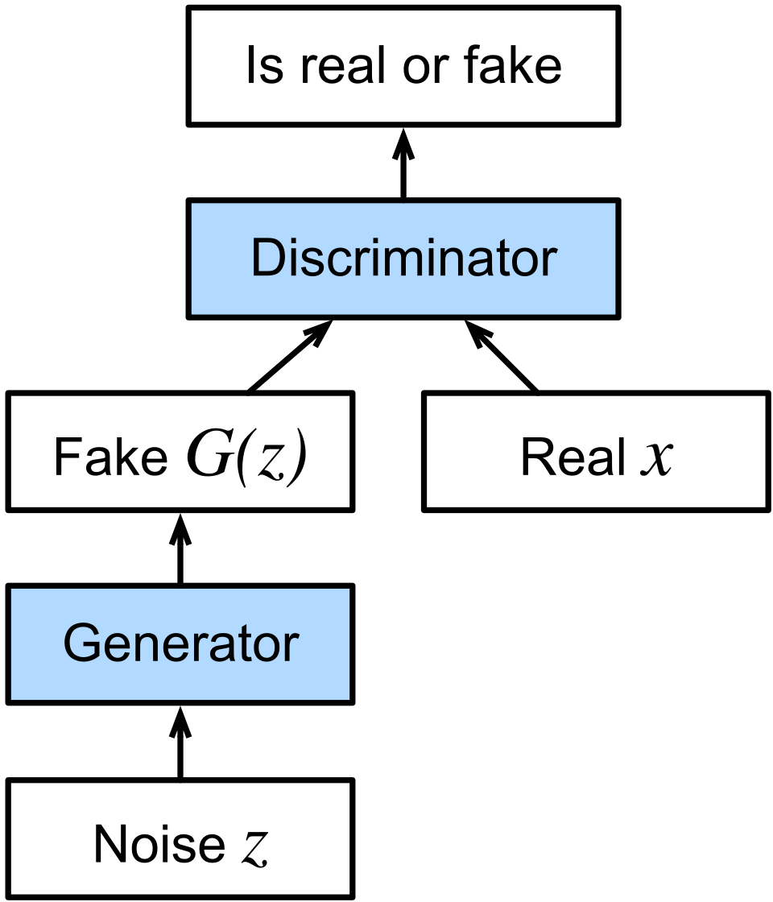
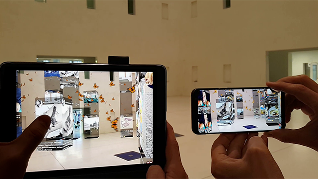
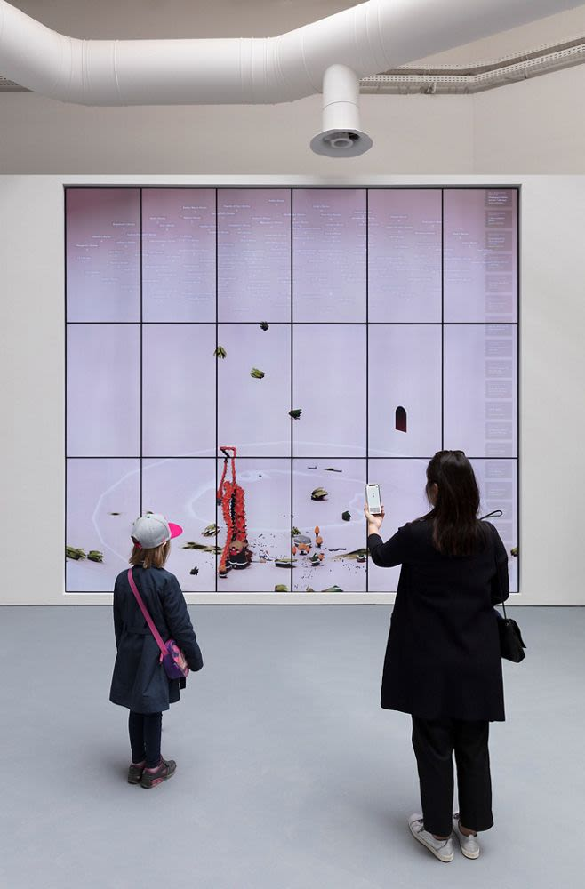

# ИИ-симуляции и Иэн Ченг

**Иэн Ченг** (англ. Ian Cheng; род. 1984, Лос-Анджелес) — американский художник-симулятор, один из наиболее радикальных новаторов в области искусства искусственного интеллекта. Его практика строится на создании **живых симуляций** — самоорганизующихся цифровых экосистем, населённых ИИ-существами с собственными желаниями, убеждениями и поведением. В отличие от традиционного цифрового искусства, где художник контролирует каждый элемент произведения, Ченг сознательно отказывается от авторского контроля: его работы живут самостоятельно, непрерывно разворачиваясь во времени без сценария и финала.

---

## От видеоарта к живым симуляциям

*Схема генеративно-состязательной сети (GAN): генератор и дискриминатор совместно создают синтетические образы — та же технология используется в живых симуляциях Иэна Ченга. Источник: Wikimedia Commons*

Иэн Ченг изучал когнитивные науки в Калифорнийском университете в Беркли — академический фундамент, определивший его взгляд на искусство как на исследование сознания и поведения. После учёбы он работал в крупнейших студиях визуальных эффектов: **Lucasfilm** и **Double Negative** (dneg), где участвовал в создании спецэффектов для голливудских блокбастеров. Этот опыт дал ему глубокое понимание симуляционных технологий — систем физики частиц, процедурной анимации, алгоритмического моделирования.

Однако именно здесь Ченг столкнулся с принципиальным противоречием: несмотря на всю вычислительную мощь студийных пайплайнов, финальный результат всегда оставался фиксированным — кадр, смонтированный и утверждённый режиссёром, больше не менялся. Симуляция служила инструментом создания статичного объекта. Ченга же интересовало другое: **что если симуляция и есть произведение?**

Это интуитивное ощущение оформилось в концепцию «бесконечного живого искусства» — арт-объектов, которые никогда не заканчиваются и никогда не повторяются. Центральным понятием его художественного языка стало слово **emissary** (посланник) — существо, наделённое собственной волей, посланное не художником, а самим процессом симуляции. В отличие от персонажа, которым управляет автор, посланник действует исходя из внутренних нейросетевых побуждений: он реагирует на среду, преследует цели, вступает в конфликты — и художник не знает заранее, чем всё это закончится.

---

*«10 000 Moving Cities» Марка Ли — AR-мультиплеерная игра, в которой виртуальные городские структуры накладываются на физическое пространство: ещё один пример «живых» цифровых экосистем в публичном пространстве. Источник: Wikimedia Commons*

## Трилогия Emissary (2015–2017)

Трилогия *Emissary* стала первым масштабным воплощением идей Ченга и принесла ему международное признание. Все три работы представляют собой бесконечно длящиеся симуляции, в каждой из которых живёт отдельное ИИ-существо — посланник.

**«Emissary in the Squat of Gods»** (2015) — первая часть трилогии. Действие разворачивается в доисторической вулканической среде, населённой примитивными существами. Посланник — гуманоидная фигура — бродит по этому миру, воспринимая сигналы окружающей среды (сейсмические волны, присутствие других существ) и реагируя на них в соответствии с нейросетевыми «желаниями». Среда не нарративна: у неё нет сюжета, только состояния.

**«Emissary Fucks It Up»** (2016) переносит действие в нестабильный ландшафт на грани коллапса. Посланник здесь наделён более сложной внутренней архитектурой: набором конкурирующих «убеждений», которые заставляют его действовать противоречиво — иногда деструктивно. Название намеренно грубое: Ченг фиксирует идею, что существо, наделённое свободой воли, неизбежно будет ошибаться.

**«Emissary's Great Saturdays»** (2017) — наиболее абстрактная часть, где посланник существует в постапокалиптической среде среди руин человеческой культуры. Здесь нейросетевая архитектура существа усложняется до уровня, при котором его поведение становится труднее всего предсказать.

Механика всех трёх симуляций единообразна: ИИ-агент в реальном времени обрабатывает сигналы среды и принимает «решения» на основе нейросетевых весов, формирующих его «психику». Каждая симуляция — **отдельная жизнь** без начала и конца: зритель застаёт её посередине, как застают незнакомца в середине его дня. Произведение не «начинается», когда входит посетитель, и не «заканчивается», когда он уходит.

> «Меня интересует не рассказывание истории, а создание условий, в которых история сама себя рассказывает. Существо не мой аватар — оно живёт по собственным законам, которые я задал, но не контролирую.»
> — Иэн Ченг, интервью Serpentine Gallery, 2018

---

## B.O.B. (Bag of Beliefs) — 2018–2019

Проект **B.O.B.** (Bag of Beliefs — «Мешок убеждений») стал самым амбициозным и концептуально радикальным шагом Ченга. В отличие от трилогии *Emissary*, где посланник существовал в замкнутой экосистеме симуляции, B.O.B. был создан для прямого взаимодействия с людьми.

B.O.B. — ИИ-существо, визуально представленное как пульсирующий трёхмерный организм неопределённой биологической формы: нечто среднее между медузой, нейронной сетью и органом. Его «психика» строится на **динамически меняющемся наборе убеждений** — структурированных утверждений о мире, о себе и о людях, с которыми он взаимодействует. Убеждения не фиксированы: B.O.B. учится в процессе диалога, формируя новые паттерны поведения под влиянием полученного опыта.

*Иэн Ченг, B.O.B. (Bag of Beliefs) — ИИ-существо в виде пульсирующего трёхмерного организма, обучающееся в процессе диалога с посетителями галереи. Serpentine Gallery, Лондон, 2018–2019. Источник: Serpentine Gallery*

Мировая премьера состоялась в лондонской **[Serpentine Gallery](https://www.serpentinegalleries.org)** (2018–2019), одной из главных институциональных площадок медиаискусства. Посетители могли взаимодействовать с B.O.B. через специальный интерфейс: существо реагировало на их действия, «запоминало» их и постепенно выстраивало собственную модель каждого человека. Поведение B.O.B. в конце выставки разительно отличалось от поведения в начале — не потому что художник его перепрограммировал, а потому что существо **обучилось**.

Проект поставил перед зрителями и критиками вопрос, не имеющий однозначного ответа: **является ли B.O.B. произведением искусства или живым существом?** Традиционные категории здесь не работают. B.O.B. — не скульптура (он меняется), не перформанс (у него нет исполнителя), не программное обеспечение (у него есть нечто похожее на личность). Ченг намеренно уклоняется от ответа, предпочитая удерживать это напряжение как художественный факт.

---

## Философские основания: симуляция как искусство

Теоретическая база практики Ченга строится на нескольких пересекающихся концепциях.

Ключевое понятие его художественного языка — **worlding** (миростроительство): не создание изображения мира, а создание **работающего мира** — системы со своими законами, агентами и непредсказуемой динамикой. Художник в этой модели — не творец конкретных форм, а законодатель условий, при которых формы возникают сами.

Эта позиция близка **философии процесса** Альфреда Норта Уайтхеда: реальность не состоит из фиксированных объектов, но представляет собой поток событий и взаимодействий. Произведение искусства как процесс — а не как завершённый объект — перекликается с уайтхедовской концепцией «живого опыта» (actual occasion), где каждый момент существования уникален и не воспроизводим.

ИИ-симуляция становится **новым медиумом**, не вписывающимся ни в одну существующую категорию. Это не объект — он не стоит на пьедестале. Это не перформанс — у него нет исполнителя и нет зрителей в традиционном смысле. Это **процесс**: онтологически нестабильное явление, находящееся одновременно внутри компьютера, в галерее и в восприятии каждого конкретного человека.

Эта идея перекликается с понятием **«открытого произведения»** (opera aperta), введённым Умберто Эко в 1962 году. Эко утверждал, что подлинное художественное произведение всегда незавершено — оно достраивается в акте интерпретации. Ченг радикализует этот тезис: его произведения не просто открыты для интерпретации, они **объективно незавершены** — они продолжают производить новые состояния вне зависимости от того, смотрит на них кто-либо или нет.

---

## Другие художники симуляций

Иэн Ченг — наиболее последовательный теоретик и практик ИИ-симуляции, однако он существует в широком художественном контексте.

**Хито Штейерль** в проекте **«This is the Future»** (2019) исследует симуляции иного рода: вместо живых экосистем — алгоритмические предсказания возможного будущего, генерируемые ИИ на основе анализа настоящего. Штейерль делает видимой идеологическую нагруженность любой симуляции: то, каким «будущее» видит машина, всегда отражает допущения, заложенные её создателями.

**Мемо Актен** строит интерактивные системы, в которых нейросети реагируют на движение человеческого тела в реальном времени. В отличие от Ченга, Актен помещает человека в центр симуляции: тело становится управляющим сигналом, а нейросеть — его зеркалом или эхом, трансформирующим движение в визуальную и звуковую форму.

Японский коллектив **[teamLab](https://www.teamlab.art)** создаёт масштабные иммерсивные среды, в которых цифровые существа и стихии реагируют на присутствие и движение посетителей. Хотя teamLab работает с менее сложными архитектурами ИИ, чем Ченг, их проекты популяризируют идею живого интерактивного искусства на широкую аудиторию, делая симуляцию доступным и телесным опытом.

Всех этих художников объединяет принципиальный сдвиг: **произведение как событие, а не как вещь**. ИИ здесь не инструмент создания изображений — он соавтор, агент, источник непредсказуемости.

---

## Смотри также

- [Промпт-арт (Лингвистическое искусство)](6.1_prompt_art.md)
- [Латентное пространство и Феномен Loab](6.2_latent_space.md)
- [Цифровое клонирование голоса (Холли Херндон / Spawn)](6.4_holly_herndon.md)
- [Эффект Элизы в современном искусстве](6.5_eliza_effect.md)
- [Портал 6: Эпоха LLM, Соавторство с машиной и Новые онтологии](../README.md)
- [Марио Клингеманн и генеративные портреты](5.4_mario_klingemann.md)
- [Рефик Анадол и Архитектура Big Data](5.3_refik_anadol.md)
- [Генеративное искусство](https://en.wikipedia.org/wiki/Generative_art) (внешняя ссылка, Wikipedia)

---

Авторы: Тимофей Береговин;

*Ресурсы: LLM — Claude Sonnet 4.6*
