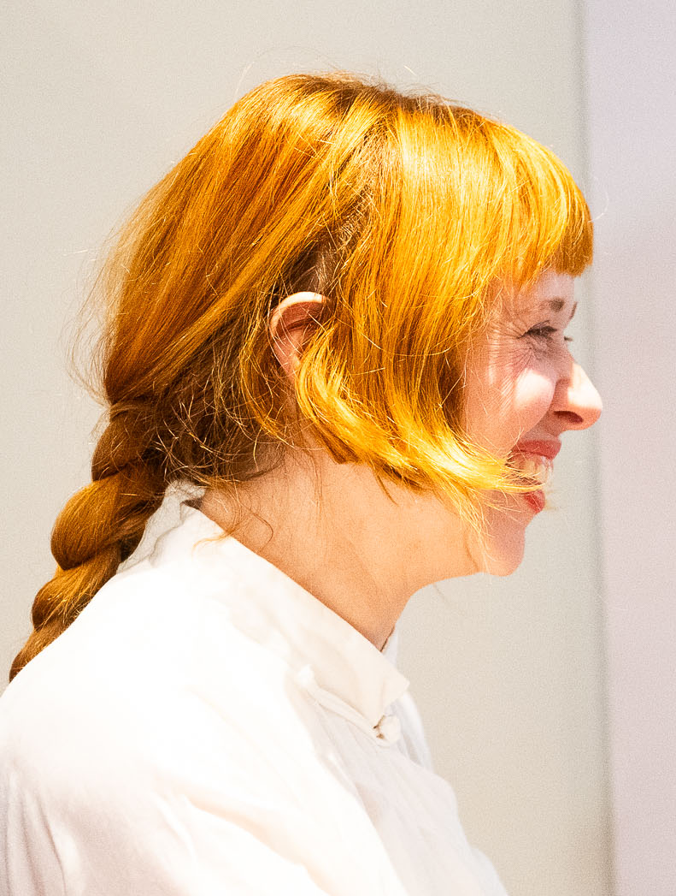
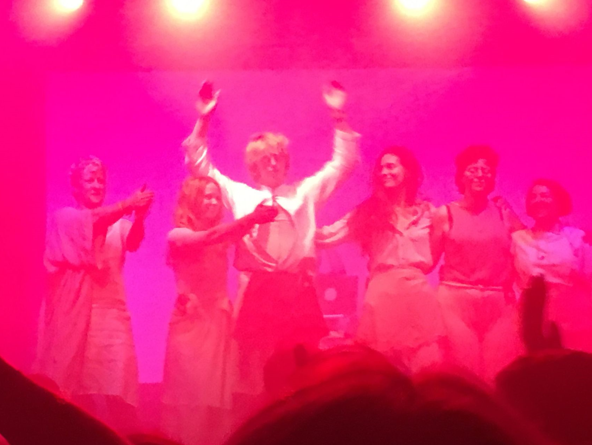

# Цифровое клонирование голоса (Холли Херндон / Spawn)

**Холли Херндон** (Holly Herndon) — американская музыкант-экспериментатор, исследователь ИИ и одна из наиболее радикальных фигур на пересечении современного искусства, технологий и философии авторства. Её практика ставит под сомнение, кому принадлежит голос человека — и что происходит, когда машина учится этот голос воспроизводить.

## Биография и художественный метод

*Холли Херндон — американская музыкант-экспериментатор, создавшая ИИ-агента Spawn и пионер этики «коллективного согласия» при обучении нейросетей на человеческих голосах. Источник: Wikimedia Commons*

Херндон получила образование сначала в Высшей школе музыки и театра в Штутгарте, а затем в Стэнфордском центре компьютерных исследований в области музыки и акустики (CCRMA) — одном из ведущих мировых центров экспериментальной электроакустической музыки. Этот академический фундамент определил её подход: строгость исследователя в сочетании с радикальностью художника.

Дебютный альбом *Movement* (2012) обозначил Херндон как самобытный голос в мире электронной музыки — плотные текстуры, препарированный вокал, компьютерная обработка звука. *Platform* (2015), записанный уже после переезда в Берлин, стал политическим высказыванием об эпохе интернета, слежки и цифровой идентичности. Берлин дал ей сообщество единомышленников и контакт с клубной культурой, однако её интересы всё сильнее смещались в сторону машинного обучения.

Постепенное включение ИИ в творческий процесс у Херндон — не технофетишизм, а методологический выбор. Она рассматривает нейронные сети не как инструмент автоматизации, а как соавтора, чьё «воспитание» является частью художественного акта.

*Холли Херндон исполняет материал альбома *PROTO* вживую в Бристоле — концерт, где человеческие голоса и ИИ-агент Spawn выступают как единый вокальный ансамбль. Источник: Wikimedia Commons*

## Spawn: ИИ как участник коллектива

В 2019 году вышел альбом *PROTO* — возможно, самый радикальный эксперимент Херндон в области обучения ИИ. Проект был создан совместно с партнёром Мэттом Дрейхерстом (Mat Dryhurst) и исследователями из Центра ИИ. Главным «персонажем» альбома стал Spawn — нейросетевой агент, обученный на живых голосах вокального ансамбля, работавшего с Херндон.

Концепция Spawn строится вокруг метафоры воспитания: ИИ — это не программа, которую запускают, а «ребёнок коллектива», которого растят. Хор певцов неделями передавал Spawn свои голоса, интонации, тембры; модель обучалась, впитывая человеческую вокальную культуру изнутри сообщества. На записях *PROTO* Spawn поёт вместе с живыми исполнителями — их голоса переплетаются так, что граница между человеческим и синтетическим намеренно размыта.

Этот подход противостоит двум распространённым нарративам об ИИ: технооптимистическому («машина заменит людей») и технофобному («машина уничтожит творчество»). Вместо этого Херндон предлагает модель симбиоза: ИИ обретает голос только через сообщество людей, которые согласились этот голос ему передать. Согласие и коллективность — ключевые слова её практики.

## Holly+: экономика голоса

В 2021 году Херндон запустила проект **[Holly+](https://holly.plus)** — инструмент на основе технологии voice conversion, позволяющий любому желающему создавать музыку с её голосом. Технически это открытая платформа: загружаешь аудио, на выходе получаешь версию, спетую голосом Херндон.

Однако Holly+ — не просто технический инструмент, а экономическая модель. Все произведения, созданные с его помощью, обязаны делиться выручкой с Херндон через DAO — децентрализованную автономную организацию на основе блокчейна. Таким образом, художница одновременно открывает доступ к своему голосу и устанавливает правила его использования, минуя традиционные институты — лейблы, агентства, суды.

Holly+ стал первым в своём роде пионерским примером «экономики голоса»: моделью, при которой биометрическая идентичность человека превращается в управляемый актив с прозрачными правилами распределения дохода. Это не запрет на использование голоса и не его безвозмездная отдача — это третий путь, построенный на прозрачном согласии и справедливом вознаграждении.

## Философия: кому принадлежит голос

Проекты Херндон разворачиваются на фоне нарастающей юридической и этической дискуссии о правах на голос. Что такое голос — звуковой отпечаток, биометрический идентификатор, часть личности? Кто вправе его воспроизводить, продавать, тиражировать?

Вопрос обостряется, когда речь заходит о «цифровых клонах» умерших людей: семьи и правообладатели продолжают голоса умерших артистов, не спрашивая их согласия. Ещё более тревожны случаи клонирования голосов живых — без их ведома. В 2023 году разгорелся скандал вокруг треков, якобы записанных голосами Дрейка и The Weeknd: анонимный пользователь с помощью нейросети создал убедительную имитацию дуэта и выложил её в сеть. Трек набрал миллионы прослушиваний прежде, чем был удалён по требованию лейбла. Правовой статус подобных произведений остался туманным.

Позиция Херндон в этой дискуссии последовательна: голос — это личное биометрическое пространство, требующее той же юридической защиты, что и другие данные о теле человека. Она не против технологий клонирования голоса — она против их использования без согласия владельца. Holly+ — это её ответ на проблему: не запрет, а инфраструктура согласия.

## Другие художники, работающие с голосом и идентичностью

Практика Херндон существует в более широком художественном контексте.

**Arca** (Алехандра Ганса) — венесуэльско-испанская художница и продюсер, чья работа с голосом и телом исследует гендерную текучесть и технологическую деконструкцию субъектности. В серии альбомов *KicK* (2020–2021) Arca использует ИИ-обработку собственного голоса как инструмент трансформации идентичности, растворяя границы между человеческим и машинным, органическим и синтетическим.

**[Hatsune Miku](https://www.crypton.co.jp/miku_eng)** — японский виртуальный певец, созданный компанией Crypton Future Media в 2007 году на основе технологии [Vocaloid](https://www.vocaloid.com). Miku не имеет «оригинального» голоса и тела — она изначально синтетична. Тем не менее вокруг неё сложилась полноценная поп-культура с концертами (голографическими), фанатским сообществом и коммерческой экономикой. Hatsune Miku — предельный случай вопроса об авторстве и идентичности: певец, у которого нет исходного человека.

**[ElevenLabs](https://elevenlabs.io)** — американский стартап, специализирующийся на синтезе и клонировании голоса. Технологии компании позволяют воспроизвести голос любого человека по нескольким минутам аудио. ElevenLabs стал символом этической проблематики в этой области: его инструменты использовались для создания дипфейковых аудиозаписей политиков и знаменитостей. Компания ввела ряд ограничений, однако дискуссия о достаточности этих мер продолжается.

## Смотри также

- [Промпт-арт (Лингвистическое искусство)](6.1_prompt_art.md)
- [Латентное пространство и Феномен Loab](6.2_latent_space.md)
- [ИИ-симуляции и Иэн Ченг](6.3_ai_simulations.md)
- [Эффект Элизы в современном искусстве](6.5_eliza_effect.md)
- [Портал 6: Эпоха LLM, Соавторство с машиной и Новые онтологии](../README.md)
- [Дипфейк-арт и Синтетическая сатира](3.3_deepfake_art.md)
- [Нейронная оборона (Яндекс)](5.5_yandex_neural.md)
- [Генеративное искусство](https://en.wikipedia.org/wiki/Generative_art)

### Медиаграмотность и критическое мышление

- [Авторское право и честное использование](../../../5.1_technology_and_digital_literacy/information%20and%20media%20literacy/articles/авторское_право_и_честное_использование.md) — правовые основы, на которые опирается Херндон, требуя согласия при использовании голоса
- [Цифровая репутация](../../../5.1_technology_and_digital_literacy/information%20and%20media%20literacy/articles/цифровая_репутация.md) — цифровой след голоса и образа как часть онлайн-идентичности человека

---

Авторы: Тимофей Береговин;

*Ресурсы: LLM — Claude Sonnet 4.6*
