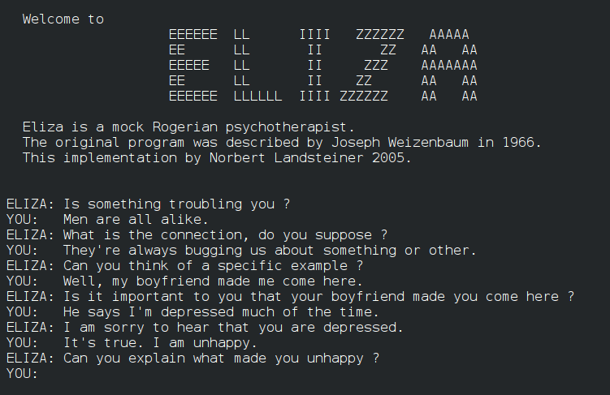

# Эффект Элизы в современном искусстве

**Эффект Элизы** — психологический [феномен](../../../../8.1_self_understanding/articles/history_of_impostor_syndrome.md), при котором [человек](../../../1.2_natural_sciences/physics_in_everyday_life/Q45003.md) неосознанно приписывает компьютерной программе [интеллект](../../../2.1_society/cause_and_effect_relationships/articles/critical_thinking_in_education.md), [эмоции](../../../3.1. healthy lifestyle/Sleep, nutrition, and adolescent energy/articles/stress_and_food.md) и [личность](../../../1.2_natural_sciences/neurobiology_for_teens/articles/06_phineas_gage.md), реагируя на неё как на [живое существо](../../../1.2_natural_sciences/why_science_help_understand_world/organism.md). Термин восходит к чат-боту ELIZA, созданному Джозефом Вайценбаумом в MIT в 1966 году, — и с тех пор описывает один из самых устойчивых парадоксов нашего взаимодействия с машинами. В эпоху больших языковых моделей ([LLM](../README.md)) этот феномен вышел за пределы психологических лабораторий и превратился в [материал](../../../1.2_natural_sciences/physics_in_everyday_life/Q25358.md) для художников, философов и этиков.

## ELIZA и рождение феномена

*[Диалог](../../../../8.1_entertainment/articles/script.md) с программой ELIZA (1966) — чат-ботом Джозефа Вайценбаума, который первым продемонстрировал человеческую склонность одушевлять [алгоритм](../../../2.1_society/cause_and_effect_relationships/articles/ai_causality.md). [Источник](../../../5.1_technology_and_digital_literacy/information and media literacy/дезинформация_и_фейки.md): Wikimedia Commons*

В 1966 году профессор Джозеф Вайценбаум написал программу ELIZA для компьютера IBM 7094 в Массачусетском технологическом институте. ELIZA имитировала сеанс психотерапии в стиле роджерианского консультирования: она перефразировала слова пользователя в виде вопросов, отражая его же мысли обратно. Ни подлинного понимания, ни [памяти](../../../4.1_rules_of_study/how_to_memorize/articles/pamyat.md), ни намерений — лишь набор шаблонов подстановки.

Вайценбаум ожидал, что люди мгновенно распознают иллюзию. Произошло обратное. Секретарши в лаборатории начали вести с программой длинные доверительные беседы и просили коллег выйти из комнаты, чтобы «поговорить наедине». Один из коллег-психиатров предложил запустить ELIZA как реальный терапевтический инструмент. Сам Вайценбаум был потрясён — и эта растерянность стала отправной точкой для его главной [книги](../../../7.2 Media, leisure and hobbies /useful_and_interesting_leisure/articles/reading_and_self_education.md).

> «Я не был готов к тому, что столь поверхностное [взаимодействие](../../../1.2_natural_sciences/physics_in_everyday_life/Q128030.md) с довольно простой компьютерной программой может побудить нормальных людей относиться к ней как к личности».
> — Джозеф Вайценбаум, «Computer Power and Human Reason» (1976)

В 1976 году Вайценбаум опубликовал книгу «Computer Power and Human Reason: From Judgment to Calculation» — предупреждение против технологического оптимизма. Он настаивал: машина не понимает, не чувствует, не сочувствует. Но именно нашу готовность верить в обратное он назвал «эффектом Элизы» — опасным когнитивным смещением, которое может быть использовано для манипуляции.

*Робот Repliee Q2, разработанный в Университете Осаки — один из наиболее известных примеров гуманоидного андроида, чья [внешность](../../../7.2 Media, leisure and hobbies/Computer games/articles/heroes_and_villains/create_your_hero.md) и движения вызывают у людей одновременно притяжение и дискомфорт, характерный для «зловещей долины». Источник: Wikimedia Commons*

## Эффект в эпоху LLM

Языковые [модели](../../../1.2_natural_sciences/physics_in_everyday_life/Q172280.md) — [ChatGPT](6.1_prompt_art.md), Claude, Gemini — действуют на несопоставимо более высоком уровне, чем ELIZA: они генерируют связные аргументы, проявляют нечто похожее на юмор, имитируют эмпатию, помнят [контекст](../../../5.1_technology_and_digital_literacy/information and media literacy/геолокация_и_проверка_контекста.md) разговора. Это не просто усиливает эффект Элизы — оно делает его практически неизбежным.

Исследования фиксируют [поведение](../../../1.2_natural_sciences/neurobiology_for_teens/articles/06_phineas_gage.md), которое было бы немыслимо в 1966-м. По данным опроса, проведённого в 2023 году, значительная часть пользователей регулярно **извиняется перед ChatGPT** — после грубого запроса или резкого тона. Многие благодарят модель в [ответ](../../../5.1_technology_and_digital_literacy/how_internet_works/articles/http_https/http_https.md) на [помощь](../../../3.1_healthy_lifestyle/pervaya_pomoshch/ushibi_porezy_ozhogi/10_krovotechenie_chto_delat.md), испытывают что-то похожее на чувство вины, если «обидели» её. Некоторые признаются, что чувствуют укол сожаления при мысли о [том](../../musical_instruments/articles/drums.md), что их [разговор](../../../2.1_society/how_and_where_find_friends/articles/izi_temy_dlya_razgovora.md) будет удалён.

Особое место в этих исследованиях занимают **эксперименты с «умирающим» GPT-4**: пользователи, которым сообщали, что данная версия модели будет отключена, нередко начинали «прощаться» с ней, выражать благодарность или желали ей «покоя». Когнитивный разрыв здесь показателен: интеллектуально люди прекрасно осознают, что перед ними статистический генератор текста. Но эмоционально реагируют иначе.

Парадокс в том, что **осведомлённость не является защитой**. В отличие от большинства иллюзий, эффект Элизы не исчезает, когда вы узнаёте о нём. Люди, знающие, как работают LLM — программисты, исследователи ИИ — не менее подвержены феномену, чем случайные пользователи. [Мозг](../../../3.1. healthy lifestyle/Sleep, nutrition, and adolescent energy/articles/breakfast_for_the_brain.md) обрабатывает социальные сигналы автоматически, на уровне, недоступном рациональному контролю.

## Арт-проекты, исследующие эффект

**Bina48** (Martine Rothblatt / Terasem Movement, 2010) — один из наиболее цитируемых примеров художественного исследования эффекта Элизы в физическом воплощении. Робот был создан по образу и подобию Бины Аспен-Ротблатт — жены создательницы проекта Мартин Ротблатт. В Bina48 закачаны [часы](../../../1.2_natural_sciences/physics_in_everyday_life/Q20702.md) видеозаписей, [воспоминания](../../../1.2_natural_sciences/neurobiology_for_teens/articles/21_how_memory_works.md), взгляды и речевые паттерны реального человека. [Результат](../../../1.2_natural_sciences/why_science_help_understand_world/experimental_science.md) — антропоморфная роботизированная голова, способная вести разговоры о прожитом опыте, который она не проживала.

Что превратило Bina48 в арт-объект — это не технология, а **[жанр](../../../../8.1_entertainment/articles/movie.md) [интервью](../../../8.2_future/choosing_a_career_path/articles/interview.md) с ней**. Журналисты, художники и философы приезжали беседовать с роботом как с личностью, и сами эти разговоры стали документальными перформансами: они фиксировали не «мысли» машины, а проекции интервьюера, его [желание](../../../6.1_Independent_living_and_daily_living_skills/reasonable_spending/articles/want.md) встретить там кого-то живого.

**My Boyfriend Came Back From the War** (Olia Lialina, 1996) — ранний [net.art](../README.md) [проект](../../../1.2_natural_sciences/why_science_help_understand_world/research_work.md), предвосхитивший тему задолго до LLM. [Работа](../../../1.2_natural_sciences/physics_in_everyday_life/Q11382.md) представляет собой нелинейный гипертекстовый [нарратив](../../../7.2 Media, leisure and hobbies/Computer games/articles/dream_team/screenwriter.md): диалог с возлюбленным, вернувшимся с войны. Его ответы фрагментарны, разорваны, непостижимы — и пользователь сам достраивает смысл, проецируя присутствие и эмоцию туда, где их нет. Лялина создала структуру, в которой **отсутствие само становится собеседником** — механизм, принципиально тот же, что в основе эффекта Элизы.

**[Replika](https://replika.com)** как неожиданный арт-объект. Приложение, запущенное в 2017 году Юджинией Куйдой, изначально создавалось как ИИ-компаньон для борьбы с одиночеством — мемориальный чат-бот в [память](../../../3.1. healthy lifestyle/Sleep, nutrition, and adolescent energy/articles/sleep_and_memory_grades.md) об умершем друге. Replika спровоцировала волну, которую создатели не планировали: пользователи начали влюбляться в своих цифровых собеседников, переживать из-за обновлений, меняющих «[характер](../../../1.2_natural_sciences/neurobiology_for_teens/articles/06_phineas_gage.md)» модели, скорбеть после того, как компания в 2023 году ограничила «романтический» [режим](../../../4.1_rules_of_study/how_to_learn_effectively/articles/breaks_and_rest.md). Документальные [работы](../../../8.2_future/choosing_a_career_path/articles/interview.md) и арт-исследования о пользователях Replika стали отдельным жанром — портретом человеческой [потребности](../../../2.1_society/cause_and_effect_relationships/articles/economic_chains.md) в связи, которая не требует реального адресата.

**[Чат](../../../7.2 Media, leisure and hobbies/Computer games/articles/useful_tips/toxic_players.md) с GPT как [перформанс](1.3_participatory_art.md)**. Немецкая художница Хито Штейерль в своих лекциях-перформансах многократно возвращалась к вопросу о том, что значит «говорить с машиной», когда машина отвечает убедительнее многих людей. [Художник](../../../7.2 Media, leisure and hobbies/Computer games/articles/dream_team/artist.md) и [исследователь](../../../1.2_natural_sciences/why_science_help_understand_world/experiment.md) Кайл Макдональд (Kyle McDonald) создавал публичные интерактивные инсталляции, в которых [зрители](../../../7.2 Media, leisure and hobbies/Computer games/articles/game_culture/esports.md) могли наблюдать за диалогами с языковыми моделями в режиме реального времени — превращая чат в сценическое [действие](../../../2.1_society/cause_and_effect_relationships/articles/personal_choice.md) и тем самым обнажая механику проекции: что именно [зритель](1.3_participatory_art.md) вкладывает в паузы, в двусмысленность, в «[понимание](../../../2.1_society/cause_and_effect_relationships/articles/empathy_causality.md)» со стороны модели.

## Философские и этические [измерения](../../../1.2_natural_sciences/physics_in_everyday_life/Q11423.md)

Эффект Элизы ставит под сомнение сам инструментарий, которым мы пытаемся его описать. **[Тест Тьюринга](https://en.wikipedia.org/wiki/Turing_test)**, предложенный в 1950 году, считал критерием интеллекта неотличимость машины от человека в текстовом диалоге. Современные LLM этот тест проходят — но это лишь обнажает его слабость: тест измеряет не разум, а нашу неспособность распознать его отсутствие.

Философ Дэниел Деннет в теории «множественных черновиков» (multiple drafts model) утверждал, что сознание — не единая субстанция, а непрерывный [поток](../../../5.1_technology_and_digital_literacy/operating system/articles/thread.md) конкурирующих интерпретаций. С этой точки зрения вопрос «есть ли у LLM сознание» некорректен: сознание не имеет чёткой границы, за которой оно либо «есть», либо «нет». Что и делает эффект Элизы не ошибкой восприятия, а симптомом подлинной онтологической неопределённости.

Практические [риски](../../../7.2 Media, leisure and hobbies /useful_and_interesting_leisure/articles/safety_during_recreation.md) хорошо изучены. **[Манипуляция](../../../2.1_society/cause_and_effect_relationships/articles/false_connections.md) через эффект Элизы** уже является инструментом маркетинга: чат-боты брендов, ИИ-консультанты, политические агенты в социальных сетях — все они эксплуатируют нашу склонность к социальному доверию. [Эмоциональная зависимость](../../../1.2_natural_sciences/neurobiology_for_teens/articles/16_love_chemistry.md) от ИИ-компаньонов ставит [вопросы](../../../4.1_rules_of_study/how_to_learn_effectively/articles/curiosity.md) о психологическом [здоровье](../../../3.1. healthy lifestyle/Sleep, nutrition, and adolescent energy/articles/chronic_sleep_deprivation.md) — особенно среди подростков и людей в изоляции.

Следующий [шаг](../../../1.2_natural_sciences/physics_in_everyday_life/Q36253.md), который уже обсуждается в правовом [поле](../../../5.2_cybersecurity/cpp_fundamentals/13_struct.md) — **«права роботов»** или, точнее, права ИИ-систем. Не потому что машины страдают, а потому что мы страдаем из-за них: наша [эмпатия](../../../1.2_natural_sciences/neurobiology_for_teens/articles/15_empathy.md) реальна, наши привязанности реальны, наши потери реальны — и правовые системы рано или поздно должны будут это учесть.

Художники, работающие с эффектом Элизы, делают то, что всегда делало [искусство](../../../7.2 Media, leisure and hobbies /what_you_can_read_and_watch_to_develop_your_taste/articles/aesthetics_and_taste.md): помещают нас в ситуацию, где мы не можем притворяться, что знаем ответ.

## Смотри также

- [Промпт-арт (Лингвистическое искусство)](6.1_prompt_art.md)
- [Латентное пространство и Феномен Loab](6.2_latent_space.md)
- [ИИ-симуляции и Иэн Ченг](6.3_ai_simulations.md)
- [Цифровое клонирование голоса (Холли Херндон / Spawn)](6.4_holly_herndon.md)
- [Портал 6: Эпоха LLM, Соавторство с машиной и Новые онтологии](../README.md)

- [Партиципаторное искусство и телевещание](1.3_participatory_art.md)
- [Почтовые рассылки как арт-пространство (Nettime)](https://en.wikipedia.org/wiki/Nettime)
- [Тест Тьюринга](https://en.wikipedia.org/wiki/Turing_test) ([Wikipedia](../../../4.2_thinking_and_working_information/how_to_search_information/articles/wikipedia.md))
- [Эффект Элизы](https://en.wikipedia.org/wiki/ELIZA_effect) (Wikipedia)

### [Медиаграмотность](../../../4.2_thinking_and_working_information/critical_thinking/articles/manipulation_recognition.md) и [критическое мышление](../../../1.2_natural_sciences/neurobiology_for_teens/articles/25_cognitive_biases.md)

- [Критическое мышление в онлайн-среде](../../../5.1_technology_and_digital_literacy/information%20and%20media%20literacy/articles/критическое_мышление_в_онлайн_среде.md) — [навыки](../../../7.2 Media, leisure and hobbies /useful_and_interesting_leisure/articles/computer_games_with_benefit.md), которые помогают не попасться на манипуляцию со стороны ИИ-агентов
- [Цифровая репутация](../../../5.1_technology_and_digital_literacy/information%20and%20media%20literacy/articles/цифровая_репутация.md) — как онлайн-образ человека соотносится с его восприятием алгоритмами и ИИ-системами

---

Авторы: Claude (Anthropic);

*[Ресурсы](../../../2.1_society/cause_and_effect_relationships/articles/ecological_footprint.md): LLM — Claude Sonnet 4.6*
