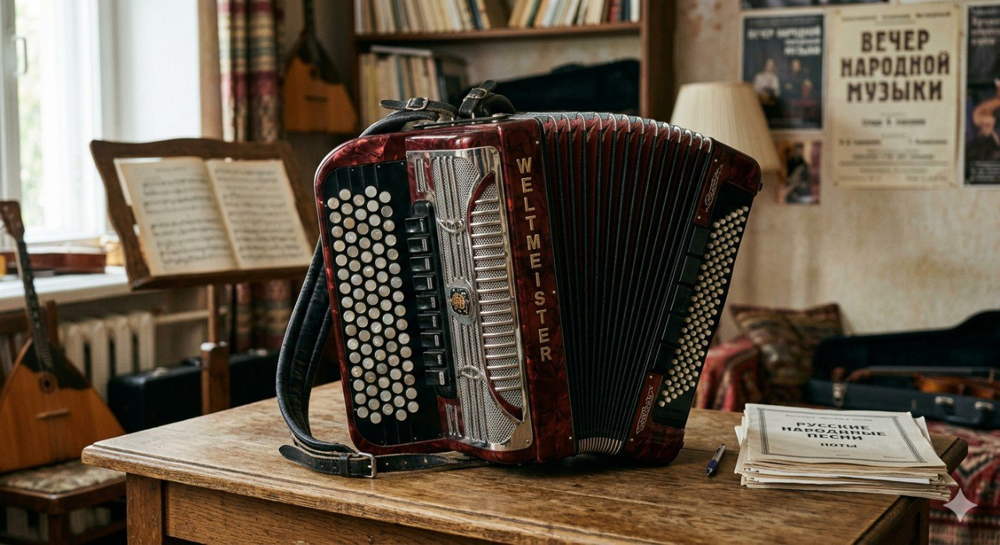

# Аккордеон

**Раздел:** 7. [Культура](../../../2.1_society/cause_and_effect_relationships/articles/why_rules_work.md) и [искусство](../../../7.2 Media, leisure and hobbies /what_you_can_read_and_watch_to_develop_your_taste/articles/aesthetics_and_taste.md) → 7.1 Искусство → [Музыкальные инструменты](../../../1.2_natural_sciences/physics_in_everyday_life/Q170475.md)

---

## [История](../../../2.1_society/cause_and_effect_relationships/articles/lessons_of_history.md) создания

Аккордео́н — один из самых узнаваемых народных инструментов — был изобретён в начале XIX века. Его [появление](../../../1.2_natural_sciences/physics_in_everyday_life/Q5339.md) стало результатом экспериментов с язычковыми инструментами (в которых [звук](../../../1.2_natural_sciences/why_science_help_understand_world/physics.md) производится вибрацией металлических язычков под действием воздуха).

Предшественником аккордеона считается **шэн** — китайский ротовой [орган](organ.md) с металлическими язычками, известный более 3000 лет. В Европе [интерес](../../../7.2_leisure/useful_and_interesting_leisure/articles/how_not_to_quit_hobby.md) к язычковым инструментам вырос в конце XVIII века.

В **1822 году** берлинский органный мастер **Кристиан Фридрих Людвиг Бушман** (1805–1864) создал инструмент «хандэолин» — ручной [орган](organ.md) с мехами. Примерно в то же [время](../../../1.2_natural_sciences/physics_in_everyday_life/Q20702.md) венский мастер **Кирилл Демиан** (1772–1847) запатентовал в **1829 году** инструмент под названием «аккордеон» (от слова «[аккорд](guitar.md)»). Его изобретение имело несколько кнопок в левой руке, автоматически воспроизводящих [аккорды](ukulele.md), — отсюда и название.

В 1850–1870-х годах итальянские мастера из Кастельфидардо (провинция Анкона) начали массовое [производство](../../../2.1_society/cause_and_effect_relationships/articles/economic_chains.md) аккордеонов, и инструмент быстро распространился по всей Европе. Россия стала одним из главных центров аккордеонной культуры.

В начале XX века появились **пианинные аккордеоны** (с фортепианной клавиатурой слева), которые стали особенно популярны в США.

---

## [Виды](../../../3.1_healthy_lifestyle/pervaya_pomoshch/ushibi_porezy_ozhogi/08_porezy_sadiny_vidy.md) аккордеона

- **Кнопочный аккордеон (баянообразный)** — левая и правая клавиатуры состоят из кнопок.
- **Пианинный аккордеон** — правая сторона имеет фортепианную клавиатуру.
- **[Концертный](bayan.md) баян** — высший класс кнопочного аккордеона с готово-выборной системой левой клавиатуры.
- **Диатонический аккордеон** — каждая кнопка даёт разные ноты при растяжении и сжатии меха.
- **[Хроматический](bayan.md) аккордеон** — каждая кнопка/клавиша даёт одну ноту независимо от движения меха.
- **Детский аккордеон** — уменьшенная версия для обучения.

---

## Конструкция

### Основные части

1. **Мех (сильфон)**
2. **Правый [корпус](guitar.md) (мелодическая сторона)**
3. **Левый [корпус](../../../1.2_natural_sciences/physics_in_everyday_life/Q11223329.md) (аккордовая сторона)**
4. **Язычки**
5. **[Клапаны](clarinet.md)**
6. **Ремни**
7. **[Регистры](organ.md) (переключатели)**

### Описание частей и [характеристики](../../../6.1_Independent_living_and_daily_living_skills/reasonable_spending/articles/comparison.md)

**Мех** — гофрированная кожаная или искусственная складчатая камера между правым и левым корпусами. [Длина](../../../1.2_natural_sciences/physics_in_everyday_life/Q25358.md) растянутого меха — **50–70 см**, в сложенном виде — около **15–20 см**. Именно [движение](../../../1.2_natural_sciences/why_science_help_understand_world/physical_science.md) меха ([растяжение](../../../1.2_natural_sciences/physics_in_everyday_life/Q170282.md)/[сжатие](../../../1.2_natural_sciences/physics_in_everyday_life/Q170282.md)) создаёт [поток](../../../5.1_technology_and_digital_literacy/operating system/articles/thread.md) воздуха через язычки.

**Правый корпус** содержит мелодическую клавиатуру. У пианинного аккордеона — **41 клавиша** (3,5 октавы); у кнопочного — от 96 до 120 кнопок.

**Левый корпус** — аккордовая [клавиатура](piano.md). Стандарт — **120 кнопок** (готовая система): 2 ряда басов + 4 ряда готовых аккордов. «Выборная» система даёт возможность нажатием одной кнопки получать любую ноту.

**Язычки** — тонкие стальные пластинки, закреплённые над отверстиями в металлических планках. При прохождении воздуха язычок вибрирует, производя [звук](../../../1.2_natural_sciences/physics_in_everyday_life/Q124003.md).

**[Регистры](../../../5.1_technology_and_digital_literacy/operating system/articles/process.md)** — переключатели тембра (включают/выключают разные ряды язычков), обозначаемые как I, II, III, мастер и т.д.

**[Вес](../../../1.2_natural_sciences/physics_in_everyday_life/Q11023.md)** стандартного концертного аккордеона — **8–12 кг**.

### [Материалы](../../../1.2_natural_sciences/physics_in_everyday_life/Q487005.md)

- Корпус: [дерево](castanets.md) (фанера), иногда ABS-пластик
- Мех: кожа (телячья, баранья) или искусственные материалы
- Язычки: закалённая сталь
- [Клапаны](clarinet.md): кожа или пластик
- Ремни: кожа или синтетика

---

## В каких ансамблях используется

- **[Народный](balalaika.md) ансамбль** ([русский](balalaika.md), французский, итальянский, латиноамериканский)
- **Джазовый ансамбль** (аккордеон хорошо звучит в мюзетте и джаз-мангуста)
- **Камерный дуэт/трио** с другими инструментами
- **Эстрадный [оркестр](balalaika.md)**
- **[Духовой оркестр](tuba.md)** (редко)
- **[Русский](balalaika.md) [народный](balalaika.md) [оркестр](balalaika.md)** (баян)
- **[Соло](cello.md)** — популярнейший сольный [концертный](bayan.md) инструмент

---

## Известные музыканты

- **Ришар Гальяно** (р. 1950) — французский аккордеонист, создатель жанра «новый мюзет».
- **Петё Пикассо** (Астор Пьяццолла, 1921–1992) — аргентинский бандонеонист, революционер танго.
- **Геннадий Заволокин** (1948–2001) — советский и российский баянист, создатель программы «Играй, гармонь».
- **Фридрих Липс** (р. 1948) — один из крупнейших российских баянистов-виртуозов.
- **Иван Жданов** — современный российский мастер концертного баяна.

---

## Интересные [факты](../../../1.2_natural_sciences/physics_in_everyday_life/Q17737.md)

- В разных странах аккордеон называют по-разному: в России кнопочный вариант — баян, гармоника; во Франции — accordéon; в Германии — Knopfakkordeon.
- Астор Пьяццолла играл на **бандонеоне** — родственном инструменте, созданном в Германии для церкви, но ставшем символом аргентинского танго.
- Аккордеонный мех можно растянуть на длину почти **метра**.
- Аккордеон входит в [список](../../../5.2_cybersecurity/cpp_fundamentals/10_arrays.md) инструментов, звучащих в **открытом космосе**: советский космонавт Юрий Романенко играл на гармони на борту станции «Мир».
- Первый аккордеон был запатентован в Вене, а мировым центром производства стала маленькая [итальянская](mandolin.md) коммуна Кастельфидардо.

---

## [Советы](../../../7.2_leisure/useful_and_interesting_leisure/articles/mistakes_in_choosing_hobby.md) начинающим

1. **Выбери правильный размер.** Для детей 7–10 лет — инструмент с 80 кнопками и 26 клавишами в правой руке; для подростков — стандарт 96–120 кнопок.

2. **Правильно надень ремни.** Оба ремня чётко затянуты, инструмент прижат к туловищу. Не скручивай корпус.

3. **Освой [движение](../../../1.2_natural_sciences/physics_in_everyday_life/Q11023.md) меха.** Мех — «[дыхание](../../../1.2_natural_sciences/why_science_help_understand_world/organism.md)» аккордеона. Растягивай и сжимай плавно, без рывков.

4. **Начни с правой руки.** Изучи гаммы и простые мелодии на мелодической клавиатуре, прежде чем добавлять [аккорды](ukulele.md) левой.

5. **Изучи аккордовую систему левой руки.** Бас-кнопки идут по квинтам; аккорды расположены рядами. Запомни логику — это поможет ориентироваться вслепую.

6. **Следи за ровностью звука при смене движения меха.** Переход от растяжения к сжатию должен быть плавным — без «щелчков» и провалов.

7. **Занимайся ежедневно.** Мышцы руки и пальцы привыкают к тяжёлому инструменту постепенно.

## Похожие статьи

- [Баян](bayan.md)
- [Губная гармошка](harmonica.md)
- [Орган](organ.md)

---

*[Автор](../../../5.1_technology_and_digital_literacy/information and media literacy/авторское_право_и_честное_использование.md): Иванченко Макар (@kalane15)*

*Использованные [нейросети](../../../2.1_society/cause_and_effect_relationships/articles/ai_causality.md): Claude Sonnet 4.5, Nano Banana 2*