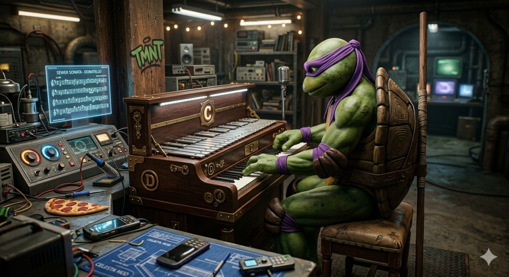

# Челеста

**Раздел:** 7. [Культура](../../../2.1_society/cause_and_effect_relationships/articles/why_rules_work.md) и [искусство](../../../7.2 Media, leisure and hobbies /what_you_can_read_and_watch_to_develop_your_taste/articles/aesthetics_and_taste.md) → 7.1 Искусство → [Музыкальные инструменты](../../../1.2_natural_sciences/physics_in_everyday_life/Q170475.md)

---

## [История](../../../2.1_society/cause_and_effect_relationships/articles/lessons_of_history.md) создания

Челе́ста — клавишный [ударный инструмент](../../../8.1_entertainment/articles/musical_instruments.md) с неземным «хрустальным» тембром — является одним из самых молодых академических инструментов. Её изобрёл французский мастер **Виктор Мюстель** (1815–1890) в **1886 году** в Париже. Название «челеста» (итал. *celesta* — «небесная», «небесный инструмент») точно отражает её [звук](../../../1.2_natural_sciences/why_science_help_understand_world/physics.md).

Внешне челеста напоминает маленькое [фортепиано](piano.md); внутри же скрыт совершенно иной принцип: нажатие [клавиши](accordion.md) приводит к удару молоточка по **стальной пластине**, находящейся над деревянным резонатором-ящиком. Именно сочетание металла и дерева даёт характерный «серебристый» [звук](../../../1.2_natural_sciences/physics_in_everyday_life/Q124003.md).

Первое оркестровое произведение для челесты написал **Пётр Ильич Чайковский** — знаменитый «Танец феи Драже» в балете **«Щелкунчик»** (1892). Чайковский впервые услышал инструмент в мастерской Мюстеля в Париже и был настолько очарован, что тайно заказал инструмент в [Санкт-Петербург](../../../2.2_society/history/articles/Peter_the_Great.md), не желая, чтобы конкуренты (Рим-Корсаков и Лядов) узнали об этом до премьеры.

С тех пор «Танец феи Драже» стал самым узнаваемым тембральным образом челесты в мировой культуре.

---

## [Виды](../../../3.1_healthy_lifestyle/pervaya_pomoshch/ushibi_porezy_ozhogi/08_porezy_sadiny_vidy.md) челесты

- **Стандартная челеста** — [диапазон](clarinet.md) 4 октавы (от [C](../../../2.1_society/how_and_where_find_friends/articles/sora_drug.md) третьей октавы до C пятой); самая распространённая.
- **5-октавная** — расширенная профессиональная версия.
- **Мини-челеста** — уменьшённая версия для съёмки или транспортировки.

---

## Конструкция

### Основные части

1. **[Корпус](guitar.md) ([деревянный](didgeridoo.md) ящик)**
2. **[Клавиатура](piano.md)**
3. **Металлические пластины**
4. **Деревянные [резонаторы](marimba.md)**
5. **Молоточковый механизм**
6. **Демпферы**
7. **[Педаль](piano.md) сустейна**

### Описание частей и [характеристики](../../../6.1_Independent_living_and_daily_living_skills/reasonable_spending/articles/comparison.md)

**Размеры** стандартной 4-октавной челесты: [высота](../../../1.2_natural_sciences/physics_in_everyday_life/Q155640.md) около **100 см**, ширина — около **60 см**, глубина — около **50 см**. [Вес](../../../1.2_natural_sciences/physics_in_everyday_life/Q11023.md) — около **30–40 кг**.

**[Клавиатура](piano.md)** — стандартная, как у [фортепиано](piano.md) (белые и чёрные [клавиши](accordion.md)); 4 октавы (49 клавиш у стандартной).

**Металлические пластины** — горизонтально расположенные стальные пластины, по одной на каждую ноту. Звук возникает при ударе молоточка.

**[Резонаторы](marimba.md)** — деревянные ящики под каждой пластиной, усиливающие и формирующие звук.

**[Педаль](piano.md)** — как у фортепиано: поднимает демпферы, позволяя звуку длиться дольше.

**Особенность нотации**: партии для челесты пишутся **на октаву ниже**, чем звучит реально (инструмент транспонирует вверх на октаву).

### [Материалы](../../../1.2_natural_sciences/physics_in_everyday_life/Q487005.md)

- [Корпус](../../../1.2_natural_sciences/physics_in_everyday_life/Q11223329.md): [дерево](castanets.md) (клён, орех)
- Пластины: сталь, специально закалённая
- [Молоточки](piano.md): войлок

---

## В каких ансамблях используется

- **Симфонический [оркестр](balalaika.md)** (соло-эпизоды; редкий, но выразительный)
- **Оперный [оркестр](balalaika.md)** (в операх Малера, Штрауса)
- **Камерный ансамбль** (в современной музыке)
- **Джазовый ансамбль** (редко, но эффектно)
- **[Кино](../../../8.1_entertainment/articles/movie.md) и [телевидение](../../modern_technological_art/articles/1.2_nam_june_paik.md)** (характерный звук для «волшебных» и «таинственных» сцен)

---

## Известные произведения и музыканты

- **П.И. Чайковский** — «Танец феи Драже» из «Щелкунчика» (1892).
- **Густав Малер** — использовал челесту в нескольких симфониях.
- **Джон Уильямс** — звук челесты слышен в «Гарри Поттере» и «Звёздных войнах».
- **Кодай** — венгерский [композитор](../../../8.1_entertainment/articles/composer.md); челеста занимает видное место в его произведениях.

---

## Интересные [факты](../../../1.2_natural_sciences/physics_in_everyday_life/Q17737.md)

- Чайковский так боялся «утечки» тайны о новом инструменте, что специально просил, чтобы его не показывали ни Глазунову, ни Рим-Корсакову.
- Тема из «Гарри Поттера» (Джон Уильямс, «Hedwig's Theme») написана именно для **челесты** — именно её «хрустальный» [тембр](../../../1.2_natural_sciences/neurobiology_for_teens/articles/18_music_chills.md) создаёт ощущение волшебства.
- Челеста звучит **на октаву выше**, чем написано в нотах.
- Известные оркестры имеют в составе лишь **одну челесту**, которую доверяют самым внимательным пианистам ансамбля.
- Инструмент настолько редко звучит сольно, что большинство оркестровых пианистов совмещают партии челесты и ксилофона.

---

## [Советы](../../../7.2_leisure/useful_and_interesting_leisure/articles/mistakes_in_choosing_hobby.md) начинающим

1. **Переходи с фортепиано.** Клавиатура челесты идентична фортепианной; любой пианист освоит её быстро.

2. **Изучи транспонирование.** Партии пишутся на октаву ниже реального звука; нужно привыкнуть читать ноты «иначе».

3. **Осторожно с динамикой.** Челеста звучит очень легко и «хрупко»; слишком сильный удар разрушает тембр.

4. **Используй педаль умеренно.** Педаль позволяет звукам сливаться красиво, но при злоупотреблении создаёт «кашу».

5. **Слушай «Щелкунчика».** «Танец феи Драже» — идеальный образец того, как должна звучать хорошая [игра](../../../4.1_rules_of_study/how_to_learn_effectively/articles/gamification.md) на челесте.

## Похожие статьи

- [Фортепиано](piano.md)
- [Вибрафон](vibraphone.md)
- [Ксилофон](xylophone.md)

---

*[Автор](../../../5.1_technology_and_digital_literacy/information and media literacy/авторское_право_и_честное_использование.md): Нугаев Мирон (@liksantt)*

*Использованные [нейросети](../../../2.1_society/cause_and_effect_relationships/articles/ai_causality.md): Claude Sonnet 4.5, Nano Banana 2*