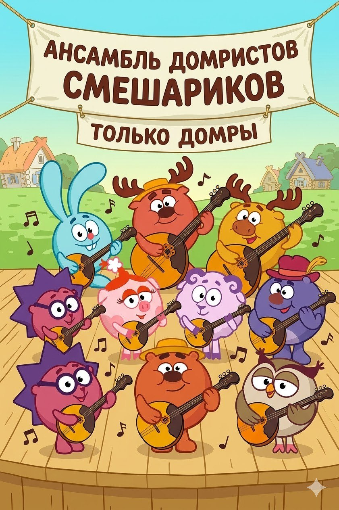

# Домра

**Раздел:** 7. [Культура](../../../2.1_society/cause_and_effect_relationships/articles/why_rules_work.md) и [искусство](../../../7.2 Media, leisure and hobbies /what_you_can_read_and_watch_to_develop_your_taste/articles/aesthetics_and_taste.md) → 7.1 Искусство → [Музыкальные инструменты](../../../1.2_natural_sciences/physics_in_everyday_life/Q170475.md)

---

## [История](../../../2.1_society/cause_and_effect_relationships/articles/lessons_of_history.md) создания

До́мра — старинный [русский](balalaika.md) [щипковый](balalaika.md) инструмент с богатой и немного загадочной историей. Первые упоминания о домре встречаются в русских летописях и документах конца XVI века. В то [время](../../../1.2_natural_sciences/physics_in_everyday_life/Q20702.md) домра была распространена среди скоморохов — народных певцов и музыкантов, игравших на ярмарках и царских пирах. Скоморохи нередко использовали домру для сатирических куплетов, что навлекало на них [гнев](../../../4.2/critical_thinking/articles/influence_of_emotions.md) церкви.

В **1648 году** [царь](../../../2.2_society/history/articles/Third_Rome.md) [Алексей Михайлович](../../../2.2_society/history/articles/time_of_troubles.md) издал указ, запрещавший скоморошество. [Инструменты](../../../1.2_natural_sciences/physics_in_everyday_life/Q36253.md) конфисковывали и сжигали. Домра оказалась под запретом и, по всей видимости, вышла из широкого употребления.

Долгое время историки считали, что домра полностью исчезла. Но в конце XIX века **Василий [Андреев](balalaika.md)** (1861–1918) — выдающийся музыкант и пропагандист народных инструментов — нашёл в Вятской губернии полукруглый инструмент с тремя струнами, который местные называли «балалайкой». [Андреев](balalaika.md) и мастер Семён Налимов в **1896 году** реконструировали инструмент и назвали его «домрой».

Так началось **возрождение домры**: Андреев создал целое семейство инструментов — малая, альт, [тенор](cello.md), [бас](trombone.md), [контрабас](balalaika.md) домра — и основал первый Великорусский [оркестр](balalaika.md) народных инструментов.

---

## [Виды](../../../3.1_healthy_lifestyle/pervaya_pomoshch/ushibi_porezy_ozhogi/08_porezy_sadiny_vidy.md) домры

- **Малая домра** (трёхструнная) — ведущий сопрановый инструмент в оркестре.
- **Альтовая домра** — [строй](oboe.md) квинтой ниже малой.
- **Теноровая домра** — промежуточный вид.
- **Басовая домра** — [низкий регистр](tuba.md).
- **Контрабасовая домра** — самая большая.
- **Четырёхструнная домра** — менее распространённый вариант с квартовым строем (как у скрипки).

---

## Конструкция

### Основные части

1. **Полусферический [корпус](guitar.md)**
2. **[Гриф](double_bass.md)**
3. **Голова грифа с колками**
4. **[Три струны](balalaika.md)**
5. **Медиатор**
6. **Подставка**

### Описание частей и [характеристики](../../../6.1_Independent_living_and_daily_living_skills/reasonable_spending/articles/comparison.md)

**[Корпус](../../../1.2_natural_sciences/physics_in_everyday_life/Q11223329.md)** — отличительная особенность домры — **полукруглый, выпуклый снизу** корпус (в отличие от плоской балалайки). У малой домры [длина](../../../1.2_natural_sciences/physics_in_everyday_life/Q25358.md) корпуса — около **30–35 см**, ширина — около **23–27 см**.

**[Гриф](double_bass.md)** — длина около **38–42 см**; с металлическими ладами (как у гитары, а не как у скрипки). Количество ладов — **16–19**.

**[Три струны](balalaika.md)** малой домры настраиваются в квинты: **ми — ля — ре** (как у скрипки, но на октаву ниже в среднем регистре). [Диапазон](clarinet.md) малой домры — около **3 октав**.

**Медиатор** — тонкая пластиковая или черепаховая пластинка для извлечения звука; характерная [техника](../../../1.2_natural_sciences/physics_in_everyday_life/Q133673.md) домры — **[тремоло](mandolin.md)** (быстрые удары медиатором по струне, создающие эффект непрерывного звука).

### [Материалы](../../../1.2_natural_sciences/physics_in_everyday_life/Q487005.md)

- Корпус: ель ([дека](cello.md)), клён (обечайки и задняя [дека](cello.md))
- Гриф: клён, берёза
- Накладка грифа: эбен, палисандр
- [Струны](banjo.md): [металл](../../../1.2_natural_sciences/physics_in_everyday_life/Q2225.md) (сталь, [нейлон](ukulele.md) с обмоткой)
- Медиатор: пластик, карбон

---

## В каких ансамблях используется

- **[Русский](balalaika.md) [народный](balalaika.md) [оркестр](balalaika.md)** — основная роль: домры трёх размеров образуют «смычковую» секцию
- **Домровое трио/[квартет](cello.md)**
- **Камерный ансамбль** (домра + [фортепиано](piano.md))
- **[Соло](cello.md)** (произведения Цыганкова, Будашкина)
- **[Народный](balalaika.md) ансамбль** (домра + [балалайка](balalaika.md) + [баян](accordion.md))

---

## Известные музыканты

- **Александр Цыганков** (р. 1948) — крупнейший российский [виртуоз](violin.md) и [композитор](../../../8.1_entertainment/articles/composer.md) для домры.
- **Тамара Вольская** (р. 1938) — знаменитый педагог и исполнитель.
- **Рустам Рахимов** — современный лауреат международных конкурсов.
- **[Владимир](../../../2.2_society/history/articles/Kievan_Rus.md) Краснощёков** — один из ведущих исполнителей и педагогов в области домры.

---

## Интересные [факты](../../../1.2_natural_sciences/physics_in_everyday_life/Q17737.md)

- Домра была фактически **изобретена заново** в конце XIX века: оригинальный инструмент настолько изменился, что это де-факто реконструкция.
- Техника [тремоло](mandolin.md) на домре позволяет имитировать непрерывный [звук](../../../1.2_natural_sciences/why_science_help_understand_world/physics.md) смычкового инструмента, поэтому в оркестре домры звучат как «струнные».
- Домра — один из немногих инструментов, у которого нет прямого аналога в западной музыке.
- На домре можно играть как медиатором, так и **пальцами** (в folk-стиле).
- В России проводится крупный **Международный конкурс домристов** в Москве.

---

## [Советы](../../../7.2_leisure/useful_and_interesting_leisure/articles/mistakes_in_choosing_hobby.md) начинающим

1. **Правильно держи медиатор.** Между большим и указательным пальцем; ребро медиатора перпендикулярно струне. Не зажимай слишком сильно.

2. **Освой технику тремоло.** Это главная техника домры. Начинай медленно (удар — пауза — удар) и постепенно ускоряй до слитного звука.

3. **Следи за углом удара.** Медиатор должен ударять по струне под небольшим углом; слишком прямой или слишком косой удар портит [тембр](../../../1.2_natural_sciences/neurobiology_for_teens/articles/18_music_chills.md).

4. **Начни с открытых струн и простых мелодий.** «Во [поле](../../../5.2_cybersecurity/cpp_fundamentals/13_struct.md) берёза стояла» — отличная первая пьеса.

5. **Учись у педагога.** [Постановка](../../../8.1_entertainment/articles/director.md) рук на домре имеет свои особенности; самостоятельно их трудно освоить правильно.

## Похожие статьи

- [Балалайка](balalaika.md)
- [Мандолина](mandolin.md)
- [Гитара](guitar.md)

---

*[Автор](../../../5.1_technology_and_digital_literacy/information and media literacy/авторское_право_и_честное_использование.md): Кудаева Виктория (@vkudaevaa)*

*Использованные [нейросети](../../../2.1_society/cause_and_effect_relationships/articles/ai_causality.md): Claude Sonnet 4.5, Nano Banana 2*