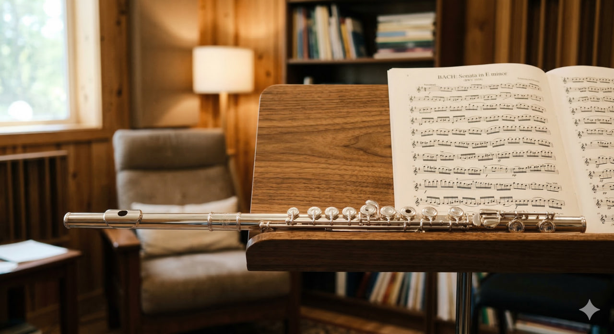

# Флейта

**Раздел:** 7. [Культура](../../../2.1_society/cause_and_effect_relationships/articles/why_rules_work.md) и [искусство](../../../7.2 Media, leisure and hobbies /what_you_can_read_and_watch_to_develop_your_taste/articles/aesthetics_and_taste.md) → 7.1 Искусство → [Музыкальные инструменты](../../../1.2_natural_sciences/physics_in_everyday_life/Q170475.md)

---

## [История](../../../2.1_society/cause_and_effect_relationships/articles/lessons_of_history.md) создания

Фле́йта — один из древнейших музыкальных инструментов в истории человечества. Самая старая известная флейта найдена в пещере Холе-Фельс в Германии и изготовлена из кости грифа-стервятника: её [возраст](../../../5.1_technology_and_digital_literacy/information and media literacy/карта_компетенций_по_возрастам.md) составляет около **40 000 лет**. Аналогичные [инструменты](../../../1.2_natural_sciences/physics_in_everyday_life/Q36253.md) той же эпохи найдены в Словении и на других стоянках древних людей.

В Древнем Египте флейты использовались в религиозных ритуалах ещё в 3000 году до н.э. В Китае нашли костяную флейту «цзяли» возрастом около 9000 лет. В Древней Греции попречная флейта (авлос) занимала важное место в театральных постановках и культе Диониса.

В средневековой Европе была распространена блок-флейта (recorder) — инструмент, в который дуют с одного конца. В эпоху Ренессанса и [Барокко](oboe.md) эти инструменты достигли расцвета: Иоганн Себастьян [Бах](cello.md), Гендель и [Вивальди](bassoon.md) писали для флейты великолепные произведения.

[Революция](../../../2.1_society/cause_and_effect_relationships/articles/lessons_of_history.md) в конструкции произошла в 1832 году, когда немецкий мастер **Теобальд [Бём](clarinet.md)** (1794–1881) разработал новую систему клапанов и расположения отверстий, основанную на акустических принципах. Его изобретение стало основой современной концертной флейты и носит имя «Система Бёма». Флейта Бёма звучит ярче, чище и технически гибче, чем все её предшественницы.

---

## [Виды](../../../3.1_healthy_lifestyle/pervaya_pomoshch/ushibi_porezy_ozhogi/08_porezy_sadiny_vidy.md) флейты

- **Концертная (поперечная) флейта** — стандартный инструмент в диапазоне 3 октав, [строй](oboe.md) [C](../../../2.1_society/how_and_where_find_friends/articles/sora_drug.md).
- **Флейта-пикколо** — вдвое меньше обычной, звучит на октаву выше; пронзительный, яркий [тембр](../../../1.2_natural_sciences/neurobiology_for_teens/articles/18_music_chills.md).
- **Альтовая флейта** — [строй](oboe.md) G, на кварту ниже концертной; более тёмный, мягкий [звук](../../../1.2_natural_sciences/why_science_help_understand_world/physics.md).
- **Басовая флейта** — строй C, на октаву ниже концертной; редко используется.
- **Контрабасовая флейта** — на две октавы ниже концертной.
- **Блок-флейта (recorder)** — дуют в торец; популярна в музыке Ренессанса и [Барокко](oboe.md), а также в начальном обучении.
- **Пан-флейта** — набор трубок разной длины без отверстий, [звук](../../../1.2_natural_sciences/physics_in_everyday_life/Q124003.md) извлекается обдуванием открытого торца.
- **[Ирландская](bagpipe.md) флейта** — деревянная флейта с простой системой без клапанов Бёма.

---

## Конструкция

### Основные части

1. **Мундштучный [раструб](french_horn.md) (головка)**
2. **[Тело](../../../1.2_natural_sciences/why_science_help_understand_world/organism.md) (средняя секция)**
3. **Нижнее колено**
4. **Клапанный механизм**
5. **Амбушюр (лабиальное [отверстие](../../../1.2_natural_sciences/physics_in_everyday_life/Q133900.md))**

### Описание частей и [характеристики](../../../6.1_Independent_living_and_daily_living_skills/reasonable_spending/articles/comparison.md)

**Головка** — трубка длиной около **17 см**, в которой находится лабиальное отверстие (амбушюр) диаметром около 12×10 мм. Именно сюда направляется воздушная струя. Небольшая пробка внутри головки регулирует акустику.

**[Тело](../../../1.2_natural_sciences/why_science_help_understand_world/organism.md)** — средняя секция длиной около **33 см** с основными клапанами (клавишами) для пальцев.

**Нижнее колено** — концевая часть длиной около **18 см** с несколькими дополнительными клапанами (до нижнего ре и до).

**Полная [длина](../../../1.2_natural_sciences/physics_in_everyday_life/Q25358.md)** концертной флейты — около **67 см**. Диаметр трубки — **19 мм**.

**Клапанный механизм** — 16 клапанов (кольца и [клавиши](accordion.md)), закрывающих акустические отверстия. В системе Бёма отверстия расположены в акустически оптимальных местах, а не там, куда удобно дотянуться пальцами.

**[Диапазон](clarinet.md)** — концертная флейта охватывает около **3 октав**: от до первой октавы до до четвёртой (иногда выше с использованием флажолетных техник).

### [Материалы](../../../1.2_natural_sciences/physics_in_everyday_life/Q487005.md)

- Студенческие флейты: никелированная латунь или мельхиор
- Профессиональные: серебро (92,5%), золото (9–18 карат), платина
- Деревянные флейты: черное [дерево](castanets.md), гренадил, розовое [дерево](../../../1.2_natural_sciences/physics_in_everyday_life/Q487005.md)
- [Клапаны](clarinet.md): серебро, золото, нейзильбер

---

## В каких ансамблях используется

- **Симфонический [оркестр](balalaika.md)** (обычно 2–3 флейты, включая флейту-пикколо)
- **[Духовой оркестр](tuba.md)**
- **Флейтовое трио/[квартет](cello.md)** (ансамбли флейт)
- **Камерный ансамбль** (флейта + [скрипка](violin.md) + [фортепиано](piano.md) — флейтовое трио)
- **Джазовый ансамбль** (флейта распространена в джаз-фьюжн и боссанове)
- **Фолк-ансамбль** ([ирландская](bagpipe.md), индийская, латиноамериканская [музыка](../../../8.1_entertainment/articles/music.md))

---

## Известные музыканты

- **Жан-Пьер Рампаль** (1922–2000) — французский флейтист, сделавший флейту полноценным сольным концертным инструментом в XX веке.
- **Джеймс Голуэй** (р. 1939) — ирландский флейтист, прозванный «[Человек](../../../1.2_natural_sciences/why_science_help_understand_world/life_sciences.md) с золотой флейтой».
- **Хасима Никитиа** (р. 1984) — один из ярчайших современных флейтистов.
- **Херби Манн** (1930–2003) — джазовый флейтист, [пионер](../../modern_technological_art/articles/1.2_nam_june_paik.md) джаз-флейты.
- **Ян Андерсон** (р. 1947) — рок-флейтист, лидер Jethro Tull, знаменитый своей стойкой «аист» при игре.
- **Николас Арнонкур** — дирижёр и исполнитель на барочных инструментах, специалист по музыке XVII–XVIII веков.

---

## Интересные [факты](../../../1.2_natural_sciences/physics_in_everyday_life/Q17737.md)

- Флейта — единственный [деревянный](didgeridoo.md) [духовой инструмент](../../../8.1_entertainment/articles/musical_instruments.md), в котором звук производится не тростью (язычком), а воздушной струёй, направленной на острый край отверстия.
- Профессиональные флейты из чистого золота стоят от **100 000 долларов** и выше.
- Флейта-пикколо — один из самых громких инструментов оркестра относительно своего размера.
- Флейта встречается практически во всех музыкальных культурах мира — от индийской бансури до андской кены.
- В Японии традиционная флейта **[сякухати](koto.md)** изготавливается из бамбука и используется в медитативной музыке дзен-буддизма.
- Флейта может звучать тихо — до 85 дБ — или громко, в особых регистрах достигая 100 дБ.
- Бетховен изначально не любил флейту, называя её «детским инструментом», однако позже включил её в несколько своих шедевров.

---

## [Советы](../../../7.2_leisure/useful_and_interesting_leisure/articles/mistakes_in_choosing_hobby.md) начинающим

1. **Начни с воздушной струи.** Поднеси стакан к губам и дуй, чтобы услышать звук на его краю — это принцип флейты. Сначала учись производить звук на одной только головке.

2. **Правильно держи флейту.** Инструмент направлен вправо перпендикулярно голове. Левая рука вверху, правая — снизу. Большой палец левой руки поддерживает флейту снизу.

3. **Следи за амбушюром.** Нижняя губа касается края отверстия, верхняя формирует воздушную струю. Не зажимай губы слишком сильно.

4. **Начни с простых нот.** Нота «ля» первой октавы — хорошая отправная точка. Освой [диапазон](../../../5.1_technology_and_digital_literacy/how_internet_works/articles/wifi/radio.md) одной октавы, потом расширяй.

5. **Дыши диафрагмой.** Глубокое [дыхание](../../../1.2_natural_sciences/why_science_help_understand_world/organism.md) животом даёт больше воздуха и лучший контроль динамики.

6. **Занимайся с зеркалом.** Оно поможет контролировать положение инструмента и форму губ.

7. **Тренируй гаммы и арпеджио.** Флейта требует беглости пальцев. Ежедневные гаммы в разных темпах — залог чистой [техники](../../../8.2_future_and_path_choice/articles/03_stress_management.md).

## Похожие статьи

- [Гобой](oboe.md)
- [Кларнет](clarinet.md)
- [Фагот](bassoon.md)
- [Дудук](duduk.md)
- [Волынка](bagpipe.md)

---

*[Автор](../../../5.1_technology_and_digital_literacy/information and media literacy/авторское_право_и_честное_использование.md): Мишин Сергей (@oryce)*

*Использованные [нейросети](../../../2.1_society/cause_and_effect_relationships/articles/ai_causality.md): Claude Sonnet 4.5, Nano Banana 2*