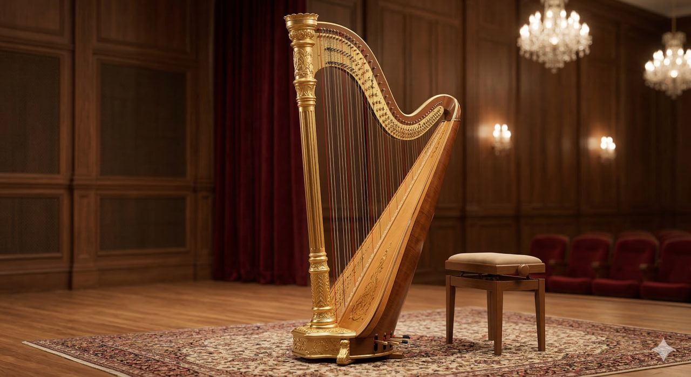

# Арфа

**Раздел:** 7. [Культура](../../../2.1_society/cause_and_effect_relationships/articles/why_rules_work.md) и [искусство](../../../7.2 Media, leisure and hobbies /what_you_can_read_and_watch_to_develop_your_taste/articles/aesthetics_and_taste.md) → 7.1 Искусство → [Музыкальные инструменты](../../../1.2_natural_sciences/physics_in_everyday_life/Q170475.md)

---

## [История](../../../2.1_society/cause_and_effect_relationships/articles/lessons_of_history.md) создания

А́рфа — один из старейших струнных инструментов человечества. Её [история](../../../1.2_natural_sciences/physics_in_everyday_life/Q11469.md) насчитывает более **5000 лет**. Древнейшие изображения арфоподобных инструментов найдены в Месопотамии (современный Ирак) и датируются примерно **3000 годом до н.э.**. Египетские фрески из гробниц показывают музыкантов с угловыми арфами, игравших на пирах фараонов.

В Средние века арфа широко распространилась по Европе — особенно в Ирландии и Уэльсе, где стала национальным инструментом. [Ирландская](bagpipe.md) арфа изображена на гербе Ирландии и монетах [евро](../../../2.2_history/world_economy_on_fingers/articles/rezervnaya_valyuta.md).

Долгое [время](../../../1.2_natural_sciences/physics_in_everyday_life/Q20702.md) арфы не имели педального механизма, что ограничивало их хроматические возможности. В **1697 году** баварский мастер Хохбрукер изобрёл первые педали, позволявшие менять [строй](oboe.md) на полтона. Это была «однодвижная» педальная система.

Революцию совершил французский мастер **Себастьян Эрар** (1752–1831), создавший в **1811 году** систему «двойного педального механизма». Теперь каждая [педаль](piano.md) имела три положения: нейтральное, нажатое вполовину и нажатое до упора — соответственно бемоль, бекар и диез. Это дало арфе полный [хроматический](bayan.md) [диапазон](clarinet.md). Арфа Эрара стала основой современного инструмента.

---

## [Виды](../../../3.1_healthy_lifestyle/pervaya_pomoshch/ushibi_porezy_ozhogi/08_porezy_sadiny_vidy.md) арфы

- **Концертная (педальная) арфа** — 47 струн, 7 педалей; полный [хроматический](bayan.md) [диапазон](../../../5.1_technology_and_digital_literacy/how_internet_works/articles/wifi/radio.md).
- **[Народная](bagpipe.md) (безпедальная, рычажная) арфа** — [диатоническая](harmonica.md); маленькие рычаги поднимают отдельные [струны](banjo.md).
- **[Ирландская](bagpipe.md)** (Celtic harp) — традиционный небольшой инструмент.
- **Готическая арфа** — средневековый вариант с более тонкими струнами.
- **[Электрическая](guitar.md) арфа** — оснащена звукоснимателем.

---

## Конструкция

### Основные части

1. **Звуковой ящик (резонатор)**
2. **Шейка**
3. **Колонна (пилон)**
4. **[Струны](banjo.md)**
5. **Педальный механизм**
6. **Диски (дискусы)**

### Описание частей и [характеристики](../../../6.1_Independent_living_and_daily_living_skills/reasonable_spending/articles/comparison.md)

**[Высота](../../../1.2_natural_sciences/physics_in_everyday_life/Q155640.md)** концертной арфы — около **185 см**, [вес](../../../1.2_natural_sciences/physics_in_everyday_life/Q11023.md) — **35–40 кг**.

**Струны** — 47 струн, охватывающих диапазон **6,5 октав**: от ре контроктавы до фа-диез четвёртой октавы. Нижние струны — металлические или обвитые; средние — жильные или нейлоновые; верхние — нейлоновые. Для ориентации: струны ноты «до» окрашены в **красный** [цвет](../../../1.2_natural_sciences/physics_in_everyday_life/Q1075.md), «фа» — в **синий**.

**Педальный механизм** — 7 педалей (по одной на каждую ноту гаммы: до, ре, ми, фа, [соль](../../../3.1_healthy lifestyle/vrednye_privychki/articles/myths_about_soft_drugs.md), ля, [си](../../../1.2_natural_sciences/physics_in_everyday_life/Q12453.md)). Каждая [педаль](piano.md) связана со стержнями внутри колонны и проволоками в шейке, которые вращают диски у каждой струны, укорачивая её и повышая [звук](../../../1.2_natural_sciences/why_science_help_understand_world/physics.md) на полтона или тон.

**Звуковой ящик** — треугольная деревянная конструкция, резонирующая полость; изготавливается из ели (верхняя [дека](cello.md)) и клёна.

**Колонна** — вертикальная [опора](../../../1.2_natural_sciences/physics_in_everyday_life/Q2945123.md), соединяющая педальный механизм с шейкой.

### [Материалы](../../../1.2_natural_sciences/physics_in_everyday_life/Q487005.md)

- [Дека](cello.md): ель
- [Корпус](guitar.md): клён, красное [дерево](castanets.md)
- Струны: [нейлон](ukulele.md), жила, сталь, [нейлон](ukulele.md) с обмоткой
- Педальный механизм: латунь, сталь

---

## В каких ансамблях используется

- **Симфонический [оркестр](balalaika.md)** (1–2 арфы; особая роль в импрессионизме)
- **Камерный ансамбль** ([флейта](flute.md) + арфа — популярный дуэт)
- **[Соло](cello.md)** (сонаты, этюды, транскрипции)
- **Джазовый ансамбль** (редко, но эффектно)
- **[Народный](balalaika.md) ансамбль** (ирландская традиция)
- **Вокальный аккомпанемент** (романсы, песни)

---

## Известные музыканты

- **Лилиан Боддикс** — ирландская арфистка, [исследователь](../../../1.2_natural_sciences/why_science_help_understand_world/experiment.md) кельтской [традиции](../../../2.1_society/cause_and_effect_relationships/articles/why_rules_work.md).
- **Нинон Вальен** — французская концертная арфистка начала XX века.
- **Ксавье де Местр** (р. 1973) — французский арфист, солист и педагог.
- **Ясмин Аль-Халал** — современная виртуозная арфистка.
- **Карлос Салседо** (1885–1961) — испанский арфист, [виртуоз](violin.md) и новатор нотации для арфы.

---

## Интересные [факты](../../../1.2_natural_sciences/physics_in_everyday_life/Q17737.md)

- Арфа — государственный символ **Ирландии** и единственный [музыкальный инструмент](../../../8.1_entertainment/articles/musical_instruments.md), который одновременно является эмблемой государства.
- Натяжение всех 47 струн концертной арфы суммарно составляет около **1 тонны**.
- В оркестре арфа может играть **глиссандо** — скольжение по всем 47 струнам за долю секунды — один из самых впечатляющих оркестровых эффектов.
- Арфа упоминается в Библии как инструмент царя Давида.
- Дебюсси написал «Танец» и «Прелюдию к послеполудню фавна» с великолепными арфовыми партиями — они считаются вершиной оркестрового импрессионизма.

---

## [Советы](../../../7.2_leisure/useful_and_interesting_leisure/articles/mistakes_in_choosing_hobby.md) начинающим

1. **Начни с народной арфы.** Концертная педальная арфа очень дорога (от 10 000 евро). Для старта подойдёт ирландская ([кельтская](bagpipe.md)) арфа за [500](../../../5.1_technology_and_digital_literacy/how_internet_works/articles/http_https/http_https.md)–2000 евро.

2. **Правильно сядь.** Арфа наклонена к плечу исполнителя. Сиди прямо, инструмент прислонён к правому плечу.

3. **Используй только четыре пальца.** На арфе играют большим, указательным, средним и безымянным пальцами — мизинец не используется.

4. **Учи «закрытие».** После щипка струны надо сразу закрыть её ладонью — это создаёт чёткий красивый [звук](../../../1.2_natural_sciences/physics_in_everyday_life/Q124003.md) и гасит лишние обертоны.

5. **Запомни цветные струны.** Красные — до, синие (чёрные) — фа. Это твоя навигационная система.

6. **Тренируй обе руки отдельно.** Сначала правая ([мелодия](../../../8.1_entertainment/articles/composer.md)) — потом левая ([бас](trombone.md) и [аккорды](ukulele.md)), потом вместе.

7. **Береги [ногти](../../../3.1_healthy lifestyle/vrednye_privychki/articles/nailbiting.md).** Арфисты обычно не обрезают ногти на рабочих пальцах, чтобы [тембр](../../../1.2_natural_sciences/neurobiology_for_teens/articles/18_music_chills.md) был богаче. Ногти — часть инструмента.

## Похожие статьи

- [Кото](koto.md)
- [Гитара](guitar.md)

---

*[Автор](../../../5.1_technology_and_digital_literacy/information and media literacy/авторское_право_и_честное_использование.md): Иванченко Макар (@kalane15)*

*Использованные [нейросети](../../../2.1_society/cause_and_effect_relationships/articles/ai_causality.md): Claude Sonnet 4.5, Nano Banana 2*