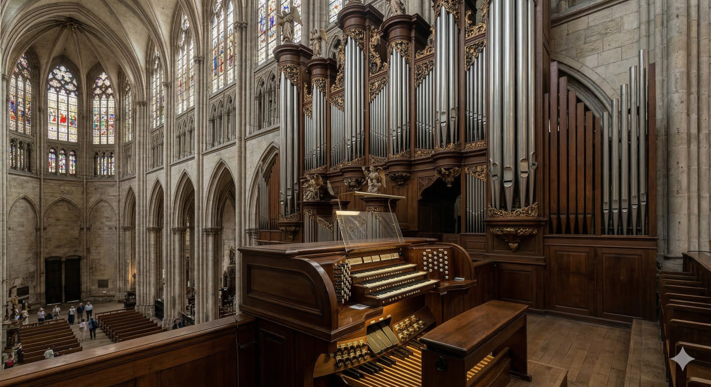

# Орган

**Раздел:** 7. [Культура](../../../2.1_society/cause_and_effect_relationships/articles/why_rules_work.md) и [искусство](../../../7.2 Media, leisure and hobbies /what_you_can_read_and_watch_to_develop_your_taste/articles/aesthetics_and_taste.md) → 7.1 Искусство → [Музыкальные инструменты](../../../1.2_natural_sciences/physics_in_everyday_life/Q170475.md)

---

## [История](../../../2.1_society/cause_and_effect_relationships/articles/lessons_of_history.md) создания

Орга́н — величайший и сложнейший [музыкальный инструмент](../../../8.1_entertainment/articles/musical_instruments.md), созданный человечеством. Его [история](../../../1.2_natural_sciences/physics_in_everyday_life/Q11469.md) начинается в Древней Греции: около **246 года до н.э.** механик **Ктесибий Александрийский** изобрёл *гидравлос* — водяной орган, в котором [давление](../../../1.1_structure_of_the_world/matter/articles/07_gases.md) воздуха регулировалось с помощью воды. Гидравлос звучал на торжествах, в цирке и на военных парадах Рима.

В Средние века орган стал главным инструментом христианской церкви. Папа Стефан II получил орган в дар от византийского императора в 757 году, и с тех пор он обосновался в европейских соборах. Монахи и органисты эпохи Романики и Готики (IX–XIV вв.) постепенно совершенствовали инструмент: добавляли новые [регистры](../../../5.1_technology_and_digital_literacy/operating system/articles/process.md), мануалы, педальную клавиатуру.

В эпоху [Барокко](oboe.md) орган достиг расцвета. **Иоганн Себастьян [Бах](cello.md)** (1685–1750) — величайший органист и органный [композитор](../../../8.1_entertainment/articles/composer.md) всех времён — создал произведения, которые до сих пор считаются вершиной мирового музыкального искусства: токкаты, фуги, хоральные прелюдии.

В XIX–XX веках появились электрические органы, пневматические и электронные системы управления. В 1930-х годах компания Hammond создала **электроорган Хаммонда**, завоевавший [джаз](clarinet.md) и [рок](electric_guitar.md).

---

## [Виды](../../../3.1_healthy_lifestyle/pervaya_pomoshch/ushibi_porezy_ozhogi/08_porezy_sadiny_vidy.md) органа

- **Трубный (пневматический) орган** — классический церковный инструмент с металлическими и деревянными трубами.
- **Электронный орган** — синтезирует [звук](../../../1.2_natural_sciences/why_science_help_understand_world/physics.md) электронными средствами; компактен и доступен.
- **Орган Хаммонда** — электромеханический инструмент; классика джаза и рока.
- **Портативный орган (портатив)** — маленький переносной средневековый инструмент.
- **Позитив** — небольшой орган, устанавливаемый на полу или столе; применялся в эпоху [Барокко](oboe.md).

---

## Конструкция

### Основные части

1. **[Трубы](../../../5.1_technology_and_digital_literacy/operating system/articles/IPC.md)**
2. **Мануалы (ручные клавиатуры)**
3. **Педальная [клавиатура](piano.md)**
4. **Регистры (тяги и [кнопки](accordion.md))**
5. **Воздуховодная система (ветряные ящики)**
6. **[Мех](accordion.md)/вентилятор**

### Описание частей и [характеристики](../../../6.1_Independent_living_and_daily_living_skills/reasonable_spending/articles/comparison.md)

**Трубы** — основа органа. В больших соборных органах их может быть от **нескольких сотен до более чем 30 000**. Трубы бывают лабиальные ([звук](../../../1.2_natural_sciences/physics_in_everyday_life/Q124003.md) производит воздушная струя на краю) и язычковые (звук издаёт металлический язычок). [Высота](../../../1.2_natural_sciences/physics_in_everyday_life/Q155640.md) труб — от нескольких сантиметров до **10 метров** (для самых низких регистров).

**Мануалы** — органисты называют клавиатуры «мануалами». Большой орган имеет **2–5 мануалов**, расположенных ярусами. Стандартный [объём](../../../1.2_natural_sciences/physics_in_everyday_life/Q39297.md) каждого мануала — **61 клавиша** (5 октав).

**Педальная [клавиатура](piano.md)** — играется ногами. Стандартный объём — **32 [педали](harp.md)** (2,5 октавы). [Педали](harp.md) отвечают за самые низкие, «гудящие» ноты органа.

**Регистры** — рычаги или [кнопки](accordion.md), включающие отдельные ряды труб. Большой орган имеет **50–[200](../../../5.1_technology_and_digital_literacy/how_internet_works/articles/http_https/http_https.md) регистров**; их комбинации создают бесчисленное разнообразие тембров.

**Воздуховодная система** — ветряные ящики под трубами; [клапаны](clarinet.md), управляемые клавишами, открывают [воздух](../../../1.2_natural_sciences/why_science_help_understand_world/environmental_sciences.md) в нужные трубы.

**[Мех](accordion.md)/вентилятор** — исторически меха качались вручную (несколько помощников-«кальканты»); сейчас используются электрические вентиляторы.

### [Материалы](../../../1.2_natural_sciences/physics_in_everyday_life/Q487005.md)

- Трубы: олово, свинец ([сплавы](../../../1.2_natural_sciences/physics_in_everyday_life/Q29539.md)), медь, цинк; деревянные — из ели, дуба, ореха
- [Корпус](guitar.md): дуб, орех, красное [дерево](castanets.md)
- [Клавиши](accordion.md): [дерево](../../../1.2_natural_sciences/physics_in_everyday_life/Q487005.md) + пластик/слоновая кость

---

## В каких ансамблях используется

- **Церковная служба** (сопровождение хора, литургия)
- **[Соло](cello.md)** (токкаты, фуги, транскрипции Баха и романтиков)
- **[Оркестр](balalaika.md) + орган** (Saint-Saëns «Органная симфония», Малер)
- **Орган + хор** (оратории, мессы)
- **Джазовый ансамбль** (орган Хаммонда + [гитара](guitar.md) + [ударные](marimba.md))
- **Рок-группа** (орган как клавишный инструмент)

---

## Известные музыканты

- **Иоганн Себастьян [Бах](cello.md)** (1685–1750) — вершина органного барокко; его токкаты и фуги известны даже людям, далёким от классики.
- **Оливье Мессиан** (1908–1992) — французский органист и [композитор](../../../7.2 Media, leisure and hobbies/Computer games/articles/dream_team/composer.md), мистик и новатор.
- **Дитрих Букстехуде** (1637–1707) — датско-немецкий органный мастер, учитель Баха.
- **Джимми Смит** (1928–2005) — великий джазовый органист, [виртуоз](violin.md) Хаммонда.
- **Камилл [Сен-Санс](xylophone.md)** (1835–1921) — органист и [автор](../../../5.1_technology_and_digital_literacy/information and media literacy/авторское_право_и_честное_использование.md) «Органной симфонии».

---

## Интересные [факты](../../../1.2_natural_sciences/physics_in_everyday_life/Q17737.md)

- Самый большой орган в мире — **Boardwalk Hall Auditorium Organ** в Атлантик-Сити, США: у него **33 [112](../../../3.1_healthy_lifestyle/pervaya_pomoshch/ushibi_porezy_ozhogi/03_obschie_pravila_algorithm.md) труб**.
- Органные произведения Баха часто исполняются на концертах в переложении для оркестра или других инструментов.
- [Строительство](../../../1.2_natural_sciences/physics_in_everyday_life/Q487005.md) большого соборного органа занимает **от 2 до 10 лет** и стоит несколько миллионов [евро](../../../2.2_history/world_economy_on_fingers/articles/rezervnaya_valyuta.md).
- Орган называют «королём инструментов» — за огромный [диапазон](clarinet.md), сложность конструкции и мощь звука.
- В некоторых соборах трубы органа настолько длинные, что они скрыты за стенами [здания](../../../1.2_natural_sciences/physics_in_everyday_life/Q83301.md).

---

## [Советы](../../../7.2_leisure/useful_and_interesting_leisure/articles/mistakes_in_choosing_hobby.md) начинающим

1. **Начни с [фортепиано](piano.md).** Орган требует крепкой клавиатурной [техники](../../../8.2_future_and_path_choice/articles/03_stress_management.md); базовые [навыки](../../../7.2_leisure/useful_and_interesting_leisure/articles/computer_games_with_benefit.md) [фортепиано](piano.md) очень помогут.

2. **Освой педальную технику.** Ноги должны играть независимо от рук. Начни с простых педальных упражнений: поочерёдные удары носком и пяткой.

3. **Изучи регистровку.** Правильный [выбор](../../../2.1_society/cause_and_effect_relationships/articles/personal_choice.md) регистров — половина исполнительского искусства. Учись комбинировать тембры.

4. **Слушай Баха.** Его токкаты и прелюдии — лучшая [школа](../../../3.1. healthy lifestyle/Sleep, nutrition, and adolescent energy/articles/healthy_school_snacks.md) органного мышления.

5. **Используй легато.** На органе нет педали сустейна — звук звучит ровно, пока клавиша нажата. Плавная смена пальцев (легато) — основа органной техники.

6. **Занимайся в церкви или консерватории.** Домашних органов практически не бывает; ищи доступ к инструменту.

## Похожие статьи

- [Фортепиано](piano.md)
- [Синтезатор](synthesizer.md)
- [Аккордеон](accordion.md)
- [Карильон](carillon.md)

---

*[Автор](../../../4.2_thinking_and_working_information/how_to_search_information/articles/copypaste.md): Кудаева Виктория (@vkudaevaa)*

*Использованные [нейросети](../../../2.1_society/cause_and_effect_relationships/articles/ai_causality.md): Claude Sonnet 4.5, Nano Banana 2*