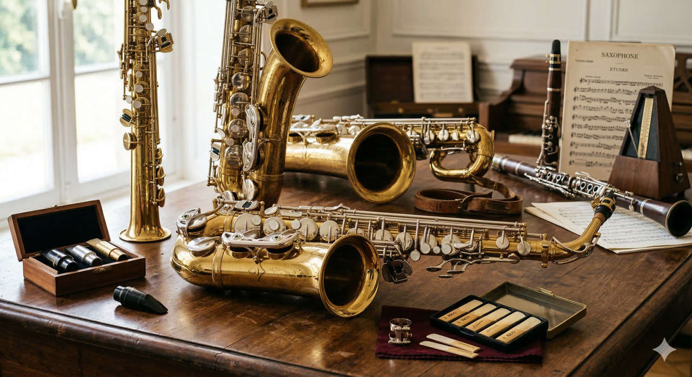

# Саксофон

**Раздел:** 7. [Культура](../../../2.1_society/cause_and_effect_relationships/articles/why_rules_work.md) и [искусство](../../../7.2 Media, leisure and hobbies /what_you_can_read_and_watch_to_develop_your_taste/articles/aesthetics_and_taste.md) → 7.1 Искусство → [Музыкальные инструменты](../../../1.2_natural_sciences/physics_in_everyday_life/Q170475.md)

---

## [История](../../../2.1_society/cause_and_effect_relationships/articles/lessons_of_history.md) создания

Саксофо́н — один из немногих классических музыкальных инструментов, чьё [авторство](../../modern_technological_art/articles/6.4_holly_herndon.md) известно точно. Его изобрёл бельгийский мастер **Адольф Сакс** (Антуан-Жозеф Сакс, 1814–1894). Сакс с детства работал в мастерской отца — известного производителя духовых инструментов — и с юности экспериментировал с конструкциями.

В 1840-е годы Адольф Сакс поставил перед собой задачу: создать инструмент, сочетающий мощь медных духовых (таких как [труба](trumpet.md)) с гибкостью и мягкостью деревянных (кларнета, гобоя). Он взял корпус-конус из металла (латуни) и добавил одинарный тростниковый язычок ([мундштук](trumpet.md)), характерный для кларнета. В результате появился принципиально новый инструмент.

В **1846 году** Адольф Сакс получил патент на семейство саксофонов — сразу в нескольких размерах. Он назвал инструмент в свою честь. Французский [композитор](../../../8.1_entertainment/articles/composer.md) Гектор [Берлиоз](gong.md) горячо поддержал изобретение и написал восторженную статью в парижских газетах.

Изначально саксофон использовался в военных оркестрах Франции. Однако настоящую мировую славу ему принёс **[джаз](clarinet.md)**: в 1920–1930-е годы в США саксофон стал центральным инструментом джазовых ансамблей. Колтрейн, Паркер, Гетц — эти имена навсегда связаны с историей саксофона.

---

## [Виды](../../../3.1_healthy_lifestyle/pervaya_pomoshch/ushibi_porezy_ozhogi/08_porezy_sadiny_vidy.md) саксофона

- **Сопрано** — прямой или немного изогнутый, [строй](oboe.md) B♭, самый высокий из распространённых.
- **Альт** — [строй](oboe.md) E♭, изогнутая [форма](../../modern_technological_art/articles/4.5_algorithmic_craft.md); самый популярный в классике и джазе.
- **[Тенор](cello.md)** — строй B♭, крупнее альта; классический джазовый инструмент.
- **Баритон** — строй E♭, большой и тяжёлый; [низкий](bassoon.md), мощный [звук](../../../1.2_natural_sciences/why_science_help_understand_world/physics.md).
- **[Бас](trombone.md)** — очень редкий, огромный инструмент.
- **Сопранино** — крошечный, строй E♭; выше сопрано.
- **[Контрабас](balalaika.md)** — экзотический вариант, почти не используется.

---

## Конструкция

### Основные части

1. **[Корпус](guitar.md) (конусная трубка)**
2. **[Мундштук](trumpet.md) с язычком (тростью)**
3. **Клапанный механизм**
4. **[Раструб](french_horn.md)**
5. **Октавный клапан**
6. **Шейка**

### Описание частей и [характеристики](../../../6.1_Independent_living_and_daily_living_skills/reasonable_spending/articles/comparison.md)

**[Корпус](../../../1.2_natural_sciences/physics_in_everyday_life/Q11223329.md)** — конусная металлическая трубка из латуни. У альт-саксофона общая [длина](../../../1.2_natural_sciences/physics_in_everyday_life/Q25358.md) около **70 см**, у [тенор](cello.md) — около **85 см**. Форма — характерный изогнутый «J».

**Мундштук** — насаживается на шейку; к нему крепится лигатурой тростниковая [трость](clarinet.md). Ширина раскрытия (гэп между концом мундштука и тростью) влияет на яркость звука.

**[Трость](clarinet.md) (язычок)** — плоская тростниковая пластинка; при вдувании воздуха она колеблется, создавая [звук](../../../1.2_natural_sciences/physics_in_everyday_life/Q124003.md). [Твёрдость](../../../1.2_natural_sciences/physics_in_everyday_life/Q11469.md) трости обозначается числами 1–5; новичкам подходят 2–2,5.

**Клапанный механизм** — около **23 клапана** (подушечек), закрывающих тональные отверстия по всему корпусу. [Клапаны](clarinet.md) управляются пальцами обеих рук.

**Октавный клапан** — специальный клапан для перехода в более высокий регистр.

**[Раструб](french_horn.md)** — расширяющийся конец корпуса, откуда выходит звук.

### [Материалы](../../../1.2_natural_sciences/physics_in_everyday_life/Q487005.md)

- Корпус: жёлтая латунь, реже [бронза](carillon.md) или медь
- [Покрытие](../../../1.2_natural_sciences/physics_in_everyday_life/Q34442.md): [лак](violin.md), серебрение, золочение
- Мундштук: эбонит, [металл](../../../1.2_natural_sciences/physics_in_everyday_life/Q2225.md), [стекло](../../../1.2_natural_sciences/physics_in_everyday_life/Q11469.md)
- Трость: бамбук (Arundo donax), синтетика

---

## В каких ансамблях используется

- **Джазовый [квартет](cello.md)/[квинтет](double_bass.md)/[биг-бэнд](trombone.md)** — главная роль в джазовой [секции](../../../7.2_leisure/useful_and_interesting_leisure/articles/clubs_and_sections.md)
- **Симфонический [оркестр](balalaika.md)** (редко, но в партитурах Равеля, Мусоргского-Равеля, Прокофьева)
- **Саксофонный [квартет](cello.md)** (сопрано + альт + тенор + баритон)
- **[Духовой оркестр](tuba.md)**
- **Рок- и поп-группы** (секция меди)
- **Камерный ансамбль** (в современной академической музыке)

---

## Известные музыканты

- **Чарли Паркер** (1920–1955) — «Птица», великий альт-саксофонист, создатель бопа.
- **Джон Колтрейн** (1926–1967) — тенор-саксофонист, мистик джаза, [автор](../../../5.1_technology_and_digital_literacy/information and media literacy/авторское_право_и_честное_использование.md) «A Love Supreme».
- **Стэн Гетц** (1927–1991) — мастер боссановы, прозванный «Звук» за исключительный [тембр](../../../1.2_natural_sciences/neurobiology_for_teens/articles/18_music_chills.md).
- **Сонни Роллинс** (р. 1930) — один из последних живых титанов джаза.
- **Каньонеро Маркес / Дейв Кузнецов** и другие — мастера современных жанров.
- **Сигурд Расчер** (1907–2001) — классический саксофонист, пропагандист академической музыки для саксофона.

---

## Интересные [факты](../../../1.2_natural_sciences/physics_in_everyday_life/Q17737.md)

- Несмотря на металлический корпус, саксофон официально относится к **деревянным духовым** инструментам — из-за тростникового язычка.
- Адольф Сакс в течение жизни пережил несколько покушений от конкурентов-завистников.
- Саксофон никогда не был включён в постоянный [состав](../../../1.2_natural_sciences/physics_in_everyday_life/Q11469.md) симфонического оркестра — он используется в отдельных произведениях.
- Первая запись саксофона на пластинку была сделана примерно в **1890 году**.
- В США саксофон настолько ассоциируется с джазом, что 6 ноября объявлено «Национальным днём саксофона».
- Некоторые трости стоят дороже хорошего мундштука — профессионалы тратят [часы](../../../1.2_natural_sciences/physics_in_everyday_life/Q20702.md) на подбор и доводку трости.

---

## [Советы](../../../7.2_leisure/useful_and_interesting_leisure/articles/mistakes_in_choosing_hobby.md) начинающим

1. **Выбери правильный вид.** Альт-саксофон — лучший старт: он не слишком большой, строй удобен, репертуар огромен.

2. **Научись правильно держать инструмент.** Саксофон висит на шейном ремне. Расположи его так, чтобы мундштук сам входил в рот без наклона шеи.

3. **Поставь правильный [амбушюр](flute.md).** Нижняя губа чуть подворачивается на нижние зубы, прикрывая их; мундштук входит примерно на 1–1,5 см. Верхние зубы лежат на мундштуке без давления.

4. **Начни с долгих звуков.** Сыграй ноту и держи её ровно 4–8 секунд. Это развивает поддержку воздухом.

5. **Осваивай аппликатуру постепенно.** Сначала изучи первую октаву (до–до), потом добавляй октавный клапан для второй.

6. **Заботься о трости.** Никогда не берись за трость влажными руками; перед игрой смачивай её во рту 1–2 минуты. Повреждённую трость сразу меняй.

7. **Слушай великих.** Включи Колтрейна, Паркера, Гетца — это лучший [урок](../../../5.1_technology_and_digital_literacy/information and media literacy/шаблон_урока_по_медиаграмотности.md) того, как должен звучать саксофон.

## Похожие статьи

- [Кларнет](clarinet.md)
- [Гобой](oboe.md)
- [Фагот](bassoon.md)

---

*[Автор](../../../4.2_thinking_and_working_information/how_to_search_information/articles/copypaste.md): Иванченко Макар (@kalane15)*

*Использованные [нейросети](../../../2.1_society/cause_and_effect_relationships/articles/ai_causality.md): Claude Sonnet 4.5, Nano Banana 2*