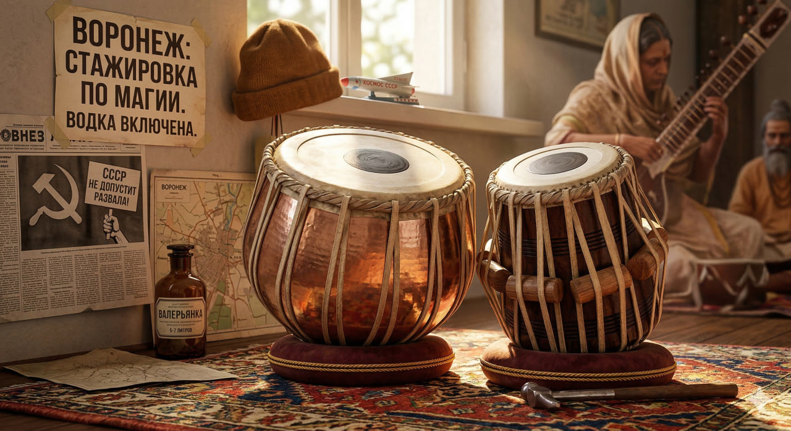

# Табла

**Раздел:** 7. [Культура](../../../2.1_society/cause_and_effect_relationships/articles/why_rules_work.md) и [искусство](../../../7.2 Media, leisure and hobbies /what_you_can_read_and_watch_to_develop_your_taste/articles/aesthetics_and_taste.md) → 7.1 Искусство → [Музыкальные инструменты](../../../1.2_natural_sciences/physics_in_everyday_life/Q170475.md)

---

## [История](../../../2.1_society/cause_and_effect_relationships/articles/lessons_of_history.md) создания

Та́бла — пара индийских ударных инструментов — является одним из главных инструментов классической индийской музыки и одним из самых технически сложных ударных в мире. [История](../../../1.2_natural_sciences/physics_in_everyday_life/Q11469.md) таблы насчитывает более **[500](../../../5.1_technology_and_digital_literacy/how_internet_works/articles/http_https/http_https.md) лет**.

Происхождение таблы связано со средневековой северо-индийской музыкальной традицией. По преданию, табла была изобретена в **XVIII веке** легендарным барабанщиком **Амир Хусрау** (1253–1325) — поэтом и музыкантом при делийском дворе. Согласно более научным версиям, табла как самостоятельный инструмент сформировалась в **XVII–XVIII веках**, скорее всего из древних барабанов **пакхавадж** и **дхолак**, разделённых пополам.

Первые достоверные изображения таблы относятся к **XVIII веку** — к живописи Могольской империи. С этого времени инструмент стал центральным в стиле **хиндустани** (северо-индийской классической музыки).

В XX веке табла приобрела мировую известность благодаря **Раму Дас Кумару**, **Закиру Хусейну** и их выступлениям с западными музыкантами. Особую роль сыграло [сотрудничество](../../../8.2_future/choosing_a_career_path/articles/team.md) ситариста **Рави Шанкара** с Джорджем Харрисоном из Beatles (1960–[1970-е](../../modern_technological_art/articles/1.3_participatory_art.md)).

---

## [Виды](../../../3.1_healthy_lifestyle/pervaya_pomoshch/ushibi_porezy_ozhogi/08_porezy_sadiny_vidy.md) и компоненты

Табла — это **пара** барабанов, а не один:

- **Дайна (дхина)** — правый барабан; меньший, [деревянный](didgeridoo.md), высокий тон; настраивается на определённую ноту (обычно тонику раги).
- **[Баян](accordion.md)** — левый барабан; больший, металлический, [низкий](bassoon.md) тон; неопределённой высоты.

---

## Конструкция

### Основные части

1. **Правый барабан (дайна)**
2. **Левый барабан ([баян](accordion.md))**
3. **Мембраны (пури)**
4. **Ремни-натяжители**
5. **Деревянные клинья**
6. **Чёрный центр (шьяхи)**

### Описание частей и [характеристики](../../../6.1_Independent_living_and_daily_living_skills/reasonable_spending/articles/comparison.md)

**Дайна** — [деревянный](didgeridoo.md) цилиндр диаметром около **13–15 см** и высотой около **25 см**. Покрыт сложной многослойной мембраной.

**Баян** — металлический (латунь, медь) или керамический купол диаметром около **25–27 см**; [высота](../../../1.2_natural_sciences/physics_in_everyday_life/Q155640.md) около **15–18 см**.

**[Мембрана](banjo.md)** — многослойная: внешний слой козлиной или телячьей кожи + внутренние слои + центральный «шьяхи» — чёрный намазанный кружок из железного порошка и рисовой пасты. Именно **шьяхи** придаёт табла уникальный гармонически богатый [звук](../../../1.2_natural_sciences/why_science_help_understand_world/physics.md).

**Натяжители** — кожаные полосы и деревянные клинья регулируют натяжение мембраны (настройку).

**Настройка** — дайна настраивается точно на ноту (тонику раги) ударами молотка по клиньям. Баян оставляют ненастроенным.

### [Материалы](../../../1.2_natural_sciences/physics_in_everyday_life/Q487005.md)

- Дайна: тика или шишем ([дерево](castanets.md))
- Баян: латунь, медь, глина (у некоторых школ)
- Мембраны: козья, телячья кожа
- Шьяхи: железный порошок, рисовая [паста](../../../7.2 Media, leisure and hobbies/Computer games/articles/game_culture/game_memes.md)

---

## В каких ансамблях используется

- **Хиндустани-классика** (сопровождение раги: ситар + табла или саранги + табла)
- **Дуэт** (табла-соло с тандпура-дроном)
- **Болливудская [музыка](../../../8.1_entertainment/articles/music.md)**
- **World music / этно-фьюжн** (табла + западные [инструменты](../../../1.2_natural_sciences/physics_in_everyday_life/Q36253.md))
- **Медитативная и йога-музыка**
- **Традиционный ансамбль катхак** (аккомпанемент танцу)

---

## Известные музыканты

- **Закир Хусейн** (р. 1951) — «Бог таблы»; сотрудничал с Чиком Кориа, Джоном Маклафлином.
- **Аллах Ракха** (1919–2000) — отец Закира Хусейна; один из величайших мастеров.
- **Аш Ашур Рани** — женщина-виртуоз таблы.
- **Прем Кумар** — педагог, распространявший таблу на Западе.

---

## Интересные [факты](../../../1.2_natural_sciences/physics_in_everyday_life/Q17737.md)

- В системе индийской музыки существует более **100 именованных боев (болов)**, каждый из которых имеет точное название, звучание и [обозначение](../../../1.2_natural_sciences/physics_in_everyday_life/Q30006.md) (например, «Та», «Кин», «Дхин», «На», «Тэ»).
- Закир Хусейн в 1975 году сыграл на табле в альбоме «Shakti» — один из первых примеров индийско-джазового фьюжна.
- Настройка таблы — **искусство само по себе**: точное попадание в тонику раги требует годов практики.
- Рисунки таблы существуют на **скульптурах XII–XIII веков** в храмах Раджастхана и Карнатаки.
- Шьяхи (чёрный центр мембраны) делается мастером вручную по **секретному рецепту**, передающемуся в традиционных семьях.

---

## [Советы](../../../7.2_leisure/useful_and_interesting_leisure/articles/mistakes_in_choosing_hobby.md) начинающим

1. **Начни с базовых болов.** «Та», «Тин», «Кин», «На» — четыре основных звука. Изучи их произношение и звучание.

2. **Правильная посадка.** [Барабаны](drums.md) лежат на специальных кольцах (тавела) перед тобой; ты сидишь скрестив ноги.

3. **Изучи тааль.** Тааль — ритмический цикл (Тин-Тааль = 16 долей, Рупак = 7 и т.д.). Без понимания ритмической системы [игра](../../../4.1_rules_of_study/how_to_learn_effectively/articles/gamification.md) бессмысленна.

4. **Слушай мастеров.** [Записи](../../../how_to_memorize/articles/konspektirovanie.md) Закира Хусейна и Аллах Ракхи — обязательное прослушивание.

5. **Найди гуру.** В индийской [традиции](../../../2.1_society/cause_and_effect_relationships/articles/why_rules_work.md) передача мастерства от учителя к ученику (гуру-шишья) — единственный правильный [путь](../../../1.2_natural_sciences/physics_in_everyday_life/Q11476.md).

## Похожие статьи

- [Барабаны](drums.md)

---

*[Автор](../../../5.1_technology_and_digital_literacy/information and media literacy/авторское_право_и_честное_использование.md): Шведов Александр (@alshved)*

*Использованные [нейросети](../../../2.1_society/cause_and_effect_relationships/articles/ai_causality.md): Claude Sonnet 4.5, Nano Banana 2*