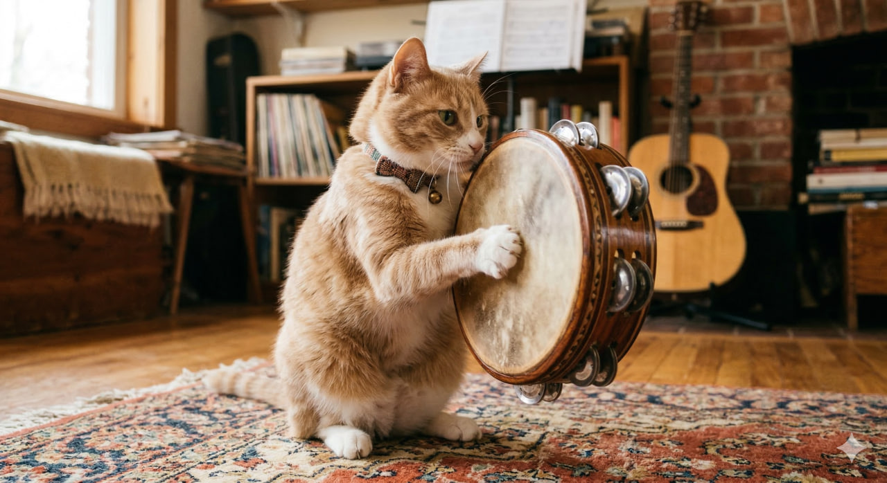

# Тамбурин

**Раздел:** 7. [Культура](../../../2.1_society/cause_and_effect_relationships/articles/why_rules_work.md) и [искусство](../../../7.2 Media, leisure and hobbies /what_you_can_read_and_watch_to_develop_your_taste/articles/aesthetics_and_taste.md) → 7.1 Искусство → [Музыкальные инструменты](../../../1.2_natural_sciences/physics_in_everyday_life/Q170475.md)

---

## [История](../../../2.1_society/cause_and_effect_relationships/articles/lessons_of_history.md) создания

Тамбури́н — один из древнейших ударных инструментов человечества. Его [история](../../../1.2_natural_sciences/physics_in_everyday_life/Q11469.md) уходит корнями в **Древний [Ближний Восток](duduk.md), [Египет](../../../2.2_history/world_economy_on_fingers/articles/suetskiy_kanal.md) и Месопотамию**, где похожие [инструменты](../../../1.2_natural_sciences/physics_in_everyday_life/Q36253.md) (маленькие ручные [барабаны](drums.md) с металлическими кольцами) использовались в религиозных ритуалах и народных праздниках более **3500 лет назад**.

В Древней Греции схожий инструмент назывался **тимпанон** и использовался в культе Диониса. В Библии упоминается инструмент **«тоф»** (tof) — предположительно, разновидность тамбурина: пророчица Мириам играла на нём после перехода через [Красное море](../../../2.2_history/world_economy_on_fingers/articles/suetskiy_kanal.md).

На протяжении Средних веков и Ренессанса тамбурин был распространён по всей Европе, Ближнему Востоку и Северной Африке. Во многих культурах он стал инструментом женского ритуального танца.

В Западную академическую музыку тамбурин вошёл в XVIII–XIX веках. Первое значимое оркестровое применение — опера **«Похищение из сераля»** Моцарта (1782), где тамбурин создаёт «турецкий» колорит. [Бизе](castanets.md), [Чайковский](celesta.md) и другие композиторы активно использовали его в «восточных» сценах.

---

## [Виды](../../../3.1_healthy_lifestyle/pervaya_pomoshch/ushibi_porezy_ozhogi/08_porezy_sadiny_vidy.md) тамбурина

- **Классический (с мембраной)** — круглая рама с мембраной и металлическими бубенцами (джинглами); можно ударять по мембране ладонью.
- **Без мембраны** — только металлические бубенцы; стряхивают или трут кожей ладони.
- **Половинный (lunette)** — полукруглая или неполная рама.
- **Провансальский тамбурин** — большой, на длинной палочке; используется вместе с провансальской флейтой.

---

## Конструкция

### Основные части

1. **Рама (обечайка)**
2. **[Мембрана](banjo.md)**
3. **Бубенцы (джинглы)**

### Описание частей и [характеристики](../../../6.1_Independent_living_and_daily_living_skills/reasonable_spending/articles/comparison.md)

**Рама** — деревянное или пластиковое кольцо. Диаметр стандартного тамбурина — **20–35 см** (есть меньшие и большие [варианты](../../../6.1_Independent_living_and_daily_living_skills/reasonable_spending/articles/comparison.md)). Ширина рамы — **4–7 см**.

**[Мембрана](banjo.md)** — натянутая кожа (исторически) или синтетика; диаметр совпадает с внешним диаметром рамы. Создаёт [звук](../../../1.2_natural_sciences/why_science_help_understand_world/physics.md) «хлопка» при ударе.

**Бубенцы (джинглы)** — пары маленьких металлических дисков (диаметр **3–5 см**) в прорезях рамы. Каждая пара создаёт [звук](../../../1.2_natural_sciences/physics_in_everyday_life/Q124003.md) при встряхивании. Стандартный тамбурин имеет **5–10 пар** джинглов. [Материал](../../../1.2_natural_sciences/physics_in_everyday_life/Q25358.md) — латунь, нержавеющая сталь, медь.

**[Техники](../../../8.2_future_and_path_choice/articles/03_stress_management.md) игры**:
- Удар ладонью по мембране
- Встряхивание
- «Большой палец (thumb roll)» — [трение](../../../1.2_natural_sciences/physics_in_everyday_life/Q11382.md) влажным большим пальцем по краю мембраны, создающее непрерывный «рулл»

### [Материалы](../../../1.2_natural_sciences/physics_in_everyday_life/Q487005.md)

- Рама: [дерево](castanets.md) (берёза, ясень), пластик
- Мембрана: кожа (козлиная, телячья), синтетика Mylar
- Джинглы: латунь, медь, сталь

---

## В каких ансамблях используется

- **Симфонический [оркестр](balalaika.md)** (эпизодически, в «характерных» сценах)
- **[Народный](balalaika.md) ансамбль** (итальянский тарантелла, испанский, ближневосточный)
- **Поп и рок-группа** (эстрадный перкуссионист)
- **Оперный [оркестр](balalaika.md)**
- **Детский ансамбль** (лёгок для освоения)
- **Церковный хор** (в евангельской [традиции](../../../2.1_society/cause_and_effect_relationships/articles/why_rules_work.md))

---

## Известные музыканты

- **Стиви Никс** из Fleetwood [Mac](../../../5.1_technology_and_digital_literacy/how_internet_works/articles/ip_mac/ip_and_mac.md) — известна игрой на тамбурине во [время](../../../1.2_natural_sciences/physics_in_everyday_life/Q20702.md) живых выступлений.
- **Лайнус Сильвер** — студийный перкуссионист, записавший тысячи треков.
- **Маккой Тайнер** ([джаз](clarinet.md)) — перкуссионные инструменты в джазе.

---

## Интересные [факты](../../../1.2_natural_sciences/physics_in_everyday_life/Q17737.md)

- В «Звуке музыки» тамбурин звучит в сцене нарядных выступлений детей.
- В блокбастере **«Убить пересмешника»** тамбурин ассоциируется с сельской американской музыкой.
- «Tambourine Man» Боба Дилана (1965) — одна из самых известных рок-песен; тамбурин здесь — символ свободного духа.
- Thumb roll (рулл большого пальца) требует влажного пальца: оркестровые перкуссионисты держат специальный кусочек губки или воды.
- В некоторых странах Ближнего Востока и Северной Африки существуют **профессиональные ансамбли тамбуринистов** (рукожогиль) со сложными ритмическими партиями.

---

## [Советы](../../../7.2_leisure/useful_and_interesting_leisure/articles/mistakes_in_choosing_hobby.md) начинающим

1. **Освой три основных приёма.** Удар ладонью — встряхивание — thumb roll. Трёх хватит для 90% применений.

2. **Тренируй thumb roll.** Увлажни большой палец и веди его медленно по краю мембраны. Сначала не получится — продолжай.

3. **Держи инструмент расслабленно.** Зажатые пальцы создают глухой, невыразительный звук.

4. **Слушай тарантеллу.** [Итальянская](mandolin.md) тарантелла — лучший пример профессиональной игры на тамбурине.

5. **Начни с простого ритма 4/4.** Встряхивание на «раз», удар на «три».

## Похожие статьи

- [Кастаньеты](castanets.md)
- [Гонг](gong.md)
- [Барабаны](drums.md)

---

*[Автор](../../../5.1_technology_and_digital_literacy/information and media literacy/авторское_право_и_честное_использование.md): Шведов Александр (@alshved)*

*Использованные [нейросети](../../../2.1_society/cause_and_effect_relationships/articles/ai_causality.md): Claude Sonnet 4.5, Nano Banana 2*