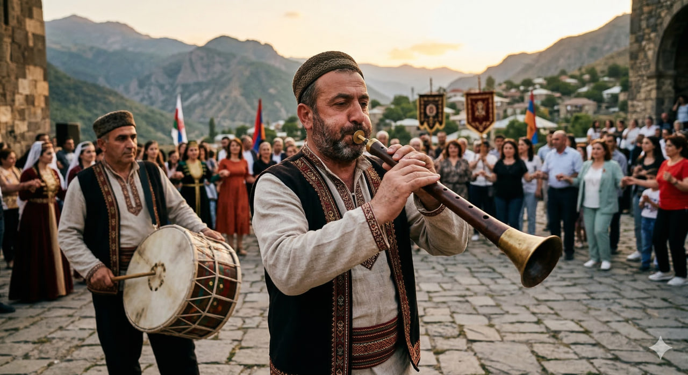

# Зурна

**Раздел:** 7. [Культура](../../../2.1_society/cause_and_effect_relationships/articles/why_rules_work.md) и [искусство](../../../7.2 Media, leisure and hobbies /what_you_can_read_and_watch_to_develop_your_taste/articles/aesthetics_and_taste.md) → 7.1 Искусство → [Музыкальные инструменты](../../../1.2_natural_sciences/physics_in_everyday_life/Q170475.md)

---

## [История](../../../2.1_society/cause_and_effect_relationships/articles/lessons_of_history.md) создания

Зурна́ — один из древнейших деревянных духовых инструментов мира, распространённый на огромном пространстве от Ближнего Востока до Центральной и Южной Азии, Кавказа и Балкан. [История](../../../1.2_natural_sciences/physics_in_everyday_life/Q11469.md) зурны насчитывает более **4000 лет**: изображения похожих инструментов с двойной тростью найдены в Месопотамии и Египте.

Само слово «зурна» пришло из персидского: *sur* — пир, праздник + *nay* — тростниковая [флейта](flute.md), то есть буквально «пиршественная [флейта](flute.md)» или «флейта для праздника». Это точно отражает роль инструмента — его традиционно играли на свадьбах, народных праздниках и военных церемониях.

На Ближнем Востоке и в Закавказье зурна веками была неотъемлемой частью народных торжеств. В Армении, Азербайджане, Грузии, Турции, Иране и других странах регион зурна занимает особое место как главный «праздничный» инструмент. Традиционно зурна звучит в паре с **барабаном** (дхол, нагара), образуя мощный уличный дуэт.

В армянской музыке зурна считается древнейшим национальным инструментом: по легенде, Ной, сойдя с ковчега на горе Арарат, заиграл на зурне.

---

## [Виды](../../../3.1_healthy_lifestyle/pervaya_pomoshch/ushibi_porezy_ozhogi/08_porezy_sadiny_vidy.md) зурны

- **Зурна** (стандартная) — самый распространённый вариант.
- **Чыр-зурна** (малая зурна) — более высокий [строй](oboe.md).
- **Нагара** — похожий инструмент без раструба в некоторых традициях.
- **Карги-зурна** (туркменская) — разновидность с более широким конусом.
- **Давул-зурна** — традиционный дуэт инструментов (зурна + барабан давул).

---

## Конструкция

### Основные части

1. **[Корпус](guitar.md) (коническая трубка)**
2. **[Двойная трость](bassoon.md) (язычок)**
3. **Мундштучный ставень**
4. **[Раструб](french_horn.md)**
5. **Тональные отверстия**

### Описание частей и [характеристики](../../../6.1_Independent_living_and_daily_living_skills/reasonable_spending/articles/comparison.md)

**[Корпус](../../../1.2_natural_sciences/physics_in_everyday_life/Q11223329.md)** — конически расширяющаяся деревянная трубка; [длина](../../../1.2_natural_sciences/physics_in_everyday_life/Q25358.md) около **28–35 см**. Конический [профиль](../../../5.1_technology_and_digital_literacy/information and media literacy/цифровая_репутация.md) даёт зурне яркий, пронизывающий [тембр](../../../1.2_natural_sciences/neurobiology_for_teens/articles/18_music_chills.md).

**Тональные отверстия** — **7 отверстий** спереди (для пальцев) + 1 сзади (для большого пальца). В некоторых региональных вариантах до 8 отверстий.

**[Двойная трость](bassoon.md)** — изготавливается из специального тростника; при вдувании воздуха между двумя листками трости создаётся [вибрация](../../../7.2 Media, leisure and hobbies/Computer games/articles/technologies_inside/management_history.md), производящая [звук](../../../1.2_natural_sciences/why_science_help_understand_world/physics.md). [Трость](clarinet.md) — самая тонкая и капризная деталь, требующая особого ухода.

**Мундштучный ставень (диск-упор)** — маленький [деревянный](didgeridoo.md) или металлический [диск](../../../5.1_technology_and_digital_literacy/operating system/articles/file_system.md), ограничивающий глубину посадки трости в рот. При традиционной технике **кругового дыхания** музыкант упирается губами в диск и накапливает [воздух](../../../1.2_natural_sciences/why_science_help_understand_world/environmental_sciences.md) за щеками, выдувая его без остановки.

**[Раструб](french_horn.md)** — расширяющийся конец корпуса диаметром около **8–10 см**, усиливающий и формирующий [звук](../../../1.2_natural_sciences/physics_in_everyday_life/Q124003.md).

### [Материалы](../../../1.2_natural_sciences/physics_in_everyday_life/Q487005.md)

- Корпус: [абрикос](duduk.md), слива, орех, груша
- [Трость](clarinet.md): тростник (*Arundo donax*)
- Раструб: медь, олово или то же [дерево](castanets.md), что корпус

---

## В каких ансамблях используется

- **Традиционный [народный](balalaika.md) ансамбль** (зурна + дхол/давул)
- **Свадебный [оркестр](balalaika.md)** (несколько зурначей + барабанщики)
- **Военный ансамбль** (янычарская [музыка](../../../8.1_entertainment/articles/music.md))
- **Народные фестивали и праздники**
- **Современные этно-джаз ансамбли** (зурна + электронные [инструменты](../../../1.2_natural_sciences/physics_in_everyday_life/Q36253.md))

---

## Известные музыканты

- **Дживан [Гаспарян](duduk.md)** (1928–2021) — [армянский](duduk.md) мастер дудука, также [виртуоз](violin.md) зурны; его [музыка](../../../1.2_natural_sciences/neurobiology_for_teens/articles/18_music_chills.md) звучала в голливудских фильмах.
- **Тарик Балабан** — азербайджанский зурначи, хранитель [традиции](../../../2.1_society/cause_and_effect_relationships/articles/why_rules_work.md).
- **Насими Шейхов** — один из ведущих зурначей Азербайджана.
- **Ахмет Метин Онгюр** — турецкий мастер зурны и этнической музыки.

---

## Интересные [факты](../../../1.2_natural_sciences/physics_in_everyday_life/Q17737.md)

- Зурна настолько **громкая** (до 120 дБ), что традиционно играет на открытом воздухе — в закрытом помещении её звук почти невыносим.
- [Техника](../../../1.2_natural_sciences/physics_in_everyday_life/Q133673.md) **кругового дыхания** (непрерывное [дыхание](../../../1.2_natural_sciences/why_science_help_understand_world/organism.md) без пауз) — обязательный [навык](../../../5.1_technology_and_digital_literacy/information and media literacy/карта_компетенций_по_возрастам.md) для зурначи. Музыкант дышит носом, одновременно выдувая [воздух](../../../1.2_natural_sciences/physics_in_everyday_life/Q487005.md) ртом.
- В Армении зурна включена в [список](../../../5.2_cybersecurity/cpp_fundamentals/10_arrays.md) **нематериального культурного наследия [ЮНЕСКО](duduk.md)** как часть [традиции](../../../2.1_society/cause_and_effect_relationships/articles/why_rules_work.md) «зурна-дхол».
- Звук зурны хорошо слышен на расстоянии **нескольких километров** в открытом [поле](../../../5.2_cybersecurity/cpp_fundamentals/13_struct.md).
- В Турции зурна исторически была инструментом янычар — элитной военной пехоты Османской империи.

---

## [Советы](../../../7.2_leisure/useful_and_interesting_leisure/articles/mistakes_in_choosing_hobby.md) начинающим

1. **Найди мастера.** Зурна — инструмент с сильной устной традицией; самостоятельно освоить правильный [стиль](../../modern_technological_art/articles/5.5_yandex_neural.md) практически невозможно.

2. **Освой circular breathing.** Без кругового дыхания зурна не раскрывает своих возможностей. Начни с соломинки и стакана воды: тренируй выдувание воздуха ртом при одновременном вдохе носом.

3. **Начни с простых народных мелодий** той традиции, которой ты следуешь (армянской, азербайджанской, турецкой).

4. **Береги трость.** Храни в специальном контейнере с небольшой влажностью; никогда не пересушивай.

5. **Слушай оригинальные [записи](../../../how_to_memorize/articles/konspektirovanie.md).** YouTube предлагает бесчисленное количество живых записей традиционных зурначей — это лучшая [школа](../../../3.1. healthy lifestyle/Sleep, nutrition, and adolescent energy/articles/healthy_school_snacks.md).

## Похожие статьи

- [Дудук](duduk.md)
- [Флейта](flute.md)
- [Волынка](bagpipe.md)

---

*[Автор](../../../5.1_technology_and_digital_literacy/information and media literacy/авторское_право_и_честное_использование.md): Домкин Павел (@crazycatgames)*

*Использованные [нейросети](../../../2.1_society/cause_and_effect_relationships/articles/ai_causality.md): Claude Sonnet 4.5, Nano Banana 2*