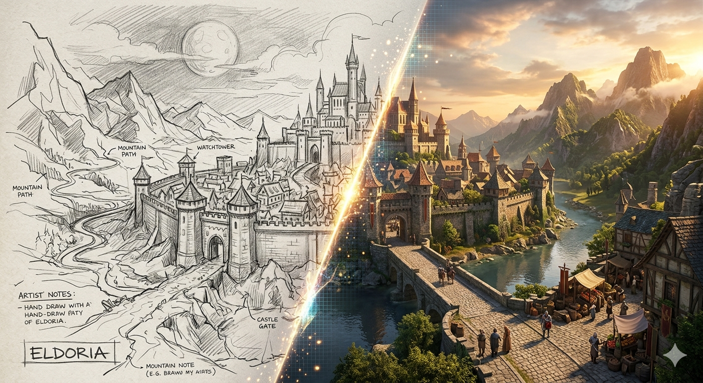
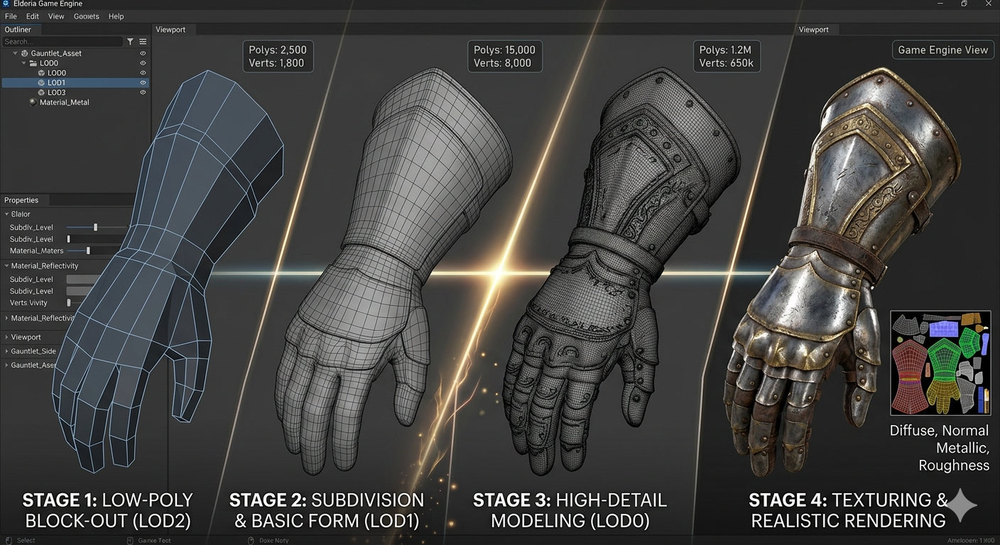
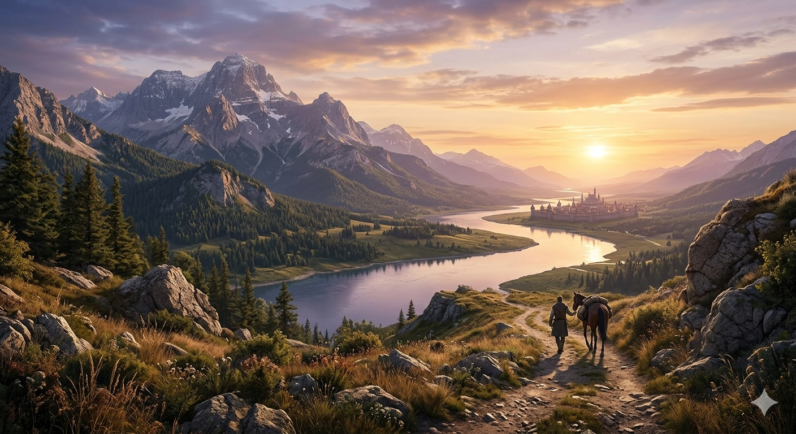
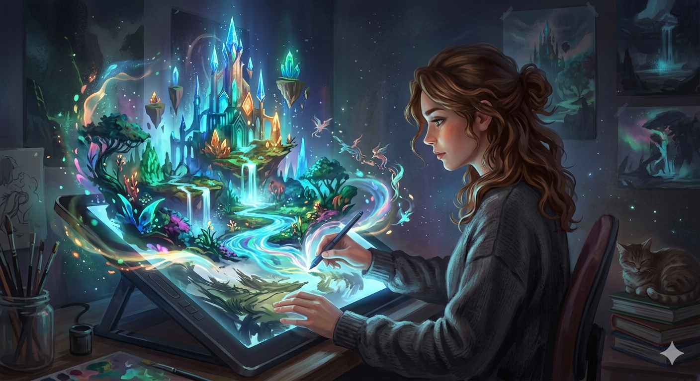

# Художник: как рождаются миры — От наброска на бумаге до 3D-модели, по которой можно бегать 🎨

Когда вы заходите в игру и замираете от вида заката, древних руин или шумного города — это не случайность. Это работа художника. Именно он превращает пустоту в мир, который хочется исследовать, где каждая деталь кажется живой.

И да, всё начинается… с простого наброска на бумаге ✏️

## Первый штрих: идея, которая становится миром

Любой игровой мир начинается не с кода и даже не с 3D. Он начинается с вопроса: *«Какой мир мы хотим показать?»*

И здесь художник работает рука об руку со сценаристом. Например, Нил Дракманн при создании The Last of Us хотел рассказать историю о людях, а не о зомби. Художникам нужно было визуально подчеркнуть это.

В итоге мир получился не просто разрушенным — он стал… тихим. Природа медленно забирает города обратно. Заросшие улицы, пустые дома, свет, пробивающийся сквозь окна. Это не просто фон — это часть истории.

Именно художники сделали так, чтобы игрок *почувствовал одиночество*, даже когда никто ничего не говорит.

## Концепт-арт: место, где рождается атмосфера

После идеи начинается самый магический этап — концепт-арт. Это те самые изображения, которые задают стиль всей игры.

Посмотрите на работы Ёдзи Синкава, который сотрудничал с Хидео Кодзима. Его стиль — резкие линии, динамика, почти «рваная» энергия. Благодаря этому Metal Gear Solid выглядит не как обычный военный шутер, а как художественное произведение.

Концепт-арт — это не просто «красиво». Это ответ на вопросы:

* как выглядит мир?
* какие в нём цвета?
* он давит или вдохновляет?

Иногда один удачный концепт может задать настроение всей игре.

## Когда рисунок становится реальностью

Но красивый арт — это только начало. Дальше подключаются 3D-художники, и начинается настоящая магия 🧙‍♂️

Они берут плоское изображение и превращают его в объёмный объект, с которым можно взаимодействовать. Дом становится зданием, по которому можно бегать. Камень — тем, за который можно спрятаться.

В The Witcher 3: Wild Hunt художники из CD Projekt создали мир, который кажется живым. Деревни выглядят так, будто там реально живут люди: грязные дороги, кривые заборы, следы повседневной жизни.

Это не случайность. Это тысячи маленьких деталей, которые художники добавляют вручную.

## Детали, которые рассказывают историю

Лучшие художники — это немного рассказчики. Они умеют говорить без слов.

Вспомните Dark Souls и работу Хидэтака Миядзаки. Здесь почти нет прямого повествования, но мир буквально кричит о своей истории.

Разрушенные замки, странные статуи, забытые предметы… Всё это создаёт ощущение древности и тайны.

Игрок не читает сюжет — он *видит* его.

## Свет, цвет и настроение

Иногда всё решает не объект, а то, как он освещён.

Художники работают со светом так же, как режиссёры в кино. Тёплый свет создаёт уют 🙂, холодный — тревогу 😨, а резкие тени могут заставить напрячься даже без врагов рядом.

В Red Dead Redemption 2 от Rockstar Games пейзажи выглядят настолько реалистично, что иногда хочется просто остановиться и смотреть.

И это не только технологии. Это чувство композиции, цвета и атмосферы.

## Художник и игрок: невидимая связь

Есть один интересный момент: игрок редко думает о художнике. Но он постоянно чувствует его работу.

Когда вы:

* идёте по узкой тёмной тропе и чувствуете напряжение 😬
* заходите в уютную деревню и расслабляетесь 🙂
* замираете перед красивым видом 😍

— это всё результат решений художника.

Он буквально управляет вашим восприятием мира.

## Как становятся игровыми художниками

Если кажется, что это что-то недостижимое — нет. Но это долгий путь.

Нужно:
рисовать, наблюдать, изучать реальный мир. Почему старые здания выглядят именно так? Как свет падает на объекты? Почему один кадр выглядит «живым», а другой — нет?

И, конечно, учиться работать с инструментами: от графических планшетов до 3D-софта.

Но главное — развивать вкус. Потому что техника без чувства — это просто набор полигонов.

## Итог

Игровой художник — это человек, который создаёт миры, в которые мы убегаем от реальности. Он берёт идею и превращает её в пространство, где можно жить, исследовать и чувствовать.

И в следующий раз, когда вы остановитесь в игре просто чтобы посмотреть на пейзаж… задумайтесь 🙂

Кто-то когда-то нарисовал это с нуля.

## См. также

[Сценарист: главный storyteller — Как придумывают сюжеты, от которых невозможно оторваться](./Screenwriter.md)

[Композитор и звукорежиссёр — Почему звук шагов или шелест листвы так же важен, как и графика](./Composer.md)

---
Автор: Андрюхин Артём
При создании использовались нейросети: ChatGPT, Gemini
