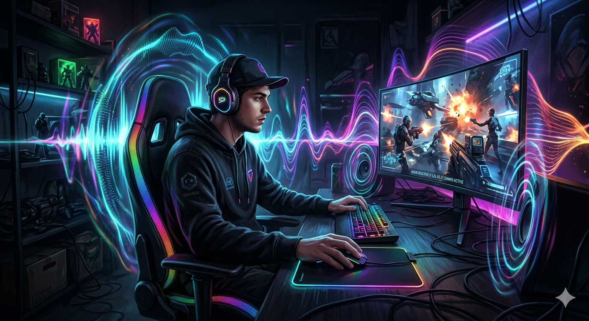
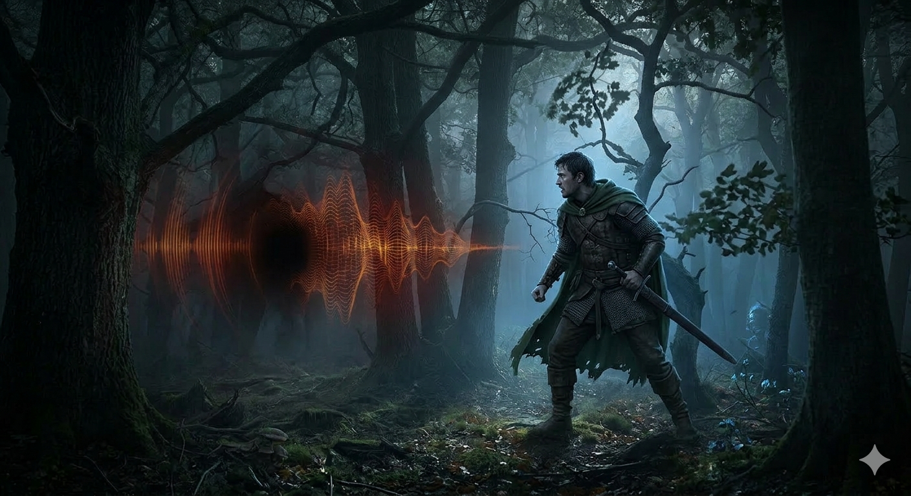

# [Композитор](../dream_team/composer.md) и [звукорежиссёр](../dream_team/composer.md) — Почему [звук](../../../../1.2_natural_sciences/physics_in_everyday_life/Q124003.md) шагов или [шелест](../dream_team/composer.md) листвы так же важен, как и графика 🎧

Представьте: вы идёте по тёмному лесу в игре. Вокруг — тишина. Только звук ваших шагов… и вдруг — лёгкий шелест листвы где-то позади 😨

Вы останавливаетесь.

Оборачиваетесь.

И в этот момент понимаете: звук в играх — это не просто «дополнение». Это половина опыта. Иногда даже больше.

## [Музыка](../../../../1.2_natural_sciences/neurobiology_for_teens/articles/18_music_chills.md), которая рассказывает историю

В [кино](../../../../7.2 Media, leisure and hobbies /what_you_can_read_and_watch_to_develop_your_taste/articles/z1.md) музыка усиливает [эмоции](../../../../3.1. healthy lifestyle/Sleep, nutrition, and adolescent energy/articles/stress_and_food.md). В играх — она живёт вместе с игроком. Она меняется, реагирует, подстраивается.

Один из самых ярких примеров — Густаво Сантаолалья, работавший над The Last of Us вместе с Нил Дракманн.

Интересно, что музыка здесь… минималистична. Никаких громких оркестров. Часто — всего несколько нот на гитаре.

Почему?

Потому что [история](../../../../1.2_natural_sciences/physics_in_everyday_life/Q11469.md) — о людях. О тишине между словами. О потерях.

Именно поэтому музыка не кричит, а шепчет. И от этого становится только сильнее 💔

## Когда звук становится частью геймплея

Звук в играх — это не только эмоции, но и инструмент.

В The Witcher 3: Wild Hunt от [CD](../how_it_all_started/cartridge_versus_disc.md) Projekt вы можете определить [опасность](../../../../3.1_healthy_lifestyle/pervaya_pomoshch/ushibi_porezy_ozhogi/06_ushib_kogda_vrach.md) по звуку ещё до того, как увидите врага.

Рычание вдалеке. Скрип веток. [Шаги](../dream_team/composer.md).

Звук предупреждает, направляет, пугает.

Он становится частью механики.

А теперь представьте, что этого нет. Мир становится… плоским.

## Звук шагов, который вы даже не замечаете

Самое интересное — лучшие звуки в игре те, которые вы не замечаете.

Шаги по дереву звучат иначе, чем по камню. По снегу — глухо. По воде — с брызгами.

И всё это — [работа](../../../../1.2_natural_sciences/physics_in_everyday_life/Q11382.md) звукорежиссёров.

В Red Dead Redemption 2 от Rockstar Games [внимание](../../../../1.2_natural_sciences/neurobiology_for_teens/articles/16_love_chemistry.md) к деталям просто безумное. Лошадь звучит иначе в грязи, чем на сухой земле. [Одежда](../../../../1.2_natural_sciences/physics_in_everyday_life/Q487005.md) шуршит. Оружие звенит.

Вы не думаете об этом… но чувствуете.

Именно это создаёт эффект «реальности».

## Тишина — тоже звук

Иногда самый сильный звук — это его отсутствие.

В Dark Souls, созданной под руководством Хидэтака Миядзаки, часто нет музыки во [время](../../../../1.2_natural_sciences/physics_in_everyday_life/Q20702.md) исследования.

И это делает мир ещё более напряжённым.

Вы слышите каждый [шаг](../../../../1.2_natural_sciences/physics_in_everyday_life/Q36253.md). Каждый шорох.

И начинаете бояться… даже когда ничего не происходит 😬

## Как создаются звуки, которые кажутся реальными

Самое удивительное — многие звуки в играх не записываются «как есть».

Их… создают.

Например:

* звук шагов может записываться с разными материалами (гравий, [дерево](../../../../1.2_natural_sciences/physics_in_everyday_life/Q487005.md), ткань)
* звук удара меча — это [смесь](../../../../1.2_natural_sciences/why_science_help_understand_world/chemistry.md) металла, овощей и даже льда 😄
* шелест листвы — это не всегда листья

Звукорежиссёры буквально становятся «алхимиками звука».

Они ищут идеальный эффект, который будет звучать правдоподобно, даже если он создан из неожиданных источников.

## Музыка, которая реагирует на вас

Одна из самых крутых вещей в играх — адаптивная музыка.

Она меняется в зависимости от того, что вы делаете.

Бежите — музыка ускоряется. Вступаете в бой — становится напряжённой. Прячетесь — затихает.

Это как если бы композитор сидел рядом с вами и играл [саундтрек](../dream_team/composer.md) в реальном времени 🎹

И это требует не только таланта, но и технического мышления. Нужно продумать, как музыка будет «сшиваться» в разных ситуациях.

## Эмоции, которые невозможно подделать

Хороший звук может сделать сцену незабываемой.

Вспомните момент, когда:

* музыка резко обрывается
* остаётся только [дыхание](../../../../1.2_natural_sciences/physics_in_everyday_life/Q163214.md) персонажа
* и вы понимаете — сейчас что-то произойдёт

Это чистая магия.

Композитор и звукорежиссёр работают вместе, чтобы управлять вашими эмоциями так же точно, как [сценарист](../dream_team/screenwriter.md) или [художник](../dream_team/artist.md).

## Почему звук — это половина игры

Можно сделать красивую графику. Можно создать интересный [сюжет](../dream_team/screenwriter.md).

Но без звука всё это теряет глубину.

Звук:
создаёт атмосферу, усиливает эмоции, помогает ориентироваться и делает мир живым.

Он не просто дополняет игру — он делает её настоящей.

## Итог

Композитор и звукорежиссёр — это невидимые архитекторы атмосферы. Они создают мир, который не только видно, но и слышно.

И в следующий раз, когда вы услышите шаги за спиной в игре… 😉

Возможно, именно звук заставит вас обернуться быстрее, чем картинка.

## См. также
[Сценарист: главный storyteller — Как придумывают сюжеты, от которых невозможно оторваться](./Screenwriter.md)

[Художник: как рождаются миры — От наброска на бумаге до 3D-модели, по которой можно бегать](./Artist.md)

---

[Автор](../../../../4.2_thinking_and_working_information/how_to_search_information/articles/copypaste.md): Андрюхин Артём
При создании использовались [нейросети](../../../../2.1_society/cause_and_effect_relationships/articles/ai_causality.md): [ChatGPT](../../../../7.1_art/modern_technological_art/articles/6.1_prompt_art.md), Gemini
