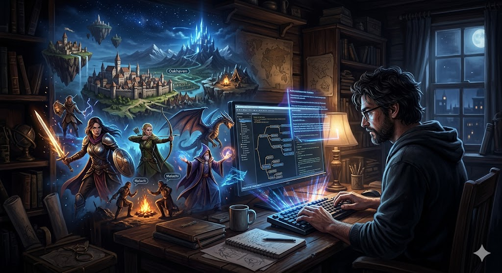
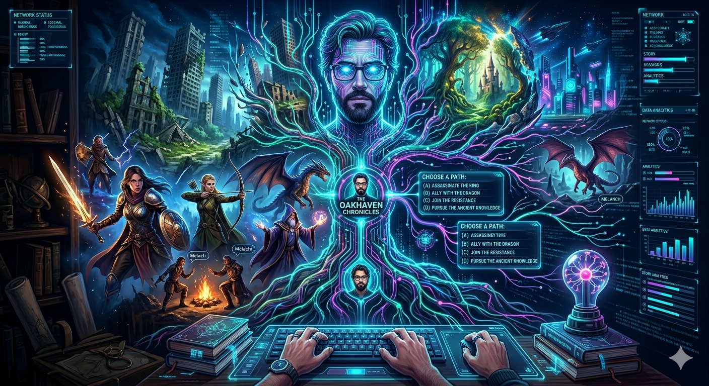
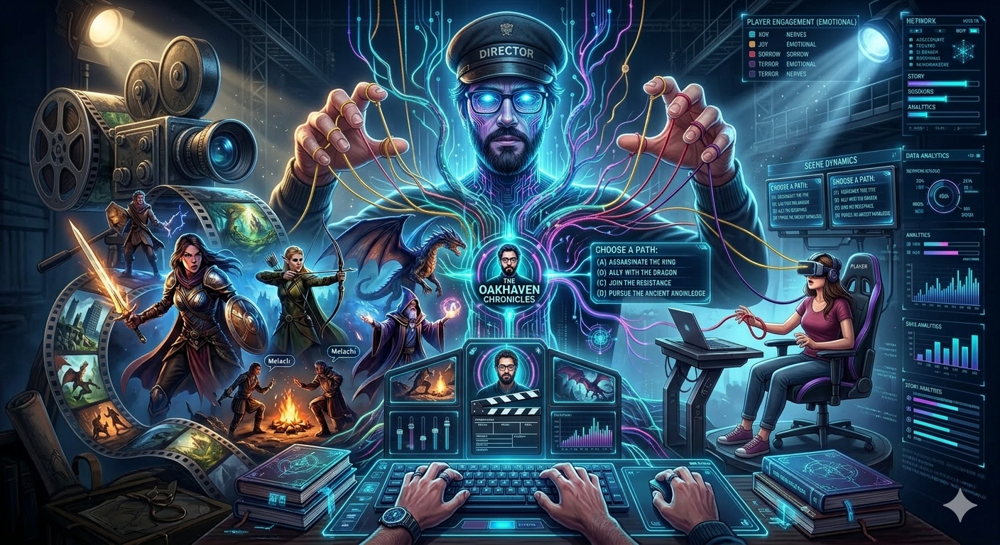

# [Сценарист](../dream_team/screenwriter.md): главный storyteller — Как придумывают сюжеты, от которых невозможно оторваться 🎮

Игры давно перестали быть просто развлечением. Сегодня это полноценные истории, которые могут конкурировать с [кино](../../../../7.2 Media, leisure and hobbies /what_you_can_read_and_watch_to_develop_your_taste/articles/z1.md) и литературой. И за каждой такой историей стоит [человек](../../../../1.2_natural_sciences/physics_in_everyday_life/Q45003.md), которого часто не видно — сценарист. Именно он превращает набор механик в мир, в котором хочется жить, страдать, любить и… нажимать «ещё один [квест](../dream_team/screenwriter.md)» в 3 часа ночи 😄

## Кто такой сценарист в игровой индустрии

Сценарист — это не просто [автор](../../../../4.2_thinking_and_working_information/how_to_search_information/articles/copypaste.md) диалогов. Это архитектор эмоций. Он отвечает за [сюжет](../dream_team/screenwriter.md), персонажей, мотивацию, конфликты и даже за то, как игрок воспринимает [выбор](../../../../2.1_society/cause_and_effect_relationships/articles/personal_choice.md).

В отличие от кино, здесь [история](../../../../1.2_natural_sciences/physics_in_everyday_life/Q11469.md) нелинейна. Игрок может пойти не туда, убить не того или вообще проигнорировать половину контента. И сценарист должен быть к этому готов.

Представьте: вы пишете не одну историю, а десятки возможных веток, которые всё равно должны ощущаться как единое целое. Это уже не просто писательство — это [инженерия](../../../../1.2_natural_sciences/physics_in_everyday_life/Q161635.md) повествования.

## Как рождаются захватывающие сюжеты

Секрет не в «гениальной идее». Почти всегда всё начинается с простого вопроса: *а что если?..*

Именно так работают лучшие storytellers индустрии.

Возьмём, например, Нил Дракманн — человека, стоящего за легендарной The Last of Us. Его идея была проста и пугающе человечна: «Что если в мире после апокалипсиса главная история — это не выживание, а [отношения](../../../../2.1_society/how_and_where_find_friends/articles/guide_dlya_introvertov.md) между людьми?»

Он вдохновлялся реальными новостями, личными переживаниями и даже фильмами. Но магия случилась, когда он сделал акцент не на зомби, а на связи между Джоэлом и Элли. Именно поэтому [игроки](../useful_tips/toxic_players.md) плачут, а не просто стреляют.

Другой пример — Хидео Кодзима, автор Metal Gear Solid. Он всегда строил свои сюжеты вокруг сложных тем: войны, политики, контроля информации. Его подход — это [смесь](../../../../1.2_natural_sciences/why_science_help_understand_world/chemistry.md) философии, кино и безумных идей. Иногда настолько безумных, что кажется: «Это не сработает». Но работает. И ещё как.

Кодзима не боится перегружать игрока смыслами. Он делает сюжет частью игрового опыта, а не просто фоном.

## История через [геймплей](../genres_and_worlds/endless_worlds.md)

Один из главных вызовов — встроить сюжет в саму игру. Не просто вставить катсцены, а сделать так, чтобы игрок *жил* историей.

Посмотрите на Dark Souls и [работу](../../../../8.2_future/choosing_a_career_path/articles/interview.md) Хидэтака Миядзаки. Здесь почти нет прямого повествования. Нет длинных диалогов. История спрятана в описаниях предметов, окружении, намёках.

Игрок сам собирает сюжет как пазл. И это делает его участие в истории гораздо глубже. Ты не просто наблюдаешь — ты исследуешь.

## Почему одни сюжеты цепляют, а другие — нет

Есть один важный момент: хороший сюжет — это не обязательно сложный сюжет.

Сценаристы часто используют три ключевых элемента:

* узнаваемые [эмоции](../../../../3.1. healthy lifestyle/Sleep, nutrition, and adolescent energy/articles/stress_and_food.md) ([страх](../../../../1.2_natural_sciences/neurobiology_for_teens/articles/14_amygdala_fear.md), [любовь](../../../../1.2_natural_sciences/neurobiology_for_teens/articles/16_love_chemistry.md), [потеря](../../../../1.2_natural_sciences/neurobiology_for_teens/articles/20_sadness.md))
* сильные [персонажи](../dream_team/screenwriter.md)
* выбор с последствиями

Например, в The Witcher 3: Wild Hunt, написанном при участии команды [CD](../how_it_all_started/cartridge_versus_disc.md) Projekt, игрок постоянно сталкивается с моральными дилеммами. И почти никогда нет «правильного» ответа.

Ты делаешь выбор… и живёшь с его последствиями.

Именно это заставляет игроков обсуждать игру годами.

## Сценарист как [режиссёр](../../../../../8.1_entertainment/articles/director.md) эмоций

Хороший сценарист думает не только о [том](../../../../7.1_art/musical_instruments/articles/drums.md), *что* происходит, но и о том, *что чувствует игрок*.

Например:

* когда дать игроку надежду 🙂
* когда разрушить её 😢
* когда заставить сомневаться 🤯

В Red Dead Redemption 2 [команда](../../../../4.1_rules_of_study/how_to_learn_effectively/articles/peer_learning.md) Rockstar Games построила историю так, что игрок постепенно привязывается к Артуру Моргану. И к финалу это уже не просто [персонаж](../game_culture/cosplay.md) — это кто-то близкий.

Именно поэтому концовка так сильно бьёт по эмоциям.

## Как стать таким сценаристом

Если кажется, что сценаристы — это какие-то маги, то нет. Это [навык](../../../../5.1_technology_and_digital_literacy/information and media literacy/карта_компетенций_по_возрастам.md), который можно развивать.

Важно:
читать, смотреть, играть и анализировать. Почему [сцена](../../../../../8.1_entertainment/articles/script.md) работает? Почему персонаж [запоминается](../../../../4.1_rules_of_study/how_to_memorize/articles/zapominanie.md)? Почему выбор вызывает [сомнения](../../../../8.2_future_and_path_choice/articles/02_insecurity_causes.md)?

И главное — писать. Много. Плохо. Потом лучше. Потом ещё лучше.

Потому что каждая великая история когда-то была просто идеей в голове.

## Итог

Сценарист в игровой индустрии — это человек, который заставляет нас чувствовать через [пиксели](../../../../5.1_technology_and_digital_literacy/operating system/articles/window_manager.md). Он превращает игру в [опыт](../../../../1.2_natural_sciences/why_science_help_understand_world/experimental_science.md), который остаётся с нами надолго.

И если вы когда-нибудь не могли оторваться от сюжета, переживали за персонажа или сидели в тишине после финала — знайте: где-то там был сценарист, который всё это спланировал 😉

## См. также

[Художник: как рождаются миры — От наброска на бумаге до 3D-модели, по которой можно бегать](./Artist.md)

[Композитор и звукорежиссёр — Почему звук шагов или шелест листвы так же важен, как и графика](./Composer.md)

---

Автор: Андрюхин Артём
При создании использовались [нейросети](../../../../2.1_society/cause_and_effect_relationships/articles/ai_causality.md): [ChatGPT](../../../../7.1_art/modern_technological_art/articles/6.1_prompt_art.md), Gemini
