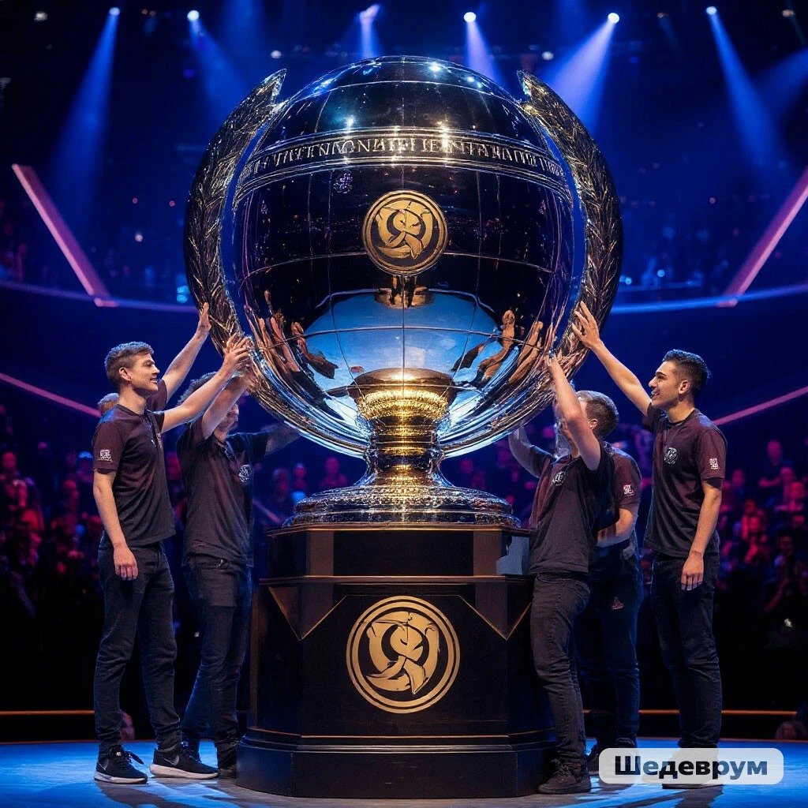
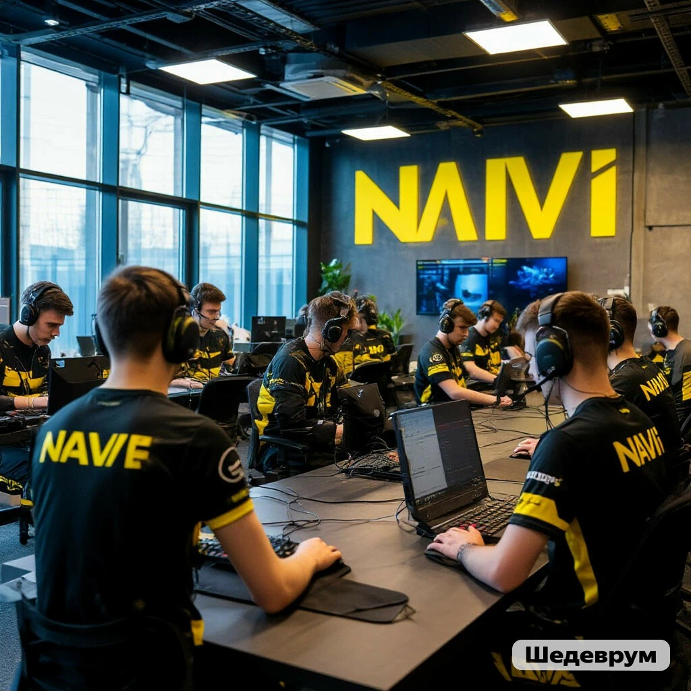
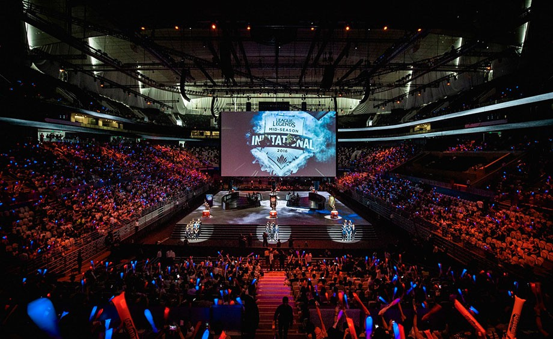
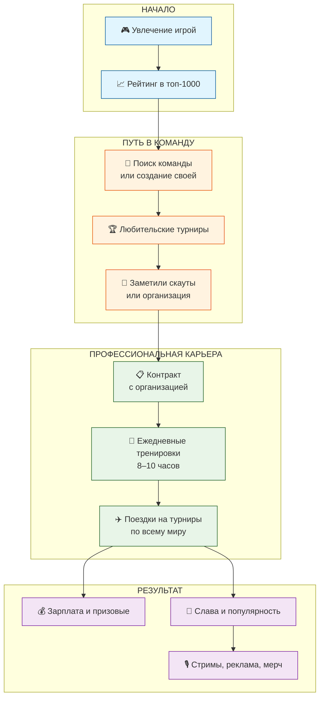

# 🎮 [Киберспорт](../game_culture/esports.md): [игра](../../../../4.1_rules_of_study/how_to_learn_effectively/articles/gamification.md) как [профессия](../../../../7.2 Media, leisure and hobbies /useful_and_interesting_leisure/articles/leisure_influence_on_future.md)

## Введение

Многие слышали от родителей: «Хватит играть, лучше бы уроки сделал!» А что, если играть — это и есть [работа](../../../../1.2_natural_sciences/physics_in_everyday_life/Q11382.md)? Для профессиональных киберспортсменов [видеоигры](../../../../7.1_art/modern_technological_art/articles/3.1_uncensored_library.md) — такая же профессия, как для футболистов — [спорт](../../../../3.1. healthy lifestyle/Sleep, nutrition, and adolescent energy/articles/sport_and_energy.md). Они тренируются по 8–10 часов в день, ездят на турниры, зарабатывают миллионы и собирают стадионы болельщиков. Давай разберёмся, кто такие киберспортсмены и можно ли жить игрой.

## 🏆 Что такое киберспорт

Киберспорт (или eSports) — это официальные соревнования в видеоиграх. Всё как в большом спорте: команды, тренеры, [стратегии](../../../../../8.1_self_understanding/articles/overcoming.md), [фанаты](../game_culture/cosplay.md) и кубки. Только вместо мяча — [клавиатура](../../../../7.1_art/musical_instruments/articles/piano.md) и мышь, а вместо поля — монитор.

**Чем киберспорт отличается от обычной игры:**

| Обычный игрок | Киберспортсмен |
|---------------|----------------|
| Играет для удовольствия, когда хочет | Тренируется по расписанию, как на [работе](../../../../8.2_future/choosing_a_career_path/articles/interview.md) |
| Может бросить игру в любой момент | Должен доиграть матч до конца, даже если проигрывает |
| Никому ничего не должен | Отвечает перед командой, тренером и спонсорами |
| Не зарабатывает (или тратит [деньги](../../../../2.1_society/cause_and_effect_relationships/articles/economic_chains.md)) | Получает [зарплату](../../../../8.2_future/choosing_a_career_path/articles/salary.md), [призовые](../game_culture/esports.md), бонусы |

## 🎯 Какие игры в киберспорте

Не все игры подходят для профессиональных соревнований. Киберспортивные дисциплины требуют баланса, навыков и зрелищности.

### Топ-5 популярных киберспортивных игр

| Игра | [Жанр](../../../../../8.1_entertainment/articles/movie.md) | Где популярна | Призовой фонд (примерно) |
|------|------|---------------|---------------------------|
| **Dota 2** | MOBA ([стратегия](../../../../2.1_society/cause_and_effect_relationships/articles/future_planning.md)) | Весь мир | До $40 млн на турнире The International |
| **League of Legends** | MOBA | Весь мир, особенно Корея, Китай | До $6 млн на чемпионате мира |
| **CS:GO / Counter-Strike 2** | [Шутер](../../../../../8.1_entertainment/articles/game-genres.md) | Европа, США, СНГ | До $2 млн на мейджорах |
| **[Valorant](../../../../5.1_technology_and_digital_literacy/how_internet_works/articles/tcp_udp/online_games.md)** | Тактический шутер | Весь мир | До $1 млн на турнирах |
| **[StarCraft](../genres_and_worlds/strategy.md) II** | [RTS](../genres_and_worlds/strategy.md) (стратегия в реальном времени) | Корея (там это национальный спорт!) | До $[500](../../../../5.1_technology_and_digital_literacy/how_internet_works/articles/http_https/http_https.md) тыс. |

## 👨‍💻 Как становятся киберспортсменами

[Путь](../../../../1.2_natural_sciences/physics_in_everyday_life/Q11476.md) в киберспорт похож на путь в большой спорт. Вот основные этапы:

### 1️⃣ Начать играть и прокачивать скилл
Сначала нужно просто играть, но не ради [развлечения](../../../../6.1_Independent_living_and_daily_living_skills/reasonable_spending/articles/want.md), а чтобы становиться лучше. Анализировать свои [ошибки](../../../../3.1_healthy_lifestyle/pervaya_pomoshch/ushibi_porezy_ozhogi/07_ushib_chego_nelzya.md), смотреть стримы профи, учить тактики.

### 2️⃣ Попасть в тир-лист (рейтинг)
Во всех играх есть рейтинговая система. Чтобы тебя заметили, нужно быть в топе (обычно в топ-500 или топ-1000 своего региона). Профессиональные команды и скауты постоянно смотрят на лидеров.

### 3️⃣ Найти команду
Можно собрать свою команду с друзьями или откликнуться на объявления. Команды ищут игроков на специальных сайтах и форумах. Сначала будут маленькие любительские турниры.

### 4️⃣ Попасть в академию или молодёжный [состав](../../../../1.2_natural_sciences/physics_in_everyday_life/Q11469.md)
У больших киберспортивных организаций (как футбольные клубы) есть академии, где тренируют молодых игроков. Там учат командной игре, тактике, работе с психологом.

### 5️⃣ Подписать контракт с профессионалами
Если ты показываешь [результаты](../../../../1.2_natural_sciences/why_science_help_understand_world/research_work.md), тебя могут позвать в основной состав. Дальше — [тренировки](../../../../3.1. healthy lifestyle/Sleep, nutrition, and adolescent energy/articles/sport_and_energy.md), сборы, турниры, [зарплата](../../../../8.2_future/choosing_a_career_path/articles/salary.md) и слава!

## 💰 Можно ли заработать игрой

Да, и иногда очень много! Но путь к большим [деньгам](../../../../8.2_future/choosing_a_career_path/articles/salary.md) долгий и трудный.

### Из чего складывается [доход](../../../../6.1_Independent_living_and_daily_living_skills/reasonable_spending/articles/income.md) киберспортсмена

| [Источник дохода](../../../../6.1_Independent_living_and_daily_living_skills/reasonable_spending/articles/income.md) | Описание | Сколько можно получить |
|-----------------|----------|------------------------|
| **Зарплата в команде** | Ежемесячные выплаты от организации | От $500 до $10 000+ (зависит от уровня команды) |
| **Призовые с турниров** | Деньги за победы на соревнованиях | От $100 до миллионов (делятся на команду) |
| **Стримы и донаты** | Трансляции на Twitch, YouTube, деньги от зрителей | От $0 до $100 000+ в месяц у топов |
| **Реклама и спонсоры** | Контракты с брендами (периферия, [энергетики](../../../../3.1. healthy lifestyle/Sleep, nutrition, and adolescent energy/articles/the_energy_trap.md) и т.д.) | Зависит от популярности |
| **Продажа мерча** | Футболки, [кружки](../../../../7.2 Media, leisure and hobbies /useful_and_interesting_leisure/articles/clubs_and_sections.md) с символикой игрока | Дополнительный доход |

### 📊 Примерные [зарплаты](../../../../8.2_future/choosing_a_career_path/articles/salary.md) (в мире киберспорта)

*   **Новичок в академии:** часто бесплатно или небольшие стипендии
*   **Игрок полупро-команды:** $500–1500/мес + призовые
*   **Игрок топ-команды (СНГ):** $2000–5000/мес + призовые
*   **Мировая [звезда](../../../../1.2_natural_sciences/physics_in_everyday_life/Q1146001.md) (Nigma, OG, Navi):** $10 000–30 000/мес + миллионные призовые
*   **Легенды (например, s1mple):** зарплата может быть засекречена, но призовые + стримы + реклама = миллионы долларов в год

## 🌟 Реальные примеры: кто заработал игрой

### 🇺🇦 Александр "s1mple" Костылев (CS:GO)
Считается одним из величайших игроков в истории CS:GO. Его призовые за карьеру — более **$1,7 млн**, а с учётом зарплаты, стримов и рекламы — состояние в несколько миллионов долларов. Он играет за украинскую организацию NAVI.

### 🇷🇺 Роман "RAMZES666" Кушнарёв (Dota 2)
Российский игрок, который начал карьеру в 16 лет. За карьеру заработал призовыми более **$1,4 млн**. Играл в топ-командах, таких как Virtus.pro и Evil Geniuses.

### 🇫🇮 Ласси "MATUMBAMAN" Урпалайнен (Dota 2)
Выиграл The International 2017 (главный [турнир](../genres_and_worlds/racing_fighting_sports.md) года) и заработал призовыми более **$3,6 млн**.

## 📸 Примеры из мира киберспорта

### 🏆 The International по Dota 2

Это чемпионат мира по Dota 2. Призовой фонд собирают сами фанаты, покупая внутриигровые предметы. В 2021 году фонд составил **$40 млн**! Победители получают десятки миллионов.

### 🖥️ Тренировочная [база](../../../../1.2_natural_sciences/physics_in_everyday_life/Q5339.md) команды NAVI

Профессиональные команды живут на тренировочных базах. У них есть тренеры, психологи, повара. [Режим](../../../../4.1_rules_of_study/how_to_learn_effectively/articles/breaks_and_rest.md) жёсткий: подъём, [зарядка](../useful_tips/eyes_and_back.md), тренировки, разбор игр, снова тренировки, отбой.

### 🇰🇷 Киберспорт в Корее

В Южной Корее киберспорт — часть национальной культуры. Финалы турниров собирают целые стадионы, а [игроки](../useful_tips/toxic_players.md) — настоящие [звёзды](../../../../1.1_structure_of_the_world/matter/articles/08_plasma.md), как футболисты или певцы.

## 📊 Схема: как устроена киберспортивная [карьера](../../../../7.2 Media, leisure and hobbies /useful_and_interesting_leisure/articles/leisure_influence_on_future.md)

## ⚠️ Обратная сторона киберспорта

Не всё так радужно, как кажется. У киберспорта есть и тёмные стороны:

*   **[Здоровье](../../../../3.1. healthy lifestyle/Sleep, nutrition, and adolescent energy/articles/chronic_sleep_deprivation.md):** Сидячий [образ](../game_culture/cosplay.md), нагрузка на [глаза](../useful_tips/eyes_and_back.md), запястья (туннельный синдром), [спина](../useful_tips/eyes_and_back.md). Нужно следить за собой и заниматься спортом.
*   **[Психология](../../../../2.1_society/cause_and_effect_relationships/articles/empathy_causality.md):** Постоянный [стресс](../../../../3.1. healthy lifestyle/Sleep, nutrition, and adolescent energy/articles/chronic_sleep_deprivation.md), [давление](../../../../1.1_structure_of_the_world/matter/articles/07_gases.md), [критика](../../../../8.1_self-understanding/HowToFindYourStrengths/articles/impostor_syndrome.md) фанатов. Многие выгорают и уходят молодыми.
*   **Короткая карьера:** Пик обычно в 18–25 лет. Дальше [реакция](../../../../1.2_natural_sciences/why_science_help_understand_world/chemistry.md) падает, и нужно искать новую профессию.
*   **Нестабильность:** Сегодня ты выиграл турнир, завтра проиграл — и [команда](../../../../4.1_rules_of_study/how_to_learn_effectively/articles/peer_learning.md) может разогнать.

## 🎯 Главное о киберспорте

Киберспорт — это настоящая профессия для тех, кто готов пахать 24/7. Это не просто «посидеть за компом», а тяжёлый труд с тренировками, дисциплиной и конкуренцией.

Но если ты действительно талантлив, готов учиться и не боишься трудностей — игрой можно не только зарабатывать, но и стать легендой, на которую будут равняться миллионы.

## См. также
[Косплей: когда герой оживает — Как фанаты шьют костюмы и становятся похожими на любимых персонажей](./Cosplay.md)

[Мемы из игр — Почему фраза «All your base are belong to us» стала легендой и как игры проникают в интернет-юмор](./Memes_from_games.md)

---

## 📝 Авторы

**[Автор](../../../../4.2_thinking_and_working_information/how_to_search_information/articles/copypaste.md):** Глебова Мария Алексеевна, М8О-307Б-23  
*При создании статьи использовались: нейросеть [ChatGPT](../../../../7.1_art/modern_technological_art/articles/6.1_prompt_art.md)*
