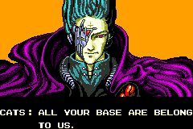
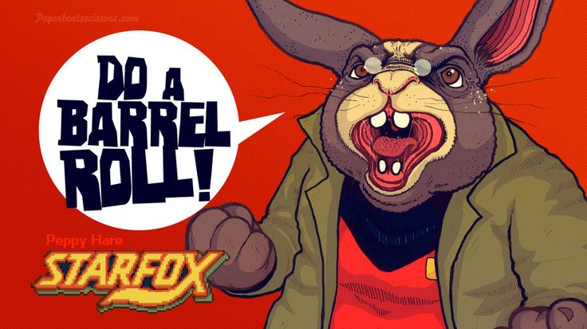
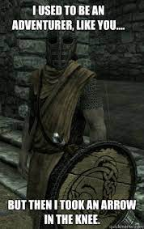
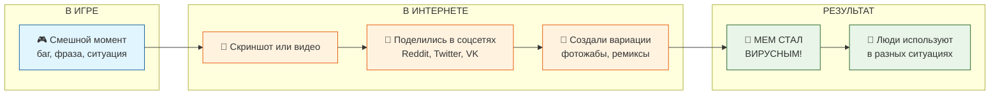

# 😂 Игровые мемы: когда игры смеются вместе с нами

## Введение

Ты наверняка видел в интернете смешные картинки с подписями или странные фразы, которые повторяют все вокруг. Многие из них пришли... из видеоигр! Игровые мемы — это особый [язык](../../../../5.2_cybersecurity/cpp_fundamentals/1_introduction.md), на котором общаются миллионы геймеров по всему миру. Они делают игры ближе, а [интернет](../../../../1.2_natural_sciences/physics_in_everyday_life/Q26540.md) — веселее. Сегодня мы разберёмся, откуда берутся игровые мемы и почему [фраза](../game_culture/game_memes.md) «[All your base](../game_culture/game_memes.md) are belong to us» стала легендой.

## 🎭 Что такое [мем](../game_culture/game_memes.md) и почему игры их рождают

**Мем** — это идея, [образ](../game_culture/cosplay.md) или фраза, которые быстро распространяются в интернете. Как [вирус](../../../../5.2_cybersecurity/passwords_cyber_safety/articles/virus.md), только смешной. Игры — идеальная почва для мемов, потому что:

| [Причина](../../../../2.1_society/cause_and_effect_relationships/articles/causality_base.md) | Пример |
|---------|--------|
| В играх много повторяющихся ситуаций | «Опять я упал в лаву!» |
| Встречаются забавные [ошибки](../../../../3.1_healthy_lifestyle/pervaya_pomoshch/ushibi_porezy_ozhogi/07_ushib_chego_nelzya.md) (баги) | [Персонаж](../game_culture/cosplay.md) застрял в текстуре |
| Есть запоминающиеся [персонажи](../dream_team/screenwriter.md) и фразы | «[Get](../../../../5.1_technology_and_digital_literacy/how_internet_works/articles/http_https/http_https.md) over here!» из [Mortal Kombat](../genres_and_worlds/racing_fighting_sports.md) |
| Геймеры любят шутить над сложностями | «Тёмные души: умри 100 раз и начни заново» |

## 👾 Легендарная фраза: «All your base are belong to us»

Это, пожалуй, **самый известный игровой мем в истории**. Откуда он взялся?

### [История](../../../../1.2_natural_sciences/physics_in_everyday_life/Q11469.md) мема

1. **1989 год:** В Японии выходит [игра](../../../../4.1_rules_of_study/how_to_learn_effectively/articles/gamification.md) **Zero Wing** для аркадных автоматов. Там была фраза на японском, которая переводилась как «Всё ваша [база](../../../../1.2_natural_sciences/physics_in_everyday_life/Q5339.md) принадлежат нам».

2. **1991 год:** Игру портируют на [Sega](../how_it_all_started/cartridge_versus_disc.md) Mega Drive. Английский перевод делали... скажем так, очень плохо. Вместо нормального перевода появилось нечто:

> **In A.D. 2101, war was beginning.**
> **Captain: What happen ?**
> **Mechanic: Somebody set up us the bomb.**
> **Operator: We get signal.**
> **Captain: What !**
> **Operator: [Main](../../../../5.2_cybersecurity/cpp_fundamentals/2_syntax.md) screen turn on.**
> **Captain: [It](../../../../8.2_future/choosing_a_career_path/articles/programmer.md)'s you !!**
> **CATS: How are you gentlemen !!**
> **CATS: All your base are belong to us.**
> **CATS: You have no chance to survive make your time.**
> **CATS: Ha ha ha ha ...**

3. **2000–2001 год:** В интернете начинают распространять анимацию с этой сценой и техно-ремейком. Фраза «All your base are belong to us» становится вирусной. Люди вставляют её в подписи к [фото](../../../../5.1_technology_and_digital_literacy/information and media literacy/проверка_фото_на_манипуляции.md), делают плакаты, футболки.

4. **Сейчас:** Это классика интернет-фольклора. Фразу используют, когда хотят по-доброму «захватить» что-то или просто посмеяться над старыми играми.

## 🎮 Другие знаменитые игровые мемы

### 🇷🇺 Русские игровые мемы

| Мем | Откуда | Смысл |
|-----|--------|-------|
| **«Ура, товарищи!»** | Red Alert 2 (советская кампания) | Радость советских солдат, часто используется иронично |
| **«Get out of here, STALKER!»** | S.T.A.L.K.E.R. | Крик бандитов в игре, стал мемом про неожиданные встречи |
| **«А ну-ка, отойди оттуда!»** | Глюк в игре про Ну, погоди! | Крик волка, который пытается достать зайца |
| **«Чики-брики и в дамки!** | S.T.A.L.K.E.R. (сидорович) | Фраза торговца про выгодную сделку |

### 🌍 Мировые игровые мемы

| Мем | Откуда | Что означает |
|-----|--------|--------------|
| **«Do a barrel roll!»** | Star Fox 64 | Совет сделать бочку — стал командой делать что угодно 360 градусов |
| **«It's dangerous to go alone! Take this.»** | The Legend of Zelda | Фраза старика, который даёт меч — мем про [помощь](../../../../3.1_healthy_lifestyle/pervaya_pomoshch/ushibi_porezy_ozhogi/10_krovotechenie_chto_delat.md) в любой ситуации |
| **«Press F to pay respects»** | Call of Duty: Advanced Warfare | В игре нужно было нажать F, чтобы отдать честь. Стало мемом для выражения соболезнований |
| **«Arrow in the knee»** | Skyrim | Фраза стражников «Раньше я был приключенцем, но потом мне в колено стрелу всадили». Мем про отговорки |
| **«Stop! He's already dead!»** | Team Fortress 2 | Когда врага добивают всей командой |

## 📸 Примеры мемов в картинках

### 😂 All your base are belong to us

Так выглядел оригинальный скриншот из Zero Wing. Корявый перевод и [злодей](../heroes_and_villains/main_villains.md) с усами стали легендой.

### 🌀 Do a barrel roll!

Пеппи из Star Fox советует сделать бочку. Теперь так шутят в любой ситуации, где нужно что-то провернуть.

### 🦵 Arrow in the knee

Стражники в Skyrim обожают жаловаться на стрелу в колене. Мем стал символом историй о «былых временах».

## 🧠 Почему игры становятся мемами

Игры — это не просто развлечение, а часть нашей культуры. Вот почему они так часто рождают мемы:

| Причина | [Объяснение](../../../../4.1_rules_of_study/how_to_learn_effectively/articles/teaching_others.md) |
|---------|------------|
| **[Эмоции](../../../../3.1. healthy lifestyle/Sleep, nutrition, and adolescent energy/articles/stress_and_food.md)** | Игры вызывают сильные [чувства](../../../../2.1_society/cause_and_effect_relationships/articles/empathy_causality.md) — радость, злость, [страх](../../../../1.2_natural_sciences/neurobiology_for_teens/articles/14_amygdala_fear.md). Это легко высмеять |
| **[Повторяемость](../../../../1.2_natural_sciences/why_science_help_understand_world/patterns.md)** | Одни и те же ситуации (например, смерть от лавы) случаются у всех |
| **[Сообщество](../../../../2.1_society/how_and_where_find_friends/articles/druzhba_s_sosedyami.md)** | Геймеры любят делиться смешными моментами и чувствовать себя «своими» |
| **[Ностальгия](../../../../2.1_society/how_and_where_find_friends/articles/druzhba_posle_shkoly.md)** | Мемы из старых игр объединяют поколения |

## 📊 Схема: как рождается игровой мем

## 🔥 Как игровые мемы живут сегодня

Сейчас мемы появляются мгновенно. Новые игры сразу порождают шутки:

*   **Baldur's Gate 3** — мемы про медведя-друида и романы с персонажами.
*   **Hogwarts Legacy** — «Я в Хогвартсе, а мне всё равно надо делать уроки».
*   **Atomic Heart** — «Красная армия всех сильней» и танцующие роботы-шары.
*   **Among Us** — «SUS» и подозрительные гномы.

## 🎯 Главный секрет игровых мемов

Мемы — это способ сказать: «Я тоже это проходил, мне знакомо». Они объединяют геймеров по всему миру. Можно не знать языка, но посмеяться над стрелой в колене или корявым переводом — легко.

Игры дарят нам не только приключения, но и общий язык смеха. А фраза «All your base are belong to us» будет жить вечно, как напоминание: даже ошибки могут стать легендой.

## См. также
[Косплей: когда герой оживает — Как фанаты шьют костюмы и становятся похожими на любимых персонажей](./Cosplay.md)

[Киберспорт: игра как профессия — Кто такие профессиональные игроки и можно ли зарабатывать игрой](./Esports.md)

---

## 📝 Авторы

**[Автор](../../../../4.2_thinking_and_working_information/how_to_search_information/articles/copypaste.md):** Глебова Мария Алексеевна, М8О-307Б-23   
*При создании статьи использовались: нейросеть [ChatGPT](../../../../7.1_art/modern_technological_art/articles/6.1_prompt_art.md)*
