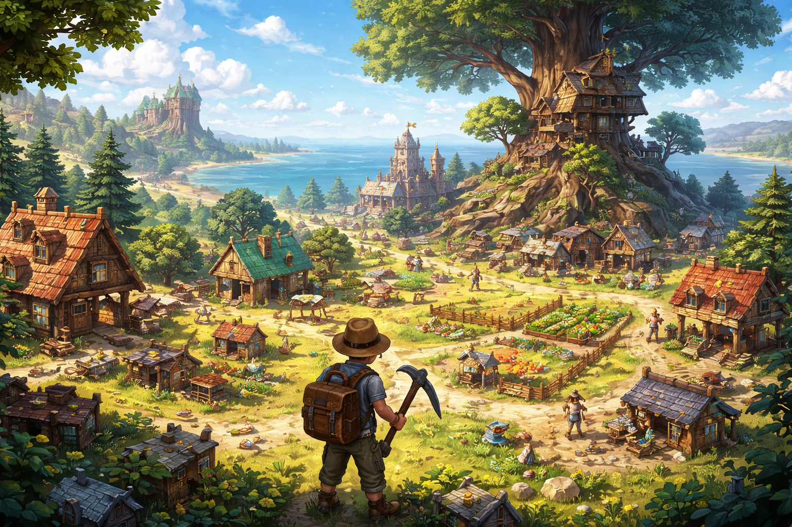

# 🌍 Бесконечные миры «песочницы»: Творчество без границ



Игры-песочницы — это жанр, в котором игроку предоставляется максимальная свобода действий. Здесь нет строгих правил, нет заранее предписанного пути, нет "правильного" способа завершить игру. Каждый игрок создаёт свой собственный опыт, свою собственную историю.

Возьмите Minecraft: одни строят величественные замки, другие создают машины из красного камня, третьи рассказывают истории в выживании на острове. Все играют в одной игре, но у каждого свой опыт.

---

## 🎮 Что делает песочницу уникальной? Определение жанра

### Основные черты песочниц:

**1. Максимальная свобода действий**
В отличие от линейных игр (где есть одна дорога к финишу), песочницы предлагают:
- Самостоятельный выбор целей
- Множество способов достичь одного результата
- Возможность проигнорировать основное задание и делать что-то своё
- Полная свобода экспериментировать

**2. Отсутствие обязательной сюжетной линии**
Некоторые песочницы:
- Вообще не имеют сюжета (Minecraft, The Sims)
- Имеют опциональный сюжет (Skyrim, GTA V)
- Позволяют заканчивать сюжет в любом порядке

**3. Самовыражение через создание**
- Игрок становится архитектором
- Игрок становится художником
- Игрок становится рассказчиком

**4. Бесконечная переиграемость**
- Каждая новая игра совершенно другая
- Сотни часов новых возможностей
- Возможность вернуться спустя годы и играть по-новому

---

## 🧱 Как устроена песочница: Технические основы

С виду просто, но на самом деле сложно. Вот что стоит за кулисами:

### 🌐 Открытый мир без невидимых стен
**Что это означает:**
- Большая карта без ограничений
- Игрок может идти в любом направлении
- Нет силовых полей или неведомых преград
- Мир продолжается за горизонтом

**Технические вызовы:**
- Как отрендерить огромный мир без перегрузки видеокарты?
- Как создать карту так, чтобы не было "края света"?
- Как оптимизировать все это, чтобы игра не лагировала?

**Решения:**
- **LOD (Level of Detail)** — далёкие объекты идут с меньшей детализацией
- **Streaming** — загрузка новых областей при приближении
- **Процедурная генерация** — карта создаётся на лету, не предписана полностью

### ⚙️ Физика и взаимодействие
**Объекты действительно взаимодействуют:**
- Дерево падает вниз при разрушении
- Огонь распространяется на соседние блоки
- Вода течёт по склону
- Персонаж не проходит сквозь стены
- Прыжок работает как в реальности

**Почему это важно:**
- Делает мир реалистичным
- Создаёт неожиданные взаимодействия
- Позволяет решать задачи творчески

### 🔨 Система крафта (создание предметов)
**Основной элемент песочниц:**
- Игрок собирает ресурсы (дерево, камень, руду)
- Объединяет их в новые предметы
- Обновляет свой инвентарь
- Создаёт всё более сложные предметы

**Минекрафтный крафт:**
```
8 досок + 1 слиток железа = 1 ведро
3 железных слитка + 4 палки = кирка
И так далее...
```

**Психологический эффект:**
- Ощущение прогресса
- Чувство достижения при создании нового
- Система целей (нужны лучшие инструменты)

### 🎨 Система строительства
**Творческий инструмент:**
- Разместить блок/предмет в любом месте
- Комбинировать разные материалы
- Создавать структуры и произведения искусства
- Нет ограничений на фантазию

**Примеры из сообщества:**
- Точные копии реальных зданий (Тадж-Махал, Эйфелева башня)
- Огромные художественные инсталляции
- Функциональные машины (в Minecraft)
- Целые города с инфраструктурой

### 🎭 Система модов и расширений
**Песочницы часто содержат редакторы:**
- Игроки могут создавать новые биомы
- Добавлять новые предметы
- Создавать новые механики
- Модификации распространяются в сообществе

**Beispiel:** В Minecraft есть mod для магии, mods для машин, mods для новых биомов — словом, бесконечные возможности.

---

## 🧠 Какие навыки развиваются? Психологический анализ

### 🎨 Креативность и воображение
**Развиваемые компетенции:**
- Превращение идей в реальность
- Проектирование и планирование
- Эстетическое чувство
- Инновационное мышление
- Экспериментирование с новыми идеями

**Исследование (University of Rochester, 2021):**
Дети, играющие в творческие песочницы показывают:
- На 35% выше креативные тесты
- На 20% лучше решение неструктурированных проблем
- На 25% выше уровень инноваций в проектах

### 🧩 Пространственное мышление
**Развиваемые компетенции:**
- Визуализация трёхмерных объектов
- Понимание перспективы и масштаба
- Манипулирование объектами в голове
- Понимание координат и расстояний
- Планирование расположения элементов

**Практический пример (Minecraft):**
Построение замка требует:
- Представления финального результата
- Понимания пропорций
- Применения симметрии
- Расчёта требуемых блоков

### 🤔 Самостоятельное принятие решений
**Развиваемые компетенции:**
- Автономность и независимость
- Определение собственных целей
- Планирование и исполнение плана
- Ответственность за результаты
- Адаптация при неудаче

**Контраст с линейными играми:**
- Линейные игры говорят: "Сделай это"
- Песочницы говорят: "Делай, что хочешь"

### 🔍 Исследовательский интерес
**Развиваемые компетенции:**
- Любопытство к неизведанному
- Систематическое исследование
- Документирование находок
- Постановка гипотез и проверка их
- Обучение через экспериментирование

**Пример из Skyrim:**
Игрок начинает тупо бегать по миру:
- Случайно находит подземелье
- Случайно связывается с фракцией
- Получает квест, который его интересует
- Исследует ветвь сюжета дальше

### 💡 Решение проблем творческим путём
**Развиваемые компетенции:**
- Нестандартное мышление
- Использование имеющихся ресурсов творчески
- Преодоление препятствий не стандартно
- Комбинирование идей

**Пример (Minecraft):**
- Нужно перебраться через реку?
- Можно построить мост (стандартно)
- Можно построить лодку (творчески)
- Можно высушить воду с помощью блоков (креативно)

---

## ⚖️ Серьёзные плюсы и минусы

### ✅ Плюсы песочниц

**Свобода действий и выбора**
- Нет "неправильного" пути
- Каждый может играть в свой способ
- Уважение индивидуальности
- Снижение фрустрации (нет неудачных квестов)

**Высокая переиграемость**
- Каждая новая игра совершенно другая
- Можно сотни часов без скуки
- Новые мотивации и цели
- Долгосрочное ранжирование (годы, не месяцы)

**Развитие воображения и творчества**
- Активирует творческие части мозга
- Развивает оригинальное мышление
- Особенно полезна для детей
- Помогает в реальной жизни (архитектура, дизайн, ремёсла)

**Социальное взаимодействие**
- Могут играть несколько человек одновременно
- Показывают друг другу постройки
- Совместные проекты
- Сообщество создаёт невероятные вещи

**Успокаивающий эффект (Flow state)**
- Ритмичные действия (копание, строительство)
- Понятные цели (собрать ресурсы, построить жилище)
- Достижение и прогресс
- Может снижать стресс и тревожность

**Образовательный потенциал**
- Школы используют Minecraft для обучения
- Физика (гравитация, электричество в Industrial Craft)
- История (реконструкция исторических мест)
- Архитектура и дизайн
- Программирование (модификирование игр)

### ❌ Минусы песочниц

**Отсутствие чёткой цели может сбивать**
- Новые игроки не знают, что делать первым
- Можно заблудиться в безграничности
- Нет направления, куда ехать
- Некоторые люди нуждаются в структуре

**Требует самодисциплины**
- Легко начать, потом забить
- Нет принудительной мотивации (нет сюжета)
- Можно просто ходить и ничего не делать
- Требуется личная мотивированность

**Может привести к целеполаганию гроссальниками**
- Один проект может занять месяцы
- Легко переключаться между целями
- Может привести к недовершённым проектам
- Не развивает настойчивость в одной цели

**Высокий порог входа для новичков**
- Первые часы могут быть конфузными
- Можно умереть и потерять ресурсы (в режиме выживания)
- Нет ясной инструкции "что делать дальше"
- Может отпугнуть казуальных игроков

**Малый нарратив (сюжета)**
- Люди, ценящие историю, могут разочароваться
- Нет персонажей, с которыми можно сопереживать
- История рассказывается самим игроком (или вообще не рассказывается)

**Бесконечность может быть парализующей**
- Слишком много возможностей = паралич выбора
- Трудно определить, что делать в первую очередь
- Может привести к прокрастинации

---

## 💎 Известные игры-песочницы и их особенности

### 🎮 Minecraft
**Характер:** Кубические блоки, бесконечный мир
- **Плюсы:** Простая механика, огромное сообщество, режимы творчества
- **Минусы:** Графика простовата, может быть скучновато без цели
- **Идеален для:** Начинающих, детей, творчески людей

### 🎮 The Sims
**Характер:** Симуляция жизни, управление людьми
- **Плюсы:** Глубокое социальное взаимодействие, множество стилей жизни
- **Минусы:** Могут стать аддиктивно (собирание денег), иногда нудная работа
- **Идеален для:** Людей, интересующихся социологией, любителей ролеплея

### 🎮 Skyrim
**Характер:** Фэнтази мир, квесты, боевая система
- **Плюсы:** Отличный сюжет, живой мир, модсообщество
- **Минусы:** Концентрируется больше на сюжете, чем на творчестве
- **Идеален для:** Любителей RPG, фэнтази, приключений

### 🎮 GTA V
**Характер:** Городская песочница, преступления, свобода
- **Плюсы:** Огромный мир, множество активностей, ощущение свободы
- **Минусы:** Насилие (не для детей), может быть морально сомнительно
- **Идеален для:** Взрослых геймеров, ищущих ощущение безграничной свободы

### 🎮 Stardew Valley
**Характер:** Фермерская жизнь, медитативная
- **Плюсы:** Успокаивающая, множество деятельности, уютная атмосфера
- **Минусы:** Медленный темп (не для тех, кто ищет экшена)
- **Идеален для:** Релаксации, вечеров на диване, избежания стресса

---

## 🔧 Советы для игроков в песочницы

### Если вам не хватает направления:
1. **Установите личные цели** — построить дом, найти сокровище, покорить гору
2. **Используйте вызовы** — попробуйте сложные режимы (режим Hardcore в Minecraft)
3. **Присоединитесь к сообществу** — смотрите, что делают другие, вдохновляйтесь
4. **Играйте по сюжетным модам** — добавьте narration через расширения

### Если вы новичок:
1. **Начните с творческого режима** — нет стресса умирания
2. **Посмотрите туториал** — 30 минут обучения спасят часы игры
3. **Поэкспериментируйте** — не бойтесь ошибок на ранних этапах
4. **Присоединитесь к серверу** — игра с другими может быть вдохновляющией

---

## 🎨 Вывод: Песочницы как инструмент самовыражения

**Песочницы — это не просто игры, это инструмент самовыражения.** Они позволяют игроку стать:
- **Творцом** — создателем виртуальных миров
- **Архитектором** — проектировщиком сооружений
- **Художником** — выразителем эстетики
- **Рассказчиком** — автором собственной истории

В мире, где так много ограничений и правил, песочницы предлагают **истинную свободу**. Они учат, что возможно всё, если у вас есть воображение и настойчивость.

Если вы ищете игру, где можете разраться на полную — где вы сами командир, дизайнер и рассказчик вашей истории — **песочницы идеальный выбор!** 🌍✨

## См. также
[Гонки, драки и спорт — Как игры учат нас соревноваться, не выходя из дома](./Racing,_fighting,_and_sports.md)
[Стратегии: думаем как полководец — Почему в некоторых играх главное — не скорость пальцев, а план в голове](./Strategies.md)


---
## 📝 Авторы

Штанникова Екатерина, 306

С использованием нейросети ChatGPT
