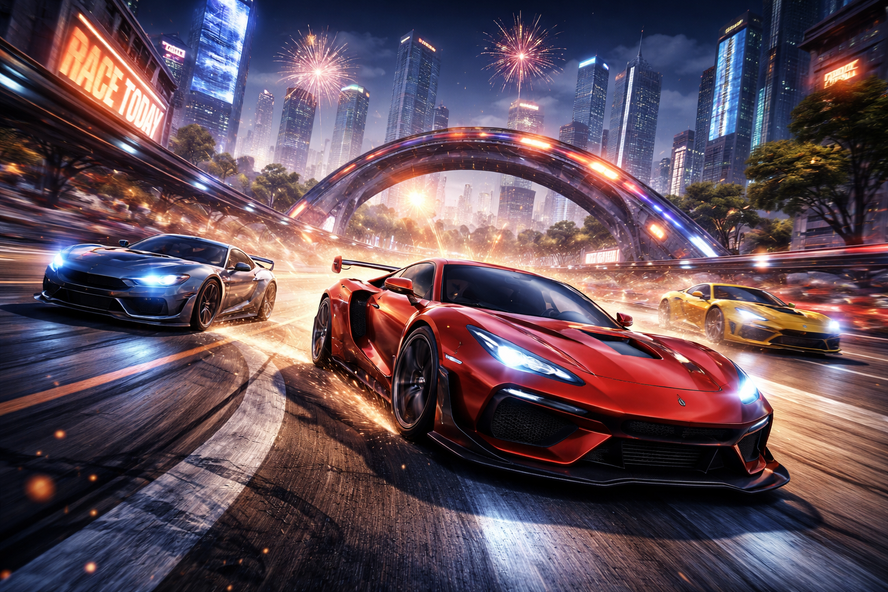

# 🏁 Гонки, драки и спорт: Мир соревнований

Этот жанр объединяет игры, в которых ключевую роль играет соревнование, скорость и стремление к победе. От зажигательных гонок до напряжённых поединков — это жанры, которые держат игрока в постоянном напряжении и требуют максимальной отдачи.

---

## ⚡ Основная идея соревновательных игр

В основе всех соревновательных игр лежит простой принцип: игрок должен быть **лучше, быстрее и умнее** соперника. Это означает:
- реагировать быстрее противника, предугадывая его ходы
- принимать критически важные решения за доли секунды
- постоянно адаптироваться к меняющейся ситуации
- сохранять холодный ум под давлением
- анализировать действия соперника и предпринимать контрмеры

---

## 🚗 Гонки — Мир скорости и адреналина

### Что определяет гоночный жанр?

Современные гоночные игры — это не просто симуляция вождения. Это целая экосистема:

**Механика геймплея:**
- Управление автомобилем с физикой, приближенной к реальности
- Прохождение трасс на максимальной скорости
- Дрифтование, использование нитро и других бонусов
- Система повреждений и восстановления машины

**Типы гонок:**
- Уличные гонки (Need for Speed, Grand Theft Auto)
- Профессиональные гонки (Formula 1, Forza Motorsport)
- Off-road гонки (DiRT, Dakar)
- Arcade гонки (Mario Kart, Crash Bandicoot)

**Что развивается у игрока:**
- Быстрота реакции на чрезвычайные ситуации
- Пространственное мышление и координация
- Стратегическое мышление (куда ехать, когда использовать бонусы)
- Способность сосредотачиваться на высокой скорости
- Управление стрессом и азартом

**Психологический эффект:**
Гонки дают ощущение скорости и адреналина, что делает их привлекательными для тех, кто ищет острых ощущений. Исследования показывают, что гоночные игры стимулируют выработку адреналина даже больше, чем просмотр фильмов экшена.

---

## 🥊 Драки (файтинги) — Искусство боевых систем

### Сущность файтинга

Файтинги — это, по сути, **виртуальные шахматы на скорость**. Каждый ход имеет значение, каждая комбинация может изменить исход боя.

**Основные элементы:**
- **Комбинации** — последовательности ударов, требующие точного ввода
- **Таймирование** — идеальный момент для атаки или защиты
- **Чтение противника** — предугадывание следующего хода соперника
- **Управление дистанцией** — знание, на каком расстоянии находиться для оптимальной позиции
- **Менеджмент ресурсов** — использование спецприёмов в нужный момент

**Легендарные серии файтингов:**
- Street Fighter — икона жанра, требующая невероятного мастерства
- Mortal Kombat — жестокие бои с яркими спецэффектами
- Tekken — 3D-файтинги с глубокой боевой системой
- Super Smash Bros — многополюсный файтинг с множеством персонажей

**Навыки, которые развиваются:**
- Молниеносная реакция (время реакции профессиональных геймеров 100-150 мс)
- Мышечная память и точность
- Стратегическое мышление (когда атаковать, когда защищаться)
- Анализ ситуации и принятие решений
- Психологическая устойчивость (работа со стрессом при проигрыше)

**Киберспорт:**
Файтинги — один из самых популярных жанров в киберспорте. Чемпионаты Street Fighter и Tekken собирают миллионы зрителей и выплачивают призовые фонды в миллионы долларов.

---

## ⚽ Спортивные игры — Симуляция реальности

### Разнообразие спортивных симуляторов

**Командные виды спорта:**
- **Футбол** (FIFA/EA FC, Pro Evolution Soccer) — самый популярный жанр спортивных игр
- **Баскетбол** (NBA 2K, NBA Live)
- **Хоккей** (NHL Series, KHL Official Game)
- **Американский футбол** (Madden NFL)
- **Регби** (Rugby Challenge, EA Sports Rugby)

**Индивидуальные виды спорта:**
- **Теннис** (Top Spin, Tennis World Tour)
- **Гольф** (PGA Tour)
- **Бокс** (eFootball Boxing)
- **Легкая атлетика** (Olympic Games series)

### Что делает спортивную игру реалистичной?

- **Лицензирование** — официальные команды, игроки, стадионы
- **Физика** — реалистичное движение мяча, отскоки, удары
- **AI противников** — тактическое поведение команд, которое меняется в зависимости от счёта
- **Карьерный режим** — создание и развитие своего игрока
- **Мультиплеер** — онлайн-турниры и лиги

**Развиваемые навыки:**
- Тактическое мышление и позиционирование
- Командная игра и взаимодействие с AI-напарниками
- Понимание реальных спортивных правил и стратегий
- Творческое решение проблем (как обойти защиту)
- Терпение и последовательность (построение карьеры требует времени)

**Социальный аспект:**
Спортивные игры часто играют вместе с друзьями — это позволяет взаимодействовать с реальными людьми в виртуальной спортивной среде, что укрепляет социальные связи.

---

## 🧠 Комплексная польза соревновательного жанра

### Когнитивное развитие:
- ⚡ **Быстрота реакции** — улучшение времени отклика мозга на стимулы (исследования MIT показывают улучшение на 20-30%)
- 🎯 **Координация глаз и рук** — синхронизация визуального восприятия и физических действий
- 🧩 **Пространственное мышление** — ориентация в трёхмерном пространстве
- 🔄 **Адаптивность** — быстрое переключение между стратегиями

### Эмоциональное развитие:
- 💪 **Стрессоустойчивость** — способность оставаться спокойным в напряжённых ситуациях
- 🏆 **Устойчивость к поражениям** — понимание, что поражение — это часть обучения
- 😌 **Управление азартом** — контроль эмоций при выигрыше и проигрыше
- 🤝 **Спортивный дух** — уважение к противнику и честной игре

### Социальное развитие:
- 👥 **Командная работа** (в многопользовательских режимах)
- 💬 **Общение с сообществом** — участие в турнирах и клубах
- 🌍 **Глобальная конкуренция** — возможность играть с людьми по всему миру

---

## ⚠️ Возможные негативные эффекты и как их избежать

### Потенциальные проблемы:
- 😤 **Высокая эмоциональная нагрузка** — игры могут вызывать стресс
- 🎮 **Зависимость от побед** — желание играть только ради побед
- 😠 **Агрессивное поведение** — некоторые игроки проявляют токсичность в чате
- 👀 **Усталость глаз** — долгие сеансы перед экраном
- 💤 **Нарушение сна** — стимуляция перед сном

### Рекомендации для здоровой игры:
- ⏰ **Устанавливайте лимиты** — играйте не более 1-2 часов в день
- 🔋 **Берите перерывы** — каждые 30 минут отдыхайте 5-10 минут
- 😊 **Сберегайте психику** — помните, что это просто игра
- 👥 **Общайтесь конструктивно** — избегайте токсичности в чате
- 🏃 **Сбалансируйте физической активностью** — не забывайте о спорте в реальной жизни

---

## 🎯 Практические примеры и статистика

**Исследование Université Laval (2020):**
Учёные выяснили, что игроки в гонки и файтинги показывают:
- На 20% лучшую реакцию в стрессовых ситуациях
- На 15% выше способность к многозадачности
- На 10% лучше навыки стратегического мышления

**Киберспортивное сообщество:**
В 2024 году:
- Более 500 млн. люде играют в соревновательные игры
- Призовые фонды в киберспорте превышают $300 млн в год
- Профессиональные игроки тренируются 8-10 часов в день

---

## 🏁 Заключение

Соревновательные игры — это **не просто развлечение**, это инструмент развития важных жизненных навыков. Они учат быстро реагировать, адаптироваться к изменениям, стойко переносить поражения и ценить победы. Однако, как и любое увлечение, требуют баланса и ответственного подхода.

Если вы ищете игры, которые развивают реакцию, координацию и стратегическое мышление — соревновательные жанры идеальный выбор! 🎮🏆

[Бесконечные миры «песочницы» — Почему в Minecraft и GTA можно делать всё что угодно и как это работает](./Endless_worlds.md)

[Стратегии: думаем как полководец — Почему в некоторых играх главное — не скорость пальцев, а план в голове](./Strategies.md)

---
## 📝 Авторы

Штанникова Екатерина, 306

С использованием нейросети ChatGPT
