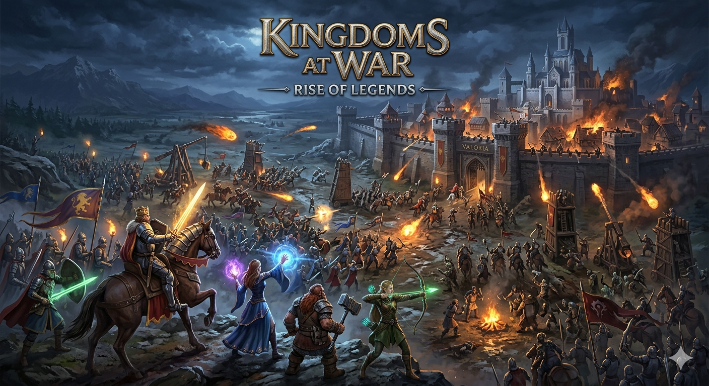

# 🧠 Стратегии: Искусство думать как полководец

Стратегические игры требуют от игрока не скорости рук, а скорости ума. Здесь каждое решение имеет вес, каждый ход может привести к победе или поражению. Это игры для тех, кто любит думать, анализировать и планировать.

В отличие от соревновательных жанров, стратегии требуют глубокого анализа ситуации. Игрок не просто реагирует на события — игрок их планирует и создаёт.

---

## 🧠 Суть стратегических игр

Главный принцип: Побеждает не тот, кто быстрее кликает, а тот, кто лучше думает.

**В основе всех стратегических игр лежит простая истина:** глубокое понимание ситуации гораздо важнее скорости действий. Игроку нужно одновременно учитывать множество факторов и принимать решения, которые повлияют на исход игры на часы вперёд.

---

## 📊 Основные механики и особенности

### ⏰ Долгосрочное планирование
Стратегические игры часто не торопят игрока. Вы можете:
- Обдумывать каждый ход столько, сколько нужно
- Планировать на 5, 10, 20 ходов вперёд
- Предусмотреть действия противников
- Изменять стратегию в зависимости от ситуации

### ⚙️ Управление ресурсами
Критически важный элемент стратегии:
- **Золото/деньги** — для найма войск и строительства
- **Еда** — для пропитания армии
- **Осуществление** — для закупок и строительства
- **Население** — рабочая сила для развития
- **Технологии** — улучшение военной и экономической мощи

Ограниченность ресурсов создаёт конкуренцию и заставляет принимать трудные решения.

### 🧩 Анализ боевой ситуации
- Какие юниты выслать на фронт?
- Когда отступить и перегруппироваться?
- Как использовать местность в своих целях?
- Когда нарушить фронт и атаковать в неожиданном месте?

### 🧠 Проактивное принятие решений
Каждое решение влияет на будущее:
- Инвестировать в армию или экономику?
- Атаковать врага или укреплять границы?
- Заключить союз или остаться независимым?  

---

## ⚔️ Что делает игрок?

- строит базы  
- управляет армиями  
- распределяет ресурсы  
- выбирает тактику  

---

## 🧩 Почему стратегии сложные?

Игрок должен учитывать:
- действия противника  
- ограниченные ресурсы  
- последствия своих решений  

Каждая ошибка может привести к поражению.

---

## 🧠 Какие навыки развиваются?

- логическое мышление  
- стратегическое планирование  
- аналитика  
- терпение  

---

## ⚖️ Плюсы и минусы

### ✅ Плюсы:
- развитие интеллекта  
- тренировка памяти  
- глубокий геймплей  

### ❌ Минусы:
- требуют много времени  
- сложны для новичков  

---

## 🎯 Вывод

Стратегии — это “шахматы в цифровом мире”. Они учат думать на несколько шагов вперёд и принимать взвешенные решения.

## См. также
[Бесконечные миры «песочницы» — Почему в Minecraft и GTA можно делать всё что угодно и как это работает](./Endless_worlds.md)
   
[Гонки, драки и спорт — Как игры учат нас соревноваться, не выходя из дома](./Racing,_fighting,_and_sports.md)

---
## 📝 Авторы

Штанникова Екатерина, 306

С использованием нейросети ChatGPT
