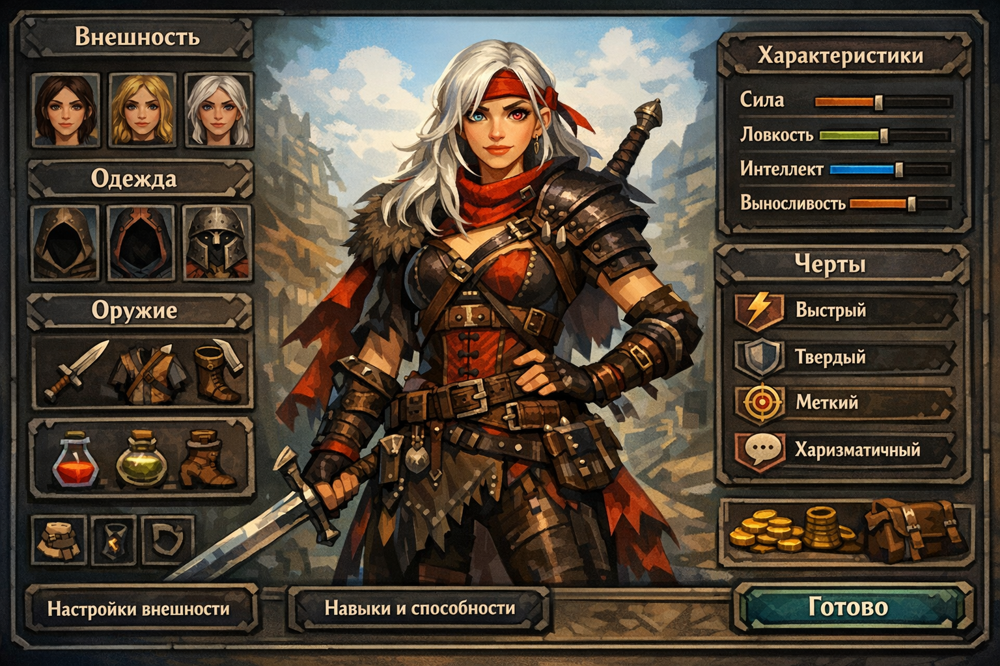
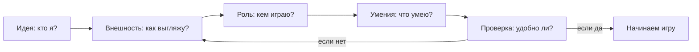
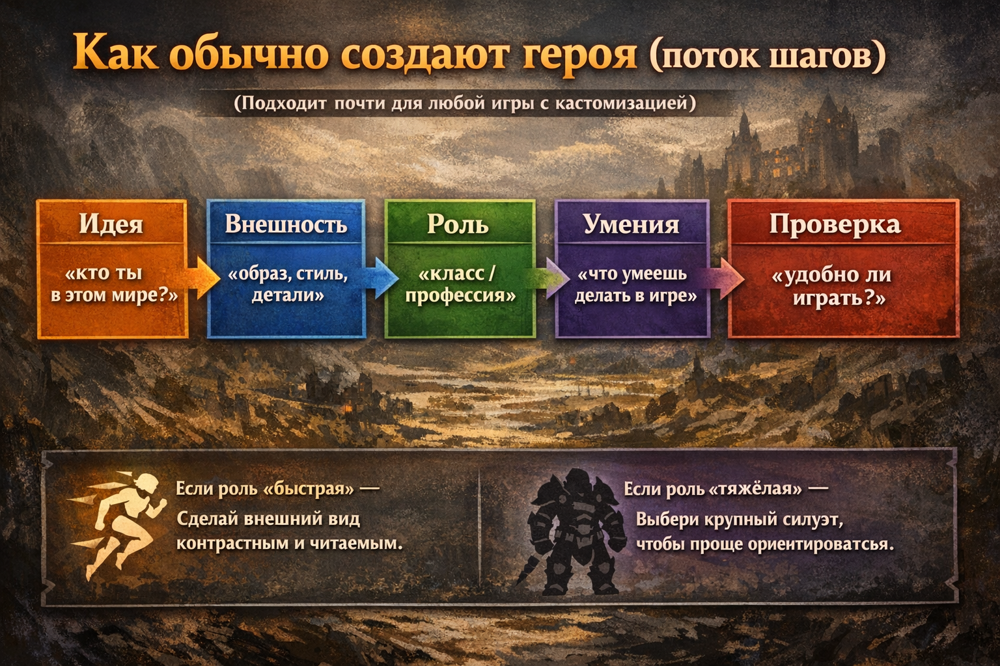

# Создаем своего героя

> 💡 **Коротко:** [Редактор персонажа](../heroes_and_villains/create_your_hero.md) помогает придумать героя, который **выглядит круто**, **удобен в игре** и **похож на тебя** (или на твою мечту).

---

# [Создаем своего героя](./create_your_hero.md)

## Введение
Ты когда-нибудь создавал персонажа в игре — выбирал причёску, [цвет](../../../../1.2_natural_sciences/physics_in_everyday_life/Q1075.md) [глаз](../../../../1.2_natural_sciences/physics_in_everyday_life/Q467980.md), одежду и имя? 🎮 Это и есть **редактор персонажа**. Он нужен не только “для красоты”. Часто от выбора зависит, **как ты играешь**, **как к тебе относятся другие герои** и даже **какую историю ты проживёшь**.

В этой статье разберём:
- что такое редактор персонажа и зачем он нужен;
- почему людям нравится “делать себя” или “делать мечту”;
- что обычно можно настроить;
- как внешний вид и роль (класс) влияют на игру;
- [советы](../../../../7.2 Media, leisure and hobbies /useful_and_interesting_leisure/articles/mistakes_in_choosing_hobby.md), чтобы герой получился и красивым, и удобным.

## Что такое редактор персонажа
**Редактор персонажа** — это набор настроек, с помощью которых игрок собирает героя как конструктор.

Обычно он отвечает за три вещи:
- **[Внешность](../heroes_and_villains/create_your_hero.md)**: лицо, волосы, [тело](../../../../1.2_natural_sciences/why_science_help_understand_world/organism.md), [одежда](../../../../1.2_natural_sciences/physics_in_everyday_life/Q487005.md), цветовые схемы.
- **Роль в игре**: класс (маг/воин/разведчик), стартовые [умения](../../../../8.2_future/choosing_a_career_path/articles/skills.md), оружие.
- **Самовыражение**: “кто я здесь?”, “каким я [хочу](../../../../6.1_Independent_living_and_daily_living_skills/reasonable_spending/articles/want.md) быть?”, “какую историю я рассказываю через персонажа?”.

Если редактор хороший, он помогает сделать персонажа таким, чтобы:
- его было **легко узнать** на экране;
- им было **удобно управлять**;
- он “подходил” **под [стиль](../../../../7.1_art/modern_technological_art/articles/5.5_yandex_neural.md) игры** (например, скрытность или [сила](../../../../1.2_natural_sciences/physics_in_everyday_life/Q11023.md)).

## Почему людям нравится создавать «себя» (и не только)
Есть несколько причин, почему создание героя так затягивает.

- **Хочется быть собой**. Тогда ты делаешь персонажа похожим на себя: похожая прическа, [рост](../../../../3.1. healthy lifestyle/Sleep, nutrition, and adolescent energy/articles/micronutrients_and_teenagers.md), любимые [цвета](../../../../1.2_natural_sciences/physics_in_everyday_life/Q11652.md). Так [игра](../../../../4.1_rules_of_study/how_to_learn_effectively/articles/gamification.md) становится “личной”.
- **Хочется попробовать роль**. В реальности ты ученик, а в игре можешь стать капитаном космического корабля, рыцарем или детективом.
- **Хочется контролировать историю**. Когда ты сам выбираешь детали, кажется, что ты не просто проходишь игру, а **создаёшь её вместе с авторами**.
- **Хочется выделяться**. В сетевых играх приятно, когда твой герой узнаваем: по силуэту, цветам, аксессуарам.

Иногда даже простая вещь (например, шрам или необычная маска) помогает “оживить” персонажа: у него появляется “[прошлое](../../../../2.1_society/cause_and_effect_relationships/articles/lessons_of_history.md)”, и играть становится интереснее ✨.

## Что обычно можно настроить
В разных играх набор настроек разный, но чаще всего можно менять:

### 1) Внешность
- **Лицо**: [форма](../../../../7.1_art/modern_technological_art/articles/4.5_algorithmic_craft.md), нос, [глаза](../useful_tips/eyes_and_back.md), брови, веснушки.
- **Волосы**: прическа, цвет, борода/усы.
- **Одежда**: стиль, броня, аксессуары, эмблемы.
- **Цвета**: палитра (иногда можно настроить очень точно).

### 2) Роль (класс) и стиль игры
- **Класс/[профессия](../../../../7.2 Media, leisure and hobbies /useful_and_interesting_leisure/articles/leisure_influence_on_future.md)**: кто ты по “[работе](../../../../8.2_future/choosing_a_career_path/articles/interview.md)” в игре (танк, лекарь, лучник, маг).
- **Статы/[навыки](../../../../7.2 Media, leisure and hobbies /useful_and_interesting_leisure/articles/computer_games_with_benefit.md)**: сила, ловкость, [интеллект](../../../../2.1_society/cause_and_effect_relationships/articles/critical_thinking_in_education.md), скрытность и т.д.
- **Стартовые предметы**: оружие, броня, расходники.

| Класс | Главная сила | Стиль игры | Подходит, если ты любишь… |
|:--|:--|:--|:--|
| Воин/танк | [Здоровье](../../../../3.1. healthy lifestyle/Sleep, nutrition, and adolescent energy/articles/chronic_sleep_deprivation.md), броня | В ближнем бою, держит удар | быть в центре сражения |
| Маг | Заклинания | На расстоянии, мощные атаки | стратегию и комбинации |
| Лучник/разведчик | Ловкость, [скорость](../../../../1.2_natural_sciences/physics_in_everyday_life/Q11402.md) | Скрытность, точные удары | действовать незаметно |
| Лекарь/[поддержка](../../../../1.2_natural_sciences/neurobiology_for_teens/articles/17_hugs_oxytocin.md) | Лечение, баффы | [Помощь](../../../../3.1_healthy_lifestyle/pervaya_pomoshch/ushibi_porezy_ozhogi/10_krovotechenie_chto_delat.md) команде | играть с друзьями |

### 3) [История](../../../../1.2_natural_sciences/physics_in_everyday_life/Q11469.md) и [характер](../../../../1.2_natural_sciences/neurobiology_for_teens/articles/06_phineas_gage.md) (если игра это поддерживает)
- **Происхождение**: откуда ты, кто твоя [семья](../../../../5.1_technology_and_digital_literacy/information and media literacy/семейные_правила_потребления_контента.md), что ты умеешь.
- **Черты характера**: добрый/строгий/ироничный (иногда это влияет на [диалоги](../dream_team/screenwriter.md)).
- **Имя и голос**: как к тебе обращаются и как ты звучишь.

Вот простой “[поток](../../../../5.1_technology_and_digital_literacy/operating system/articles/thread.md)” создания героя, который подходит почти везде:

И ещё одна схема в виде картинки (её удобно вставлять в презентацию/отчёт):

## Как внешность и класс могут влиять на игру
Кажется, что внешность — это просто “красота”. Но часто она влияет на то, **как ты воспринимаешь персонажа** и как **персонажа воспринимают другие**.

### [Влияние](../../../../5.1_technology_and_digital_literacy/information and media literacy/манипуляции_и_пропаганда.md) на тебя (игрока)
- **Проще вжиться в роль**: если герой выглядит так, как ты задумал, [мозг](../../../../3.1. healthy lifestyle/Sleep, nutrition, and adolescent energy/articles/breakfast_for_the_brain.md) быстрее “верит” в историю.
- **Удобнее играть**: читаемая одежда и контрастные цвета помогают не терять персонажа на экране.
- **Меньше ошибок**: если у героя заметный силуэт, легче понять, где он находится, особенно в динамичных моментах.

### Влияние на игру (механики)
Это зависит от конкретной игры, но встречаются такие [варианты](../../../../6.1_Independent_living_and_daily_living_skills/reasonable_spending/articles/comparison.md):
- **Класс меняет доступные умения** (например, маг лечит, а воин держит удар).
- **[Выбор](../../../../2.1_society/cause_and_effect_relationships/articles/personal_choice.md) навыков меняет стиль прохождения**: можно идти “в лоб” или тихо и аккуратно.
- **Одежда/броня может давать бонусы**: скорость, [защита](../../../../5.1_technology_and_digital_literacy/how_internet_works/articles/dns/cdn.md), скрытность.

Важно [помнить](../../../../4.1_rules_of_study/how_to_memorize/articles/pamyat.md): “красиво” и “эффективно” — не всегда одно и то же, но хороший редактор позволяет совместить оба.

## Советы: как сделать персонажа удобным и интересным
Вот практичные советы, которые помогают почти всегда:

- **Сначала придумай идею в одном предложении**: “быстрый разведчик”, “умный маг-исследователь”, “рыцарь-защитник”.
- **Сделай героя узнаваемым**:
  - выбери 1–2 главных цвета;
  - добавь “деталь-подпись” (шрам, значок, необычная шляпа).
- **Подгони внешний вид под стиль игры**:
  - если герой быстрый — делай контрастный [образ](../game_culture/cosplay.md), чтобы его было видно;
  - если герой тяжёлый — крупный силуэт и массивные детали.
- **Не переборщи с деталями**: иногда простая одежда выглядит лучше, чем “всё и сразу”.
- **Сделай тест**: покрути камеру, зайди в темную и светлую локацию, посмотри, не “пропадает” ли герой 👀.
- **Если игра с сюжетом — придумай мини-биографию из 3 фактов**:
  1) откуда он, 2) чего хочет, 3) чего боится.  
  Это сильно оживляет персонажа.

## [Заключение](../../../../1.2_natural_sciences/physics_in_everyday_life/Q2225.md)
Редактор персонажа — это не просто меню с ползунками. Это способ создать героя, который:
- отражает твою идею;
- помогает тебе играть так, как тебе нравится;
- делает историю “твоей”.

Когда ты создаёшь персонажа, ты как будто говоришь игре: “Вот кто я (или кем я хочу стать) — давай проживём приключение вместе” 🚀.

## Смю также

[Знаменитый водопроводчик — История Марио: как простой персонаж стал символом Nintendo и дедушкой всех платформеров](./Famous_plumber.md)

[Главные злодеи, которых мы любим — Почему нам нравится проходить игры ради встречи с харизматичным врагом](./Main_villains_we_love.md)

---

*[Автор](../../../../4.2_thinking_and_working_information/how_to_search_information/articles/copypaste.md): Дзюба Майя • Сгенерировано с помощью GPT-5.3 • Слов: 762 • 2026-03-17*
